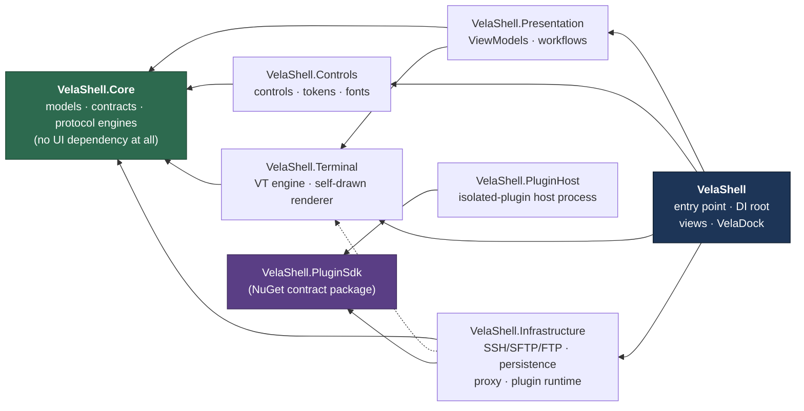
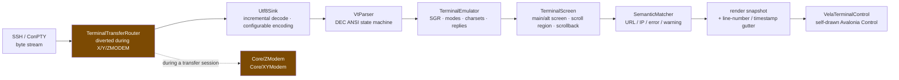
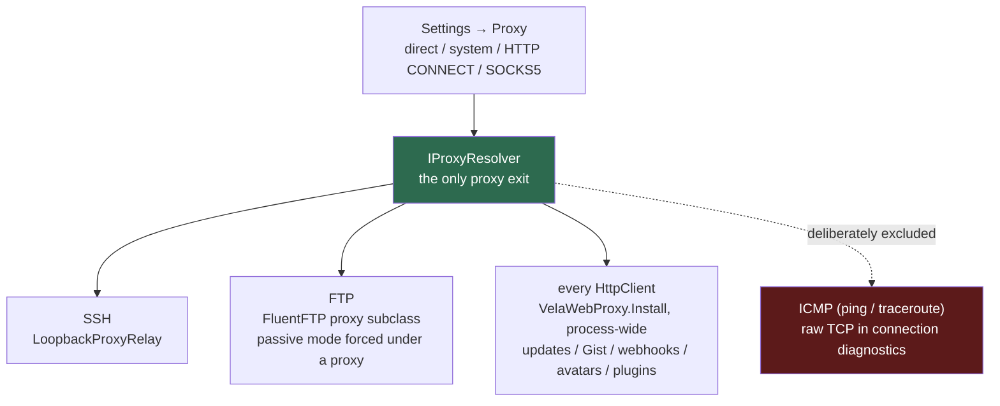
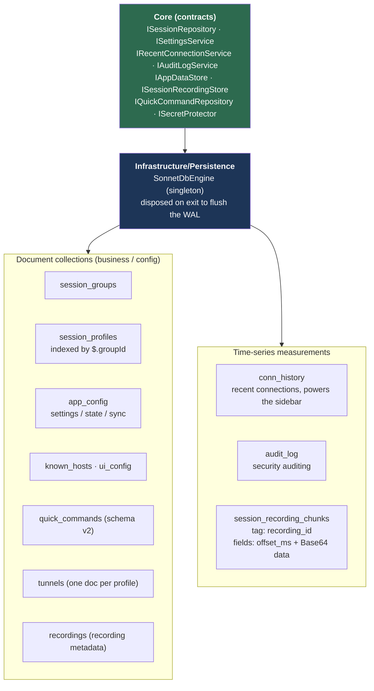
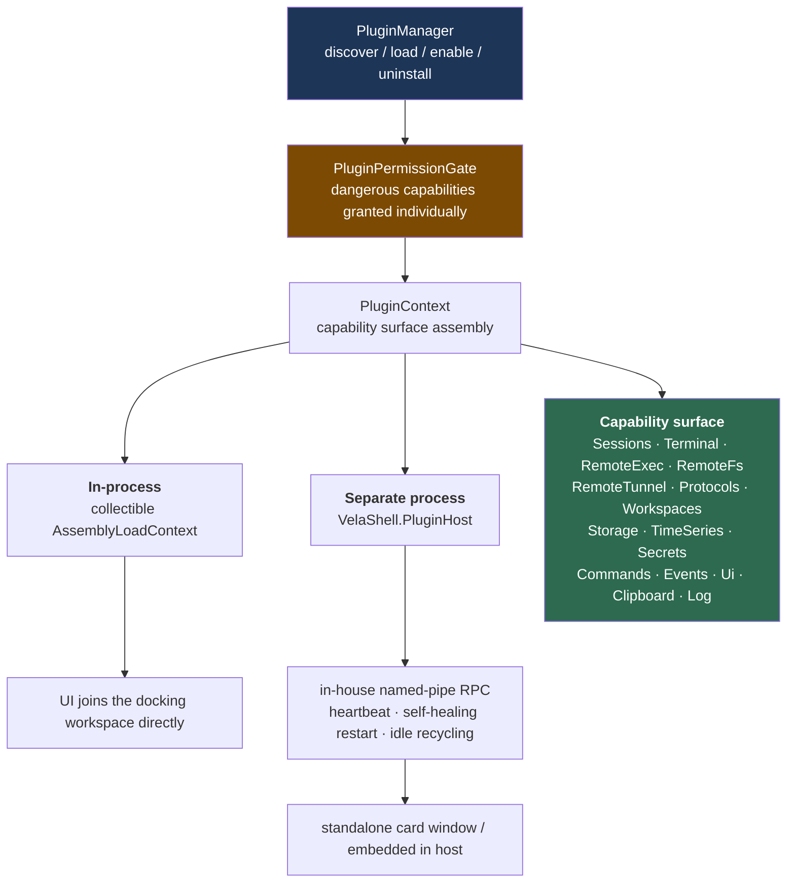
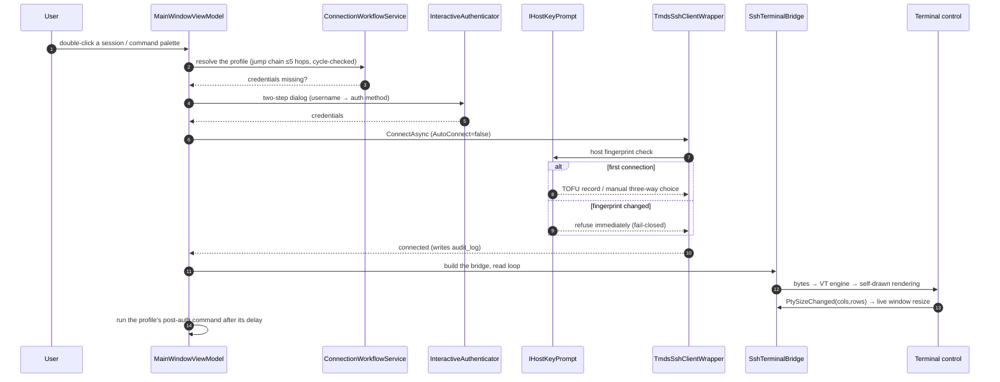

# Host Layering Architecture

> This page covers **how the host application is layered, which way dependencies point, and what
> lives in each layer**. For *why* it was refactored this way see
> [architecture-design.md](architecture-design.md); for why the plugin system looks the way it does
> see [`../plugins/`](../plugins/).
> 中文：[`../../zh/host/architecture.md`](../../zh/host/architecture.md)

## 1. Projects

| Project | Responsibility | May depend on |
| --- | --- | --- |
| `VelaShell` | Desktop entry point, DI composition root, XAML views, VelaDock docking, global styles and behaviours | every layer |
| `VelaShell.Presentation` | Cross-layer ViewModels, connection / tunnel workflow services | Core, Terminal |
| `VelaShell.Controls` | Reusable controls, design tokens, the bundled Cascadia Mono faces | Core (shared UI contracts only) |
| `VelaShell.Terminal` | In-house VT engine, self-drawn rendering control, X/Y/ZMODEM routing | Core |
| `VelaShell.Core` | Domain models, service contracts, persistence abstractions, protocol engines, localization | **nothing** |
| `VelaShell.Infrastructure` | SSH / SFTP / FTP / tunnel implementations, SonnetDB persistence, proxying, Gist sync, plugin management and capabilities | Core, Terminal (only when an adapter genuinely belongs here) |
| `VelaShell.PluginHost` | Host process for isolated plugins | **SDK contracts only** |

> The desktop entry project is named `VelaShell` (assembly `VelaShell`, `OutputType=WinExe`).
> `VelaShell.App` is a legacy alias that still appears in older docs. Each project carries its own
> `README.md` describing its internal structure and dependencies.

Arrows point at the **dependency**. The dashed edge is the "only when an adapter genuinely belongs
here" weak link.

**This direction is a hard constraint.** Two consequences worth writing down:

1. **Core depends on no UI framework**, so domain models, protocol engines and persistence
   contracts are unit-testable without Avalonia — VT parsing, ZMODEM coding and tunnel metering,
   exactly the things that most need regression cover, all live there.
2. **`PluginHost` and the first-party plugins only know the SDK contracts** — no host-internal
   assembly. That is precisely what lets a plugin cross a process and an ALC boundary while the
   types stay identical.

### Why `VelaShell.Controls` is separate

- The design file is mostly **reusable surfaces**, not one-off screens.
- Theme tokens, panel shells, session-tree items, the tab strip, transfer rows and tunnel cards
  should evolve independently of application bootstrap.
- Runtime theme switching is far simpler when token dictionaries and control styles live in their
  own assembly.

## 2. The terminal subsystem

The terminal is **not a control, it is a subsystem**. Bytes travel from the SSH stream to the
screen, and every stage in between can be replaced and unit-tested on its own:

This split is what makes the following tractable: incremental streaming (character- or
line-at-a-time), ANSI escape sequences, URL / error / warning highlighting, selection that does not
hijack `Ctrl+C`, multiline paste, and the whole-line redraw behaviour of Linux progress bars.

The renderer also offers a **line-number / timestamp gutter**
(`Terminal/Rendering/GutterLayout` + `GutterFoldModel`): two independently toggled side columns
with fold markers and blank-gap handling, wired to keyboard shortcuts.

**Ten terminal profiles** (vt52 / 100 / 102 / 220 / 320 / 340 / 420 / 520 / xterm /
xterm-256color), each with its own TERM name and Device Attributes reply, live in
`TerminalType.cs`; xterm-256color is the default. TERM is negotiated **at connect time**, so
changing the setting only affects new connections — hot-swapping a live session would just
desynchronise local emulation from the remote capability tier.

## 3. The remote transport stack

### SSH / SFTP

Provided by **[Tmds.Ssh](https://github.com/tmds/Tmds.Ssh)** (fully managed, async-first; it
replaced SSH.NET in 2026-07).

**Library types never leave `Infrastructure/Ssh/`**: `TmdsSshClientWrapper` /
`TmdsSftpClientWrapper` / `ShellStreamWrapper` adapt `SshClient` / `SftpClient` / `RemoteProcess`
to the neutral `Core.Ssh` interfaces, and `TmdsSshInterop` translates library exceptions into the
`VelaSsh*Exception` family declared in `Core`.

> ⚠️ **Identify exceptions across layers by type** (`ex is VelaSshAuthenticationException`),
> **never by `GetType().Name` string**: swapping libraries or renaming a type produces no compile
> error with string matching. This one was learned the hard way — a version matched SSH.NET's old
> type names while the real types had long carried the `Vela` prefix, which **silently disabled**
> auth-failure retry and every classified error message. The tests stayed green because they
> defined their own fake exceptions with the matching names.

**Jump hosts** use the library's native `SshProxy` chain, assembled recursively by
`InfrastructureServiceCollectionExtensions.BuildProxyChain` from saved jump-host profiles
(≤5 hops, cycle-checked, **host key verified per logical hop** — never recorded against 127.0.0.1).

### FTP / FTPS

A FluentFTP backend plus a connection pool and `RoutingRemoteFileService` dispatching per session;
the file browser, transfer stack and rate limiting above it needed no changes. The pool ceiling
**adjusts itself downwards**: if the pool holds live connections but cannot open another
(`421 Too many users`) it clamps to the current count and queues for reuse; if a transfer is pushed
back with `450 Transfer busy` it clamps to 1 and retries that transfer. Trade-offs in
[ftp-client-feasibility-research.md](ftp-client-feasibility-research.md).

### Global network proxy

**Application-wide**, not per session. The single exit is `Core/Net/IProxyResolver` —
**anything new that touches the network consumes it**.

- SSH goes through a loopback relay because Tmds.Ssh's `Proxy` abstract members are `internal` and
  cannot be derived from outside; so the first real outbound TCP hop (the innermost jump host when
  a chain is present) is rewritten to a `127.0.0.1` relay. **Host fingerprints stay keyed on the
  original `ci.Host` and are unaffected.**
- **An incomplete proxy configuration raises and refuses the connection — never a silent direct
  connect.**
- ICMP and the raw TCP used by connection diagnostics **deliberately bypass the proxy**: the
  protocol does not support it, and diagnostics mean *test the direct path*.
- ⚠️ Do not confuse this with **dynamic SOCKS forwarding** (`-D`) — that is a tunnel feature and
  points the other way.

### Port-forwarding tunnels

Local `-L`, remote `-R` and dynamic SOCKS5 `-D`. **The data plane is in-house**: Tmds.Ssh does the
relaying internally and exposes no counters at all, which is why `TunnelInfo.BytesTransferred` used
to be permanently 0.

| Direction | Implementation |
| --- | --- |
| Local `-L` | Own `TcpListener` + `SshClient.OpenTcpConnectionAsync` (direct-tcpip, structurally identical to the library's own path, no extra hop) |
| Dynamic `-D` | Own listener + in-house SOCKS5 server handshake (`Socks5Negotiation`, RFC 1928, CONNECT with no auth) |
| Remote `-R` | Only the library can open the listening end → forward to a local metering listener → the host relays on to the real target (one extra loopback copy buys the same statistics) |

> ⚠️ The relay preserves **half-close semantics** (`SshDataStream.WriteEof` on the SSH side,
> `Shutdown(Send)` on the socket side). Tearing the whole link down instead would break every
> protocol that "sends a request, shuts down, then waits for the response" — pinned by the
> regression test `MeteredPortForwardTests.Relay_ForwardsHalfClose`.

Details in [tunnel-feature-planning.md](tunnel-feature-planning.md).

## 4. In-terminal file transfer (ZMODEM / XMODEM / YMODEM)

`rz`/`sz`, `rb`/`sb` and `rx`/`sx` are **all implemented in-house**, spread across three projects
and sharing protocol-neutral contracts:

| Location | Contents |
| --- | --- |
| `Core/FileTransfer/` | Shared contracts: `IByteDuplex`, `IFileTransferSink / Source / Observer`, `FileTransferSession / Item`, CRC-16/XMODEM, the ZFILE / YMODEM block-0 file-info codec, `TransferTrace` |
| `Core/ZModem/` | ZMODEM engine (frames, ZDLE escaping, CRC-16/32, `ZModemSender` / `ZModemReceiver`) — **depends only on `IByteDuplex`** |
| `Core/XYModem/` | XMODEM / XMODEM-1K / YMODEM / YMODEM-G engine (fixed-size blocks, per-block ACK/NAK) |
| `Terminal/FileTransfer/` | `ZModemDetector` (spots the ZRQINIT / ZRINIT lead-in in the output stream) + `TerminalTransferRouter` (sits between the bridge read loop and the emulator, hands bytes to the engine for the duration of a session, then resets) + `ShellStreamByteDuplex` |
| `App/Services/FileTransfer/` | Upload file source, download folder sink, progress observer |

**ZMODEM takes over automatically** — its lead-in is recognisable in the output stream.
**XMODEM and YMODEM can only be started manually** (command palette → "File Transfer"): they have
no lead-in on the wire. `sb`/`sx` wait silently for the receiver's `C`, and `rb`/`rx` emit a bare
`C` that is indistinguishable from ordinary terminal output, so any auto-detection would misfire.
Run the remote command first, then invoke the palette entry.

Because the engines need only an `IByteDuplex`, the same path serves SSH, local ConPTY and
plugin-provided protocol sessions (Telnet, serial). Set `VELASHELL_TRANSFER_TRACE=1` (the
historical `VELASHELL_ZMODEM_TRACE=1` still works) to dump protocol frames.

> ⚠️ **Testing lesson**: interop expectations must be hand-built from lrzsz's `zm.c`/`zmodem.h` and
> ymodem.txt. Generating expectations with your own encoder keeps the suite green even when encoder
> and decoder are wrong in the same way — which is exactly how the double-CRC-augmentation bug got
> in.

## 5. Docking and the window shell

### VelaDock (in-house, zero third-party dependencies)

It replaced `Dock.Avalonia`; the plan is in [dock-replacement-plan.md](dock-replacement-plan.md).

| Layer | Contents |
| --- | --- |
| `Docking/Model/` | **Pure INPC, unit-testable**: `DockWorkspace` / `DockGroup` / `DockSplit` / `DockDocument`; empty secondary groups collapse, single-child splits are promoted |
| `Docking/Controls/` | `DockWorkspaceControl` (renders the split tree as Grid + GridSplitter, **caches views per document**), `DockGroupControl` (tab strip + overflow), `DockTabItem`, `DockDragController` + `DockDropOverlay` (reorder insertion line, cross-group merge, five-zone drag-drop split, Esc cancels) |

Documents *are* the live SSH / local / SFTP sessions; each `TerminalTabView` is cached per document
and reused across tab switches. **Floating windows are deliberately not implemented** — multi-screen
needs are served by the five-zone split.

### Window shell

The main window is a **self-drawn borderless window** (`WindowDecorations="None"`), *not* native
chrome.

> ⚠️ This conclusion was earned; do not try to revert it. Avalonia 12.x's `ExtendClientArea` /
> `WindowDecorationsElementRole` managed decorations intercept title-bar input on Win32 (buttons
> stop responding, the window stops dragging), and `BorderOnly` additionally drops `WS_CAPTION`
> (HTCAPTION dragging plus minimise/maximise animations break). The whole mechanism is unusable.
> A second trap: `VisualRoot as Window` is **always null** (the visual root is TopLevelHost) — the
> window must be reached through the logical tree via `FindLogicalAncestorOfType<Window>()`. That
> one cost hours of "the title-bar buttons appear to receive no input".

Instead: **self-drawn plus native behaviour restored programmatically.** `Views/TitleBarView` draws
a 36px bar (logo + product name on the left, the global action icon group and self-drawn
minimise / maximise / close on the right); blank areas call `BeginMoveDrag` (the native move loop,
so Win11 edge snapping works), double-click toggles maximise, **Win11 Snap Layouts come from a
`MainWindow` WndProc hook on `HTMAXBUTTON`**, and there is a self-drawn 5px edge / 10px corner
resize grip area (disabled while maximised). Every dialog uses the same borderless mode.

The text menu bar was removed entirely; the command palette (`Ctrl+P` / `Ctrl+K`) took over.

## 6. Themes and design tokens

**12 named themes** (7 dark, 5 light) and **16 built-in terminal colour schemes**, paired.

A theme requires only **25 hand-picked seed colours** (`UiThemePalette`, in Core): the surface
ladder, four text tiers, two border tiers, the accent and the semantic colours. The other sixty-odd
tokens (`*Dim`, `VelaHeat1-5`, `VelaGauge*`, `VelaTrace*`, `VelaShell*`, …) are derived by
`ThemeTokenApplier` on the host side by fixed rules.

> **Why derive**: copying by hand goes wrong, and the result is invisible. A mistyped
> `#644AC922` — alpha written at the end — compiles fine and renders as a field of green at
> runtime. Derived tokens are self-consistent by construction, and adding a theme means filling in
> seed colours and nothing else.

- **No colour literals in XAML or C#** — always `DynamicResource` bound to a token (the rules live
  in the code repository's [`DESIGN.md`](https://github.com/joesdu/VelaShell/blob/main/DESIGN.md)).
- The accent colour is a separate override layer; a custom accent auto-pairs its foreground by
  luminance.
- "Follow theme" is an **explicit state**, not an implicit default — the implicit version produced
  "I picked Dracula and nothing happened".

## 7. Persistence

Everything persists through **[SonnetDB](https://github.com/IoTSharp/SonnetDB)**, used as an
**embedded** multi-model database (`SonnetDB.Core`, opened via `Tsdb.Open` under
`~/.velashell/sonnetdb`). Legacy JSON files (`sessions.json`, `settings.json`, `state.json`,
`known_hosts.json`, `quick-commands.json`) are imported once on first run and renamed
`*.migrated.bak`.

**Sensitive fields are encrypted at rest**: passwords, key passphrases and sync tokens go through
`ISecretProtector` (AES-256-GCM plus the local key file `~/.velashell/secret.key`, ciphertext
prefixed `enc1:`).

> ⚠️ **Repository encryption must write a copy, never mutate the profile it was handed** — the
> in-memory plaintext is in use by the live connection, and encrypting in place turns it into
> ciphertext. The symptom is "reconnecting suddenly fails authentication".

**Device-local state** (sidebar section collapse, remembered heights) lives in `app_config/state`
and is **excluded from Gist sync**.

Quick commands load through `IQuickCommandRepository`, which owns v1 SonnetDB and legacy JSON
migration, backups, schema validation and the Gist-compatible v1/v2 snapshots — the UI and the sync
service **never touch** the SonnetDB document directly.

### ⚠️ SonnetDB dialect traps

| Trap | Notes |
| --- | --- |
| `ORDER BY time` | Requires the `time` column to be **present in the SELECT list** |
| `DELETE FROM measurement` | May be unsupported — the recording store falls back to **drop-and-rewrite compaction** during retention cleanup, so orphaned chunk bytes do not grow forever |
| Time-series tag values | **Empty strings are not allowed** (which is why ad-hoc connections write no `profile_id`) |
| `FieldType` naming | Lives in `SonnetDB.Storage.Format`; it is `Int64`, not `Long`, and values are written with `FieldValue.FromLong` |
| Lock granularity | **A global semaphore is kept deliberately** — document collections and time series share one Tsdb instance (one WAL / storage engine) and SonnetDB makes no internal thread-safety promise, so per-collection locks risk concurrent corruption. The real hotspot was settings reads (once per connection, once per transferred file), solved by a JSON cache in `SonnetDbSettingsService` |

## 8. The plugin runtime (host side)

The host-side plugin runtime lives in `Infrastructure/Plugins/`. **Dual-mode loading:**

The mode is declared by the plugin manifest's `hostMode`; **both modes share one set of SDK
contracts and the plugin source is identical either way**.

**Dependency resolution** follows the plugin's own `deps.json`; only the SDK contracts and the
`Avalonia*` framework assemblies fall back to the host
(`PluginAssemblyLoadContext.SharedPrefixes`), which is what keeps types identical across the
boundary.

**Protocol and workspace extension**: the `Protocols` / `Workspaces` capabilities let a plugin
**register new connection types** — that is how Telnet, serial, Redis and S3 reach the session
tree. A plugin session is adapted to `IShellStreamWrapper` by `PluginTerminalShellStream` and
reuses the entire existing chain: bridge, VT engine, X/Y/ZMODEM, reconnect. Ids are forced to carry
the plugin prefix (impersonation would hijack another plugin's saved connections), and every
registration is revoked on dispose — the precondition for a collectible ALC actually being
reclaimed.

**Distribution**: the `.vpx` package (VelaShell's own plugin package format, carrying a zip payload;
`PluginPackageExtractor` runs three independent gates — an entry-count gate against "a million
empty files", a byte budget against "one entry that expands to ten GB", and path validation against
zip-slip).

Full design in the fifteen blueprint documents under [`../plugins/`](../plugins/) plus the
[status overview](../plugins/STATUS.md).

## 9. How a connection is established

A few non-obvious conventions:

- **`AutoConnect = false` is set explicitly.** Tmds.Ssh defaults it to `true`, which makes *every*
  SFTP operation silently reconnect on its own after a session drops — dragging in N files means N
  implicit reconnects and N exceptions. Connections are initiated only by `ConnectAsync`.
- **The bridge read loop does not pre-write `\n` to the shell** (this fixed a duplicated final
  prompt).
- **Local terminal tabs never auto-reconnect** — `exit` is the user's intent. The same now applies
  to a remote `exit`.
- **Closing a "connecting" tab cancels the background handshake** rather than letting it finish and
  linger.
- Connection failures do not crash: authentication / network / timeout exceptions are mapped to
  readable status-bar messages, and `Program.cs` installs
  `TaskScheduler.UnobservedTaskException` / `AppDomain.UnhandledException` as a backstop.

## 10. Composition root and DI

**Every DI registration is centralised in
[`src/VelaShell/App.axaml.cs`](https://github.com/joesdu/VelaShell/blob/main/src/VelaShell/App.axaml.cs)**;
each layer contributes through its own `*ServiceCollectionExtensions`. Services are injected as
interfaces throughout, which is what makes mocking and unit testing practical.

The right way to add a cross-layer service: contract in `Core`, implementation in
`Infrastructure`, registration in that layer's `*ServiceCollectionExtensions` — **never** a bare
`new` in the composition root.

## Related documents

| Document | Contents |
| --- | --- |
| [architecture-design.md](architecture-design.md) | Engineering refactor blueprint (why the layering looks like this) |
| [dock-replacement-plan.md](dock-replacement-plan.md) | Replacing Dock.Avalonia with VelaDock, and the integration analysis |
| [interaction-and-ui-specs.md](interaction-and-ui-specs.md) | Interaction logic and design tokens |
| [settings-audit.md](settings-audit.md) | Settings audit ledger |
| [tunnel-feature-planning.md](tunnel-feature-planning.md) · [route-tracing-design.md](route-tracing-design.md) · [message-center-and-feed.md](message-center-and-feed.md) | Per-feature designs |
| [`../plugins/02-architecture.md`](../plugins/02-architecture.md) | The plugin system's process model and component split |
