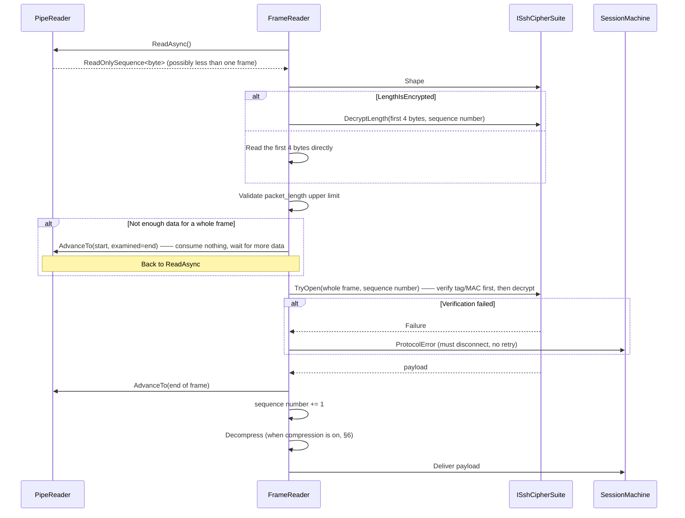
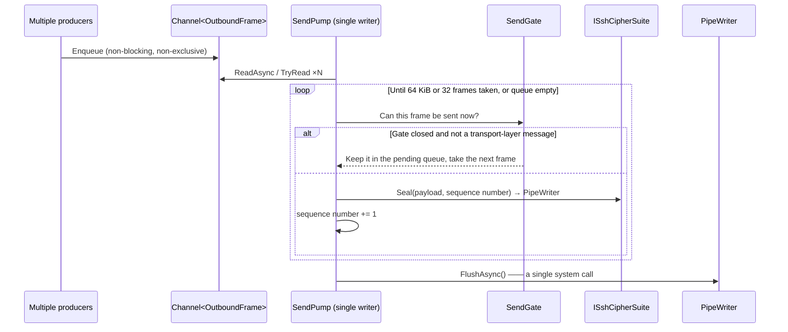

# 01 · Transport-Layer Framing

> Normative basis: RFC 4253 §6 (Binary Packet Protocol), §6.3, §6.4;
> RFC 5647 (AES-GCM); OpenSSH `PROTOCOL.chacha20poly1305`;
> `*-etm@openssh.com` in OpenSSH `PROTOCOL`.
>
> Corresponding implementation: `Transport/` (L2 framing layer) and `Crypto/` (L3 cipher suites).
> 中文：[`../../../zh/ssh/spec/01-transport-framing.md`](../../../zh/ssh/spec/01-transport-framing.md)

---

## 1 Frame structure

The shape of every SSH packet on the wire:

```
uint32    packet_length      —— excludes these 4 bytes themselves, and excludes the MAC
byte      padding_length     —— number of padding bytes
byte[n1]  payload            —— n1 = packet_length - padding_length - 1
byte[n2]  random padding     —— n2 = padding_length
byte[m]   mac                —— m = MAC length (0 under AEAD suites; the tag is counted separately)
```

| # | Type | Field | Constraint |
| :-: | --- | --- | --- |
| 1 | `uint32` | `packet_length` | See the upper limit in §1.1. **MUST** be validated before use |
| 2 | `byte` | `padding_length` | **MUST** be ≥ 4 and ≤ 255, and < `packet_length` |
| 3 | `byte[]` | `payload` | The (compressed) payload; its first byte is the message number |
| 4 | `byte[]` | `padding` | **MUST** be random bytes; MUST NOT be zeros or a predictable sequence |
| 5 | `byte[]` | `mac` | Present only for non-AEAD suites |

### 1.1 Length limits

| Phase | `packet_length` upper limit | Basis |
| --- | --- | --- |
| Before authentication completes | **35000** | RFC 4253 §6.1 requires implementations to support at least 35000; the handshake needs nothing larger |
| After authentication completes | **262144 (256 KiB)** | 〔Decision〕see below |

〔Decision〕**After authentication, relax to 256 KiB.**
Rationale: the RFC only specifies a lower bound. SFTP on high-latency links relies on large packets to reduce round trips;
permanently locking the limit at 35000 would directly shut off the throughput optimizations of §7. But there cannot be no limit either ——
it is the largest single block of memory the peer can make us allocate, a clear denial-of-service surface.
256 KiB is the compromise between "large enough not to limit throughput" and "small enough not to be worth using to exhaust memory".

〔Decision〕The relaxation happens **at the moment authentication succeeds**, performed by the connection factory (the same switch point as delayed compression).
The `maximum packet size` announced when opening a channel (the channel option `ReceiveMaxPacketBytes`, default 32 KiB) MUST fit within this limit (minus the packet header and maximum padding),
otherwise opening the channel is refused on the spot —— rather than waiting for the peer to send an "oversized packet" per our announcement and then judging it a protocol error.
〔History〕A comment in an early implementation said "relax after authentication", but no code actually performed the relaxation:
once a channel's announced packet limit exceeded roughly 34 KB, the server's packets were treated as protocol errors.

**Exceeding the limit MUST disconnect immediately**; "read it fully, discard, and continue" is not allowed —— an out-of-range length field means we
are already parsing at the wrong position, and all subsequent bytes are untrustworthy (General Provisions §5.3).

### 1.2 Padding rules

- The padding **MUST** make `packet_length + 4` (including the length field itself) an
  **integer multiple of `max(8, cipher block size)`**.
  - ChaCha20-Poly1305 and the null suite of the handshake align to 8.
  - AES-CTR and AES-GCM align to the AES block size of 16 (§2.1).
  - CBC is not implemented (00 §6.3).
- **Exception: two cases where the length field does not enter the alignment computation.**
  What is aligned is `padding_length + payload + padding`, **excluding** the 4-byte length, when:
  1. the encryption algorithm is **AEAD** (`aes*-gcm@openssh.com` see RFC 5647,
     `chacha20-poly1305@openssh.com` see OpenSSH PROTOCOL);
  2. **or** the MAC algorithm is **EtM** (`*-etm@openssh.com`) —— in that case the length field is plaintext
     and is likewise excluded from alignment.

  > 〔2026-09-21 correction〕This rule originally mentioned only AEAD. While implementing AES-CTR + EtM, checking OpenSSH's
  > `ssh_packet_send2_wrapped` with its `padlen = block_size - ((len - aadlen) % block_size)`
  > revealed that `aadlen` is **4 for both EtM and AEAD**.
  > Implementing it for AEAD only would misalign every frame by 4 bytes when `aes256-ctr` is paired with
  > `hmac-sha2-256-etm@openssh.com` —— which happens to be a common combination in modern OpenSSH.

  This rule is the most common source of misalignment in framing implementations and MUST be pinned down by a unit test (see
  `CipherSuiteConformanceTests.帧长满足对齐要求`).
- The padding length **MUST** be ≥ 4.
- 〔Decision〕**Add random-length padding when sending**: while still satisfying alignment,
  add one extra alignment block with 50% probability (capped at 255 bytes).
  Rationale: equal-length packets (such as each keystroke in an interactive shell) leak keystroke timing and length characteristics.
  The cost is a few dozen extra bytes per frame on average, negligible for interactive traffic.

### 1.3 Sequence numbers

Each direction maintains its own `uint32` sequence number:

- Starts at **0**, **counting from the first packet after the version identification string**.
- Incremented by 1 after each **complete frame** sent/received, **wrapping around to 0 on overflow** (not an error).
- The sequence number itself is **not transmitted on the wire**; the two sides stay in sync by counting independently.
- The sequence number takes part in the MAC / AEAD nonce computation —— so once they fall out of sync, authentication inevitably fails;
  this is integrity protection built into the protocol.
- **With strict KEX enabled, both sequence numbers are reset to zero after `SSH_MSG_NEWKEYS`** (see `03-key-exchange.md` §6).

---

## 2 The "shape" of a cipher suite

Different suites differ in **framing** along only four dimensions. Extracting them as data (`CipherSuiteShape`)
spares the framing layer from writing a "how many bytes to read first" branch for every algorithm.

| Dimension | Meaning |
| --- | --- |
| `LengthIsEncrypted` | Whether the length field itself is encrypted (decides whether the first 4 bytes can be read directly) |
| `AadBytes` | Number of prefix bytes that take part in integrity computation but are not encrypted |
| `TagBytes` | Length of the AEAD tag or MAC |
| `BlockBytes` | Block size used for padding alignment |
| `EncryptThenMac` | Whether the MAC covers the ciphertext (EtM) or the plaintext (MtE) |

### 2.1 Instances of the three shapes

#### ① `chacha20-poly1305@openssh.com`

Basis: OpenSSH `PROTOCOL.chacha20poly1305`.

```
LengthIsEncrypted = true    AadBytes = 0   TagBytes = 16   BlockBytes = 8   EtM = —
```

**Two independent keys** (64 bytes of key material in total; the first 32 bytes are `K_2`, the last 32 bytes are `K_1`):

| Key | Purpose |
| --- | --- |
| `K_1` | Encrypts **only** the 4-byte `packet_length`, nonce = sequence number, counter = 0 |
| `K_2` | Encrypts everything else (counter starts at 1) and produces the Poly1305 tag |

The Poly1305 key is the first 32 bytes of `ChaCha20(K_2, nonce=sequence number, counter=0)`.
The tag covers **the entire ciphertext** (including the 4 bytes of encrypted length).

> The receive order is therefore: decrypt the length with `K_1` → read the whole frame according to the length → verify the tag → decrypt the rest with `K_2`.
> **The tag MUST be verified before decrypting**, otherwise we would be providing the peer with a decryption oracle.

#### ② `aes256-gcm@openssh.com` / `aes128-gcm@openssh.com`

Basis: RFC 5647 + OpenSSH's nonce convention.

```
LengthIsEncrypted = false   AadBytes = 4   TagBytes = 16   BlockBytes = 16(alignment only)   EtM = —
```

- The length field is **plaintext**, and also takes part in tag computation as AAD.
- The nonce is 12 bytes: **a 4-byte fixed IV + an 8-byte invocation counter**;
  the counter's initial value is taken from the last 8 bytes of the IV produced by key derivation, and is **incremented by 1 per frame (wrapping as a 64-bit unsigned integer)**.
  〔Note〕It is **not** the sequence number —— RFC 5647 §7.1 specifies an independently incremented invocation counter.
  Using the sequence number instead happens to give the same value after the initial KEX, **but diverges after rekeying**; the symptom is
  "the connection runs for a while and then suddenly fails authentication". This is the most insidious pitfall in GCM implementations.
- Alignment is to 16, **excluding** the length field (the exception in §1.2).

#### ③ `aes*-ctr` + separate MAC

```
LengthIsEncrypted = true(CTR encrypts the length)   AadBytes = 0
TagBytes = MAC length   BlockBytes = 16   EtM = determined by the MAC algorithm name
```

CBC has this same shape in framing terms, but this library does not implement it (00 §6.3).

Two MAC orders:

| | MAC input | Receive flow |
| --- | --- | --- |
| **MtE** (`hmac-sha2-256`) | `sequence number ‖ unencrypted whole frame` | Must decrypt before computing the MAC → decrypt first, then verify |
| **EtM** (`hmac-sha2-256-etm@openssh.com`) | `sequence number ‖ plaintext length field ‖ ciphertext` | Can verify first, then decrypt |

〔Decision〕**EtM is ordered before MtE.** Rationale: MtE requires decrypting untrusted data before it can be verified,
which is essentially a decryption oracle; EtM does not have this problem. This is also OpenSSH's default order.

〔Note〕Under EtM **the length field is plaintext** (even though the encryption algorithm is CTR),
which conflicts with `LengthIsEncrypted = true` in the block above —— therefore in `CipherSuiteShape`
this flag is determined by the **combination** of "encryption algorithm + MAC algorithm", not by the encryption algorithm alone.
In the implementation this is the responsibility of the `ISshCipherSuite` assembly function, not a Cartesian product of two independent enums.

### 2.2 The "null suite" during the handshake

After the version exchange and before the first `SSH_MSG_NEWKEYS`, `none` + `none` is used:
no encryption, no authentication, block size 8. This is not a special-case branch; it is simply one set of values of `CipherSuiteShape` ——
the framing layer treats it exactly like any other.

---

## 3 Receive sequence



**Key point**: the two arguments of `AdvanceTo(consumed, examined)` MUST be given separately.
When data is insufficient, `consumed = start` (nothing consumed) and `examined = end` (we have looked this far;
give us more on the next read) —— getting them wrong causes `PipeReader` either to consider data "consumed" and drop it,
or to consider it "not yet examined" and no longer wait for new data; the latter shows up as a **hang**.

---

## 4 Send sequence and coalescing



**Why coalesce**: with a full SFTP pipeline there are 64 in-flight write requests; flushing per frame means one round of 64
socket writes. Coalescing them into 1–2 writes is the entire content of item 1 in the table of §7.

**Boundaries**:
- The limit of one coalescing batch is constrained by both "bytes" and "frame count", whichever is reached first.
  Limiting only by bytes would let many small frames (interactive keystrokes) pile up into high latency; limiting only by frame count would let large frames overflow the buffer.
- 〔Decision〕**Flush immediately when the queue is empty, without waiting**. No Nagle-style delayed aggregation ——
  keystroke latency in an interactive shell matters far more than throughput, and in bulk scenarios the queue is not empty anyway.

**Disposal**:

〔Decision〕**Disposing the transport no longer writes to the stream.** The send pump flushes explicitly after every batch, so any bytes still in the write buffer at disposal
can only have been left behind by a flush that was cancelled —— and that flush was most likely cancelled precisely because the peer stopped reading
(TCP zero window, a half-open link). Flushing again at disposal means waiting on the disposal path for a peer that is never coming back,
until TCP itself gives up (which can take a dozen minutes or more), with the caller's `await using` stuck there the whole time.
So the write side is completed with a "disposed" error and the leftover bytes are discarded; the read side is completed as usual.
The whole disposal path **does not throw**: it usually runs while cleaning up after some error, and a secondary I/O error surfacing there would only mask the real cause.

---

## 5 Boundaries and errors

| Situation | Handling |
| --- | --- |
| `packet_length` exceeds the limit | Disconnect, `ProtocolError` |
| `packet_length` < `padding_length + 1` | Disconnect, `ProtocolError` |
| `padding_length` < 4 | Disconnect, `ProtocolError` |
| Alignment does not satisfy the block size | Disconnect, `ProtocolError` |
| MAC / tag verification fails | Disconnect, `ProtocolError`. Retrying or continuing to read is **forbidden** |
| Payload length is 0 (no message number) | Disconnect, `ProtocolError` |
| Unknown message number | Reply `SSH_MSG_UNIMPLEMENTED` (carrying the sequence number that triggered it), **do not disconnect** |
| Peer closes the connection mid-frame | `ClosedByPeer`. **Not** `ProtocolError` —— distinguishing the two matters for the upper layer's reconnect decision |
| Peer closes cleanly (EOF on a frame boundary) | `ClosedByPeer` |
| Decompression fails (over the §6 limit, or a corrupt zlib stream) | Disconnect, `ProtocolError`; the reported cause MUST be the decompression failure itself (§6) |

〔Decision〕**EOF in the middle of a frame is an error, but the error must say "the peer closed mid-packet".**
The framing layer cannot quietly return "end of stream" the way it does for EOF on a frame boundary —— that would silently swallow a truncated packet,
and the upper layer would believe the peer left normally. But it is not the peer sending garbage either: the frame format error the framing layer raises carries a "peer closed mid-packet" flag,
and **all three phases** —— key exchange, authentication, and the session after the connection is established —— use it to classify the failure as `ClosedByPeer`
(`SshConnectionClosedException`, with phase `KeyExchange` / `Authenticating` / `Open` respectively, the same class as socket I/O failures);
only the remaining frame format and integrity errors are classified as `ProtocolError`.
Automatic reconnect acts only on "the link dropped" —— report a dropped link as a protocol error and reconnect never kicks in.

〔Decision〕**An unknown message number does not disconnect.** RFC 4253 §11.4 requires replying `SSH_MSG_UNIMPLEMENTED`.
Disconnecting would make it impossible to coexist with servers that implement new extensions —— and that is precisely how the SSH ecosystem evolves.

---

## 6 Where compression sits

Compression happens at the **payload layer**, i.e. on the content of `payload` in the diagram above:

```
Send:    message → compress → payload → pad → encrypt/MAC
Receive: decrypt/verify → strip padding → payload → decompress → message
```

- `zlib@openssh.com`: compression starts only **after authentication succeeds**. This is the only compression algorithm implemented.
  This avoids exposing compression state to arbitrary connecting parties during the unauthenticated phase.
  〔Note〕The switch point is **the next packet after** `SSH_MSG_USERAUTH_SUCCESS` is received/sent.
  **No** compressor is installed at the NEWKEYS of the first key exchange.
- `zlib` (RFC 4253 §6.2): **not implemented** (rationale in 00 §6.5). It compresses from the first NEWKEYS;
  if it were negotiated but treated as no compression, the two ends would desynchronize on the first authentication packet, surfacing only as an unexplained decompression error.
  So if our compression list contains any name other than `none` / `zlib@openssh.com`, the pre-connect list check rejects it (03 §2.2);
  when key exchange is run directly, bypassing the connection factory, a negotiated result other than these two still fails on the spot with a key-exchange error.
- **After every key re-exchange, the compression context MUST be reset**.
  The symptom of not resetting it is that the peer fails to decompress after rekeying —— by which time it is no longer recognizable as a compression problem.

The compressed `payload` length is still subject to the limit of §1.1;
**the decompressed length MUST also be capped**, otherwise a small packet could decompress into arbitrarily large memory —— i.e. a zip bomb.

〔Decision〕**The decompression cap is the `packet_length` limit in force at the time** (§1.1). `zlib@openssh.com` is only enabled after authentication, so in practice it is 256 KiB.
The cap is checked **before** the decompressed data is written out; exceeding it disconnects with `ProtocolError`.
Rationale: a normal peer splits data according to the channel packet limit we announce (32 KiB by default; raising it must still fit within the §1.1 limit) and every other message is small, so decompressed payloads fit anyway;
allowing some multiple of the packet limit buys no interoperability and only enlarges the memory a compression bomb can occupy.

> 〔2026-09-25 correction〕This rule used to say "4 times `ReceiveMaxPacketBytes`". The implementation uses the packet limit itself; the text now matches it.

〔Note〕Decompression happens **after** the frame has already been consumed from the read buffer. When decompression fails, the "parse failure → hand the read buffer back untouched" cleanup
**MUST NOT** run —— the read position is already past this frame, so that step throws a separate internal error that masks the real cause (hitting the decompression cap, a corrupt zlib stream),
and the user sees only an internal exception with nothing to act on. What reaches the upper layer must be the decompression failure itself.
