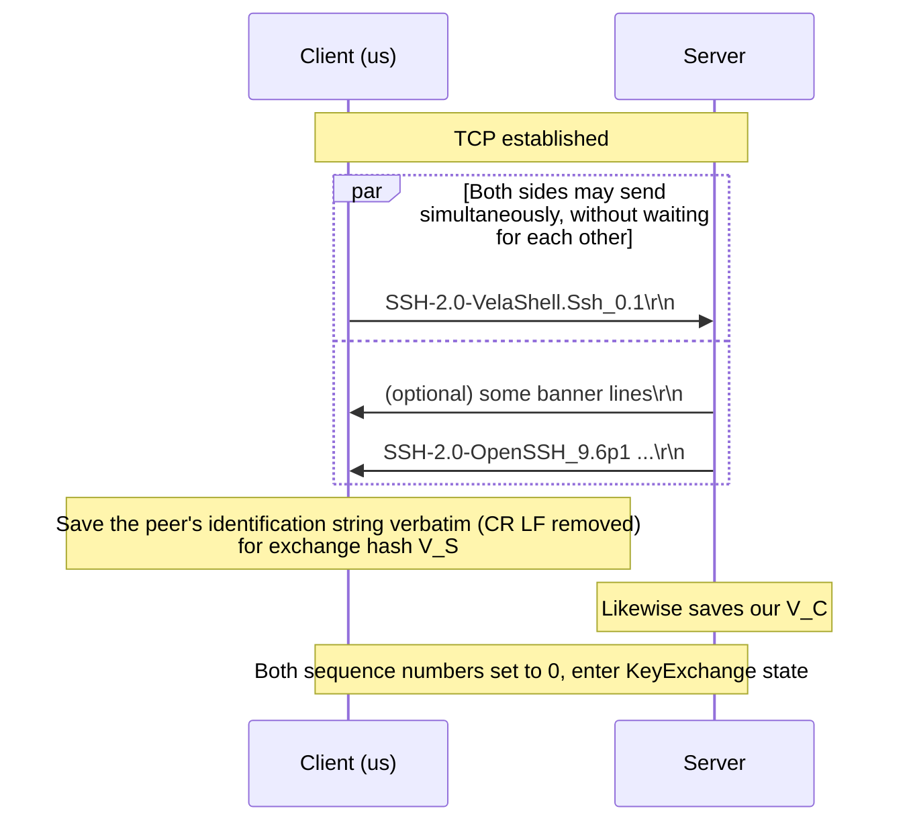

# 02 · Version Identification String Exchange

> Normative basis: RFC 4253 §4.2 (Protocol Version Exchange).
> Corresponding implementation: `Session/` (the `VersionExchange` state of the L4 state machine).
> 中文：[`../../../zh/ssh/spec/02-version-exchange.md`](../../../zh/ssh/spec/02-version-exchange.md)

---

## 1 What this step does

After TCP is established and before any SSH packet, each side sends one line of ASCII text identifying itself:

```
SSH-2.0-softwareversion SP optional-comment CR LF
```

For example:

```
SSH-2.0-OpenSSH_9.6p1 Ubuntu-3ubuntu13.5\r\n
SSH-2.0-VelaShell.Ssh_0.1.0\r\n
```

This step serves three purposes; **the third is the one most easily overlooked**:

1. Protocol version negotiation (we support only 2.0).
2. Software identification, for interoperability workarounds.
3. **The two sides' identification strings (with CR LF removed) are the first two inputs of the exchange hash `H`**
   —— see [`03-key-exchange.md`](03-key-exchange.md) §4.
   They therefore **MUST be saved verbatim**, including any spaces and comments; any normalization will cause signature verification to fail.

---

## 2 Message format

### 2.1 What we send

| Part | Value | Constraint |
| --- | --- | --- |
| Prefix | `SSH-2.0-` | Fixed |
| softwareversion | `VelaShell.Ssh_<version>` | **MUST NOT** contain spaces, `-`, CR, LF or non-printable ASCII |
| Comment | 〔Decision〕**not sent** | See below |
| Terminator | `\r\n` | Fixed |

〔Decision〕**Send no comment, and no operating system / runtime information.**
Rationale: the only use of the comment part (after the space) is to give the peer hints for its compatibility decisions,
and we do not need the peer to treat us specially. Conversely, it is a pure fingerprinting surface ——
broadcasting `.NET 9.0.3 / Windows 11` to every machine you have ever connected to (honeypots included) has no benefit whatsoever.

〔Decision〕**The version number goes only down to the minor version** (`0.1` rather than `0.1.3+abc1234`).
Rationale: same as above; the patch number means nothing for interoperability and only increases fingerprinting precision.
〔Interop〕If it is ever found that some server needs the exact version to judge compatibility correctly, this will be relaxed as needed.

**The whole line (including CR LF) MUST be ≤ 255 bytes.**

### 2.2 What we receive

The peer's line **MUST**:

- start with `SSH-`;
- have the second segment (between `SSH-` and the next `-`) be `protoversion`;
- have `softwareversion [SP comment]` from the third segment on.

| protoversion | Handling |
| --- | --- |
| `2.0` | Normal |
| `1.99` | 〔Decision〕**Accept**, treated as 2.0. This is how old servers express "supports both 1.x and 2.0" (RFC 4253 §5.1) |
| Anything else (`1.5` etc.) | `VersionMismatch`, disconnect |

---

## 3 Banner lines

RFC 4253 §4.2 allows the **server** to send arbitrary lines of text (legal notices, announcements) before the identification string.
These lines:

- **do not start with `SSH-`**;
- **do not take part** in the exchange hash;
- the client **MUST** ignore them or display them to the user, and then keep waiting for the real identification string.

〔Decision〕**Collect them and hand them to the consumer** (`SshConnectionOptions.PreAuthBannerHandler`),
but do not display them by default. Rationale: in enterprise environments this text is often a usage notice with legal significance,
so it is inappropriate for the library to swallow it; but it comes from an **unauthenticated** peer, and printing it to the user's terminal by default is an injection surface.

**Limits** (all of them are required; otherwise this is a zero-cost memory exhaustion surface):

| Limit | Value | Rationale |
| --- | --- | --- |
| Maximum length of a single line | 255 bytes (including CR LF) | Same limit as the identification string |
| Maximum number of lines | 〔Decision〕**1024** | Enough for any real legal notice |
| Maximum cumulative bytes | 〔Decision〕**64 KiB** | Belt and braces: 1024 × 255 is only 255 KiB anyway, but real scenarios never come close |
| Timeout for the whole version exchange | Counted against `ConnectTimeout` | See §5 |

**The client MUST NOT send banner lines** (RFC 4253 §4.2 allows only the server to send them).

---

## 4 Sequence



**Concurrency**: both sides may send their identification strings **simultaneously**; there is no need to receive before sending.
〔Decision〕**We send immediately, without waiting for the peer.** Rationale: waiting for the peer to send first adds an RTT for nothing;
moreover, some servers (and every middlebox that treats SSH as a port-probing target) really do wait for the client to speak first.

---

## 5 Boundaries and errors

| Situation | Handling |
| --- | --- |
| A single line exceeds 255 bytes | `ProtocolError`, disconnect |
| Banner lines exceed 1024 lines or 64 KiB | `ProtocolError`, disconnect |
| A received line does not start with `SSH-` and the banner-line limits have been exceeded | `ProtocolError`, disconnect |
| `protoversion` is not `2.0` / `1.99` | `VersionMismatch`, disconnect |
| Peer closes the connection before finishing its identification string | `ClosedByPeer` |
| Timeout | Counted against `ConnectTimeout`, reported as `Timeout` |
| Line ends with a bare `\n` (missing `\r`) | 〔Interop〕**Accept** |

〔Interop〕**A bare `\n` line ending MUST be accepted.** The RFC requires `\r\n`, but some embedded SSH implementations
(including the management ports of several models of network devices) send only `\n`. Strictly requiring `\r\n` would make these devices entirely unreachable,
while accepting it has no security cost at all —— the identification string itself takes part in no trust decision.
**Note**: in this case the `V_S` saved into the exchange hash is the content **with the line ending removed**;
the result is identical for `\r\n` and `\n`, so signature verification is unaffected.

---

## 6 Implementation notes

1. **Scan byte by byte for `\n`; do not read a fixed length in one go.** The first binary packet follows immediately after the identification string,
   and any extra bytes read MUST stay in the `PipeReader` buffer and be handed to the framing layer ——
   this is the direct benefit of using `PipeReader` rather than `Stream.ReadAsync`:
   after `AdvanceTo(end of line)` the remaining bytes automatically belong to the framing layer, with no need to shuffle buffers yourself.
2. **Save the original text, not the parsed result.** What goes into the hash as `V_C` / `V_S` is **the whole line with the line ending removed**,
   not "the parsed software name". The implementation should store a `byte[]` rather than a `string`,
   to avoid any encoding round trip altering the bytes.
3. **Completion of the version exchange means "the peer is an SSH service".** Anything received before that point
   may come from an entirely unrelated service (wrong port), and error messages should reflect this ——
   "the peer is not an SSH service" is far more useful to the user than "protocol error".
