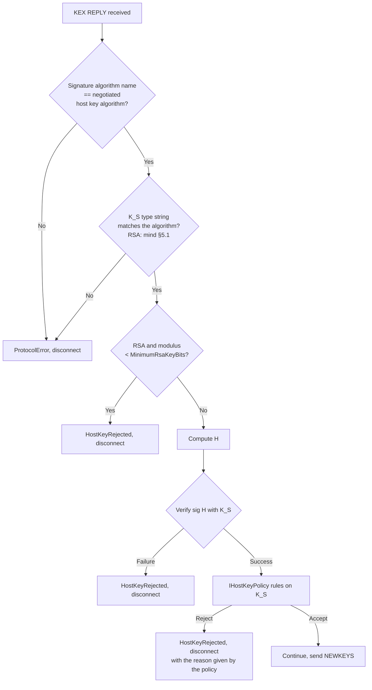
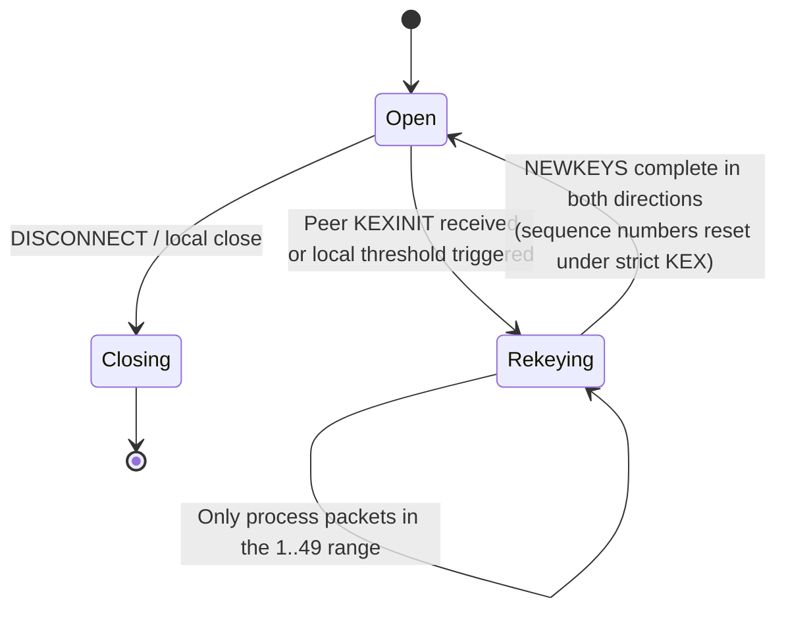

# 03 · Algorithm Negotiation and Key Exchange

> Normative basis: RFC 4253 §7–§9 (Key Exchange / Key Derivation / Rekey), §8 (DH group14);
> RFC 5656 (ECDH, NIST curves); RFC 8731 (curve25519-sha256); RFC 8268 (group14/16 + SHA-2);
> RFC 4419 (group exchange); RFC 8308 (Extension Negotiation);
> `kex-strict-*-v00@openssh.com` in OpenSSH `PROTOCOL` (Terrapin mitigation, CVE-2023-48795);
> draft-kampanakis-curdle-ssh-pq-ke (ML-KEM hybrid); the sntrup761 hybrid in OpenSSH `PROTOCOL`.
>
> Corresponding implementation: `Crypto/` (L3) and `Session/` (the `KeyExchange` / `Rekeying` states of L4).
>
> **This is the longest document in the whole specification, and the one that least tolerates mistakes.** Every byte-order error here
> surfaces as the same "signature verification failed", and is extremely expensive to track down.
> 中文：[`../../../zh/ssh/spec/03-key-exchange.md`](../../../zh/ssh/spec/03-key-exchange.md)

---

## 1 Overview sequence

```mermaid
sequenceDiagram
    participant C as Client (us)
    participant S as Server

    Note over C,S: Version exchange complete, sequence number = 0

    par Both sides send simultaneously, without waiting
        C->>S: SSH_MSG_KEXINIT (I_C)
    and
        S->>C: SSH_MSG_KEXINIT (I_S)
    end

    Note over C,S: Each side computes the mutually supported algorithm set per the rules of §2

    C->>S: KEX-method-specific INIT (30) —— client public key
    S->>C: KEX-method-specific REPLY (31) —— K_S ‖ server public key ‖ sig(H)

    Note over C: ① Compute shared secret K<br/>② Assemble exchange hash H (§4)<br/>③ Verify sig(H) with K_S<br/>④ Host key policy rules on K_S (§5)

    par Both sides send simultaneously
        C->>S: SSH_MSG_NEWKEYS (21)
    and
        S->>C: SSH_MSG_NEWKEYS (21)
    end

    Note over C,S: Each side switches to the new keys; with strict KEX both sequence numbers reset to 0
```

**Two concurrency facts that must be remembered**:

1. `KEXINIT` is **sent by both sides simultaneously**; it is not request-response. Either may arrive first; both are legal.
2. `NEWKEYS` is also bidirectional, and **the directions are independent**:
   - **After sending** `NEWKEYS`, the next packet we send uses the new send keys;
   - **After receiving** `NEWKEYS`, the next packet we receive uses the new receive keys.
   The two switch points **do not wait for each other**. Merging them into a single "switch moment" is a common mistake;
   the symptom is sporadic decryption failures on fast links.

---

## 2 `SSH_MSG_KEXINIT` (20)

### 2.1 Field table

| # | Type | Field | Description |
| :-: | --- | --- | --- |
| 1 | `byte` | `SSH_MSG_KEXINIT` = 20 | |
| 2 | `byte[16]` | `cookie` | **MUST** be a cryptographically random value. Prevents either side from determining `H` alone |
| 3 | `name-list` | `kex_algorithms` | Contains indicators, see §2.3 |
| 4 | `name-list` | `server_host_key_algorithms` | |
| 5 | `name-list` | `encryption_algorithms_client_to_server` | |
| 6 | `name-list` | `encryption_algorithms_server_to_client` | |
| 7 | `name-list` | `mac_algorithms_client_to_server` | |
| 8 | `name-list` | `mac_algorithms_server_to_client` | |
| 9 | `name-list` | `compression_algorithms_client_to_server` | |
| 10 | `name-list` | `compression_algorithms_server_to_client` | |
| 11 | `name-list` | `languages_client_to_server` | Always sent empty |
| 12 | `name-list` | `languages_server_to_client` | Always sent empty |
| 13 | `boolean` | `first_kex_packet_follows` | See §2.4 |
| 14 | `uint32` | `0` (reserved) | **MUST** send 0; a non-zero value received **MUST** be ignored rather than treated as an error |

**The payload of the whole message (from the message number byte up to the final `uint32`) MUST be saved verbatim** ——
it is exactly `I_C` / `I_S` in the exchange hash (§4).

> Implementation note: what is saved is the **payload**, not the whole frame. It excludes `packet_length`, `padding_length`, padding and MAC.

### 2.2 Negotiation rule (RFC 4253 §7.1)

For each algorithm category, independently:

> Take the first name in the **client's list** that **also appears in the server's list**.

Note three things:

1. **The client's order prevails** —— so the order of our lists is our preference (General Provisions §7).
2. **Each category is negotiated independently**, without affecting the others —— with one exception:
   the eligible set of host key algorithms is constrained by the KEX method (some KEX methods require the host key to be capable of signing/encryption;
   all the KEX methods we support require only signing, so this constraint always holds in this implementation).
3. **No intersection in any category → negotiation fails**, throwing `SshNegotiationException`,
   **with both sides' complete lists and the peer's version string included in the exception** (see [`08-failures.md`](08-failures.md)).
   This is this library's most direct improvement over existing libraries: what the user gets is not
   "No common encryption algorithm.", but "the peer offered only aes128-cbc;
   we support chacha20-poly1305@openssh.com, aes256-gcm@openssh.com, …" ——
   from which it is obvious at a glance that the peer has nothing but CBC left, and this library does not implement CBC (General Provisions §6.3).

**The AEAD special case**: when the negotiated encryption algorithm is AEAD (`*-gcm@openssh.com`,
`chacha20-poly1305@openssh.com`), **the result of the MAC list negotiation for that direction is ignored**;
integrity is provided by the AEAD itself. We still **MUST** send a non-empty MAC list ——
not sending one would make it impossible for peers that support only non-AEAD to negotiate with us.

〔Decision〕**Our own lists are validated before dialing** (`SshAlgorithmSet.Validate()`, called when connecting starts):

- none of the eight lists may be empty —— an empty list cannot be negotiated with any peer;
- every name in the key exchange list is either a method this library implements (the fixed table in `SshKeyExchangeFactory`; nothing can be registered at runtime) or one of the indicators of §2.3;
- every name in the encryption, MAC and compression lists must be one this library implements (for compression that is only `none` and `zlib@openssh.com`).

Otherwise `ArgumentException` is thrown on the spot and **no dialing happens at all**.
Rationale: a name we do not implement that slips into the list only gets negotiated when the peer happens to have nothing else left ——
the failure then happens during key derivation, surfaces as an unexplained "not implemented", and shows up only when connecting to that one device.
Reporting it here points the error at the configuration itself.
Host key algorithm names are **not checked here**: they are guarded by host key parsing and signature verification (§5.3), where an unknown type gets an explicit error.

### 2.3 The three indicators hidden in `kex_algorithms`

These three names **are not key exchange methods**; they are flags stuffed into the same list.
The client **MUST** put them in the list, but **MUST NOT** treat them as a negotiation result.

| Name | Sent by | Meaning |
| --- | --- | --- |
| `ext-info-c` | Client | I support RFC 8308 extension negotiation; please send me `SSH_MSG_EXT_INFO` |
| `ext-info-s` | Server | The same thing on the server side (as a client we only read it, never send it) |
| `kex-strict-c-v00@openssh.com` | Client | I support strict KEX (§6) |
| `kex-strict-s-v00@openssh.com` | Server | The server supports strict KEX |

〔Decision〕**`ext-info-c` and `kex-strict-c-v00@openssh.com` are always sent, and only in the first KEXINIT.**
RFC 8308 §2.2 explicitly requires `ext-info-c` to appear only in the **first** KEXINIT;
sending it again during rekeying is a protocol violation, and some servers will disconnect.

**Indicators MUST be placed at the end of the list**, to avoid being mistakenly selected as a negotiation result (although matching by name would not select them anyway,
placing them at the end makes it obvious at a glance that they are not candidates).

### 2.4 `first_kex_packet_follows` (guessed KEX)

The sender may send, **immediately** after KEXINIT, the KEX INIT packet it guesses will be needed, saving one RTT.
If the guess is wrong (the negotiated KEX method or host key algorithm differs from the guess), the receiver **MUST ignore** that packet.

〔Decision〕**We always send `false`, and correctly handle a peer's `true` on receipt.**

Rationale:
- Not used on the sending side: a correct guess saves 1 RTT; a wrong guess wastes one public key (for the ML-KEM hybrid that is a 1KB+ packet)
  and requires handling the state branch "what I guessed differs from what was negotiated". **The complexity of that branch is not worth that one RTT** ——
  our means of saving RTTs are the send coalescing and adaptive windows of §7, which are effective throughout the connection,
  whereas guessed KEX is effective only once, at connection setup.
- The receiving side **MUST** implement it: OpenSSH servers use it in some configurations.
  On receiving `first_kex_packet_follows = true`: if the negotiation result matches the peer's first preference, process that packet normally;
  otherwise **discard it** (the entire packet is discarded; the sequence number is incremented as usual).

> The rule for deciding "did the peer guess correctly" (RFC 4253 §7.1):
> whether both the **first** entry of the peer's `kex_algorithms` and the **first** entry of its `server_host_key_algorithms`
> equal the final negotiation result. Only if both are equal does the guess count as correct.

---

## 3 Key exchange methods

### 3.1 Common shape

All KEX methods we support have the same two-step shape; only the public key content differs:

| Direction | Number | Content |
| --- | :-: | --- |
| C → S | 30 | The client's ephemeral public key `Q_C` (`string`) |
| S → C | 31 | `string K_S` ‖ `string Q_S` ‖ `string signature` |

- `K_S` is **the blob of the server's host public key** (format in §5.1).
- `signature` is the signature over **the exchange hash `H`** made with the host private key (format in §5.2).
- The algorithm for the shared secret `K` varies (see below), but it **always enters `H` as either an `mpint` or a `string`**
  —— this differs between methods and is the easiest place to go wrong; it is listed item by item below.

> Numbers 30/31 are **method-specific**; different KEX methods may assign them different meanings
> (see the comment in `Protocol/SshMessageNumber.cs`: 30–49 are deliberately kept out of the global enum).
> The methods we support all happen to use the 30/31 pair, but `diffie-hellman-group-exchange-*`
> has an additional set of preceding messages; see §3.5.

### 3.2 `curve25519-sha256` (RFC 8731)

| Item | Value |
| --- | --- |
| Hash | SHA-256 |
| `Q_C` / `Q_S` | 32-byte X25519 public key, encoded as `string` |
| `K` | X25519 shared secret (32 bytes), **encoded into `H` as `mpint`** |

**Three MUSTs**:

1. `Q_C` / `Q_S` **MUST** be exactly 32 bytes long; otherwise it is a protocol error.
2. **If the X25519 result is all zeros, the exchange MUST be aborted** (the contributory behaviour requirement of RFC 7748 §6.1).
   All zeros means the peer supplied a low-order point.
3. `K` enters `H` as an `mpint` —— meaning **a `0x00` must be prepended when the top bit is 1, and leading zeros must be stripped**
   (General Provisions §3.1). Stuffing it in directly as a fixed 32 bytes is the most common mistake; the symptom is
   "about 1/256 of connections fail signature verification" —— a probabilistic failure that is extremely hard to diagnose.

`curve25519-sha256@libssh.org` is **exactly the same**; only the name differs (for historical reasons).
Both names are sent, and they share one implementation.

### 3.3 `ecdh-sha2-nistp256 / 384 / 521` (RFC 5656)

| Curve | Hash | `Q` encoding |
| --- | --- | --- |
| nistp256 | SHA-256 | Uncompressed point `0x04 ‖ X ‖ Y`, as `string` |
| nistp384 | SHA-384 | Same as above |
| nistp521 | SHA-512 | Same as above |

- `K` is the **X coordinate** of the shared point, encoded into `H` as `mpint`.
- **The peer's public key point MUST be verified to be on the curve** and not the point at infinity.
  .NET's `ECDiffieHellman.ImportSubjectPublicKeyInfo` / `ECParameters` validation does this,
  **but it MUST be confirmed that the exception is correctly translated into a protocol error rather than leaking out**.
- 〔Note〕The coordinates of nistp521 are 66 bytes (521 bits); `0x04 ‖ X ‖ Y` totals 133 bytes.
  Implementations that hard-code an assumption of 64 or 65 bytes will crash on this curve.

### 3.4 `diffie-hellman-group14-sha256` / `group16-sha512` (RFC 8268)

| Name | Group | Hash |
| --- | --- | --- |
| `diffie-hellman-group14-sha256` | MODP 2048-bit (RFC 3526 Group 14) | SHA-256 |
| `diffie-hellman-group16-sha512` | MODP 4096-bit (RFC 3526 Group 16) | SHA-512 |
| `diffie-hellman-group14-sha1` | Group 14 | SHA-1. **Off by default**, 〔Interop〕old devices |

- `e = g^x mod p` (client), `f = g^y mod p` (server), both as `mpint`.
- `K = f^x mod p`, as `mpint`.
- **MUST validate** `1 < e,f < p-1`. Not validating amounts to accepting small-subgroup attacks.
- The bit length of the private exponent `x` **SHOULD** be at least twice the hash output (the recommendation of RFC 4253 §8).
  〔Decision〕Uniformly use **2× the hash length** (group14-sha256 → 512 bits), not the full bit width of the group ——
  the full width brings no additional security, it only makes modular exponentiation much slower.

### 3.5 `diffie-hellman-group-exchange-sha256` (RFC 4419)

> **Implementation status (2026-09-25)**: **not implemented yet**. It is not in the default list and not registered with the key exchange factory,
> so putting it in the list is rejected by the pre-connect check (§2.2). What follows is the specification to implement it against.

**Two more messages than the other methods**, because the group is supplied by the server on the fly according to the client's request:

| Direction | Number | Content |
| --- | :-: | --- |
| C → S | 34 `GEX_REQUEST` | `uint32 min` ‖ `uint32 n` (preferred) ‖ `uint32 max` |
| S → C | 31 `GEX_GROUP` | `mpint p` ‖ `mpint g` |
| C → S | 32 `GEX_INIT` | `mpint e` |
| S → C | 33 `GEX_REPLY` | `string K_S` ‖ `mpint f` ‖ `string signature` |

> Note that the numbers **conflict with other methods**: here 31 is `GEX_GROUP`, whereas in curve25519 31 is `KEX_ECDH_REPLY`.
> This is exactly why the 30–49 range must be interpreted according to "the currently negotiated KEX method" and cannot have a global enum.

- 〔Decision〕`min = 2048`, `n = 3072`, `max = 8192`.
  **A `p` smaller than 2048 bits supplied by the server is not accepted** —— after logjam (CVE-2015-4000), 1024 bits is unacceptable.
- **MUST validate** that `p` is prime, that `g` is in a reasonable range, and that the bit length of `p` falls within our requested `[min, max]`.
  Primality testing uses Miller-Rabin (the BCL has no direct API; implement it ourselves on `System.Numerics.BigInteger`,
  with ≥ 64 rounds). 〔Decision〕This step **may be cached**: the same `(p, g)` is usually reused by a server,
  so cache the test result keyed by `SHA-256(p ‖ g)` to avoid spending tens of milliseconds on every connection.
- The inputs of `H` **include** `min ‖ n ‖ max ‖ p ‖ g`; see §4.2.

### 3.6 Post-quantum hybrids: `mlkem768x25519-sha256` and `sntrup761x25519-sha512`

Both have the same shape: **a KEM run in parallel with X25519**, with the shared secret being the hash of both results.

| Method | KEM | Hash | Client sends | Server sends |
| --- | --- | --- | --- | --- |
| `mlkem768x25519-sha256` | ML-KEM-768 | SHA-256 | `ek_pq ‖ Q_C` (1184 + 32 bytes) | `ct_pq ‖ Q_S` (1088 + 32 bytes) |
| `sntrup761x25519-sha512` | sntrup761 | SHA-512 | `pk_pq ‖ Q_C` (1158 + 32) | `ct_pq ‖ Q_S` (1039 + 32) |

- The two parts are **concatenated and encoded as a single `string`**, not as two `string`s.
- Shared secret: `K = HASH(K_pq ‖ K_x25519)`, where `HASH` is the method's hash.
  〔Critical〕**Here `K` is a `string` (fixed at 32 or 64 bytes), not an `mpint`.**
  This is the **fundamental difference** from §3.2/§3.3/§3.4 —— the post-quantum hybrid methods deliberately switched to a fixed-length `string`
  precisely to avoid the `mpint` leading-zero problem. **Get this wrong and the symptom is, again, probabilistic signature failure.**
- ML-KEM is available in the .NET 11 BCL (`System.Security.Cryptography.MLKem`);
  sntrup761 is not, and must be implemented ourselves or taken from BouncyCastle.
  〔Decision〕**M1 does only `mlkem768x25519-sha256`**; sntrup761 is deferred to M5,
  because OpenSSH 9.9+ already ranks ML-KEM first, and sntrup761 is only for compatibility with 8.5–9.8.
- `sntrup761x25519-sha512@openssh.com` is the old name of the same algorithm (used by OpenSSH < 9.9).

---

## 4 Exchange hash `H`

### 4.1 Common inputs (all methods except GEX)

`H = HASH(...)`, with the inputs concatenated in order, **each item encoded according to its SSH type**:

| # | Type | Content |
| :-: | --- | --- |
| 1 | `string` | `V_C` —— client identification string (CR LF removed, original bytes) |
| 2 | `string` | `V_S` —— server identification string (CR LF removed, original bytes) |
| 3 | `string` | `I_C` —— the **payload** of the client's KEXINIT (including the message number byte) |
| 4 | `string` | `I_S` —— the payload of the server's KEXINIT |
| 5 | `string` | `K_S` —— server host public key blob |
| 6 | Method-dependent | Client public key (`Q_C` / `e`) |
| 7 | Method-dependent | Server public key (`Q_S` / `f`) |
| 8 | Method-dependent | Shared secret `K` |

The types of items 6/7/8 depend on the method:

| Method | `Q_C`/`e` | `Q_S`/`f` | `K` |
| --- | --- | --- | --- |
| curve25519 | `string` | `string` | **`mpint`** |
| ecdh-nistp* | `string` | `string` | **`mpint`** |
| dh-group14/16 | **`mpint`** | **`mpint`** | **`mpint`** |
| mlkem768x25519 / sntrup761x25519 | `string` | `string` | **`string`** |

> **Make this table the data source for unit tests.** One known vector per row, asserting `H` byte by byte.
> This is the place in the entire specification most worth writing tests for first.

### 4.2 Additional inputs for GEX

`diffie-hellman-group-exchange-*` inserts the following between item 5 and item 6:

| # | Type | Content |
| :-: | --- | --- |
| 5.1 | `uint32` | `min` (the minimum bit length we requested) |
| 5.2 | `uint32` | `n` (preferred bit length) |
| 5.3 | `uint32` | `max` |
| 5.4 | `mpint` | `p` |
| 5.5 | `mpint` | `g` |

〔Note〕RFC 4419 has an old "send only `n`" variant (`SSH_MSG_KEX_DH_GEX_REQUEST_OLD`, number 30).
〔Decision〕**The old variant is not implemented**; only the three-parameter 34 is sent. Any server that still supports only the old variant
has an SSH implementation too old to fall within our support scope.

### 4.3 Session identifier `session_id`

The `H` computed by the **first** key exchange is the `session_id`, and it **never changes** thereafter
(even when rekeying produces a new `H`).

Uses of `session_id`:
- key derivation (§4.4);
- **the signature input of public key authentication** ([`04-authentication.md`](04-authentication.md) §4.3).

〔Implementation note〕During rekeying, "the new `H`" and "the unchanging `session_id`" must be stored separately.
If they are merged into a single field, the symptom is that public key authentication on a newly opened channel after rekeying fails ——
and that is an extremely rare path, likely to go unnoticed for a long time after release.

---

## 5 Host key verification

### 5.1 Format of `K_S`

| Algorithm | Blob content |
| --- | --- |
| `ssh-ed25519` | `string "ssh-ed25519"` ‖ `string key`(32 bytes) |
| `ecdsa-sha2-nistp256` | `string "ecdsa-sha2-nistp256"` ‖ `string "nistp256"` ‖ `string Q`(uncompressed point) |
| `ssh-rsa` / `rsa-sha2-*` | `string "ssh-rsa"` ‖ `mpint e` ‖ `mpint n` |
| `*-cert-v01@openssh.com` | Certificate structure, see OpenSSH `PROTOCOL.certkeys` |

〔Critical〕**The type string in an RSA blob is always `"ssh-rsa"`, even if `rsa-sha2-512` was negotiated.**
`rsa-sha2-256` / `rsa-sha2-512` are **signature algorithm** names, not key type names.
Comparing the negotiated algorithm name against the type string in the blob will fail —— this is an easy-to-trip asymmetry
introduced by RFC 8332.

### 5.2 Signature format

| Algorithm | Signature blob |
| --- | --- |
| `ssh-ed25519` | `string "ssh-ed25519"` ‖ `string sig`(64 bytes) |
| `ecdsa-sha2-nistp*` | `string alg` ‖ `string (mpint r ‖ mpint s)` —— **nested**; the inner part is a string made of two concatenated mpints |
| `rsa-sha2-256/512` | `string "rsa-sha2-256"` ‖ `string sig` —— PKCS#1 v1.5, **not PSS** |
| `ssh-rsa` | `string "ssh-rsa"` ‖ `string sig` —— SHA-1 + PKCS#1 v1.5 |

〔Note〕The **double string nesting** of ECDSA signatures is another classic pitfall:
the content of the outer string is the concatenation "`mpint r` followed by `mpint s`",
not r and s concatenated directly as fixed-length bytes. DER encoding is also wrong.

### 5.3 Verification order (the order itself is a security property)



**Three reasons for the order**:

1. **Verify the signature first, then consult the policy.** Asking the user "do you want to trust this key" before the signature has passed is absurd ——
   the key has not even proven that it holds the corresponding private key.
2. **The RSA length check comes before signature verification.** 〔Decision〕`MinimumRsaKeyBits` defaults to **2048**.
   It is placed before signature verification so as not to spend any computing resources on weak keys.
3. **Policy rulings are timed independently.** 〔Decision〕The time taken by `IHostKeyPolicy.EvaluateAsync`
   **is not counted against `ConnectTimeout`**; it is bounded by a separate `HostKeyDecisionTimeout` (infinite by default).

   Rationale: this targets a real defect directly —— an interactive client pops up a dialog here to ask the user,
   and if the time the dialog sits there counted against the connect timeout, by the time the user clicks "Trust" this attempt has already been declared dead,
   and a reconnect has to be made on the spot. With the two timers separated, that reconnect logic disappears together with its explanatory comment.

   〔Decision〕In the implementation this comes down to three things:
   - the connection timer is **paused** during the ruling, and resumes from the remaining time after the ruling ends;
   - the ruling and the persistence of "trust permanently" honor only **the caller's cancellation token**, not the connection timer's ——
     when the user clicks "trust permanently", that write to known_hosts should not receive an already-cancelled token;
   - when connecting through a jump host, the entire connection setup of the inner hop happens within the dialing phase of the outer hop ——
     while the inner hop is ruling, **the outer timer is paused as well** (`09-dialing.md` §2.4).

### 5.4 The contract of `IHostKeyPolicy`

```
ValueTask<SshHostKeyVerdict> EvaluateAsync(SshHostKeyContext context, CancellationToken cancellationToken)
```

`SshHostKeyContext` **MUST** provide (all the material of the key itself is on `Key`, an `SshPublicKey`):

| Field | Purpose |
| --- | --- |
| `Host` / `Port` | The **logical** host being connected to (on a jump chain, the target of this hop, not the TCP peer) |
| `KeyBlob` / `KeyType` / `KeyBits` | Raw material |
| `Sha256Fingerprint` / `Md5Fingerprint` | For display. SHA-256 is base64 without padding, consistent with OpenSSH |
| `Key.IsCertificate` / `Key.Certificate` | Host certificate issued by a CA (§5.5). A certificate's fingerprint is the fingerprint of **the key inside it**, consistent with `ssh-keygen -l` |
| `RandomArt` | 〔Decision〕Provide an OpenSSH-style ASCII fingerprint picture. It genuinely helps with visual comparison |

An `SshHostKeyVerdict` can only be obtained from four factory members: `Accept` / `AcceptAndPersist` / `Reject(message)` / `RejectChanged(message)`.
**A rejection MUST carry a reason text**, which goes verbatim into `SshConnectException.Message` ——
this directly targets "the user only sees a bare UntrustedPeer and doesn't know where to delete the record".
The reason code is determined by the kind of rejection (`SshHostKeyVerdict.Reason`): `Reject` is `HostKeyRejected`;
`RejectChanged` is `HostKeyChanged` —— the recorded key has changed, or only other types are recorded (the next decision), possibly a man-in-the-middle.
Callers use this to handle "not trusted" and "changed" separately: the latter should not be casually waved through by a "trust and remember" button.

〔Decision〕**`default(SshHostKeyVerdict)` is a rejection.** The zero value of the verdict enum is `Reject`, so a verdict someone forgot to assign does not turn into a pass;
a rejection without an explanation reports "host key rejected by policy".

〔Decision〕**Switching to another key type must not bypass "changed".** If a man-in-the-middle presents a key type not in the records and it is treated as "never seen",
the "host key changed" check is bypassed, and a policy that accepts new hosts will quietly record it. Both of the following are done:

1. A policy can (via the optional `IHostKeyTypePreference`) report which key types are already recorded for this host; at connect time the host key algorithms of those types
   are **moved to the front** — negotiation follows the client's order, so a legitimate server ends up with the recorded type. Rekeying uses the same list.
2. If a type that isn't recorded is still negotiated (the records only hold other types), that is a separate status, `OtherKeyTypesKnown`,
   handled exactly like "changed": reject, listing the recorded types and line numbers in the reason. It must **not** be treated as "never seen" and asked about or recorded.

Two more rules for `KnownHostsPolicy`: when a negated pattern (`!pattern`) matches, the **whole line** does not apply to this host
(`*.corp,!untrusted.corp` must not trust the key for `untrusted.corp` via `*.corp`);
before appending a record, check whether the file ends with a newline and add one if not — otherwise the new record is glued onto the last line and both break.

### 5.5 Host certificates (`*-cert-v01@openssh.com`)

Sources: OpenSSH `PROTOCOL.certkeys` (certificate layout and what the signature covers), and the SSH_KNOWN_HOSTS section of sshd(8) (`@cert-authority` / `@revoked`).

**Algorithm list.** The default list appends the certificate variants **after** the plain host key algorithms:
`ssh-ed25519-cert-v01@openssh.com`, `ecdsa-sha2-nistp256/384/521-cert-v01@openssh.com`,
`rsa-sha2-512-cert-v01@openssh.com`, `rsa-sha2-256-cert-v01@openssh.com`.
`ssh-rsa-cert-v01@openssh.com` (SHA-1) is not included.

〔Decision〕**The certificate variants go last.** When no CA is configured for the host, negotiating a certificate buys no extra assurance (see item 4 below),
and putting them last guarantees such connections behave exactly as before. When `known_hosts` has an `@cert-authority` line matching the host,
`IHostKeyTypePreference` reports the certificate types, which moves the certificate algorithms forward (§5.4 item 1);
if the host's plain key is recorded too, the plain algorithms still come first in the list — that key is already explicitly trusted, and either path gives the same result.

**Handshake.** `K_S` is the whole certificate blob, and that is what goes into the exchange hash. The signature in the KEX reply is made by **the key inside the certificate**,
and the signature blob carries the **plain** algorithm name (`rsa-sha2-512-cert-v01@openssh.com` corresponds to `rsa-sha2-512`).
The verification order in §5.3 gains two rules:

- When a certificate algorithm is negotiated, `K_S` must be a certificate; when a plain algorithm is negotiated, it must not be — a mismatch is `HostKeyRejected`;
- the RSA minimum length applies to **the key inside the certificate** (its type string is `ssh-rsa-cert-v01@openssh.com`, so comparing the type string to `ssh-rsa` would skip the check).

**How `KnownHostsPolicy` decides** (in order; once a rule applies, later ones are not consulted):

1. An `@revoked` line matching the host whose key is the key inside the certificate, the whole certificate, or the CA that signed it → `Revoked`.
2. The key inside the certificate is recorded as a plain key for this host → `Known`. An explicitly recorded key takes precedence and the certificate is not examined.
3. An `@cert-authority` line matches the host and its key is the certificate's signing CA → validate the certificate; it is `Known` only if **all** of these hold:
   - the certificate type is host (2);
   - the CA signature verifies: it covers every field from the type string up to and including the signing CA's public key;
     the signature algorithm is limited to `ssh-ed25519`, `ecdsa-sha2-nistp256/384/521`, `rsa-sha2-256`, `rsa-sha2-512` —
     〔Decision〕SHA-1 `ssh-rsa` signatures are not accepted; the CA key must not itself be a certificate; an RSA CA must be at least 2048 bits;
   - the current time is within `[valid_after, valid_before)`;
   - `valid principals` is non-empty and contains the host name being connected to (exact comparison, case-insensitive, no wildcards);
   - there are no critical options (none are defined for host certificates, and an unrecognized critical option must be rejected).

   If any of these fails → `CertificateInvalid`: reject and say which one. 〔Decision〕**Do not fall back to "never seen" and ask or record**:
   the host has a CA configured, so an invalid certificate means a misconfiguration or someone on the path; quietly switching to TOFU would hide that
   until the day the key is no longer on record.
   〔Decision〕**Host certificates with an empty `valid principals` are rejected.** `PROTOCOL.certkeys` defines an empty list as "valid for any principal";
   for a host certificate that means one certificate signed by the CA can impersonate any host within the scope of the `@cert-authority` line.
4. No CA vouches for it → treat the key inside the certificate as a plain key and apply the §5.4 rules to get `Changed` / `OtherKeyTypesKnown` / `Unknown`.
   When a new host is accepted, **the plain key is what gets recorded**, not the certificate: the blob changes every time the certificate is re-issued, so recording it would guarantee a "changed" report next time.

   〔Decision〕**An `@cert-authority` line matching the host also counts as "other types recorded".** If the host is managed by a CA but presents a key that CA doesn't vouch for
   (a plain key, or a certificate signed by another CA), and that key isn't recorded on its own → `OtherKeyTypesKnown`: reject, without asking or recording.
   The reason is the same as §5.4 item 2: otherwise a man-in-the-middle only has to present a plain key and `accept-new` records it quietly —
   and configuring a CA for a host is precisely about no longer relying on blind trust the first time. For a host that really has no certificate, verify the fingerprint and add its key to `known_hosts` on its own.

**Rekeying** pins the whole `K_S` from the first exchange (§8.4); a changed certificate is treated as a changed host key.
So on rekey the host key algorithm list keeps only algorithms of the pinned key's **type and certificate-ness** (certificate stays certificate, plain stays plain):
when a certificate is pinned, the plain algorithm also looks "supported" once the suffix is stripped, and negotiating it would make the server present its plain key instead of the certificate — the pin fails and the connection is dropped as a changed host key.

---

## 6 Strict KEX (Terrapin mitigation)

> Basis: `kex-strict-*-v00@openssh.com` in OpenSSH `PROTOCOL`; CVE-2023-48795.

**MUST be implemented, and cannot be turned off.**

The principle of the Terrapin attack: during the handshake a man-in-the-middle can **insert or delete** packets
(`SSH_MSG_IGNORE`, `SSH_MSG_DEBUG` etc. are allowed during the handshake),
thereby shifting the two sides' sequence numbers, and then, once encryption is established, delete the first few packets without being detected ——
including `SSH_MSG_EXT_INFO`, which allows the signature algorithm to be downgraded.

The mitigation has two parts, both required:

1. **Enabled when both sides announce support** (we send `kex-strict-c-v00@openssh.com`,
   and the peer's KEXINIT contains `kex-strict-s-v00@openssh.com`).
   **Only the first KEXINIT counts**: the markers are valid only there, and whether a later rekey KEXINIT carries them is ignored ——
   strict KEX is a property of the **whole connection**, fixed by the initial exchange.
2. Once enabled:
   - **Receiving any non-KEX-related packet during the first KEX (including `SSH_MSG_IGNORE`,
     `SSH_MSG_DEBUG`, `SSH_MSG_UNIMPLEMENTED`) always disconnects.**
     This applies to the first KEX only —— during a rekey these are ordinary, legal packets.
   - **After every `SSH_MSG_NEWKEYS`, both sequence numbers are reset to zero** —— including every rekey.

〔Note〕Recomputing it from "does this KEXINIT carry the marker" each time is wrong: when the peer omits the marker on rekey,
the local side stops resetting while the peer keeps resetting, the first packet after the rekey fails integrity checking, and the long-lived connection drops.
chacha20-poly1305 (the nonce is the sequence number) and HMAC suites (the MAC covers the sequence number) expose it immediately;
AES-GCM's nonce ignores the sequence number and masks the error.

〔Decision〕**When the peer does not support strict KEX, log a warning-level entry and continue.**
The connection is not refused —— there are many old servers, and refusing would kill a large number of legitimate scenarios;
but the consumer must be able to see "this connection has no Terrapin mitigation" in the diagnostics panel.
`SshConnectionInfo.StrictKeyExchange` exposes this fact.

---

## 7 Key derivation (RFC 4253 §7.2)

Six keys, each using the same formula with a different constant letter:

```
K_x = HASH(K ‖ H ‖ "X" ‖ session_id)
```

| Letter | Purpose |
| :-: | --- |
| `A` | Initial IV, client→server |
| `B` | Initial IV, server→client |
| `C` | Encryption key, client→server |
| `D` | Encryption key, server→client |
| `E` | Integrity key, client→server |
| `F` | Integrity key, server→client |

**Key points**:

1. `K` is encoded according to the type for its method (the table in §4.1); `H` and `session_id` as `string`.
   **The letter `X` is a single raw byte, not a `string`.**
2. **When the key is not long enough, it must be extended** (the HASH output is 32 bytes, but AES-256 needs 32 and ChaCha20 needs 64):
   ```
   K1 = HASH(K ‖ H ‖ "X" ‖ session_id)
   K2 = HASH(K ‖ H ‖ K1)
   K3 = HASH(K ‖ H ‖ K1 ‖ K2)
   key = K1 ‖ K2 ‖ K3 ‖ ... take the first N bytes
   ```
   Note that subsequent rounds **do not include** the letter or `session_id`, only `K ‖ H ‖ everything generated so far`.
3. **On the first KEX, `session_id == H`**; on rekeying, `H` changes while `session_id` does not.
4. Derived key material **MUST** be wiped with `CryptographicOperations.ZeroMemory` after use.

---

## 8 Rekeying

### 8.1 Trigger conditions

Either side may initiate rekeying at any time by sending `SSH_MSG_KEXINIT`.

> **Implementation status (2026-09-21)**: **fully landed** (see architecture document §11.2.11) ——
> handles rekeying initiated by the peer, initiated by us, and initiated by both sides simultaneously.
> The thresholds live in `SshRekeyPolicy`, enabled by default.

〔Decision〕Thresholds at which we trigger rekeying ourselves:

| Condition | Default | Rationale |
| --- | --- | --- |
| Bytes sent/received | **1 GiB** (in either direction) | Recommendation of RFC 4253 §9 |
| Duration | **1 hour** | Same as above |
| AES-GCM invocation counter | **Forced** when approaching 2⁶⁴ | Counter wraparound would reuse nonces, which is catastrophic |

〔Decision〕**Thresholds are configurable but have lower bounds**: bytes no lower than 64 MiB, duration no lower than 1 minute.
Overly frequent rekeying is itself a denial-of-service surface (each one requires asymmetric operations).

### 8.2 Send gate

This is where this implementation differs most from common practice, and it is the core of [architecture.md §5.4](../design/architecture.md).

The literal wording of RFC 4253 §7.1: once `KEXINIT` has been sent,
**no packets other than transport-layer messages (1–49) may be sent before `NEWKEYS`**.

We implement this sentence directly as a gate:

```
While in state Rekeying:
  SendPump takes a frame from the queue
    → Is the frame's message number within 1..49?
        Yes → send normally
        No  → put it in the "pending stash", continue with the next frame
  NEWKEYS received/sent and KEX complete
    → open the gate → the stash drains in its original order
```

**Three MUSTs**:

1. **The stash preserves order** —— the order of channel data is part of its semantics.
2. **The stash has an upper limit** (〔Decision〕16 MiB by default). When the limit is exceeded, **the enqueuer is blocked** rather than anything being dropped,
   so backpressure propagates to the caller. Never drop packets here.
3. **The caller's `WriteAsync` is not blocked** —— enqueueing is non-blocking (unless it hits the limit);
   the gate acts only on `SendPump`. This is the most essential difference from "using semaphores to make two loops wait on each other":
   **no two paths hold each other's synchronization primitives, so deadlock is impossible**.

〔Decision〕**Only one exchange at a time.** "In progress" runs from the moment we send `KEXINIT` (or receive the peer's `KEXINIT`)
until that exchange finishes and the gate reopens. Any attempt to start another during that time (a caller, or the threshold monitor firing) is a no-op —
sending another `KEXINIT` mid-exchange is a protocol violation and the peer will disconnect.
The thresholds are reset only when the exchange completes, so checking only "we sent one and the peer hasn't answered yet" is not enough: that marker is gone as soon as the exchange starts,
while the monitor's next tick still sees counters past the threshold. Closing the gate and our `KEXINIT` are enqueued under the same lock,
so an exchange the peer starts at the same moment cannot put its first frame ahead of our `KEXINIT`.

〔Decision〕**Rekeying has a timeout** (2 minutes by default): if our `KEXINIT` never gets the peer's, or the exchange stalls midway,
the connection is dropped with `Timeout` (`Phase = Rekeying`). While the gate is closed, all channel data is stashed and keepalive probes cannot go out —
without a timeout the connection would simply stop, silently.

### 8.3 Receiving side



〔Note〕**Channel data can still be received during rekeying.** The gate constrains only the **sending** direction;
the RFC imposes no such restriction on the receiving direction (the peer may already have put data on the wire before it sent its KEXINIT).
Blocking the receiving side as well would lose data.

### 8.4 What is **not** done during rekeying

| Not done | Rationale |
| --- | --- |
| `ext-info-c` is not renegotiated | Explicitly forbidden by RFC 8308 §2.2 (§2.3) |
| `session_id` is not reset | §4.3 |
| Existing channels are not interrupted | Channels sit above the transport layer and are unaware of rekeying |
| The host key fingerprint is not shown to the user again for re-verification | 〔Decision〕**But the signature is still verified**. If `K_S` differs from the first time, disconnect immediately and report `HostKeyChanged` —— there is no legitimate scenario for changing the host key mid-connection |

---

## 9 Boundaries and errors quick reference

| Situation | Failure reason | Retryable |
| --- | --- | :-: |
| Our list is empty or contains a name this library does not implement | Not a connection failure: `ArgumentException` before dialing (§2.2) | No (fix the configuration) |
| No intersection in any algorithm category | `NegotiationFailed` (with both sides' lists) | No (unless configuration is changed) |
| Wrong `Q_C`/`Q_S` length | `ProtocolError` | No |
| X25519 result is all zeros | `ProtocolError` | No |
| ECDH point not on the curve | `ProtocolError` | No |
| DH `e`/`f` out of range | `ProtocolError` | No |
| GEX `p` smaller than 2048 bits | `NegotiationFailed` | No |
| GEX `p` not prime | `ProtocolError` | No |
| Signature algorithm name does not match the negotiation result | `ProtocolError` | No |
| Signature verification fails | `HostKeyRejected` | No |
| RSA modulus below the minimum | `HostKeyRejected` | No (can be relaxed by configuration) |
| A certificate algorithm is negotiated but `K_S` is not a certificate (or vice versa) | `HostKeyRejected` | No |
| A host certificate vouched for by a CA is invalid (§5.5 item 3) | `HostKeyRejected` | Yes (after the certificate is re-issued) |
| Rejected by policy | `HostKeyRejected` / `HostKeyChanged` | Yes (after the user changes trust) |
| IGNORE/DEBUG received during the first KEX under strict KEX | `ProtocolError` | No |
| `K_S` changed during rekeying | `HostKeyChanged` | No |
| KEX timeout | `Timeout` | Yes |

**Every `ProtocolError` SHOULD send `SSH_MSG_DISCONNECT` before disconnecting**
(`SSH_DISCONNECT_KEY_EXCHANGE_FAILED = 3` or `SSH_DISCONNECT_PROTOCOL_ERROR = 2`),
on a best-effort basis —— failure to send it does not affect the disconnect itself.
