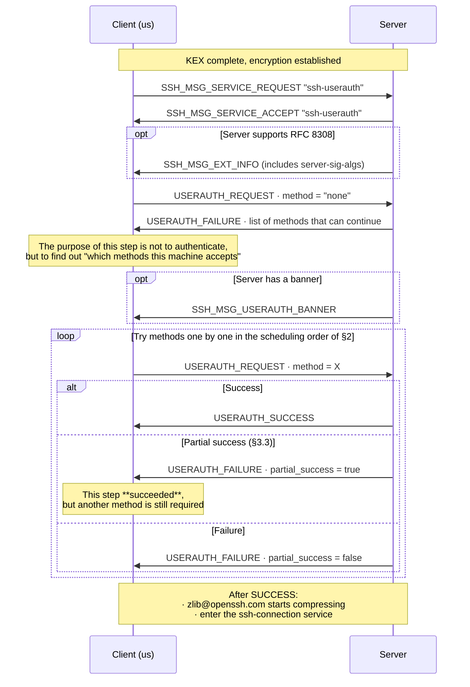
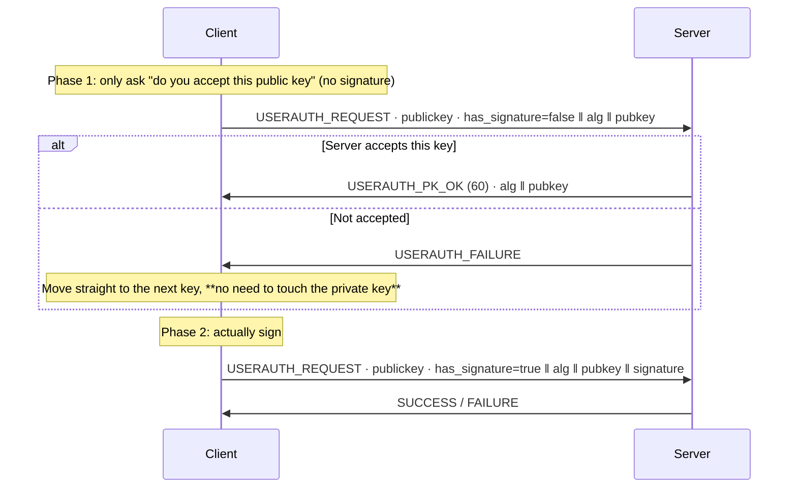
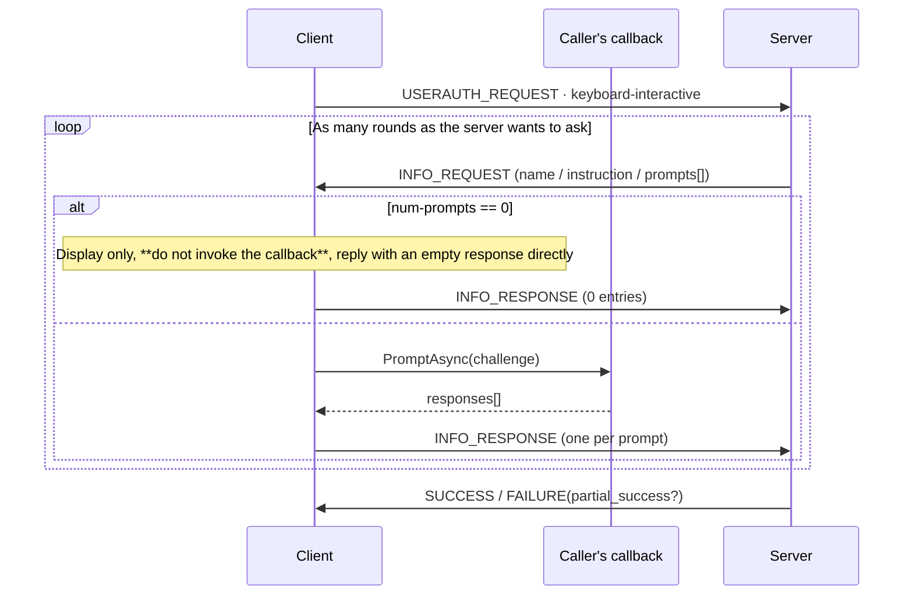

# 04 · Authentication

> Normative basis: RFC 4252 (Authentication Protocol); RFC 4256 (keyboard-interactive);
> RFC 8332 (rsa-sha2-*); RFC 8308 (Extension Negotiation / `server-sig-algs`);
> RFC 4462 (GSS-API); OpenSSH `PROTOCOL.certkeys`, `PROTOCOL.agent`.
>
> Implementation: `Auth/` (L7).
>
> **The two most important sections in this file are §3.3 (partial success) and §6 (keyboard-interactive).**
> Together they decide whether 2FA / OTP works at all — and that is one of the top reasons we decided to write the SSH library ourselves.
>
> 中文：[`../../../zh/ssh/spec/04-authentication.md`](../../../zh/ssh/spec/04-authentication.md)

---

## 1 Overview



---

## 2 Method scheduling

### 2.1 `none` probe

**Always send a `none` first.** It almost always fails, but the `USERAUTH_FAILURE` carries back
**the list of methods the server is willing to accept** — this is the only way to obtain that list.

〔Note〕`none` may also **succeed** (the server is configured with no authentication). This case must be handled correctly;
do not assume it always fails.

### 2.2 Scheduling rules

〔Decision〕**Try credentials in the order the caller gave them, but filter out methods the server does not accept.**

```
candidates = credentials configured by the caller (ordered)
available  = method list the server gave in the most recent FAILURE

for credential in candidates:
    if credential.Method not in available: skip (record "skipped because the server does not accept it")
    result = try(credential)
    if result == Success: done
    if result == PartialSuccess: refresh "available", continue the outer loop (§3.3)
    if result == Failure: refresh "available", continue
throw AuthenticationMethodExhausted, with the per-attempt record attached
```

**Three 〔Decision〕s**:

1. **The credential list configured by the caller is everything; no implicit fallback of any kind.**
   Do not automatically read `~/.ssh/id_*`, do not automatically connect to ssh-agent, unless the caller has explicitly added the corresponding credential.

   Rationale: implicit fallback is a real problem in desktop clients — the user selects "password" in the UI,
   yet the library first tries some default private key, so inexplicable failure records appear in the server log;
   on Windows `SSH_AUTH_SOCK` often points to an msys/WSL Unix socket,
   and auto-connecting to the agent hits an exception every time. **To use default keys or the agent, add a
   `DefaultIdentityCredential` / `AgentCredential`** — a one-liner,
   but it is the caller's explicit decision.

2. **The reason for skipping must be recorded.** The `AuthenticationMethodExhausted` exception
   carries a per-attempt table: which were tried and with what result; which were **not tried because the server does not accept them**.
   Without this table, information like "skipped: publickey" exists only in the log,
   while the user sees "incorrect username or password".

3. **Failure count and backoff**: after the same method fails N times in a row (〔Decision〕N = 3), do not retry it.
   The server usually has its own counter too, and hitting the limit gets you temporarily banned.

### 2.3 Common fields of `USERAUTH_REQUEST`

| # | Type | Field |
| :-: | --- | --- |
| 1 | `byte` | `SSH_MSG_USERAUTH_REQUEST` = 50 |
| 2 | `string` | User name (**UTF-8**) |
| 3 | `string` | Service name, always `"ssh-connection"` |
| 4 | `string` | Method name |
| 5+ | Method-specific | See each section |

〔Note〕**The user name is repeated in every request and must always be the same.**
RFC 4252 §5 allows changing the user name midway, but server behavior is undefined — we **forbid** doing so.

---

## 3 `USERAUTH_FAILURE` and partial success

### 3.1 Field table

| # | Type | Field |
| :-: | --- | --- |
| 1 | `byte` | `SSH_MSG_USERAUTH_FAILURE` = 51 |
| 2 | `name-list` | Authentications that can continue |
| 3 | `boolean` | `partial_success` |

### 3.2 Semantics of the method list

This is **"which methods can be used next"**, not "which methods this machine supports".
It changes as authentication progresses — after a partial success, the list usually shrinks to the one remaining method.

**Every time a `FAILURE` is received, overwrite the old list with the new one** — do not merge, do not keep only the first.

### 3.3 Partial success — the protocol expression of 2FA

> **`partial_success == true` means this authentication step succeeded.**

The server is saying: "You passed this step, but I also require you to pass another method."
This is how multi-factor authentication (publickey + OTP, password + OTP) is expressed in SSH —
**there is no separate "2FA message"**.

**Treating `partial_success = true` as a failure is the most common and most subtle implementation bug in 2FA support.**
The symptom: the user enters the correct password and the correct one-time code, but after the first step the client declares this credential dead,
moves on to try the next one (usually there is none), and finally reports "authentication failed".

Correct handling:

```
On FAILURE(partial_success = true):
    record "method X passed"
    refresh the available method list
    do **not** mark this credential as failed, and do not count it toward the failure count
    continue the outer loop, picking the next method from the new list
```

〔Decision〕**After a partial success, the same credential type is allowed to appear again.**
For example, the server requires "publickey twice, with two different keys" — this is a real configuration in high-security environments.

### 3.4 Authentication attempt record

Every attempt appends one entry to `AuthAttemptLog`:

| Field | Content |
| --- | --- |
| `Method` | Method name |
| `CredentialLabel` | Name the caller gave the credential (e.g. the private key path), **containing no key material** |
| `Outcome` | `Success` / `PartialSuccess` / `Failure` / `SkippedNotOffered` / `SkippedNoMaterial` |
| `ServerOfferedAfter` | Method list the server offered after this step |
| `Detail` | E.g. "private key file could not be read", "server does not accept rsa-sha2-512" |

This table is packed into `SshAuthenticationException`.
Its reason to exist is concrete: **so that "this machine requires a one-time code" and "the password was mistyped" can be distinguished in the UI.**

---

## 4 `publickey` (RFC 4252 §7)

### 4.1 Two phases: query first, then sign



〔Decision〕**When the private key is local and already decrypted, skip phase 1 and sign directly.**
This saves one RTT, at the cost of a wasted signature when the server does not accept the key (a local computation, very cheap).

〔Decision〕**When signing goes through an external party (ssh-agent / PKCS#11 / HSM / KeyVault), phase 1 must be used.**
Rationale: external signing may require the user to press a hardware key, enter a PIN, or go over the network. Bothering the user or issuing a network request
for a key the server does not even accept is unacceptable.

This distinction is expressed by `ISshSigner.IsLocalAndCheap`.

### 4.2 Request fields

| # | Type | Field |
| :-: | --- | --- |
| 1–4 | | Common (§2.3), method name `"publickey"` |
| 5 | `boolean` | `has_signature` |
| 6 | `string` | Public key algorithm name |
| 7 | `string` | Public key blob |
| 8 | `string` | Signature (only when `has_signature = true`) |

### 4.3 Signature input — must be byte-exact

The signed data is:

```
string    session_id          ← §03 4.3, not the current H
byte      SSH_MSG_USERAUTH_REQUEST (50)
string    user name
string    "ssh-connection"
string    "publickey"
boolean   TRUE
string    public key algorithm name
string    public key blob
```

**Three key points**:

1. The first item is `session_id` (the `H` of the **first** KEX), **encoded as a `string`** (with a 4-byte length prefix).
2. From the second item on, the content is **byte-for-byte identical** to the `USERAUTH_REQUEST` message actually sent.
   The most robust implementation is therefore: **build the request message payload first, then prepend
   `string session_id`, and hand the whole thing to the signer** — rather than assembling it separately in two places.
   Assembling it in two places is the sole cause of errors here.
3. `boolean TRUE` must be sent as `0x01`.

### 4.4 RSA signature algorithm selection (RFC 8332)

`ssh-rsa` uses SHA-1 and is widely deprecated. `rsa-sha2-256` / `rsa-sha2-512` are the replacements.
The problem: **the same RSA key can be used with three signature algorithms, and the client has no way to know which one the server accepts**
— unless the server sent `server-sig-algs`.

Rules:

| Situation | What we use |
| --- | --- |
| `server-sig-algs` received (§7) | The highest-priority one among those we support (`rsa-sha2-512` > `rsa-sha2-256` > `ssh-rsa`) |
| `server-sig-algs` not received | 〔Decision〕Try `rsa-sha2-512` first; if that fails, **downgrade and retry once** with `ssh-rsa` (only if the caller permits SHA-1) |

〔Decision〕**Downgrade is off by default** (`AllowSha1RsaSignatures = false`).
Rationale: unconditional downgrade hands back the gains of Terrapin-style downgrade attacks.
Those who need to connect to old servers turn it on explicitly, and "SHA-1 signature was used this time" is visible in the diagnostics.

〔Note〕The type string in the public key blob is **always `"ssh-rsa"`**, independent of the signature algorithm name (§03 5.1).

### 4.5 Certificate authentication (OpenSSH `PROTOCOL.certkeys`)

Certificate authentication is **not** a separate method; it is still `publickey`, except that:

- The algorithm name is something like `ssh-ed25519-cert-v01@openssh.com`;
- The "public key blob" position holds the **entire certificate**;
- **The signature is still produced by the corresponding private key**; the certificate is merely the CA's endorsement.

The implementation therefore fully reuses the path of §4.1–§4.4, with just one extra task:
pairing the certificate file with the private key. 〔Decision〕Following OpenSSH convention,
the certificate for private key `id_ed25519` is by default at `id_ed25519-cert.pub`; if not found, explicit specification is required.

〔Decision〕**The client does not validate the validity period of its own certificate.** That is the server's job;
local validation only produces false negatives when clocks are out of sync. But **the expiry fact must be put into
`AuthAttemptLog.Detail`** — when authentication fails, it is the number-one clue.

---

## 5 `password` (RFC 4252 §8)

| # | Type | Field |
| :-: | --- | --- |
| 1–4 | | Common, method name `"password"` |
| 5 | `boolean` | `FALSE` (`TRUE` when changing password) |
| 6 | `string` | Password (**UTF-8**) |

### 5.1 Password change request

The server may reply with `SSH_MSG_USERAUTH_PASSWD_CHANGEREQ` (**60**, a method-specific number):

| # | Type | Field |
| :-: | --- | --- |
| 1 | `byte` | 60 |
| 2 | `string` | Prompt text (UTF-8) |
| 3 | `string` | Language tag (ignored) |

〔Decision〕**Implement it, but do not handle it by default** — when no `PasswordChangeHandler` is configured,
treat it as a failure with an explicit reason (`Detail = "server requires a password change"`),
rather than as an incomprehensible message.

Rationale: password expiry is very common in enterprise environments, and "the client simply disconnects without saying why"
is the kind of failure users find hardest to recover from on their own.

### 5.2 Security requirements

- The password **must** be encoded as UTF-8, and **must not** undergo any normalization (NFC/NFKC) —
  the server compares whatever it receives.
- The password's lifetime in memory should be as short as possible; `ZeroMemory` it after use.
  〔Decision〕The credential interface accepts `Func<CancellationToken, ValueTask<...>>` rather than `string`,
  so the caller can decrypt and retrieve it only when actually needed.
- Writing the password into any log or `IPacketTap` is **forbidden** (General §5.5).

---

## 6 `keyboard-interactive` (RFC 4256) — where 2FA / OTP lands

> **This is one of the top reasons for writing the SSH library ourselves.** Google Authenticator, Duo,
> and RSA SecurID on bastion hosts all go through this path.

### 6.1 Request

| # | Type | Field |
| :-: | --- | --- |
| 1–4 | | Common, method name `"keyboard-interactive"` |
| 5 | `string` | Language tag, 〔Decision〕send an empty string |
| 6 | `string` | Submethods hint, 〔Decision〕send an empty string (let the server choose) |

### 6.2 `SSH_MSG_USERAUTH_INFO_REQUEST` (60, method-specific)

| # | Type | Field |
| :-: | --- | --- |
| 1 | `byte` | 60 |
| 2 | `string` | `name` — dialog title (UTF-8, may be empty) |
| 3 | `string` | `instruction` — instruction text (UTF-8, may be empty) |
| 4 | `string` | Language tag (ignored) |
| 5 | `uint32` | `num-prompts` |
| 6 | Repeated `num-prompts` times | `string prompt` (UTF-8) ‖ `boolean echo` |

### 6.3 `SSH_MSG_USERAUTH_INFO_RESPONSE` (61, method-specific)

| # | Type | Field |
| :-: | --- | --- |
| 1 | `byte` | 61 |
| 2 | `uint32` | `num-responses` — **must** equal `num-prompts` in the request |
| 3 | Repeated | `string response` (UTF-8) |

### 6.4 Sequence — may go back and forth for multiple rounds



**Six musts**:

1. **`num-prompts == 0` is legal**, used for display-only information ("please press the button on your hardware token").
   In this case the client **should not** pop up a dialog asking for user input; reply directly with an `INFO_RESPONSE` of 0 entries.
   〔Decision〕But **the `instruction` must be passed to the callback** (as a challenge with `IsInformationalOnly = true`),
   so the UI can display "please press your token" — otherwise the user waits in front of an unresponsive interface.
2. **The number of responses must exactly equal the number of prompts**; one more or one fewer is a protocol error.
3. **Prompts with `echo == false` must be collected as passwords** (not echoed).
   Prompts with `echo == true` are usually a user name or one-off supplementary information.
4. **The number of rounds must be capped** (〔Decision〕**64 rounds**). The server can in theory keep asking forever,
   which is a denial of service against the user's attention.
5. **Cap on prompts per round** (〔Decision〕**32**), **cap on each string's length** (〔Decision〕**4 KiB**).
6. `name` / `instruction` / `prompt` all come from an **unauthenticated peer**
   and are an injection surface. The library passes them to the caller as-is, but **the documentation must state**:
   when displaying these texts, treat them as untrusted content (do not interpret control characters, do not treat them as rich text).

### 6.5 Relationship with password

Many servers enable both `password` and `keyboard-interactive`,
and the latter's only prompt is "Password:".

〔Decision〕**Provide `PasswordCredential.AlsoAnswerKeyboardInteractive` (default `true`)**:
when `keyboard-interactive` has exactly one prompt and `echo == false`,
answer it automatically with the password, without bothering the caller.

Rationale: this is the actual behavior of the OpenSSH client, and it is what users expect.
But it **must** be possible to turn it off — in a true 2FA scenario, the first prompt may be the one-time code,
and auto-filling the password only wastes an attempt.

---

## 7 Extension negotiation (RFC 8308)

### 7.1 `SSH_MSG_EXT_INFO` (7)

| # | Type | Field |
| :-: | --- | --- |
| 1 | `byte` | 7 |
| 2 | `uint32` | `nr-extensions` |
| 3 | Repeated | `string name` ‖ `string value` |

**May appear in two positions** (RFC 8308 §2.3):

1. Immediately **after** the first `NEWKEYS`;
2. **Before** `SSH_MSG_USERAUTH_SUCCESS`.

Both positions must be accepted. **Received at any other position → protocol error.**

### 7.2 Extensions we care about

| Extension | Purpose |
| --- | --- |
| `server-sig-algs` | §4.4 — without it the RSA signature algorithm cannot be chosen safely |
| `delay-compression` | 〔Decision〕**Not implemented.** `zlib@openssh.com` already solves the same problem |
| `no-flow-control` | 〔Decision〕**Not implemented.** Our window management depends on flow control |
| `elevation` | 〔Decision〕**Not implemented** (Windows-server specific) |
| `publickey-hostbound@openssh.com` | 〔Decision〕Revisit in M5. Related to the security of agent forwarding |

**Unknown extensions are always ignored**, with no error.

---

## 8 Banner (`SSH_MSG_USERAUTH_BANNER`, 53)

| # | Type | Field |
| :-: | --- | --- |
| 1 | `byte` | 53 |
| 2 | `string` | Text (UTF-8) |
| 3 | `string` | Language tag (ignored) |

- **May arrive at any time during authentication, and multiple times.**
- Passed to `SshConnectionOptions.BannerHandler`.
- 〔Decision〕Limits: each ≤ 64 KiB, cumulative ≤ 256 KiB, count ≤ 1024. Disconnect when exceeded.
- Same as §6.4 item 6: this is untrusted text, and the documentation must state so.

---

## 9 Edge cases and errors quick reference

| Situation | Failure reason | Notes |
| --- | --- | --- |
| `SERVICE_REQUEST` rejected | `ProtocolError` | Server does not provide `ssh-userauth`; extremely rare |
| All methods tried without success | `AuthenticationMethodExhausted` | **Carries the per-attempt record** (§3.4) |
| Server offers only `keyboard-interactive` and we have no matching credential configured | `TwoFactorRequired` | 〔Decision〕A separate reason code — so the UI can say "this machine requires a one-time code" |
| `INFO_RESPONSE` count mismatch | `ProtocolError` | |
| Interaction rounds / prompt count / length exceeded | `ProtocolError` | §6.4 |
| Banner limits exceeded | `ProtocolError` | §8 |
| `EXT_INFO` in an illegal position | `ProtocolError` | §7.1 |
| Channel message (80–127) received during authentication | `ProtocolError` | The connection protocol has not started before authentication completes |
| Authentication timeout | `Timeout` | 〔Decision〕Independent of `ConnectTimeout`: `AuthenticationTimeout` defaults to 2 minutes — the user has to dig out their phone for the one-time code |

〔Decision〕**Authentication timeout is timed independently**, for the same reason as the host key verdict (§03 5.3):
no step that requires human involvement should be interrupted by a timeout designed for network round trips.
