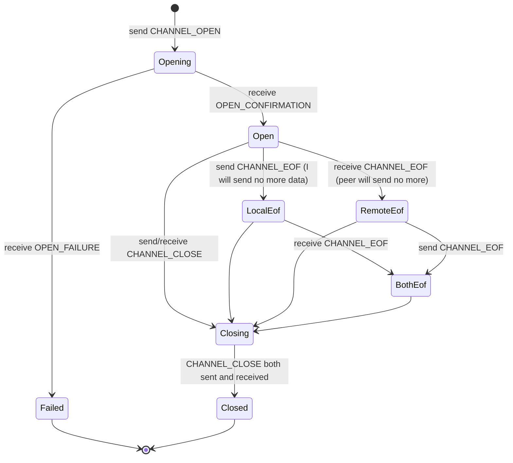
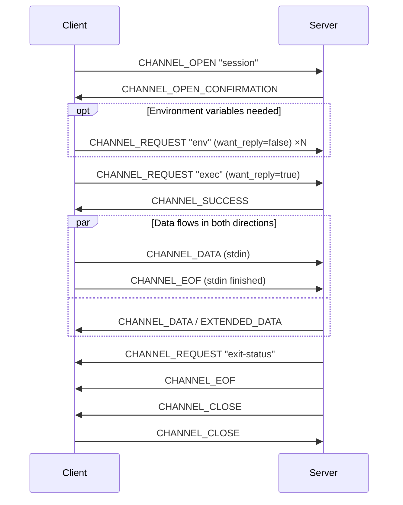

# 05 · Connection Protocol: Channels, Flow Control and Requests

> Normative basis: RFC 4254 (Connection Protocol); RFC 4250 §4.2 (signal names, disconnect codes);
> OpenSSH `PROTOCOL`'s `*-streamlocal@openssh.com`, `auth-agent-req@openssh.com`.
>
> Implementation: `Channels/` (L5), `Threading/` (L6 request ledger).
>
> 中文：[`../../../zh/ssh/spec/05-connection.md`](../../../zh/ssh/spec/05-connection.md)

---

## 1 Channel lifecycle



**Six hard rules**:

1. **EOF is a one-directional half-close.** After sending `CHANNEL_EOF`, data **can still be received**.
   Treating EOF as "channel finished" is the most common mistake; the symptom is
   losing the server's final output in scenarios like `ssh host 'cat > f' < big`.
2. **`CHANNEL_CLOSE` must be bidirectional.** After receiving the peer's `CLOSE`, we **must** send one back
   (unless we have already sent one). The channel number may be reclaimed only after **both sides have sent** `CLOSE`.
   〔Decision〕When the caller disposes a channel, the local side **finishes immediately** (pipes complete, the event stream ends with `Closed`),
   but the number **stays reserved** until the peer's `CLOSE` arrives (or the session ends, or the peer never established the channel).
   Sending `CLOSE` itself is not bound by the dispose deadline: if backpressure does not clear in time, it waits in the background and is sent once it does —
   sending it under a deadline would mean that a timeout leaves the channel open on the server forever.
3. **Reclaiming channel numbers too early = crosstalk.** The peer may still have data for this channel number in flight;
   once the number is reused by a new channel, that data will be delivered to the wrong channel.
   〔Decision〕After a channel number is reclaimed, **delay 30 seconds before reusing it** (maintain a pending-reuse queue),
   as a safety net against non-conforming peer implementations.
4. **Any data for a channel received after `CLOSE` must be discarded, without error.**
   This is not a protocol violation; it is in-flight data.
5. **A channel is an independent failure domain.** An error on one channel (e.g. the peer refusing to open it)
   **must not** affect the session or other channels.
6. **After sending `CLOSE`, the local side sends nothing more on that channel** (RFC 4254 §5.3) —
   no data, `EOF`, `WINDOW_ADJUST`, channel requests, or replies to the peer's requests.
   "Has `CLOSE` been sent?" must be decided under the same lock as **enqueueing**: checking first and enqueueing later lets a `CLOSE`
   slip in between, putting the frame after the `CLOSE` — and a peer that has received `CLOSE` may already have released the channel.
   Calling the request API after closing does not throw; it reports "not sent" (`false`) — a window resize arriving from the UI after the remote process has exited is routine, not an error.

---

## 2 `SSH_MSG_CHANNEL_OPEN` (90)

| # | Type | Field | Notes |
| :-: | --- | --- | --- |
| 1 | `byte` | 90 | |
| 2 | `string` | Channel type | `"session"` / `"direct-tcpip"` / … |
| 3 | `uint32` | `sender channel` | The number **we** assign to this channel |
| 4 | `uint32` | `initial window size` | Bytes we are willing to receive before sending WINDOW_ADJUST |
| 5 | `uint32` | `maximum packet size` | Upper limit of the data segment of a single `CHANNEL_DATA` |
| 6+ | Type-specific | | |

### 2.1 Channel types

| Type | Purpose | Extra fields |
| --- | --- | --- |
| `session` | exec / shell / subsystem | None |
| `direct-tcpip` | Local forwarding, tunnel to a remote TCP endpoint | `string host` ‖ `uint32 port` ‖ `string orig_host` ‖ `uint32 orig_port` |
| `direct-streamlocal@openssh.com` | Tunnel to a remote **Unix socket** | `string socket_path` ‖ `string reserved` ‖ `uint32 reserved` |

> `direct-streamlocal@openssh.com` is the only proper way to reach endpoints like `/var/run/docker.sock`:
> it **does not open a listening port on the local machine**; the stream is handed straight to the caller, and other processes on the same machine cannot connect to it.
> For root-equivalent endpoints, this difference is not an optimization but a prerequisite.

For server-initiated channel types see [`07-forwarding.md`](07-forwarding.md).

### 2.2 Value of `maximum packet size`

〔Decision〕We **announce** 32 KiB (part of `ReceiveMaxPacketBytes`).

- It constrains the data segment length of a single `CHANNEL_DATA` the **peer** sends to us.
- The value the peer announces constrains what **we** send to it. OpenSSH usually announces 32 KiB.
- **The value announced by the peer must be respected**: exceeding it makes the peer disconnect.

### 2.3 Replies

`SSH_MSG_CHANNEL_OPEN_CONFIRMATION` (91):

| # | Type | Field |
| :-: | --- | --- |
| 2 | `uint32` | `recipient channel` — our channel number |
| 3 | `uint32` | `sender channel` — the peer's channel number |
| 4 | `uint32` | Peer's initial window |
| 5 | `uint32` | Peer's maximum packet size |

`SSH_MSG_CHANNEL_OPEN_FAILURE` (92):

| # | Type | Field |
| :-: | --- | --- |
| 2 | `uint32` | `recipient channel` |
| 3 | `uint32` | Reason code |
| 4 | `string` | Description (UTF-8) |
| 5 | `string` | Language tag |

| Reason code | Meaning | Our mapping |
| :-: | --- | --- |
| 1 | `ADMINISTRATIVELY_PROHIBITED` | Common when the server has disabled forwarding. **The error message must point this out** |
| 2 | `CONNECT_FAILED` | Target unreachable (forwarding scenario) |
| 3 | `UNKNOWN_CHANNEL_TYPE` | |
| 4 | `RESOURCE_SHORTAGE` | Server's `MaxSessions` reached |

〔Decision〕**Reason codes 1 and 4 must come with actionable hints** —
"The server prohibits port forwarding (AllowTcpForwarding no)" and
"The server's concurrent session limit is reached (MaxSessions)" are far more useful than "Failed to open channel".

---

## 3 Flow-control window

### 3.1 Mechanism

- Each direction has its own window counter (bytes).
- For every `n` bytes of data the **sender** sends, it decrements its send window by `n`; when the window is 0 it **must stop sending**.
- After data has been **consumed**, the **receiver** sends `SSH_MSG_CHANNEL_WINDOW_ADJUST` (93)
  to replenish the window.
- `CHANNEL_EXTENDED_DATA` (stderr) **also counts against the window**. Forgetting this leads to
  the window being drained and a deadlock when stderr produces large output.

### 3.2 When to replenish — tied to consumption, not to receipt

〔Decision〕**The window is replenished after `PipeReader.AdvanceTo`, not when the message arrives.**

This is the concrete realization of "backpressure is structural" (architecture principle 2):
if the consumer does not read, the window is not replenished, and the peer naturally stops. No extra rate limiter is needed,
and "the internal queue grows without bound" cannot happen.

Replenish trigger threshold: 〔Decision〕**refill to full when the remaining window ≤ 1/2 of the window size**.
Too frequent wastes messages; too sparse makes the sender wait idly.

〔Decision〕**Window adjustments jump the queue; they do not wait behind our own pending data.**
The queue in front of the send pump may build up to 16 MiB of bytes not yet on the wire before data-plane senders have to wait (backpressure).
During heavy uploads on the same connection (a pile of port-forwarded connections all sending at once) those 16 MiB may already be full;
if another channel's `WINDOW_ADJUST` queued behind them, the peer would get its window only after all of that had been sent —
our own upload would slow the download almost to a halt, coupling the two directions. 〔History〕Early on, an adjustment even had to wait for room on the backpressure before it could be enqueued.

So window adjustments go through a separate priority lane: the send pump checks it before taking each item, and an adjustment does not wait on backpressure;
its bytes still count toward the pending total, so data-plane senders see them. This is safe because:

- It is bounded: an adjustment is 9 bytes, and each channel has at most one in flight at a time (the adjust pump sends the next one only after the previous one is out);
- Jumping only moves it **earlier**; it never passes what it must not pass: once `CLOSE` has been sent, the check under the enqueue lock (§1 rule 6) still stops it;
  during a rekey it is still stashed by the send gate, and the stash preserves order;
- It has no ordering constraint relative to the data we send — it is about our **receiving**, not our **sending**.

### 3.3 Adaptive window

The problem with a fixed window is that **it also determines the throughput ceiling**:

```
throughput ceiling ≈ window / RTT
2 MiB / 200 ms ≈ 10 MB/s      ← on a transoceanic link you can never exceed this
```

〔Decision〕Default `WindowPolicy.Adaptive(min: 256 KiB, max: 64 MiB)`:

| Phase | Rule |
| --- | --- |
| Initial | 256 KiB |
| Round | The span between two window adjustments. Resizing is decided at each adjustment; there is no separate RTT estimate — when the window is the bottleneck, a round is roughly one round trip |
| Grow | In this round the window **ran low** (remaining ≤ 1/8 of the window size) **and** the reader was **recently starved** (this round or the previous one) → window ×2, up to `max`; the extra amount is first requested from the session budget (see below) and granted to the peer with this very adjustment |
| Shrink | Did not run low for 3 consecutive rounds → window ×0.75 (floor `min`); done by granting a little less this round — credit already granted cannot be taken back |

〔Decision〕**Growing requires two conditions at once: the window ran low, and the reader was starved.**
"Ran low" alone cannot tell who made it run low: with a slow reader, data piles up unread in the pipe, no adjustment is sent, and the window runs low just the same —
but then the bottleneck is the reader, and a bigger window buys no throughput; it only makes the channel buffer a bigger pile of unread data.
〔History〕Early versions looked only at "ran low": as soon as the consumer was slow, the window doubled all the way to the limit. On an interactive shell with heavy remote output,
tens of MiB of unread output piled up locally, and after Ctrl-C the output kept coming until all of it had been displayed.

The distinguishing signal is "has the reader drained everything and been left waiting": when the window is too small (bandwidth-delay product larger than the window), a fast reader drains the data
and then waits idly for a round trip until the next round arrives; a slow reader always has something unread and never drains. Concretely:

- "Ran low" means remaining ≤ 1/8 of the window size, not exactly 0: with that little left, the peer is already limited by "how much can I still send".
- Each time data arrives we take a look: if everything handed to the reader so far has been read, that counts as "starved". The channel's first packet does not count — the pipe is naturally empty then.
- "Recently" means this round or the previous one: the adjustment often happens before a round's data has all arrived, so starving (at the start of a round) and running low (at its end) end up on either side of that adjustment.
- No proportional line such as "less than 1/N unread": timing crosses such a line by accident, and the window would rise and fall at random.

`WindowPolicy.Fixed(n)` is also provided for scenarios that need deterministic memory usage.

〔Decision〕**The receive-side buffer watermark must be computed from `max`, not from the initial value.**
This is easy to get wrong in the implementation: the window is a backpressure mechanism, so "unconsumed data cannot exceed the window" —
hence a pause watermark of "twice the window" for the receive buffer is always enough.
**But the adaptive window grows to `max`**, so a watermark computed from the initial value soon becomes insufficient,
and after that "cannot" no longer holds. Computing from `max` makes the two equal under the fixed policy,
so it has no effect there.

(This is not a theoretical risk: the version computed from the initial value occasionally made large files arrive only half-received;
see the architecture document §11.2.8.)

**The memory upper bound must be stated clearly**: worst-case usage per channel = current window size.
`max = 64 MiB` means one full-speed SFTP channel occupies at most 64 MiB of receive buffer.
〔Decision〕**There is also a session-level total budget** (`SessionWindowBudget`, default 256 MiB);
the sum of all channels' windows must not exceed it — otherwise opening 100 channels could blow up the process.

Budget accounting must follow the window, not just the moment the channel opens:

- Opening a channel charges the initial window; **before growing, the channel requests the extra amount, and if the request is refused it does not grow** (the window stays at its current size and data keeps flowing);
  shrinking gives the shrunk amount back.
- On close, refund **what this channel is currently charged for** — not "the current window size", and never twice (be especially careful when the peer refuses the open).

Charging only at open time lets every channel later grow to `max`, so the total budget only constrains "the moment the channel opens";
refunding by window size, or refunding twice, makes the budget grow with every refund until the limit means nothing.

---

## 4 Data messages

### 4.1 `SSH_MSG_CHANNEL_DATA` (94)

| # | Type | Field |
| :-: | --- | --- |
| 2 | `uint32` | `recipient channel` |
| 3 | `string` | Data |

### 4.2 `SSH_MSG_CHANNEL_EXTENDED_DATA` (95)

| # | Type | Field |
| :-: | --- | --- |
| 2 | `uint32` | `recipient channel` |
| 3 | `uint32` | `data_type_code` — **1 = stderr**, others reserved |
| 4 | `string` | Data |

〔Decision〕**Extended data with `data_type_code != 1`: discard, count against the window, log one debug entry.**
No error — the semantics of reserved values may be defined in the future, and disconnecting would prevent us from coexisting with newer implementations.

### 4.3 Shape of the data-plane API

Externally, each channel is three pipes plus one event stream:

```
PipeReader StandardOutput;   // CHANNEL_DATA
PipeReader StandardError;    // CHANNEL_EXTENDED_DATA(1)
PipeWriter StandardInput;    // what is written becomes CHANNEL_DATA
ValueTask<SshChannelEvent> ReadEventAsync(...)  // Eof / Closed / ExitStatus / ExitSignal / requests
```

〔Decision〕**stdout and stderr are two independent `PipeReader`s**, not one read interface with a flag.

There are two reasons, and the second is a hard one:
1. Zero-copy — the `ReadOnlySequence<byte>` is handed directly to the consumer, with no need to copy into the caller's `Memory`.
2. **The two streams must be readable concurrently, each on its own.** A one-shot command must receive stdout and stderr at the same time:
   if there were only one read interface, the caller would alternate between the two, and while one side is drained the other may be filled up by the peer
   — that is the classic two-pipe deadlock. Two independent `PipeReader`s let the caller read both sides at once.

〔Important〕**The two streams share a single channel window** (RFC 4254 §5.2: `CHANNEL_EXTENDED_DATA` counts against the window too).
Each pipe has its own buffer, but there is only one window: if one side is not read, once its data fills the window **the other side stalls too**.
So either read both sides (`ReadToEndAsync` reads them concurrently) or set the stderr you do not care about to `Discard`.

〔Decision〕**stderr can be explicitly discarded** (`StderrPolicy.Discard`).
In that case the library still receives packets as usual and **replenishes the window immediately**, but does not buffer — otherwise discarding would turn into a deadlock.

### 4.4 End of stream vs. broken connection

〔Decision〕**A broken connection is not EOF.** The reader must be able to tell "the peer has finished" from "the link broke":

| What happened | What readers of stdout / stderr (and of the `AsStream()` stream) see |
| --- | --- |
| The peer sent `CHANNEL_EOF` or `CHANNEL_CLOSE`; or this side disposed the channel | A normal end (`IsCompleted`; the stream reads 0) |
| The connection broke midway (keepalive declared it dead, the peer dropped, a protocol error…) | The read throws **the connection's failure** — the same `SshException` every other call on this connection gets |
| This side disposed the connection | The read throws `ObjectDisposedException` |
| The peer sent EOF first, and only then did the connection break | A normal end — the data was complete before the link broke |

(A stderr set to `Discard` is an empty stream that ends immediately from the start, and is not covered by this table.)

Rationale: treated as a normal end, a half-downloaded file or half-finished command output would be handed over as the complete result;
a tunnel's relay loop (`07-forwarding.md` §6) would turn that "end" into a `shutdown(SEND)` (FIN) on the local socket,
and the local program would accept the truncated data as complete. Given the failure instead, the relay loop aborts both ends (RST on the local socket).
A terminal also relies on this to tell "the user typed `exit`" from "the link broke" — only the latter should trigger an automatic reconnect.

Data already received but not yet read when the link breaks is discarded along with it — the result is incomplete anyway.
Disposing the connection yields `ObjectDisposedException` rather than a connection failure, so the caller can tell "I tore it down" from "the link broke".

**`SshChannel.Closed`** (a `CancellationToken`) is cancelled when the channel is **entirely** finished: both `CLOSE`s done, this side disposed the channel,
the peer refused the open, or the connection went away. It differs from EOF — EOF only means the peer will send no more, and writing to it still makes sense; at `Closed` both directions are gone.
Callbacks run on the thread pool, not on the receive loop (§8). The forwarding relay loop uses it to stop the direction that writes into this channel:
that direction is usually blocked reading the local socket at that moment, and unless it is stopped, the socket and the forwarding slot stay occupied.

---

## 5 Channel requests

### 5.1 `SSH_MSG_CHANNEL_REQUEST` (98)

| # | Type | Field |
| :-: | --- | --- |
| 2 | `uint32` | `recipient channel` |
| 3 | `string` | Request type |
| 4 | `boolean` | `want_reply` |
| 5+ | Type-specific | |

The reply is `CHANNEL_SUCCESS` (99) / `CHANNEL_FAILURE` (100),
**present only when `want_reply = true`**.

〔Important〕**Channel request replies have no id; they are matched by FIFO order.**
When multiple `want_reply = true` requests are sent concurrently on the same channel,
replies come back in sending order. The request ledger (L6) uses a **queue**, not a dictionary, on this channel.

### 5.2 Requests we send

| Type | `want_reply` | Fields |
| --- | :-: | --- |
| `pty-req` | true | See §5.3 |
| `shell` | true | None |
| `exec` | true | `string command` |
| `subsystem` | true | `string name` (e.g. `"sftp"`) |
| `env` | 〔Decision〕**false** | `string name` ‖ `string value` |
| `window-change` | **false** (required by RFC) | See §5.3 |
| `signal` | **false** (required by RFC) | `string signal_name` (**without the `SIG` prefix**) |
| `auth-agent-req@openssh.com` | true | None |
| `x11-req` | true | See `07-forwarding.md` §7.5.3 |

〔Decision〕**The order of requests on a session channel is fixed**:

| Usage | Order |
| --- | --- |
| Interactive shell | `pty-req` → `x11-req` → `auth-agent-req@openssh.com` → `env` → (caller hook) → `shell` |
| One-shot command | `x11-req` → `auth-agent-req@openssh.com` → `env` → (caller hook) → `exec` |

`x11-req` and `auth-agent-req` are sent only when the caller **explicitly requests** them; if requested and the server refuses, an exception is thrown — no silent downgrade.
The "caller hook" (`BeforeStart`) leaves room for channel requests the library does not have built in; if it throws, the session is abandoned.
〔History〕Early versions placed `env` before `pty-req`, and the shell had no point at which to insert `x11-req` at all —
so the most common use of `ssh -X` (an interactive shell) could not open X11 forwarding.

〔Decision〕**`env` does not request a reply.** Most servers' `AcceptEnv` lets only a few variables through;
rejection is the norm rather than an error. Requesting a reply would only add one RTT per variable set,
and would report a normal situation as a failure. The consequences of a failed set are for the caller to observe on the remote side.

〔Decision〕**`exec` / `shell` / `subsystem` must request a reply and wait for it.**
Sending data without waiting manifests, when the server refuses to execute, as "the command produced no output and no error".

### 5.3 `pty-req` and `window-change`

`pty-req`:

| # | Type | Field |
| :-: | --- | --- |
| 5 | `string` | `TERM` (e.g. `"xterm-256color"`) |
| 6 | `uint32` | Width (character columns) |
| 7 | `uint32` | Height (character rows) |
| 8 | `uint32` | **Width (pixels)** |
| 9 | `uint32` | **Height (pixels)** |
| 10 | `string` | Encoded terminal modes (see below) |

`window-change` (`want_reply` must be false):

| # | Type | Field |
| :-: | --- | --- |
| 5–8 | `uint32` ×4 | width (columns) ‖ height (rows) ‖ width (pixels) ‖ height (pixels) |

〔Decision〕**Pixel dimensions are first-class citizens, not always 0.**
`TerminalSize` is a read-only struct with four fields, carried all the way from `OpenShellAsync` through to `Resize`.

Rationale: programs that depend on pixel dimensions really exist — sixel images, the kitty graphics protocol,
and any TUI that lays out by pixel. Hard-coding 0 amounts to telling the remote side "unknown",
which makes these programs degrade or not work at all. Pixel values are supplied by the caller (the terminal control knows its own glyph size);
the library does not guess. When the caller supplies 0, 0 is sent as usual, and the semantics remain "unknown".

〔Decision〕**None of the four fields accepts negative numbers; they are rejected at construction time.**

On the wire they are `uint32`: `-1` silently becomes `4294967295`. The remote side accepts it as-is
and then lays out for four billion columns — that is not "wrong size", it is **garbage output**,
and the error shows up in the remote program, with no way to trace it back to the call site.

All four fields are guarded, not just the two pixel ones: the column and row counts are also `uint32`.
The validation is written in the `init` accessor rather than on an auto-property, so `with` cannot bypass it either.
`0` is still legal — it means "unknown"; rejecting it too would force callers to make up a number.

**Terminal mode encoding** (RFC 4254 §8):

```
repeated: byte opcode ‖ uint32 argument
end:      byte 0 (TTY_OP_END)
```

- Opcodes 1–159 carry a `uint32` argument; 160–255 are reserved (stop parsing upon an unknown one).
- 〔Decision〕The opcode table lives in `Protocol/TerminalModeOpcode.cs`;
  common ones (`VINTR`=1, `VERASE`=3, `ECHO`=53, `ICRNL`=36, `ONLCR`=72,
  `IUTF8`=42, `ISPEED`=128, `OSPEED`=129) get named members, the rest may be passed as raw values.
- It **must** end with `TTY_OP_END` (0). If this byte is missing, OpenSSH rejects the entire `pty-req`.

### 5.4 Requests we receive (server → client)

| Type | `want_reply` | Handling |
| --- | :-: | --- |
| `exit-status` | false | `uint32` exit code → `SshChannelEvent.ExitStatus` |
| `exit-signal` | false | See below |
| `keepalive@openssh.com` | true | Reply `CHANNEL_FAILURE` (allowed by RFC; the peer only needs a reply) |
| Others | Per `want_reply` | Unknown type: reply `CHANNEL_FAILURE` when `want_reply` is true, otherwise ignore |

`exit-signal`:

| # | Type | Field |
| :-: | --- | --- |
| 5 | `string` | Signal name, **without the `SIG` prefix** (`"TERM"`, not `"SIGTERM"`) |
| 6 | `boolean` | core dumped |
| 7 | `string` | Error message (UTF-8) |
| 8 | `string` | Language tag |

〔Important〕**`exit-status` and `exit-signal` are mutually exclusive, and either may not arrive at all.**

- Process killed by a signal → only `exit-signal`, no `exit-status`.
- Connection interrupted → neither.
- Therefore `SshCommandResult.ExitCode` must be `int?`, not `int`.
  〔Decision〕**Signals are not encoded as pseudo exit codes like 128+n** — that is a shell convention,
  not an SSH one; faking it would make "process returned 137" indistinguishable from "process was KILLed".

〔Decision〕**The exit status may arrive only after `CHANNEL_CLOSE`** — no, the other way round:
the RFC requires `exit-status` to be sent **before** `CHANNEL_CLOSE`.
But the case "CLOSE received while there is still no exit status" **must** still be handled (non-conforming peer implementation or a broken connection);
in that case `ExitCode` is `null`, and the reason is carried in `SshChannelEvent.Closed`.

---

## 6 Global requests

### 6.1 `SSH_MSG_GLOBAL_REQUEST` (80)

| # | Type | Field |
| :-: | --- | --- |
| 2 | `string` | Request type |
| 3 | `boolean` | `want_reply` |
| 4+ | Type-specific | |

Replies are `REQUEST_SUCCESS` (81) / `REQUEST_FAILURE` (82).
**Likewise there is no id; matching is by FIFO** — a queue is maintained at the session level.

〔Decision〕Global requests and channel requests share the same kind of "FIFO request ledger" (`architecture.md` §5.6):

- **Registering and enqueuing are one and the same action** (done under the same lock). If done separately, two concurrent requests may
  be registered in the opposite order from how they go on the wire, and replies get attributed to the wrong request — a silent wrong answer;
  and when "register first, then wait on backpressure" is cancelled, the ledger is left with a slot that will never receive a reply.
- **A caller cancelling its wait does not remove the entry from the ledger**: the request has already been sent, and the reply will arrive sooner or later;
  it must land on this entry so that subsequent replies line up correctly.
- When the connection drops or the channel closes, everything waiting in the ledger is completed as "failed", and anything registered afterwards gets "failed" immediately.

### 6.2 Requests we send

| Type | Purpose |
| --- | --- |
| `tcpip-forward` | Remote forwarding `-R`, see `07-forwarding.md` |
| `cancel-tcpip-forward` | Cancel |
| `streamlocal-forward@openssh.com` | Remote Unix socket forwarding |
| `keepalive@openssh.com` | Keepalive probe (`want_reply = true`; **the reply content does not matter, only whether there is a reply**) |

### 6.3 Keepalive

〔Decision〕Keepalive uses the `keepalive@openssh.com` global request with `want_reply = true`.

| Parameter | Default | Notes |
| --- | --- | --- |
| `KeepAliveInterval` | 0 (off) | Interval since **the last receipt of any message**, not a fixed period |
| `KeepAliveMaxMissed` | 3 | This many consecutive probes without any reply → the connection is declared dead |

**Key points**:

1. **The timing reference is "last receipt of any message"**, not "last keepalive sent".
   While the connection is busy there is no need to send keepalives at all — the data itself proves the link is alive.
2. **Any inbound message resets the counter**, not just keepalive replies.
3. Declaring the connection dead throws `KeepAliveTimeout` rather than a generic `Timeout`,
   because the upper layer's automatic reconnect policy should apply only to this category.
4. 〔Decision〕**Every probe has its own deadline** (equal to `KeepAliveInterval`).
   Keepalive exists precisely to deal with half-open connections: messages can be written into the local send buffer, but the reply never comes.
   Without a deadline, the first probe waits forever and the "N consecutive" counter never increments —
   the dead-detection logic becomes a dead letter. 〔History〕The early implementation was exactly like this, and the test cases only covered the "server replies" case.
5. 〔Decision〕**The deadline starts the moment the probe is enqueued and covers both "getting sent" and "waiting for the reply"; the probe does not wait on backpressure.**
   A dead link typically looks like this: the peer no longer reads, the send pump is stuck on a write, and the pending backlog (up to 16 MiB during a big upload) has filled the backpressure.
   If the probe first waited for room on the backpressure, or started its timer only after it had been flushed, it would get stuck along with everything else and "N consecutive" would never increment —
   the link could not be declared dead precisely when it matters most. 〔History〕Early versions did exactly that: while an upload filled the send queue, a dead link went unnoticed.
   So once the probe is registered in the ledger and enqueued, it counts as sent — it waits neither on backpressure nor for the flush; its bytes still count toward the pending total.
   Skipping backpressure does not make it unbounded: at most one probe per keepalive period, and after `KeepAliveMaxMissed` unanswered ones the connection is declared dead.
   It does **not**, however, take the `WINDOW_ADJUST` priority lane (§3.2): global request replies are matched by FIFO (§6.1), the probe is registered in the ledger the moment it is enqueued,
   and its order on the wire must equal its order of registration — jumping ahead of another global request already in the queue would swap the two replies.
   Nor does it need to arrive early: all it needs is a deadline that starts at enqueue time.
6. A timed-out probe **still stays in the global request ledger** (§6.1): the reply is merely late,
   and when it arrives it must land on this entry so that subsequent real global requests line up correctly.
7. After being declared dead the session **actually stops**: it raises `Disconnected`, stops the receive/send pumps, and closes all channels
   (channel readers get the reason the session was declared dead, rather than hanging forever or seeing an EOF-like normal end — see §4.4).

### 6.4 Requests we receive

| Type | Handling |
| --- | --- |
| `hostkeys-00@openssh.com` | 〔Decision〕Implemented in M5 — the server proactively announces all its host keys, for rotation. Parsed and passed to `IHostKeyPolicy.OnHostKeysAnnouncedAsync` |
| Other unknown | Reply `REQUEST_FAILURE` when `want_reply = true`, otherwise ignore |

〔Important〕**Replying `REQUEST_FAILURE` to unknown global requests is mandatory**; staying silent is not allowed.
Silence would permanently misalign the peer's FIFO queue — the reply to its next request would be taken as the reply to this one.

---

## 7 Two uses of the session channel

### 7.1 One-shot command (`SshCommand`)



### 7.2 Interactive shell (`SshShell`)

For request order see §5.2. X11 and agent forwarding are used on a shell the same way as on a one-shot command.

There are only three differences from the diagram above, but all of them concern correctness:

1. `exec` is replaced by `pty-req` + `shell`.
2. **With a pty, stderr is merged into stdout** (a pseudo-terminal has only one output stream) —
   the `StandardError` `PipeReader` will **never have any data**.
   〔Decision〕`SshShell` simply does not expose `StandardError`, so callers do not wait on a stream that is forever empty.
3. Size changes send `window-change`.

〔Decision〕**`SshCommand` and `SshShell` are two types, not one class with `HasTerminal`.**
Their lifecycles, read/write shapes and exit semantics all differ; cramming them together results in a pile of
"this property is meaningless when there is a pty" conditional branches, and someone will always trip over such branches.

---

## 8 Edge cases and errors quick reference

| Situation | Handling |
| --- | --- |
| Message received for an unknown channel number | 〔Decision〕**Ignore and log at debug level**; do not disconnect. May be in-flight data for a just-reclaimed channel |
| Peer sends data exceeding the window we announced | `ProtocolError`, disconnect (this is a clear protocol violation) |
| Peer sends a single data segment exceeding the max packet we announced | `ProtocolError`, disconnect |
| Data we want to send exceeds the peer's window | Wait for `WINDOW_ADJUST` (backpressure), **no error** |
| `WINDOW_ADJUST` causes the window to overflow `uint32` | `ProtocolError`, disconnect |
| Data for a channel received after its `CHANNEL_CLOSE` | Discard, no error (§1 rule 4) |
| SUCCESS/FAILURE received while the channel request reply queue is empty | `ProtocolError`, disconnect (FIFO out of sync) |
| SUCCESS/FAILURE received while the global request reply queue is empty | `ProtocolError`, disconnect (FIFO out of sync) |
| Message with an unknown number received | Reply `UNIMPLEMENTED`, **carrying the sequence number of the rejected message** (RFC 4253 §11.4); do not disconnect |
| `UNIMPLEMENTED` / `IGNORE` / `DEBUG` / `EXT_INFO` received | Ignore (replying `UNIMPLEMENTED` to an `UNIMPLEMENTED` would only make both sides echo each other) |
| `DISCONNECT` received | Session declared dead; the exception carries **the reason code and the peer's verbatim text** (`DisconnectReason` / `PeerDescription`) |
| The peer keeps sending messages that need replies but does not read what we send back | Replies posted by the receive loop queue past `MaxQueuedReplyBytes` (default 16 MiB) → `ProtocolError`, disconnect. The receive loop cannot wait on backpressure, so a hard limit is the only option here; replies also count toward backpressure, so data-plane senders wait |
| The peer floods channel requests we don't recognize | At most 64 unread unknown requests stay in the event stream; later ones are dropped (still answered with `FAILURE`). Exit status, `EOF` and close are not affected |
| The peer opens a channel type we don't recognize | Reply `CHANNEL_OPEN_FAILURE`; the description is truncated to 256 characters — an overlong type name from the peer is not echoed back verbatim |
| Session window total budget exceeded | Refuse to open new channels, throw `SshChannelException`, **do not disconnect the session** |
| Channel count exceeds `MaxChannels` (〔Decision〕default 512) | Same as above |

〔Decision〕**When disconnecting with `ProtocolError`, send `DISCONNECT(2)` first, then declare the session dead.**
In the reverse order, the send path would refuse at its first step because it is "already faulted", and `DISCONNECT` would never reach the peer —
the peer would only see the connection drop inexplicably. Sending `DISCONNECT` waits at most 2 seconds: the link is most likely already in bad shape by then,
and it is not worth hanging the receive loop for it.

〔Decision〕**Declaring dead means actually stopping**: raise `Disconnected`, stop the receive loop and the send pump,
give all callers waiting for replies the reason, and close all channels. Merely recording "faulted" while letting the receive loop keep reading
leaves the session in a half-dead state where "`IsAlive` is false, yet it is still receiving data".

〔Decision〕**Caller code is never executed on the receive loop or the send pump.**
Once either of these two threads is occupied by caller code, the whole session stalls — and caller code may block synchronously (polling, `Wait`).
Every action that wakes someone up from these two places must let the woken party continue on the thread pool:

- All `TaskCompletionSource`s use `RunContinuationsAsynchronously`; pooled completion notifications likewise use asynchronous continuations;
- Pipe reader continuations go through the thread-pool scheduler; event queues do not allow synchronous continuations;
- **Cancellation token sources always use `CancelAsync()`, never `Cancel()`** — the latter runs callbacks synchronously on the calling thread,
  and what the callbacks wake up is often a chain of synchronously completing continuations that runs all the way past the caller's `await`.
  〔History〕A single `Cancel()` during channel teardown did exactly this, pulling a host integration test's test method onto the receive loop:
  the test then polled with `Thread.Sleep`, the receive loop was hung for 15 seconds, and the shell's echo on the same connection sat unread in the socket —
  the symptom was "after the exec probe opens and closes once, the shell never echoes again", and it only occurred when the caller blocked synchronously.

### 8.1 Server-initiated channels

- **Multiple** handlers may be registered for the same channel type (two remote forwards both accepting `forwarded-tcpip`,
  several sessions all with agent forwarding enabled). When a channel arrives, **the most recently registered is asked first**; a handler expresses
  "this one is not mine" by rejecting, and the first to accept takes it; only if none wants it is `CHANNEL_OPEN_FAILURE` sent.
  Removing one handler does not affect other handlers of the same type.
- 〔Decision〕**Asking the handler does not wait on the receive loop.** Handlers are caller code, and `GetOptionsAsync` may pop up a dialog to ask someone, look up configuration, or connect somewhere.
  〔History〕Early versions awaited it right on the receive loop: a slow handler stalled receiving on every channel of the connection, keepalive replies included —
  exactly what the rule above ("caller code is never executed on the receive loop") exists to prevent.
  Now the receive loop only parses the message and looks up the handlers (with no handler it refuses on the spot with `UNKNOWN_CHANNEL_TYPE`); asking the handler, creating the channel and sending the confirmation all happen in the background.
  This introduces no ordering problem: the peer may not send anything on the channel before it receives our confirmation, and the order in which the confirmations of two opens go out does not matter — each carries the peer's channel number.
- **At most 64** peer channel opens may be deciding in the background at once; any beyond that are refused immediately with `CHANNEL_OPEN_FAILURE` (`RESOURCE_SHORTAGE`, reason code 4).
  Without a limit, a peer flooding channel opens while the handler is slow would leave a pile of hanging tasks.
- After a handler accepts, this side may still reject the channel because the channel count or window budget is exhausted —
  in that case **the handler must be notified "this one did not open"**, so it can return the resources (concurrency slot) it took when accepting.
  Without notification, each rejection leaks one, and once they are all leaked, channels of this type can never be opened again.
- Type-specific fields are **copied** before being handed to the handler: they are backed by the transport's receive buffer, which is overwritten on the next packet read,
  while the handler uses them on another task, after the receive loop has read other messages.
  Likewise, the payload in the "channel request from the peer" event handed to the caller is a copy.
