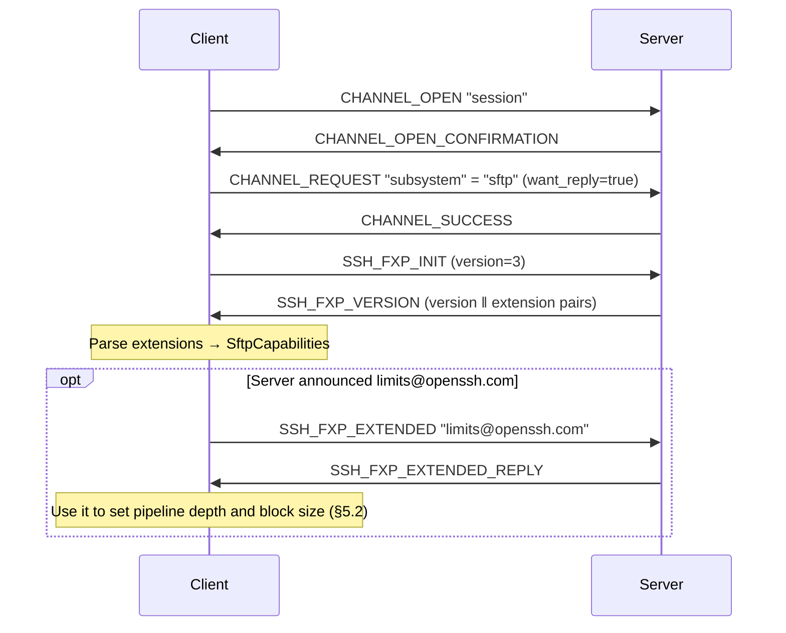
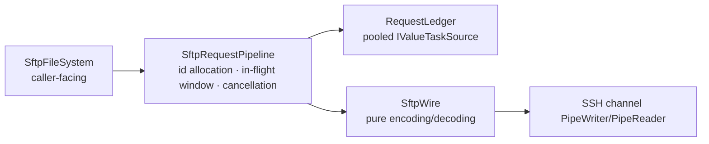

# 06 · SFTP

> Normative basis: draft-ietf-secsh-filexfer-02 (**SFTP v3, the de facto standard**);
> the SFTP extensions section of OpenSSH `PROTOCOL` (`posix-rename`, `statvfs`, `fsync`,
> `hardlink`, `limits`, `copy-data`, `home-directory`, `expand-path`).
>
> Implementation: `Sftp/`, in three layers: `SftpWire` (pure encoding/decoding),
> `SftpRequestPipeline` (pipelining), `SftpFileSystem` (caller-facing).
>
> 中文：[`../../../zh/ssh/spec/06-sftp.md`](../../../zh/ssh/spec/06-sftp.md)

> **Why v3 and not a higher version**: v3 is draft-02, and OpenSSH implements only it,
> while OpenSSH is the implementation or behavioral baseline for the vast majority of SFTP servers. v4–v6 are
> almost never seen in the real world; writing code for them is paying costs for peers that do not exist.
> 〔Decision〕**Implement v3 only**; when a higher version is negotiated, downgrade to 3.

---

## 1 Transport and handshake

SFTP runs on top of a `subsystem` request on a `session` channel:



〔Interop〕If `subsystem` is refused (some servers allow only `exec`),
〔Decision〕**do not automatically fall back to `exec sftp-server`**.
Rationale: falling back amounts to bypassing the server administrator's configuration when they have explicitly disabled the subsystem.
Report the failure truthfully (`SftpUnavailable`, with the message explaining that the server may have disabled the sftp subsystem).

---

## 2 Outer structure of SFTP messages

**Note: this layer has nothing to do with SSH binary packets.** SFTP has its own framing,
running on the byte stream of an SSH channel.

```
uint32   length      — excludes these 4 bytes themselves
byte     type        — SSH_FXP_*
uint32   request-id  — present in all except INIT / VERSION
byte[]   type-specific
```

| Constraint | Value |
| --- | --- |
| `length` upper limit | 〔Decision〕**256 KiB + 1024** (data block limit plus protocol header headroom). Exceeding it closes the channel |
| `request-id` | `uint32`; we increment from 1 and **wrap around**. 0 is reserved and unused |

**A channel can have a large number of in-flight requests**, and the reply order is **not guaranteed** to match the sending order —
this is precisely why SFTP can achieve throughput, and why replies must be matched by id rather than by a queue
(unlike the FIFO semantics of channel requests, see `05-connection.md` §5.1).

---

## 3 Message types

### 3.1 Requests (client → server)

| # | Type | Purpose |
| :-: | --- | --- |
| 1 | `SSH_FXP_INIT` | Handshake (**no request-id**) |
| 3 | `SSH_FXP_OPEN` | Open file → handle |
| 4 | `SSH_FXP_CLOSE` | Close handle |
| 5 | `SSH_FXP_READ` | Read at offset |
| 6 | `SSH_FXP_WRITE` | Write at offset |
| 7 | `SSH_FXP_LSTAT` | stat, **not following** symbolic links |
| 8 | `SSH_FXP_FSTAT` | stat by handle |
| 9 | `SSH_FXP_SETSTAT` | Set attributes |
| 10 | `SSH_FXP_FSETSTAT` | Set attributes by handle |
| 11 | `SSH_FXP_OPENDIR` | Open directory → handle |
| 12 | `SSH_FXP_READDIR` | Read a batch of directory entries |
| 13 | `SSH_FXP_REMOVE` | Delete file |
| 14 | `SSH_FXP_MKDIR` | Create directory |
| 15 | `SSH_FXP_RMDIR` | Delete empty directory |
| 16 | `SSH_FXP_REALPATH` | Canonicalize path |
| 17 | `SSH_FXP_STAT` | stat, **following** symbolic links |
| 18 | `SSH_FXP_RENAME` | Rename |
| 19 | `SSH_FXP_READLINK` | Read link target |
| 20 | `SSH_FXP_SYMLINK` | Create symbolic link (**argument order is a trap, see §4.5**) |
| 200 | `SSH_FXP_EXTENDED` | Vendor extension |

### 3.2 Replies (server → client)

| # | Type | Content |
| :-: | --- | --- |
| 2 | `SSH_FXP_VERSION` | `uint32 version` ‖ repeated `string name ‖ string data` |
| 101 | `SSH_FXP_STATUS` | `uint32 code` ‖ `string message` ‖ `string lang` |
| 102 | `SSH_FXP_HANDLE` | `string handle` (**≤ 256 bytes**) |
| 103 | `SSH_FXP_DATA` | `string data` |
| 104 | `SSH_FXP_NAME` | `uint32 count` ‖ repeated `string filename ‖ string longname ‖ ATTRS` |
| 105 | `SSH_FXP_ATTRS` | ATTRS |
| 201 | `SSH_FXP_EXTENDED_REPLY` | Extension-specific |

### 3.3 Status codes

| Code | Name | Our mapping |
| :-: | --- | --- |
| 0 | `OK` | Success |
| 1 | `EOF` | **Not an error**: for `READ` it means end of file reached; for `READDIR` it means the directory has been fully read |
| 2 | `NO_SUCH_FILE` | `SftpErrorCode.NotFound` |
| 3 | `PERMISSION_DENIED` | `AccessDenied` |
| 4 | `FAILURE` | `Failure` — **the server's catch-all error code**, see below |
| 5 | `BAD_MESSAGE` | `ProtocolError` |
| 6 | `NO_CONNECTION` | `NotConnected` |
| 7 | `CONNECTION_LOST` | `ConnectionLost` |
| 8 | `OP_UNSUPPORTED` | `Unsupported` |

〔Important〕**Code 4 (`FAILURE`) carries the vast majority of real errors in v3** —
"directory not empty", "file already exists", "disk full", "quota exceeded" are all 4 in v3.
Therefore `SftpException.Message` **must** include the `message` text given by the server,
which is the only information that can distinguish them. 〔Decision〕Also provide
the `SftpException.ServerMessage` raw-text field, so upper layers can do their own pattern matching
without having to parse the message we composed.

---

## 4 Details of key messages

### 4.1 `SSH_FXP_OPEN`

| # | Type | Field |
| :-: | --- | --- |
| 4 | `string` | Path (UTF-8) |
| 5 | `uint32` | pflags |
| 6 | ATTRS | Attributes at creation (usually only permissions) |

pflags:

| Bit | Name | Meaning |
| :-: | --- | --- |
| 0x01 | `READ` | |
| 0x02 | `WRITE` | |
| 0x04 | `APPEND` | Every write appends to the end, **ignoring the offset** |
| 0x08 | `CREAT` | Create if it does not exist |
| 0x10 | `TRUNC` | Truncate existing content (must be combined with `CREAT`) |
| 0x20 | `EXCL` | Fail if it already exists (must be combined with `CREAT`) |

〔Decision〕**Default permissions when creating files are 0644**, directories 0755, both configurable.
Not passing ATTRS makes the server use its own default (usually affected by umask),
with unpredictable results — pass explicit values.

### 4.2 ATTRS structure

```
uint32   flags
uint64   size           — flags & 0x01
uint32   uid            — flags & 0x02
uint32   gid            — flags & 0x02 (uid/gid share the same flag bit!)
uint32   permissions    — flags & 0x04
uint32   atime          — flags & 0x08
uint32   mtime          — flags & 0x08 (atime/mtime also share the same flag bit)
uint32   extended_count — flags & 0x80000000
repeated: string type ‖ string data
```

**Three traps**:

1. **`uid` and `gid` share one flag bit; `atime` and `mtime` share one.**
   To set mtime you must supply atime as well. 〔Decision〕When only mtime should change,
   first `STAT` to retrieve the current atime and write it back together.
2. **Times are 32-bit Unix seconds** and will overflow in 2038. v3 has no solution; implement as specified.
   〔Decision〕Interpreting the value read as unsigned would last until 2106 —
   but servers usually send it as signed, so **read it as signed**, consistent with OpenSSH.
3. The high bits of `permissions` are the file type (`S_IFMT`):
   `0o100000` regular file, `0o040000` directory, `0o120000` symbolic link.
   **v3 has no separate type field; the type can only be taken from here.**

### 4.3 `SSH_FXP_READ` / `SSH_FXP_WRITE`

| READ | | | WRITE | | |
| :-: | --- | --- | :-: | --- | --- |
| 4 | `string` | handle | 4 | `string` | handle |
| 5 | `uint64` | offset | 5 | `uint64` | offset |
| 6 | `uint32` | length | 6 | `string` | data |

**Both use absolute offsets; the server does not maintain a file position.**
This means reads and writes can naturally be concurrent and out of order — this is the basis of the pipeline in §5,
and also the source of the watermark problem in §6.

〔Important〕**`READ` may return less data than the requested length**; this is not an error,
and reading must loop until enough is obtained or `EOF` is encountered.

### 4.4 `SSH_FXP_READDIR`

- Each call returns **a batch** of directory entries, not all of them.
- A return of `STATUS = EOF` means reading is complete.
- `longname` is a line of text in `ls -l` style, **with a non-standardized format**.
  〔Decision〕**Do not parse `longname`**; all information is taken from ATTRS.
  Parsing it is a classic source of bugs in SFTP clients (time format, locale, column alignment all vary by server).
  But **keep the raw text** for callers who need it.
- `.` and `..` **do** appear in the results. 〔Decision〕The `SftpFileSystem` layer filters them out by default,
  with a switch provided.

### 4.5 Argument order of `SSH_FXP_SYMLINK`

> **This is the most famous trap in SFTP.**

draft-02 specifies the order as `linkpath` then `targetpath`.
**But OpenSSH's implementation swaps the two** (OpenSSH bugzilla #861),
and since OpenSSH is the de facto standard, all clients follow it in the same mistake.

〔Decision〕**Send in OpenSSH's order**: `targetpath` first, then `linkpath`.

```
uint32   request-id
string   targetpath     ← where the link points to (OpenSSH order)
string   linkpath       ← where the link is created
```

〔Decision〕**No "draft order" switch is provided.** There is no known server that implements the draft order;
adding a switch that should never be turned on only invites someone to turn it on by mistake while investigating some other problem.
If one is ever actually encountered, handle it via an extension mechanism along the lines of `posix-rename`.

This must also be stated clearly in a code comment, otherwise someone will certainly "fix it in passing" in the future.

### 4.6 `SSH_FXP_REALPATH`

Used to canonicalize relative paths, `~`, `.`, `..` into absolute paths.
Returns `SSH_FXP_NAME` with `count == 1`.

〔Decision〕**Immediately after the connection is established, do a `REALPATH` on `"."`**,
taking the result as the initial value of `SftpFileSystem.WorkingDirectory`.
This is the only reliable answer to "where is the user's home directory" — far more reliable than assembling `/home/{user}`.

---

## 5 Request pipeline

### 5.1 Structure



`SftpWire` is a **pure function**: `bytes ↔ SftpMessage`, stateless, no I/O.
This lets it be asserted byte by byte against message samples without any peer — it is the part of the whole SFTP layer
that is easiest and most worthwhile to test thoroughly.

### 5.2 Adaptive depth and block size

〔Decision〕**Determined by the server's announced `limits@openssh.com`, not hard-coded.**

The reply to `limits@openssh.com` gives four values:

| Field | Purpose |
| --- | --- |
| `max-packet-length` | Upper limit of a single SFTP message |
| `max-read-length` | Upper limit of the length of a single `READ` |
| `max-write-length` | Upper limit of the data of a single `WRITE` |
| `max-open-handles` | Upper limit of simultaneously open handles (0 = unknown) |

Conservative defaults when this extension is absent (〔Decision〕):

| Item | Default |
| --- | --- |
| Block size | 32 KiB (the typical value of an SSH channel's max packet) |
| In-flight requests | Estimated from BDP: `clamp(RTT × target bandwidth / block size, 8, 256)` |

**Why depth must be adaptive**: in-flight requests × block size is the SFTP layer's "window".
Just like the channel window (`05-connection.md` §3.3), a fixed value caps throughput outright on high-RTT links.
Hard-coding 64 × 32 KB = 2 MiB likewise caps at 10 MB/s with a 200 ms RTT.

### 5.3 Cancellation

The cancellation semantics of `RequestLedger` **must** be explicit:

- Cancelling an in-flight request does **not** make the server stop — SFTP has no cancel message.
  We simply stop waiting for its reply.
- Therefore, after cancellation, the reply for that id **must** still be consumed and discarded,
  and **the case of "the reply carries a handle that needs closing" must be handled** —
  if `OPEN` is cancelled but the server has already opened the file, that handle leaks on the server unless closed.
  〔Decision〕On cancellation, the ledger retains a "cleanup callback" and executes it (sending `CLOSE`) when the late reply arrives.

### 5.4 Wrap-up when the channel closes

Channel disconnects → all in-flight requests in the ledger are completed **at once** with the same `SshChannelClosedException`.
This is a direct benefit of the unified L6 ledger: this logic is written only once and proven only once.

---

## 6 Write watermark — eliminating the "blind 2 MB rollback"

### 6.1 The problem

When the pipeline is fully loaded there are N in-flight `WRITE`s, and **reply order is not guaranteed**.
If the transfer is interrupted midway:

```
offset 0 ....... 1 MiB ....... 2 MiB ....... 3 MiB
acked:    [==========]        [====]        [====]
                      ↑ hole          ↑ hole
file length = 3 MiB  ← but the 1–2 MiB range was never actually written
```

The **file length** reported by the server only represents "the **highest** acknowledged offset";
it does not mean every byte before it has been persisted. There may be holes in between that read as 0.

The existing approach is to **blindly roll back a full in-flight window from the file length** (e.g. 64 × 32 KB = 2 MiB),
so that the data before the resume point can be trusted. The cost is retransmitting 2 MiB on every resume,
and the number is a "guess" — change the implementation or the configuration and it is wrong.

### 6.2 Solution: contiguous acknowledged offset

The pipeline maintains, for each write handle:

| Field | Meaning |
| --- | --- |
| `_ackedRanges` | Set of acknowledged ranges (ordered, adjacent ranges merged) |
| `DurableLength` | The highest offset **contiguously acknowledged from 0** |

```
On each OK reply to a WRITE:
    merge [offset, offset+len) into _ackedRanges (merging adjacent ranges)
    DurableLength = position of the first hole from 0 (i.e. the right end of the first range, if it starts at 0)
```

`SftpStream.DurableLength` exposes it. Resumable transfer continues from this number — **exact, no guessing**.

〔Implementation note〕The range set must use an **ordered array + binary insertion** rather than a dictionary —
with sequential writes a new range almost always attaches to the tail of the last one,
so after merging the set size is constantly 1, at O(1) cost. The set only grows with out-of-order writes,
and its upper bound is the number of in-flight requests (N ≤ 256) — fully under control.

〔Decision〕**When the channel disconnects, put `DurableLength` into the exception**
(`SftpTransferInterruptedException.DurableLength`),
so upper layers need not stat again, much less roll back blindly.

### 6.3 Another route to ordering guarantees

〔Decision〕Also provide `SftpWriteMode.Sequential`:
the number of in-flight requests is fixed at 1, sacrificing throughput in exchange for "the file length is the trustworthy length".
Used for scenarios that must guarantee the file is a complete prefix at any moment (e.g. writing configuration files).

---

### 6.4 File streams are async-only

〔Decision〕(`architecture.md` principle 1) The file stream derives from `Stream`, and `Stream` comes with synchronous
`Read` / `Write` / `SetLength` / `Flush` / `Dispose`. Synchronous versions can only be implemented by "blocking a thread waiting for a network round trip" —
on the UI thread that freezes the interface for one RTT, and on the thread pool, with enough concurrency, it means starvation. Therefore:

| Synchronous member | Behavior |
| --- | --- |
| `Read` / `Write` / `SetLength` (and single-byte, `Span` overloads) | Throw `NotSupportedException`, with the message naming the async version to use |
| `Flush` | **Non-blocking no-op** (there is no local buffer); known write failures are still thrown. Use `FlushAsync` to confirm persistence |
| `Dispose` | **Non-blocking**: wrap-up (waiting for in-flight write acknowledgements, closing the handle) is handed to the background and it returns immediately; wrap-up errors are not visible — to see them, use `await using` |

`Flush` is kept as a non-throwing no-op because wrapper streams (such as `StreamWriter`) call it synchronously in their own wrap-up;
making it throw would turn a harmless call into a failure.

## 7 Extensions

### 7.1 Extensions we use

| Extension | Purpose | Behavior when absent |
| --- | --- | --- |
| `posix-rename@openssh.com` | **Atomic** rename (overwriting the target) | Degrade to `SSH_FXP_RENAME`, **and report this fact** |
| `hardlink@openssh.com` | Create hard link | Throw `Unsupported` |
| `fsync@openssh.com` | Force persistence to disk | Throw `Unsupported` |
| `statvfs@openssh.com` | File system usage | Throw `Unsupported` |
| `limits@openssh.com` | §5.2 | Use conservative defaults |
| `copy-data` | Copy **within the server**, without going over the network | Degrade to "download then upload" |
| `home-directory` | Get a given user's home directory | Use `REALPATH "."` |
| `expand-path@openssh.com` | Expand `~` | Use `REALPATH` |

### 7.2 Capability query is a public API

```
SftpCapabilities Capabilities { get; }
  bool HasPosixRename / HasHardlink / HasFsync / HasStatVfs / HasCopyData ...
  IReadOnlyDictionary<string,string> RawExtensions { get; }
```

〔Decision〕**Capabilities must be queryable, not merely degraded internally.**

The reason is concrete: the semantics of `posix-rename` and plain `rename` **differ** —
the former overwrites atomically, the latter fails when the target exists (and some servers even reject cross-directory moves).
If the library degrades silently internally, upper layers have no way of knowing which semantics they got,
nor can they warn in the UI that "this server does not support atomic overwrite; the move operation may not be atomic".

### 7.3 Shape of `SSH_FXP_EXTENDED`

| # | Type | Field |
| :-: | --- | --- |
| 4 | `string` | Extension name |
| 5+ | Extension-specific | |

`ISftpExtension` is a public extension point (architecture §8 item 10),
letting callers add vendor-private extensions without modifying the library.

---

## 8 Symbolic link conventions

〔Decision〕**Both directory listing and stat use `LSTAT` (not following); link entries additionally get a following `STAT` and a `READLINK`.**

Resulting entry:

| Field | Meaning |
| --- | --- |
| `IsSymbolicLink` | Whether **the link itself** is a link |
| `LinkTarget` | Raw text of `READLINK` (may be a relative path) |
| Other fields (`Length` / `IsDirectory` / times) | Describe **the object the link points to** |
| Broken link (following `STAT` fails) | Keep the link's own attributes, `IsDirectory = false`, **not `null`** |

Rationale:
- Using the following `STAT` directly would make the fact "this is a link" disappear entirely,
  so deleting a link that points to a directory would turn into recursively deleting the contents of the target directory — that is a data incident.
- Returning `null` for a broken link is also wrong: the link itself exists, and deleting it must not first report "not found".

〔Performance〕The supplementary requests for link entries **must be issued concurrently** (they are pipelined on the same channel).
For a directory like `/usr/lib` with hundreds of `.so` links, filling them in serially takes hundreds of round trips; concurrently it is just one round.

---

## 9 Edge cases and errors quick reference

| Situation | Handling |
| --- | --- |
| `length` exceeds the upper limit | Close the channel, `ProtocolError` |
| handle exceeds 256 bytes | `ProtocolError` (the limit specified by draft-02) |
| Reply received for an unknown `request-id` | 〔Decision〕Ignore + debug log (may be a late reply to a cancelled request, §5.3) |
| Unknown message type received | `ProtocolError` (the SFTP layer has no `UNIMPLEMENTED` mechanism) |
| Server version > 3 | Downgrade to 3 and continue |
| Server version < 3 | 〔Decision〕**Refuse**, throw `SftpUnsupportedVersion`. v0–v2 differ too much to be worth supporting |
| `READ` returns more data than the requested length | `ProtocolError` |
| `count` returned by `READDIR` does not match the actual number of entries | `ProtocolError` |
| Path contains `\0` | Rejected locally (`ArgumentException`), not sent to the server |
| In-flight request count reaches the limit | Wait (backpressure), no error |
