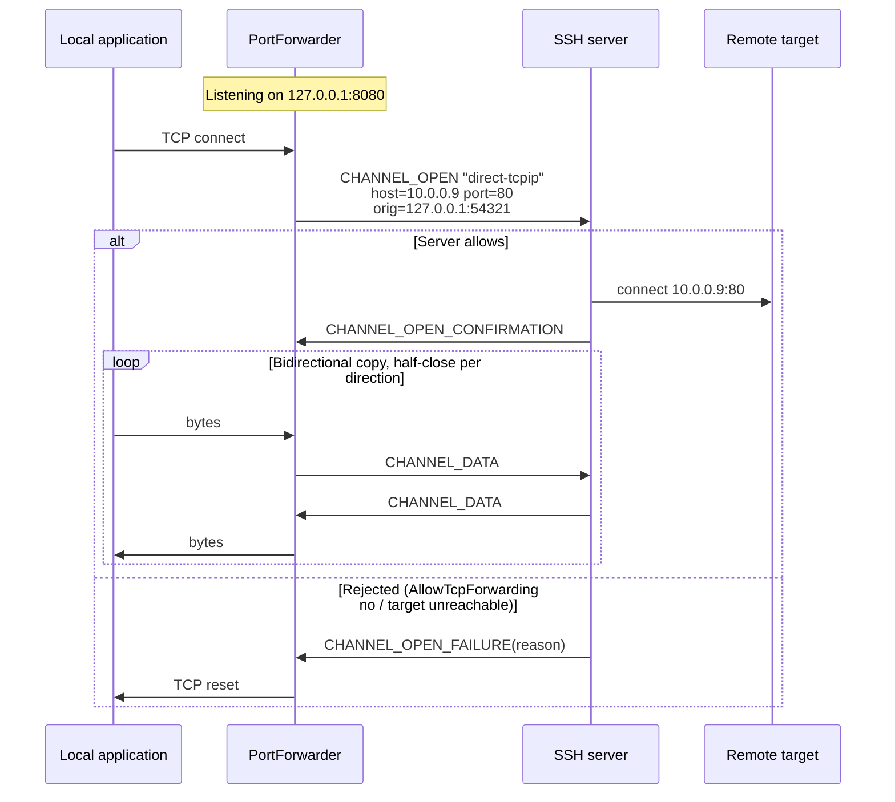
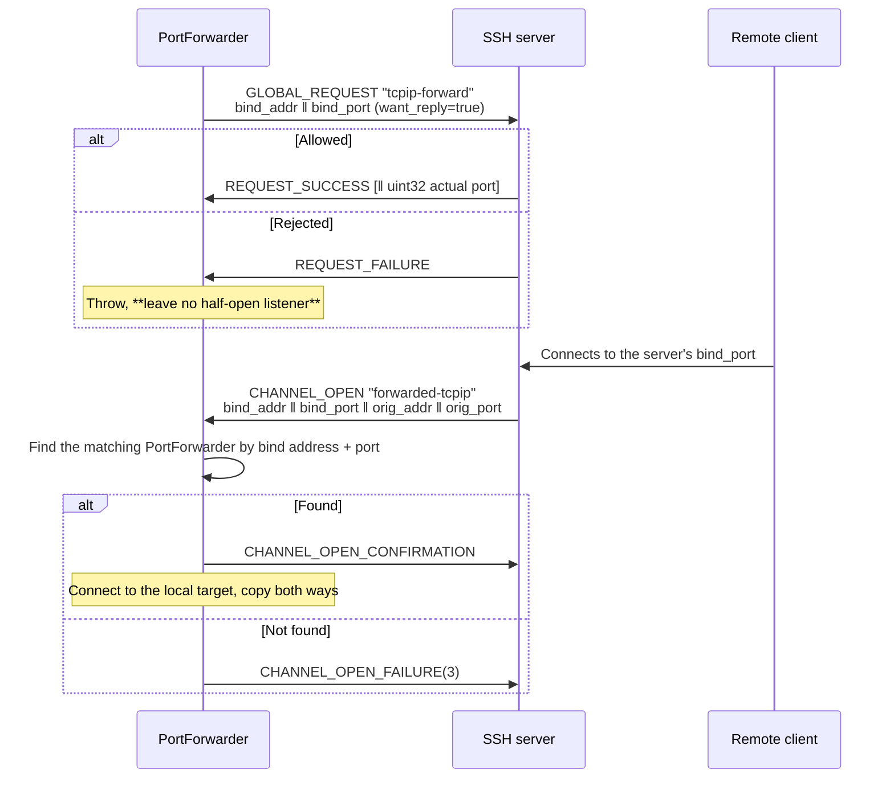

# 07 · Forwarding and Tunnels

> Normative basis: RFC 4254 §7 (TCP/IP Port Forwarding);
> OpenSSH `PROTOCOL`'s `*-streamlocal@openssh.com` and `auth-agent-req@openssh.com`;
> RFC 1928 (SOCKS5, used for dynamic forwarding).
>
> Implementation: `Forwarding/` (L8).
>
> 中文：[`../../../zh/ssh/spec/07-forwarding.md`](../../../zh/ssh/spec/07-forwarding.md)

---

## 1. Four kinds of forwarding

| Form | OpenSSH flag | Who listens | What goes outbound |
| --- | :-: | --- | --- |
| **Local forwarding** | `-L` | Us (local machine) | A `direct-tcpip` channel |
| **Dynamic forwarding** | `-D` | Us (local machine, running SOCKS5) | A `direct-tcpip` channel, target given by the SOCKS handshake |
| **Remote forwarding** | `-R` | The server | The server opens a `forwarded-tcpip` channel; we connect to the local target |
| **Direct tunnel** | None (`-W` is close) | Nobody listens | `direct-tcpip` / `direct-streamlocal`; the stream is handed straight to the caller |

**The fourth is the easiest to overlook, yet it is often the one you should be using.**
When connecting to `/var/run/docker.sock` or some internal HTTP API, the local machine does **not need** a listening port —
opening one actually means any process on the same machine can connect to it. For a root-equivalent endpoint, this is not an optimization but a prerequisite.

---

## 2. Local forwarding `-L`



### 2.1 Extra fields of `direct-tcpip`

| # | Type | Field | Notes |
| :-: | --- | --- | --- |
| 6 | `string` | `host to connect` | **Resolved from the server's point of view** — `localhost` means the server's loopback |
| 7 | `uint32` | `port to connect` | |
| 8 | `string` | `originator IP` | Local originator address |
| 9 | `uint32` | `originator port` | |

〔Decision〕**The originator is filled in truthfully** (the real local address and port).
The server writes it to its logs; a fake value would leave the server administrator unable to trace anything, with no privacy benefit whatsoever
(the server already knows where our connection comes from).

### 2.2 Handling half-close correctly

Both TCP and SSH channels support half-close, and they **must be mapped per direction**:

| Event | Action |
| --- | --- |
| Local application does shutdown(SEND) | Send `CHANNEL_EOF` |
| `CHANNEL_EOF` received | `shutdown(SEND)` on the local socket |
| Local socket fully closed | Send `CHANNEL_CLOSE` |
| `CHANNEL_CLOSE` received | Close the local socket, reply `CHANNEL_CLOSE` |

**Treating EOF as "connection over" truncates data.** Typical symptom:
`curl` POSTs a request body through the tunnel and waits for the response, but we close the whole channel
when it shuts down its write side, so the response never arrives.

### 2.3 Bind address

| `BindAddress` | Behavior |
| --- | --- |
| `127.0.0.1` (〔Decision〕**default**) | Only the local machine can connect |
| `0.0.0.0` / `::` | Reachable from the LAN. **Must be specified explicitly by the user** |
| A specific interface address | Listens only on that interface |

〔Decision〕**Bind to loopback by default.** The other end of a tunnel is often an internal database or management interface;
binding to `0.0.0.0` by default would expose it to everyone on the same network segment.
OpenSSH defaults to this as well (`GatewayPorts no`).

〔Decision〕**Port 0 means the OS assigns one**; the assigned endpoint is reported back via `PortForwarder.BoundEndPoint`.

---

## 3. Dynamic forwarding `-D` (SOCKS5)

The only difference from local forwarding: the target address is not fixed in configuration but is **given by the client in the SOCKS handshake**.

### 3.1 The SOCKS subset we implement

> Basis: RFC 1928.

| Item | Supported |
| --- | --- |
| Version | **SOCKS5 only** (0x05). SOCKS4/4a 〔Decision〕 not implemented |
| Authentication methods | Only `0x00` (no authentication) accepted. 〔Decision〕 see below |
| Commands | Only `CONNECT` (0x01). `BIND` / `UDP ASSOCIATE` get `0x07` (command not supported) |
| Address types | IPv4 (0x01), domain name (0x03), IPv6 (0x04) all supported |

〔Decision〕**SOCKS authentication is not implemented.**
Reason: this listener is on loopback by default (§2.3), and processes on the same machine can connect anyway;
adding a username/password layer gives the illusion that it is a security boundary, which it is not.
If you really need to restrict access, use OS mechanisms (firewall, namespaces).

〔Decision〕**Domain names are not resolved locally; they are passed to the server as-is.**
This is the single most important semantic of dynamic forwarding — `curl --socks5-hostname` depends on it.
Local resolution would cause a "DNS goes local, connection goes through the tunnel" split,
which simply fails for internal domain names and also leaks the destination.

### 3.2 Reply code mapping

| SSH `CHANNEL_OPEN_FAILURE` reason | SOCKS5 REP |
| :-: | :-: |
| 1 `ADMINISTRATIVELY_PROHIBITED` | 0x02 connection not allowed |
| 2 `CONNECT_FAILED` | 0x05 connection refused |
| 3 `UNKNOWN_CHANNEL_TYPE` | 0x01 general failure |
| 4 `RESOURCE_SHORTAGE` | 0x01 general failure |
| Channel open timed out | 0x06 TTL expired |

Getting the mapping right has real consequences: `curl` and browsers decide from the REP code whether to retry
and which message to show the user. Replying `0x01` for everything throws that information away.

---

## 4. Remote forwarding `-R`

### 4.1 Setup



### 4.2 Two musts

1. **When `bind_port = 0`, the actual port is in the payload of `REQUEST_SUCCESS`**
   (a `uint32`). `want_reply` must be true, otherwise the port number cannot be obtained.
2. **Server-initiated `forwarded-tcpip` channels must be routed to the matching forwarder by "bind address + port".**
   A single SSH session can carry multiple remote forwards, and they all share this one channel type.
   〔Decision〕The routing table key is `(bind_addr verbatim string, bind_port)` —
   **do not** normalize the address (`""`, `"*"`, `"0.0.0.0"`, `"localhost"` have different semantics on the server,
   and what it sends back to us is the exact string we used in the request).

### 4.3 Cancellation

The `cancel-tcpip-forward` global request, with the same fields as `tcpip-forward`.
〔Decision〕After cancellation, **continue accepting in-flight `forwarded-tcpip` channels** for a few seconds;
otherwise connections that are being established get rejected for no apparent reason.

### 4.4 Unix socket variant

`streamlocal-forward@openssh.com` / `cancel-streamlocal-forward@openssh.com`
(global requests) + `forwarded-streamlocal@openssh.com` (channel type);
the fields replace `addr ‖ port` with a single `string socket_path`.

---

## 5. Metering — in the library, not in the caller

> This is the most direct benefit of this library over the existing implementation.

`PortForwarder` exposes:

```
ForwardKind Kind { get; }
EndPoint?   BoundEndPoint { get; }      // with port 0, this holds the actual port
bool        IsActive { get; }

int  ActiveConnections { get; }
long TotalConnections  { get; }
long BytesUp   { get; }                 // local → remote
long BytesDown { get; }                 // remote → local

event EventHandler<ForwardConnectionEventArgs> ConnectionOpened;
event EventHandler<ForwardConnectionEventArgs> ConnectionClosed;   // includes that connection's byte counts and duration
event EventHandler<ForwardErrorEventArgs>      Error;              // a single connection failed; the forwarder keeps running
```

Also published through `System.Diagnostics.Metrics`:

| Instrument | Type | Tags |
| --- | --- | --- |
| `velashell.ssh.forward.connections.active` | UpDownCounter | `kind`, `bind` |
| `velashell.ssh.forward.connections.total` | Counter | `kind`, `bind` |
| `velashell.ssh.forward.bytes` | Counter | `kind`, `bind`, `direction` |
| `velashell.ssh.forward.errors` | Counter | `kind`, `bind`, `reason` |

〔Decision〕**Provide both paths**: events for the desktop UI (which refreshes a panel in real time),
Metrics for server scenarios (feeding OpenTelemetry). Picking only one would force users to rewrite the data plane themselves —
which is exactly the 376 lines we set out to eliminate.

〔Implementation note〕Counters use `Interlocked`; reads use `Volatile.Read`.
Byte counts are accumulated **in the copy loop**, not at the channel layer — channel-layer byte counts include protocol overhead,
whereas the panel should show application data volume.

---

## 6. The copy loop

All three forwarding kinds converge on the same loop, **deliberately**:

```
listen/accept → establish outbound (factory delegate) → bidirectional copy (with metering and half-close) → teardown
```

Only "how the outbound side is established" differs:

| Form | Outbound factory |
| --- | --- |
| Local | `(_, ct) => conn.OpenTunnelAsync(host, port, ct)` |
| Dynamic | `(inbound, ct) => { first run the SOCKS5 handshake on inbound to get the target; then OpenTunnelAsync }` |
| Remote | Inbound is the channel given by the server, outbound is local TCP — direction reversed, loop unchanged |

〔Decision〕**The copy layer is independent of SSH and testable on its own.**
It only sees two `Stream`s (or `IDuplexPipe`s). So the main path of half-close, metering
and error teardown can be verified without standing up a real server.

**Buffers**: 〔Decision〕32 KiB per direction, rented from `ArrayPool`.
Same order of magnitude as an SSH channel's max packet, without making every connection hold a large chunk of memory
(1000 concurrent connections × 2 directions × 32 KiB = 64 MiB, acceptable).

---

## 7. Agent forwarding

> Basis: OpenSSH `PROTOCOL`'s `auth-agent-req@openssh.com`, and `PROTOCOL.agent`.

### 7.1 Mechanism

1. Send `CHANNEL_REQUEST "auth-agent-req@openssh.com"` (`want_reply = true`) on the **session channel**.
2. The server may then open `CHANNEL_OPEN "auth-agent@openssh.com"` channels.
3. We bridge such a channel to the local ssh-agent (Unix socket / Windows named pipe).

Handled by `IIncomingChannelHandler` (architecture §8, item 8).

### 7.2 Security requirements

> **Agent forwarding is a loaded gun.** Root on the remote host can, while forwarding is active,
> sign anything with your private key.

〔Decision〕Three hard constraints:

1. **Off by default**; must be explicitly enabled per connection.
2. **Must support "forward only the specified keys"** (`AgentForwardPolicy.AllowedKeys`)
   instead of exposing the entire agent.
3. **An optional signature confirmation callback** (`AgentForwardPolicy.ConfirmEachSignature`):
   ask the user each time the remote requests a signature. For jump-host scenarios this is the only approach that lets people rest easy.

〔Decision〕**We only forward; we do not implement an agent server.**
The local agent is provided by the OS (OpenSSH agent / Pageant / 1Password, etc.).

### 7.3 Adding keys to the local agent (`ssh-add`)

> Basis: the "adding keys", "private key formats" and "key constraints" sections of draft-miller-ssh-agent; OpenSSH `PROTOCOL.agent`.

This is a request made by an agent **client** (what `ssh-add` does), not an agent server — it does not conflict with the decision in 7.2.
Purpose: decrypt an encrypted private key once and hand it to the agent; later authentication and forwarding are signed through the agent, with no passphrase prompt.

**Request message**:

| Field | Type | Notes |
| --- | --- | --- |
| Message number | byte | `17` `SSH_AGENTC_ADD_IDENTITY`; `25` `SSH_AGENTC_ADD_ID_CONSTRAINED` when constraints are present |
| Key type | string | `ssh-ed25519` / `ssh-rsa` / `ecdsa-sha2-nistp256` / `-nistp384` / `-nistp521` |
| Private key contents | per type, see below | |
| Comment | string | UTF-8; the column `ssh-add -l` shows, usually the private key file path |
| Constraints | byte + arguments, repeatable | **only in `25`**, see below |

**Private key contents** (immediately after the key type):

| Key type | Fields (in order) |
| --- | --- |
| `ssh-ed25519` | string public key (32 bytes); string seed ‖ public key (64 bytes, seed first) |
| `ssh-rsa` | mpint n; mpint e; mpint d; mpint iqmp (q⁻¹ mod p); mpint p; mpint q |
| `ecdsa-sha2-*` | string curve name (`nistp256` / `nistp384` / `nistp521`); string public point (uncompressed, `0x04 ‖ X ‖ Y`); mpint private scalar d |

⚠️ For RSA it is **n first, then e** — the reverse of the public key blob (e first). Get it backwards and the agent still answers SUCCESS;
it only shows up on the first signature.

**Constraints**:

| Number | Name | Argument | Meaning |
| :-: | --- | --- | --- |
| `1` | `SSH_AGENT_CONSTRAIN_LIFETIME` | uint32 seconds | The agent deletes the key itself when it expires |
| `2` | `SSH_AGENT_CONSTRAIN_CONFIRM` | none | The agent asks the user to confirm every signature (`ssh-add -c`) |

**Response**: `6` `SSH_AGENT_SUCCESS` means success; `5` `SSH_AGENT_FAILURE` throws `SshAgentException`.
The agent gives no reason, so the exception message names the three common ones: the agent does not support constraints (some agents reject `25` outright),
the agent is locked (`ssh-add -x`), or the agent does not support this key type.

〔Decision〕

1. **Only in-process private keys are accepted** (`InMemorySshSigner`). When a signer is backed by an agent / PKCS#11 / HSM the private key is not in hand at all;
   certificate signers (`*-cert-v01@openssh.com`) need the combined "certificate + private key" format and are not done yet. Everything else is an `ArgumentException`.
2. **No constraints means `17`**; never send a `25` with an empty constraint list — some agents accept `17` but not `25`.
3. **The request buffer is zeroed right after use.** The buffer is reserved at its upper bound up front, so growth never leaves unzeroed copies on the heap.
4. **No duplicate check.** What happens when the same key is added twice is the agent's business (OpenSSH updates the comment and constraints);
   whether to look first with `REQUEST_IDENTITIES` is up to the caller.
5. **The library never adds keys on its own.** When to put something into the user's agent is the user's decision —
   the same principle as "never connect to the agent implicitly" in 04 §2.2. How long an added key lives is up to the agent
   (the Windows OpenSSH agent stores it in the registry, so it survives a reboot).

---

## 7.5 X11 forwarding

> Basis: RFC 4254 §6.3 (`x11-req` and the `x11` channel), the connection setup message of the X11 core protocol,
> the `.Xauthority` file format, and OpenSSH's `ssh -X` / `-Y` behavior.
>
> 〔Scope〕**We implement only the forwarding side, not an X server** (architecture §12 "explicitly out of scope").
> We connect `x11` channels opened back by the server to an **existing local** X display.

### 7.5.1 Why the default for this must be "off"

X11 has no client isolation: **any client connected to the same display can read others' keystrokes,
capture others' windows, and inject events into others' windows**. So handing the local display to the remote
means handing the input and output of every local graphical session to the remote.

〔Decision〕By default X11 forwarding is **not requested**; enabling it must be explicit.
〔Decision〕By default use **untrusted** mode, consistent with `ssh -X`;
trusted mode (`-Y`) must be enabled explicitly on top of that.

### 7.5.2 Fake cookie — the security core of the whole mechanism

**Never send the real local X authorization cookie to the server.**

Approach (consistent with OpenSSH):

1. We generate a **random fake cookie** locally and send that in `x11-req`;
2. The server writes the fake cookie into the remote `.Xauthority`, and remote X clients use it to connect;
3. The server opens an `x11` channel back; we read its **first message** (the X11 connection setup message)
   and verify that the cookie inside is the fake cookie we sent;
4. Verification passes → **replace the fake cookie with the real local cookie**, then forward the message to the local X server;
5. Verification fails → **reject the channel**.

〔Decision〕Cookie comparison must be **constant-time**. A byte-by-byte short-circuit comparison leaks
"how many of the leading bytes were right", and an attacker can open many channels and try slowly.

〔Decision〕Each display has its own fake cookie — forwarding multiple displays over one connection does not cross wires.

### 7.5.3 `x11-req` (RFC 4254 §6.3.1)

```
byte      SSH_MSG_CHANNEL_REQUEST
uint32    recipient channel
string    "x11-req"
boolean   want_reply
boolean   single_connection
string    x11_authentication_protocol   // "MIT-MAGIC-COOKIE-1"
string    x11_authentication_cookie     // the fake cookie as **hexadecimal** text
uint32    x11_screen_number
```

〔Caution〕The cookie field is a **hexadecimal string**, not raw bytes. The symptom of writing raw bytes is that
the cookie stored by the remote `xauth` does not match what we verify, and the error message only says
"connection refused".

〔Decision〕Ordering: `pty-req` → **`x11-req`** → `auth-agent-req@openssh.com` → `env` → `shell`/`exec`
(`05-connection.md` §5.2). **Both interactive shells and one-shot commands are supported** — the most common use of `ssh -X` is a shell.
〔Decision〕`single_connection` is sent as `false` by default: one remote session often opens multiple X clients.
When the user asks for single-connection, besides sending `true`, **we also enforce it locally**: after the first X11 connection, all subsequent connections for the same forward are rejected —
we do not entrust a security constraint to the peer.
〔Decision〕The SFTP subsystem does **not inherit** the connection-level X11 switch — file transfer needs no display.

### 7.5.4 The `x11` channel (RFC 4254 §6.3.2)

Channel type `x11`, type-specific fields:

```
string    originator address
uint32    originator port
```

〔Decision〕**Accept only if X11 forwarding has been requested on this connection**; if not, always reject —
otherwise any server could proactively open channels onto our local display.

〔Decision〕**A single connection can have multiple X11 forwards** (one per session, each with its own fake cookie, display and lifetime).
The `x11` channel itself carries no field that points back to "which session requested it"; the only thing that distinguishes them is
**the cookie in the setup message** — so dispatch happens only after the setup message has been read: compare in constant time against each forward in turn,
and hand it to whichever one matches; if none matches, reject and record a rejection on every live forward.

- When all forwards have expired, reject at channel-open time;
- The concurrency limit is counted against the limit of the forward **after ownership is identified** — so there is no leak path of "occupied a slot but never reached handling";
- Releasing a forward removes only itself; when the last one is released, the connection stops accepting `x11` channels.

〔History〕The early implementation had only a single handler slot: a later request would evict an earlier one (the earlier session's X programs,
holding the correct cookie, were rejected as "wrong cookie"), and releasing any one of them removed the handler entirely.

### 7.5.5 X11 connection setup message

The first message sent by a connecting X11 client:

```
byte    byte_order          // 'B' = big-endian, 'l' = little-endian
byte    (unused)
uint16  protocol_major
uint16  protocol_minor
uint16  auth_protocol_name_length    n
uint16  auth_protocol_data_length    d
uint16  (unused)
byte[n] auth_protocol_name           // padded to a multiple of 4
byte[d] auth_protocol_data           // padded to a multiple of 4
```

〔Caution〕**Both byte orders must be recognized.** The byte order of the two length fields is determined by the first byte;
the symptom of parsing only one is "some clients can connect, others can't".

〔Decision〕Only `MIT-MAGIC-COOKIE-1` is supported; other authorization protocols (`XDM-AUTHORIZATION-1`)
are always rejected — consistent with OpenSSH.

〔Decision〕The message may **arrive in several pieces**: first accumulate the 12-byte fixed header,
then accumulate both data sections according to the lengths in the header. Assuming "the first read is the complete message"
fails randomly on small MTUs or slow links.

### 7.5.6 Locating the local display

Forms of `DISPLAY`: `:0`, `:10.2`, `unix:0`, `host:0`, `[::1]:0`,
and macOS launchd socket paths.

〔Decision〕After parsing into the three parts `host` / `display_number` / `screen_number`:

| Case | Where to connect |
| --- | --- |
| Local (empty host, `unix`, `localhost`) | Try the Linux abstract socket first, then `/tmp/.X11-unix/X<N>` |
| Local + Windows | TCP `127.0.0.1:(6000+N)` (VcXsrv and the like) |
| Remote host | TCP `host:(6000+N)` |

### 7.5.7 Where the real cookie comes from

| Mode | Source |
| --- | --- |
| Trusted (`-Y`) | Read `XAUTHORITY` or `~/.Xauthority`, **without running any external program** |
| Untrusted (`-X`, default) | Run `xauth -f <temporary file> generate <display> MIT-MAGIC-COOKIE-1 untrusted timeout <n>` and read the generated cookie from the temporary file |

〔Decision〕In trusted mode **do not invoke `xauth`** — reading the file is enough, and one fewer external program
means one less attack surface.
〔Decision〕When no matching entry is found in `.Xauthority`, use random data (consistent with OpenSSH):
letting the X server reject it is better than us guessing a cookie that is "probably right".
〔Decision〕Invoking `xauth` must have a **timeout** (30 seconds) — it can hang on an unresponsive X server.
On timeout or cancellation, **terminate its process tree** and leave no hanging child process; read its standard output and standard error **concurrently** —
waiting for exit without reading will fill the pipe once output grows, and the process will never exit.

〔Decision〕⚠️ **The generated restricted cookie is written to a temporary file accessible only to the current user (`-f`), deleted after use,
and never written into the user's `.Xauthority`.** The latter holds the **fully authorized** cookie for the local display;
`xauth generate` without `-f` would overwrite it with the restricted cookie — and once that expires,
the user's own local X programs can no longer connect to their own display.
(The authorization `xauth` uses to connect to the local display is still the user's: when an `.Xauthority` path is specified, it is passed via the `XAUTHORITY` environment variable.)

〔Decision〕The display name passed to `xauth` preserves the host and socket path: a local Unix socket is written as `:N`,
a remote display as `host:N`, and a macOS launchd one as the full socket path — if only `:N` were left,
`xauth` would look up (or generate) the entry for a different display.
〔Decision〕Untrusted mode has a **lifetime** (20 minutes by default); after it expires, new `x11` channels are rejected.

### 7.5.8 What to do on failure

〔Decision〕**Two cases, because the user intent differs:**

| Who enabled it | On failure |
| --- | --- |
| The caller **explicitly** requested it on this execution | **Throw** — they explicitly want X11; silently degrading would be lying to them |
| Only a connection-level switch (e.g. `ForwardX11 yes` in `ssh_config`) | **Log and start normally** — otherwise an existing configuration would make every command fail to run |

## 8. Edge cases and errors at a glance

| Situation | Handling |
| --- | --- |
| Local port already in use | Throw `SshForwardException`, **leave no half-open listener** |
| `tcpip-forward` rejected | Throw; the message points out "the server may have disabled AllowTcpForwarding / GatewayPorts" |
| Channel open fails for a single connection | Raise the `Error` event, close that one inbound connection, **the forwarder keeps running** |
| SSH session disconnected | All forwarders stop, `IsActive` becomes false, `Error` is raised |
| Invalid SOCKS handshake | Close that one, count it in `errors`, the forwarder keeps running |
| No matching forwarder for `forwarded-tcpip` | Reply `CHANNEL_OPEN_FAILURE(3)` |
| Concurrent connections exceed the limit (〔Decision〕default 1024 per forwarder) | Reject new inbound connections and raise `Error`; existing connections are unaffected |

〔Decision〕**A single connection's failure must never affect the forwarder itself.**
A tunnel has to be able to run for days, during which unreachable targets and reset connections are inevitable.
Treat those as fatal errors and the tunnel becomes unusable.
