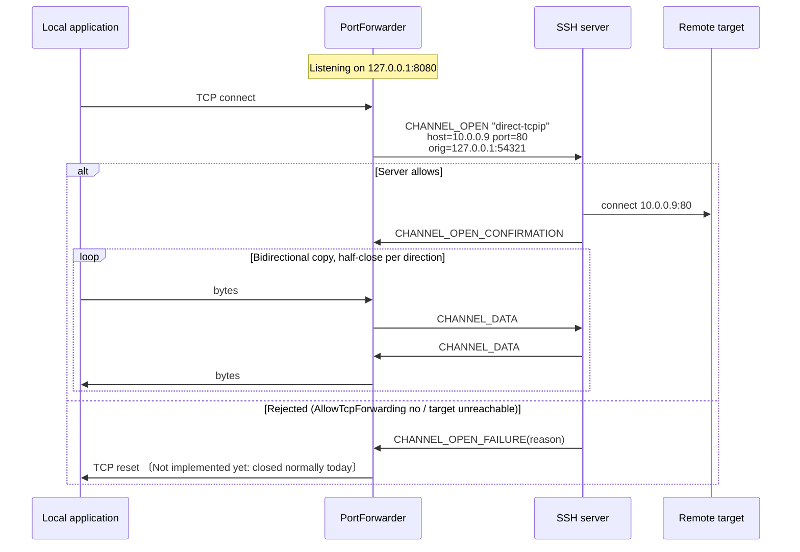
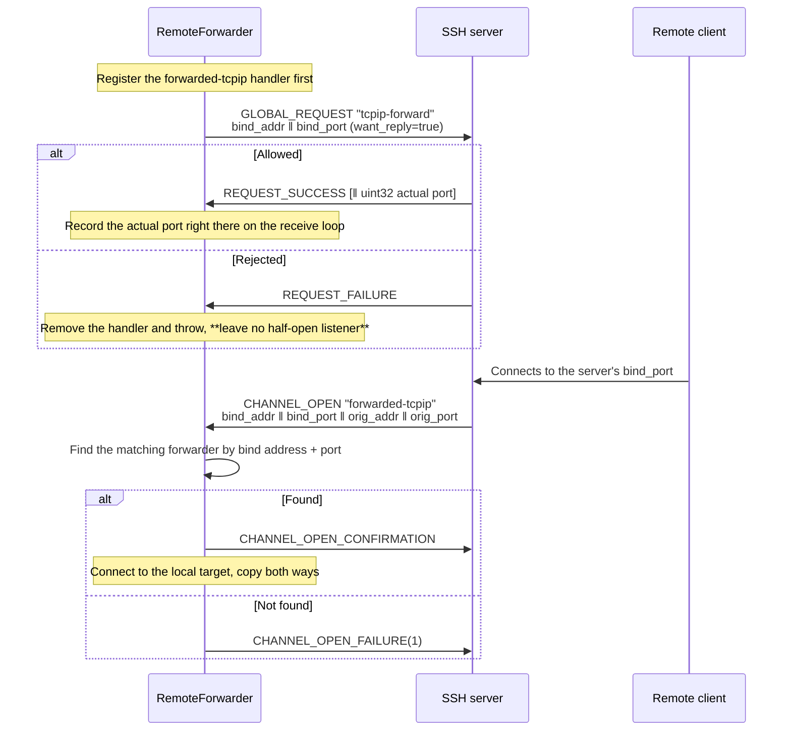

# 07 · Forwarding and Tunnels

> Normative basis: RFC 4254 §7 (TCP/IP Port Forwarding);
> OpenSSH `PROTOCOL`'s `*-streamlocal@openssh.com` and `auth-agent-req@openssh.com`;
> RFC 1928 (SOCKS5, used for dynamic forwarding).
>
> Implementation: `Forwarding/` (L8).
>
> 中文：[`../../../zh/ssh/spec/07-forwarding.md`](../../../zh/ssh/spec/07-forwarding.md)

---

## 1. Four kinds of forwarding

| Form | OpenSSH flag | Who listens | What goes outbound |
| --- | :-: | --- | --- |
| **Local forwarding** | `-L` | Us (local machine) | A `direct-tcpip` channel |
| **Dynamic forwarding** | `-D` | Us (local machine, running SOCKS5) | A `direct-tcpip` channel, target given by the SOCKS handshake |
| **Remote forwarding** | `-R` | The server | The server opens a `forwarded-tcpip` channel; we connect to the local target |
| **Direct tunnel** | None (`-W` is close) | Nobody listens | `direct-tcpip` / `direct-streamlocal`; the stream is handed straight to the caller |

**The fourth is the easiest to overlook, yet it is often the one you should be using.**
When connecting to `/var/run/docker.sock` or some internal HTTP API, the local machine does **not need** a listening port —
opening one actually means any process on the same machine can connect to it. For a root-equivalent endpoint, this is not an optimization but a prerequisite.

---

## 2. Local forwarding `-L`



〔Not implemented yet〕When the server refuses to open the tunnel, the design is to **reset** that local connection (RST): a refusal is an error too, the same rule as §2.2's "an error is not an EOF".
Today the implementation raises `Error` and closes that connection **normally** (FIN), so the local application reads an end with no data at all.
(Dynamic forwarding also sends a SOCKS failure reply that tells the client why, §3.2.)

### 2.1 Extra fields of `direct-tcpip`

| # | Type | Field | Notes |
| :-: | --- | --- | --- |
| 6 | `string` | `host to connect` | **Resolved from the server's point of view** — `localhost` means the server's loopback |
| 7 | `uint32` | `port to connect` | |
| 8 | `string` | `originator IP` | Local originator address |
| 9 | `uint32` | `originator port` | |

〔Decision〕**The originator is filled in truthfully** (the real local address and port).
The server writes it to its logs; a fake value would leave the server administrator unable to trace anything, with no privacy benefit whatsoever
(the server already knows where our connection comes from).

### 2.2 Half-close and error teardown

Both TCP and SSH channels support half-close, and they **must be mapped per direction**; and **a clean end must be kept apart from an error**.
The two sides of a forwarded connection are the local socket and the SSH channel; what happens on one side reaches the other as follows:

| What happens on one side | What the other side sees |
| --- | --- |
| Local application does `shutdown(SEND)` (we read a FIN) | `CHANNEL_EOF`; the other direction keeps flowing |
| `CHANNEL_EOF` received | `shutdown(SEND)` on the local socket (FIN); the other direction keeps flowing |
| Both directions end cleanly | Channel `CHANNEL_CLOSE`, local socket closed |
| The peer's `CHANNEL_CLOSE` received | Data already received is still delivered, then the local socket gets a FIN; the direction writing into the channel stops there, and the local socket is closed afterwards (the connection layer replies `CLOSE`) |
| Read or write error on the local socket (reset, etc.) | The channel gets **no EOF**, just `CHANNEL_CLOSE` |
| Read or write error on the channel (including the SSH connection dropping) | The local socket is **reset** (RST) |
| Cancellation from disposing the forwarder or the SSH connection dropping | Treated as an error: both sides are aborted together |

**Treating EOF as "connection over" truncates data.** Typical symptom:
`curl` POSTs a request body through the tunnel and waits for the response, but we close the whole channel
when it shuts down its write side, so the response never arrives.

〔Decision〕**An error is not an EOF.** When either direction fails (cancellation included), both sides are **aborted** together: the TCP side is closed with linger 0, so the far end receives an RST
(Unix sockets may not support linger 0; then it is simply closed); the channel side gets `CHANNEL_CLOSE` without a preceding `EOF`.
Closing as if it had ended cleanly (FIN / `EOF`) is wrong — the far end would take truncated data for complete data, and a half-downloaded file would look finished;
stopping only the failed direction is wrong too — the other direction would hang until the far end happens to close.
The reported cause is taken from **the side that failed first**, not from the side that was aborted as a consequence (that is usually just a cancellation).

〔Decision〕**Once the peer's `CLOSE` arrives, the direction writing into the channel stops, and that is not an error.** That direction is most likely blocked reading the local socket at that point —
the local program is waiting for a response and will not close first; if it is not stopped, the socket and a concurrency slot stay occupied.
The direction reading from the channel is unaffected; data already received is drained as usual. Whatever the local end sends afterwards, the OS answers with an RST once the socket is closed.

### 2.3 Bind address

| `BindAddress` | Behavior |
| --- | --- |
| `127.0.0.1` (〔Decision〕**default**) | Only the local machine can connect |
| `0.0.0.0` / `::` | Reachable from the LAN. **Must be specified explicitly by the user** |
| A specific interface address | Listens only on that interface |

〔Decision〕**Bind to loopback by default.** The other end of a tunnel is often an internal database or management interface;
binding to `0.0.0.0` by default would expose it to everyone on the same network segment.
OpenSSH defaults to this as well (`GatewayPorts no`).

〔Decision〕**Port 0 means the OS assigns one**; the assigned endpoint is reported back via `PortForwarder.BoundEndPoint`.

### 2.4 Listener resilience and teardown

Local and dynamic forwarding share the same listener (`PortForwarder`); the following holds for both.

〔Decision〕**Back off when accepting fails.** When accepting an inbound connection fails, raise one `Error` (`accept`), then wait before accepting again:
50 ms the first time, doubling each time after that, capped at 1 second; one successful accept resets it.
Failures such as file-descriptor exhaustion (EMFILE) come back immediately and repeatedly — without a wait this is a loop that pins a core and raises tens of thousands of error events per second,
and it happens exactly when the machine is already under pressure.

〔Decision〕**When the SSH connection drops, close the listener and release the port.** Otherwise the port stays taken: re-creating the same forward after reconnecting only yields "port already in use",
and meanwhile every accepted connection just earns another "tunnel could not be opened". The listener is closed first and `IsActive` becomes false after that —
whoever sees it false can be sure the port has been released. In-flight connections are aborted as errors (§2.2); local applications receive an RST.
The forwarder object must still be disposed by the caller.

〔Decision〕**Disposal returns only after every connection has finished its teardown.** The forwarder tracks each connection in progress; disposal stops the listener,
cancels all connections (aborted as errors), waits for them to finish their teardown, and only then releases the concurrency slots and other resources.
It used to release them right away: a connection still tearing down would then return a slot to an already-disposed limiter, with the exception landing in a task nobody observed; and the connections were still open when disposal returned.

---

## 3. Dynamic forwarding `-D` (SOCKS5)

The only difference from local forwarding: the target address is not fixed in configuration but is **given by the client in the SOCKS handshake**.

### 3.1 The SOCKS subset we implement

> Basis: RFC 1928.

| Item | Supported |
| --- | --- |
| Version | **SOCKS5 only** (0x05). SOCKS4/4a 〔Decision〕 not implemented |
| Authentication methods | Only `0x00` (no authentication) accepted. 〔Decision〕 see below |
| Commands | Only `CONNECT` (0x01). `BIND` / `UDP ASSOCIATE` get `0x07` (command not supported) |
| Address types | IPv4 (0x01), domain name (0x03), IPv6 (0x04) all supported |

〔Decision〕**SOCKS authentication is not implemented.**
Reason: this listener is on loopback by default (§2.3), and processes on the same machine can connect anyway;
adding a username/password layer gives the illusion that it is a security boundary, which it is not.
If you really need to restrict access, use OS mechanisms (firewall, namespaces).

〔Decision〕**Domain names are not resolved locally; they are passed to the server as-is.**
This is the single most important semantic of dynamic forwarding — `curl --socks5-hostname` depends on it.
Local resolution would cause a "DNS goes local, connection goes through the tunnel" split,
which simply fails for internal domain names and also leaks the destination.

〔Decision〕**A zero-length domain name gets `0x08` (address type not supported), and that connection is closed.** An empty name is not a target:
let through, opening the tunnel fails on an invalid argument and the client gets no SOCKS reply at all, with no way to tell what went wrong.

### 3.2 Reply code mapping

| SSH `CHANNEL_OPEN_FAILURE` reason | SOCKS5 REP |
| :-: | :-: |
| 1 `ADMINISTRATIVELY_PROHIBITED` | 0x02 connection not allowed |
| 2 `CONNECT_FAILED` | 0x05 connection refused |
| 3 `UNKNOWN_CHANNEL_TYPE` | 0x01 general failure |
| 4 `RESOURCE_SHORTAGE` | 0x01 general failure |
| Channel open timed out 〔Not implemented yet〕 | 0x06 TTL expired |

Getting the mapping right has real consequences: `curl` and browsers decide from the REP code whether to retry
and which message to show the user. Replying `0x01` for everything throws that information away.

〔Not implemented yet〕Opening a channel has no time limit of its own yet, so the last row never applies: today the forwarder waits for the server's answer;
if the forwarder is disposed or the SSH connection drops first, that connection is closed without any reply.
A failure without a reason code (for example our own channel count or window budget being exhausted) gets `0x01`.

### 3.3 Handshake time limit

〔Decision〕**The SOCKS handshake has a time limit** (`PortForwardOptions.SocksHandshakeTimeout`, 30 seconds by default):
from accepting the connection until the `CONNECT` request has been read. On timeout that connection is closed and `Error` (`socks`) is raised; the forwarder keeps running.
Every client that connects and says nothing holds a concurrency slot for nothing; without a limit, once they fill the cap (§8) no legitimate connection gets in.
Browsers and `curl` send the handshake as soon as they connect; 30 seconds is plenty.

---

## 4. Remote forwarding `-R`

### 4.1 Setup



### 4.2 Three musts

1. **When `bind_port = 0`, the actual port is in the payload of `REQUEST_SUCCESS`**
   (a `uint32`). `want_reply` must be true, otherwise the port number cannot be obtained.
2. **Server-initiated `forwarded-tcpip` channels must be routed to the matching forwarder by "bind address + port".**
   A single SSH session can carry multiple remote forwards, and they all share this one channel type.
   〔Decision〕The routing table key is `(bind_addr verbatim string, bind_port)` —
   **do not** normalize the address (`""`, `"*"`, `"0.0.0.0"`, `"localhost"` have different semantics on the server,
   and what it sends back to us is the exact string we used in the request).
3. **The handler is registered before the request is sent, and the actual port is recorded the moment the reply arrives.**
   Right after replying `REQUEST_SUCCESS` the server may open a forwarded channel (someone is already waiting to connect to that port), and that `CHANNEL_OPEN`
   is processed by the receive loop immediately afterwards. Registering the handler only after the reply, or recording the port in the caller's continuation (which runs on the thread pool),
   means that channel has already been rejected as "unclaimed".
   〔Decision〕So the reply ledger lets a request be registered with a callback: when the reply arrives, the callback is invoked synchronously on the receive loop first (recording the port),
   and only then is the waiting task completed. The callback must be short and non-blocking; if the connection drops, it receives a failed reply.
   The handler is removed when the server refuses or sending the request fails.

### 4.3 Cancellation and the grace period

The `cancel-tcpip-forward` global request, with the same fields as `tcpip-forward` (the port is the one actually bound).
〔Decision〕After cancellation, **continue accepting in-flight `forwarded-tcpip` channels** for a few seconds (`DrainGrace`, 2 seconds);
otherwise connections that are being established get rejected for no apparent reason. Disposal proceeds in this order:

1. Send `cancel-tcpip-forward` (`cancel-streamlocal-forward@openssh.com` for the Unix socket variant). From this moment `IsActive` is false.
2. During the grace period the handler stays in place: matching forwarded channels are still accepted and relayed, and existing connections keep relaying.
3. When the grace period ends, the handler is removed — forwarded channels arriving after that are rejected.
4. All of this forwarder's connections are ended, aborted as errors (§2.2): the local target receives an RST, and the server's channel receives a `CLOSE` without `EOF`.

If the SSH connection is already gone (the cancel request cannot be sent, or the connection drops during the grace period), there is no waiting — no more forwarded channels will arrive.

〔History〕The early implementation marked itself "disposed" as soon as disposal began, and the handler rejected everything once that flag was set —
the grace period did nothing, and in-flight forwarded channels were rejected anyway.

### 4.4 Unix socket variant

`streamlocal-forward@openssh.com` / `cancel-streamlocal-forward@openssh.com`
(global requests) + `forwarded-streamlocal@openssh.com` (channel type);
the fields replace `addr ‖ port` with a single `string socket_path`.

### 4.5 State and lifetime

| Property | Meaning |
| --- | --- |
| `BoundPort` | The port the server **actually** bound: taken from the `REQUEST_SUCCESS` payload when port 0 was requested, otherwise the requested port. 0 for the Unix socket variant |
| `IsActive` | False once disposal has begun, or once the SSH connection has dropped. It reads the connection's state directly and does not wait for any callback |

〔Decision〕If port 0 was requested and the server replies `REQUEST_SUCCESS` without a port: remove the handler and throw.
Routing forwarded channels by `(bind_addr, 0)` would match none of them, and the symptom is "the forward looks established, but every incoming connection is rejected".

〔Decision〕**Each forwarded connection is tied to the lifetimes of both the SSH connection and the forwarder**; whichever ends first ends it too (aborted as an error, §2.2).
Tied only to the connection, a forwarder's connections would keep relaying after the forwarder was disposed, until the whole SSH connection dropped.

Once the SSH connection drops, the server's listener disappears with it, and there is no local port to release; the forwarder object must still be disposed (disposal sees that the connection is gone and skips the grace period).

---

## 5. Metering — in the library, not in the caller

> This is the most direct benefit of this library over the existing implementation.

`PortForwarder` exposes:

```
ForwardKind Kind { get; }
EndPoint?   BoundEndPoint { get; }      // with port 0, this holds the actual port
bool        IsActive { get; }

int  ActiveConnections { get; }
long TotalConnections  { get; }
long BytesUp   { get; }                 // local → remote
long BytesDown { get; }                 // remote → local

event EventHandler<ForwardConnectionEventArgs> ConnectionOpened;
event EventHandler<ForwardConnectionEventArgs> ConnectionClosed;   // includes that connection's byte counts and duration
event EventHandler<ForwardErrorEventArgs>      Error;              // a single connection failed; the forwarder keeps running
```

Also published through `System.Diagnostics.Metrics`:

| Instrument | Type | Tags |
| --- | --- | --- |
| `velashell.ssh.forward.connections.active` | UpDownCounter | `kind`, `bind` |
| `velashell.ssh.forward.connections.total` | Counter | `kind`, `bind` |
| `velashell.ssh.forward.bytes` | Counter | `kind`, `bind`, `direction` |
| `velashell.ssh.forward.errors` | Counter | `kind`, `bind`, `reason` |

〔Decision〕**Provide both paths**: events for the desktop UI (which refreshes a panel in real time),
Metrics for server scenarios (feeding OpenTelemetry). Picking only one would force users to rewrite the data plane themselves —
which is exactly the 376 lines we set out to eliminate.

〔Decision〕**Exceptions from event subscribers do not affect forwarding.** Subscribers are invoked one by one; whatever one throws is swallowed, without affecting later subscribers, let alone the connection.
Events are there to refresh a panel, and a bug in a subscriber should not turn into a forwarding failure —
a throwing `ConnectionOpened` subscriber used to stop that connection from relaying, and the active-connection count only ever went up.

〔Decision〕Cancellation caused by the forwarder itself shutting down (disposal, the SSH connection dropping) **is not an error of the individual connection** and does not raise `Error`.

〔Implementation note〕Counters use `Interlocked`; reads use `Volatile.Read`.
Byte counts are accumulated **in the copy loop**, not at the channel layer — channel-layer byte counts include protocol overhead,
whereas the panel should show application data volume.

---

## 6. The copy loop

All three forwarding kinds converge on the same loop, **deliberately**:

```
listen/accept → establish outbound (factory delegate) → bidirectional copy (with metering and half-close) → teardown
```

Only "how the outbound side is established" differs:

| Form | Outbound factory |
| --- | --- |
| Local | `(_, ct) => conn.OpenTunnelAsync(host, port, ct)` |
| Dynamic | `(inbound, ct) => { first run the SOCKS5 handshake on inbound to get the target; then OpenTunnelAsync }` |
| Remote | Inbound is the channel given by the server, outbound is local TCP — direction reversed, loop unchanged |

〔Decision〕**The copy layer is independent of SSH and testable on its own.**
It only sees two endpoints (`IRelayEndpoint`), each offering five things: read; write; "I will send no more"
(half-close — `shutdown(SEND)` for TCP, `CHANNEL_EOF` for a channel); "abort on error" (an RST for TCP, a `CLOSE` without `EOF` for a channel);
and a signal that "this end is entirely finished" (the channel received `CLOSE`, or the session is gone). So the main path of half-close, metering
and error teardown (§2.2) can be verified without standing up a real server.

An endpoint that cannot provide an abort action (a plain stream, for instance) degrades abort to closing it: the far end learns the connection is gone but cannot tell an error from a clean end.
One that cannot provide a half-close action does nothing on half-close: the far end only learns we are done sending when the whole connection closes.

**Buffers**: 〔Decision〕32 KiB per direction, rented from `ArrayPool`.
Same order of magnitude as an SSH channel's max packet, without making every connection hold a large chunk of memory
(1000 concurrent connections × 2 directions × 32 KiB = 64 MiB, acceptable).

---

## 7. Agent forwarding

> Basis: OpenSSH `PROTOCOL`'s `auth-agent-req@openssh.com`, and `PROTOCOL.agent`.

### 7.1 Mechanism

1. Send `CHANNEL_REQUEST "auth-agent-req@openssh.com"` (`want_reply = true`) on the **session channel**.
2. The server may then open `CHANNEL_OPEN "auth-agent@openssh.com"` channels.
3. We bridge such a channel to the local ssh-agent (Unix socket / Windows named pipe).

Handled by `IIncomingChannelHandler` (architecture §8, item 8).

〔Decision〕**Not a byte-level pass-through**: each agent message (4-byte length + contents) is collected in full and decoded before it is handled —
only that way can §7.2's "forward only the specified keys" and "confirm each signature" be done.

〔Decision〕**The agent channel's receive window holds at least one whole agent message of the maximum size** (4-byte length + 256 KiB).
Nothing is consumed until a message is complete, and the window is replenished only as data is consumed — a window smaller than a message means the peer waits for window while we wait for the message, and neither can move.
It used to be 32 KiB, and signing slightly longer data (`ssh-keygen -Y sign`, certificates) stalled right there.
The window is only a credit, not memory allocated up front; ordinary messages are a few hundred bytes. A message with length 0 or over 256 KiB is treated as malformed and the channel is closed.

### 7.2 Security requirements

> **Agent forwarding is a loaded gun.** Root on the remote host can, while forwarding is active,
> sign anything with your private key.

〔Decision〕Three hard constraints:

1. **Off by default**; must be explicitly enabled per connection.
2. **Must support "forward only the specified keys"** (`AgentForwardPolicy.AllowedKeys`)
   instead of exposing the entire agent.
3. **An optional signature confirmation callback** (`AgentForwardPolicy.ConfirmEachSignature`):
   ask the user each time the remote requests a signature. For jump-host scenarios this is the only approach that lets people rest easy.

〔Decision〕**The allow-list compares the key inside a certificate.** A certificate and its key use the same private key: allowing the key allows its certificate,
and allowing the certificate allows the key. Listing identities and sign requests use the same comparison — a key that is not listed is refused even if the remote
has learned its public key elsewhere (for example `authorized_keys`) and asks for a signature directly; the request never reaches the local agent.

〔Decision〕**Keys in the agent that this library cannot recognize are skipped, rather than failing the whole list** (FIDO, DSA, certificate types this library does not support):
the remote does not see them in the list, and sign requests for them are refused — even when `AllowedKeys` is empty. Certificates it does recognize are listed, and their sign requests are passed to the agent as usual.
For RSA, the digest is chosen by the flags in the remote's request (SHA-256 / SHA-512; SHA-1 only when neither is set), **judged by the type of the key inside the certificate** —
an RSA certificate gets the SHA-2 the remote asked for, just like an RSA key; judged by the certificate's own type string, the flags would be ignored and the certificate signed with SHA-1.
It used to be that a single certificate in the agent made listing identities fail entirely, and agent forwarding with it.

〔Decision〕**Forwarding lasts exactly as long as the forwarder.** Disposing the forwarder not only stops accepting new `auth-agent@openssh.com` channels,
**it also closes the ones already open**. Removing the handler alone is not enough: the connection may still be open (SFTP, other sessions),
and an agent channel the remote opened earlier would keep signing for it until the whole connection drops.
After each request is read and before it is handled, the forwarder checks once more whether it has been disposed: the cancellation issued by disposal reaches each channel in the background,
and a request that arrives in between must not get one more signature after disposal has returned.

〔Decision〕**On Windows, before connecting to an agent exposed as a named pipe, confirm that the pipe's owner is trusted**: the current user, SYSTEM or Administrators;
otherwise refuse the connection. The OpenSSH agent's pipe name is fixed (`openssh-ssh-agent`); while the service isn't running, any local user can create that name first
and then receive our signing requests — and, when adding keys to the agent (§7.3), **plaintext private keys**. Whoever creates the pipe first can only make themselves its owner.
This is not defended by lowering the impersonation level to Identification: the OpenSSH agent service stores keys as the connecting user, so lowering it would break the legitimate agent too.

〔Decision〕**We only forward; we do not implement an agent server.**
The local agent is provided by the OS (OpenSSH agent / Pageant / 1Password, etc.).

### 7.3 Adding keys to the local agent (`ssh-add`)

> Basis: the "adding keys", "private key formats" and "key constraints" sections of draft-miller-ssh-agent; OpenSSH `PROTOCOL.agent`.

This is a request made by an agent **client** (what `ssh-add` does), not an agent server — it does not conflict with the decision in 7.2.
Purpose: decrypt an encrypted private key once and hand it to the agent; later authentication and forwarding are signed through the agent, with no passphrase prompt.

**Request message**:

| Field | Type | Notes |
| --- | --- | --- |
| Message number | byte | `17` `SSH_AGENTC_ADD_IDENTITY`; `25` `SSH_AGENTC_ADD_ID_CONSTRAINED` when constraints are present |
| Key type | string | `ssh-ed25519` / `ssh-rsa` / `ecdsa-sha2-nistp256` / `-nistp384` / `-nistp521` |
| Private key contents | per type, see below | |
| Comment | string | UTF-8; the column `ssh-add -l` shows, usually the private key file path |
| Constraints | byte + arguments, repeatable | **only in `25`**, see below |

**Private key contents** (immediately after the key type):

| Key type | Fields (in order) |
| --- | --- |
| `ssh-ed25519` | string public key (32 bytes); string seed ‖ public key (64 bytes, seed first) |
| `ssh-rsa` | mpint n; mpint e; mpint d; mpint iqmp (q⁻¹ mod p); mpint p; mpint q |
| `ecdsa-sha2-*` | string curve name (`nistp256` / `nistp384` / `nistp521`); string public point (uncompressed, `0x04 ‖ X ‖ Y`); mpint private scalar d |

⚠️ For RSA it is **n first, then e** — the reverse of the public key blob (e first). Get it backwards and the agent still answers SUCCESS;
it only shows up on the first signature.

**Constraints**:

| Number | Name | Argument | Meaning |
| :-: | --- | --- | --- |
| `1` | `SSH_AGENT_CONSTRAIN_LIFETIME` | uint32 seconds | The agent deletes the key itself when it expires |
| `2` | `SSH_AGENT_CONSTRAIN_CONFIRM` | none | The agent asks the user to confirm every signature (`ssh-add -c`) |

**Response**: `6` `SSH_AGENT_SUCCESS` means success; `5` `SSH_AGENT_FAILURE` throws `SshAgentException`.
The agent gives no reason, so the exception message names the three common ones: the agent does not support constraints (some agents reject `25` outright),
the agent is locked (`ssh-add -x`), or the agent does not support this key type.

〔Decision〕

1. **Only in-process private keys are accepted** (`InMemorySshSigner`). When a signer is backed by an agent / PKCS#11 / HSM the private key is not in hand at all;
   certificate signers (`*-cert-v01@openssh.com`) need the combined "certificate + private key" format and are not done yet. Everything else is an `ArgumentException`.
2. **No constraints means `17`**; never send a `25` with an empty constraint list — some agents accept `17` but not `25`.
3. **The request buffer is zeroed right after use.** The buffer is reserved at its upper bound up front, so growth never leaves unzeroed copies on the heap.
4. **No duplicate check.** What happens when the same key is added twice is the agent's business (OpenSSH updates the comment and constraints);
   whether to look first with `REQUEST_IDENTITIES` is up to the caller.
5. **The library never adds keys on its own.** When to put something into the user's agent is the user's decision —
   the same principle as "never connect to the agent implicitly" in 04 §2.2. How long an added key lives is up to the agent
   (the Windows OpenSSH agent stores it in the registry, so it survives a reboot).

---

## 7.5 X11 forwarding

> Basis: RFC 4254 §6.3 (`x11-req` and the `x11` channel), the connection setup message of the X11 core protocol,
> the `.Xauthority` file format, and OpenSSH's `ssh -X` / `-Y` behavior.
>
> 〔Scope〕**We implement only the forwarding side, not an X server** (architecture §12 "explicitly out of scope").
> We connect `x11` channels opened back by the server to an **existing local** X display.

### 7.5.1 Why the default for this must be "off"

X11 has no client isolation: **any client connected to the same display can read others' keystrokes,
capture others' windows, and inject events into others' windows**. So handing the local display to the remote
means handing the input and output of every local graphical session to the remote.

〔Decision〕By default X11 forwarding is **not requested**; enabling it must be explicit.
〔Decision〕By default use **untrusted** mode, consistent with `ssh -X`;
trusted mode (`-Y`) must be enabled explicitly on top of that.

### 7.5.2 Fake cookie — the security core of the whole mechanism

**Never send the real local X authorization cookie to the server.**

Approach (consistent with OpenSSH):

1. We generate a **random fake cookie** locally and send that in `x11-req`;
2. The server writes the fake cookie into the remote `.Xauthority`, and remote X clients use it to connect;
3. The server opens an `x11` channel back; we read its **first message** (the X11 connection setup message)
   and verify that the cookie inside is the fake cookie we sent;
4. Verification passes → **replace the fake cookie with the real local cookie**, then forward the message to the local X server;
5. Verification fails → **reject the channel**.

〔Decision〕Cookie comparison must be **constant-time**. A byte-by-byte short-circuit comparison leaks
"how many of the leading bytes were right", and an attacker can open many channels and try slowly.

〔Decision〕Each display has its own fake cookie — forwarding multiple displays over one connection does not cross wires.

### 7.5.3 `x11-req` (RFC 4254 §6.3.1)

```
byte      SSH_MSG_CHANNEL_REQUEST
uint32    recipient channel
string    "x11-req"
boolean   want_reply
boolean   single_connection
string    x11_authentication_protocol   // "MIT-MAGIC-COOKIE-1"
string    x11_authentication_cookie     // the fake cookie as **hexadecimal** text
uint32    x11_screen_number
```

〔Caution〕The cookie field is a **hexadecimal string**, not raw bytes. The symptom of writing raw bytes is that
the cookie stored by the remote `xauth` does not match what we verify, and the error message only says
"connection refused".

〔Decision〕Ordering: `pty-req` → **`x11-req`** → `auth-agent-req@openssh.com` → `env` → `shell`/`exec`
(`05-connection.md` §5.2). **Both interactive shells and one-shot commands are supported** — the most common use of `ssh -X` is a shell.
〔Decision〕`single_connection` is sent as `false` by default: one remote session often opens multiple X clients.
When the user asks for single-connection, besides sending `true`, **we also enforce it locally**: after the first X11 connection, all subsequent connections for the same forward are rejected —
we do not entrust a security constraint to the peer.
〔Decision〕The SFTP subsystem does **not inherit** the connection-level X11 switch — file transfer needs no display.

### 7.5.4 The `x11` channel (RFC 4254 §6.3.2)

Channel type `x11`, type-specific fields:

```
string    originator address
uint32    originator port
```

〔Decision〕**Accept only if X11 forwarding has been requested on this connection**; if not, always reject —
otherwise any server could proactively open channels onto our local display.

〔Decision〕**A single connection can have multiple X11 forwards** (one per session, each with its own fake cookie, display and lifetime).
The `x11` channel itself carries no field that points back to "which session requested it"; the only thing that distinguishes them is
**the cookie in the setup message** — so dispatch happens only after the setup message has been read: compare in constant time against each forward in turn,
and hand it to whichever one matches; if none matches, reject and record a rejection on every live forward.

- When all forwards have expired, reject at channel-open time;
- The concurrency limit is counted against the limit of the forward **after ownership is identified** — so there is no leak path of "occupied a slot but never reached handling";
- Releasing a forward removes only itself; when the last one is released, the connection stops accepting `x11` channels.

〔History〕The early implementation had only a single handler slot: a later request would evict an earlier one (the earlier session's X programs,
holding the correct cookie, were rejected as "wrong cookie"), and releasing any one of them removed the handler entirely.

### 7.5.5 X11 connection setup message

The first message sent by a connecting X11 client:

```
byte    byte_order          // 'B' = big-endian, 'l' = little-endian
byte    (unused)
uint16  protocol_major
uint16  protocol_minor
uint16  auth_protocol_name_length    n
uint16  auth_protocol_data_length    d
uint16  (unused)
byte[n] auth_protocol_name           // padded to a multiple of 4
byte[d] auth_protocol_data           // padded to a multiple of 4
```

〔Caution〕**Both byte orders must be recognized.** The byte order of the two length fields is determined by the first byte;
the symptom of parsing only one is "some clients can connect, others can't".

〔Decision〕Only `MIT-MAGIC-COOKIE-1` is supported; other authorization protocols (`XDM-AUTHORIZATION-1`)
are always rejected — consistent with OpenSSH.

〔Decision〕The message may **arrive in several pieces**: first accumulate the 12-byte fixed header,
then accumulate both data sections according to the lengths in the header. Assuming "the first read is the complete message"
fails randomly on small MTUs or slow links.

〔Decision〕**Each authorization field is limited to 256 bytes, and this is checked as soon as the 12-byte header is in.** Both lengths come from the remote side,
and these bytes must be buffered before the cookie is checked — waiting for whatever length the header claims (the protocol allows up to 64 KiB each)
would let a peer that has not proven anything decide how much we buffer and how long we wait. The only thing that can pass the check is the 18-byte
`MIT-MAGIC-COOKIE-1` plus the 16-byte fake cookie; every real X11 authorization protocol name and data is far below this limit. Anything larger rejects the channel on the spot, without connecting to the local X server.

### 7.5.6 Locating the local display

Forms of `DISPLAY`: `:0`, `:10.2`, `unix:0`, `host:0`, `[::1]:0`,
and macOS launchd socket paths.

〔Decision〕After parsing into the three parts `host` / `display_number` / `screen_number`:

| Case | Where to connect |
| --- | --- |
| Local socket (empty host, `unix`) | Try the Linux abstract socket first, then `/tmp/.X11-unix/X<N>`, then loopback TCP |
| Local socket + Windows | TCP `127.0.0.1:(6000+N)` (VcXsrv and the like) |
| `localhost` | TCP `127.0.0.1:(6000+N)` **only**; no local socket is tried |
| Remote host | TCP `host:(6000+N)` |

〔Decision〕**`localhost:N` is TCP, not a local socket.** By X convention it means `6000+N`, and that is exactly the form sshd sets for a nested `ssh -X`.
Treating it as a local socket and trying the Linux abstract socket is dangerous: the abstract namespace has no permission checks,
so another user on the same machine can bind `@/tmp/.X11-unix/X<N>` first and receive the **real** cookie we substitute in.
For cookie selection it still counts as a local display (the local host name's FamilyLocal entry, §7.5.7) — "where to connect" and "which cookie to use" are separate questions.

### 7.5.7 Where the real cookie comes from

| Mode | Source |
| --- | --- |
| Trusted (`-Y`) | Read `XAUTHORITY` or `~/.Xauthority`, **without running any external program** |
| Untrusted (`-X`, default) | Run `xauth -f <temporary file> generate <display> MIT-MAGIC-COOKIE-1 untrusted timeout <n>` and read the generated cookie from the temporary file |

〔Decision〕In trusted mode **do not invoke `xauth`** — reading the file is enough, and one fewer external program
means one less attack surface.
〔Decision〕When no matching entry is found in `.Xauthority`, use random data (consistent with OpenSSH):
letting the X server reject it is better than us guessing a cookie that is "probably right".
〔Decision〕Invoking `xauth` must have a **timeout** (30 seconds) — it can hang on an unresponsive X server.
On timeout or cancellation, **terminate its process tree** and leave no hanging child process; read its standard output and standard error **concurrently** —
waiting for exit without reading will fill the pipe once output grows, and the process will never exit.

〔Decision〕⚠️ **The generated restricted cookie is written to a temporary file accessible only to the current user (`-f`), deleted after use,
and never written into the user's `.Xauthority`.** The latter holds the **fully authorized** cookie for the local display;
`xauth generate` without `-f` would overwrite it with the restricted cookie — and once that expires,
the user's own local X programs can no longer connect to their own display.
(The authorization `xauth` uses to connect to the local display is still the user's: when an `.Xauthority` path is specified, it is passed via the `XAUTHORITY` environment variable.)

〔Decision〕The display name passed to `xauth` preserves the host and socket path: a local Unix socket is written as `:N`,
a remote display as `host:N`, and a macOS launchd one as the full socket path — if only `:N` were left,
`xauth` would look up (or generate) the entry for a different display.
〔Decision〕Forwarding has a **validity period** (default 20 minutes, corresponding to `ForwardX11Timeout` in `ssh_config`); after it expires, new `x11` channels are refused,
while existing ones are unaffected; 0 means valid for the whole connection.
〔Intentional difference from OpenSSH〕In OpenSSH `ForwardX11Timeout` only governs untrusted mode; we apply it to **both modes** —
trusted mode is by far the more dangerous one, and it makes no sense for it alone to have no time limit.

〔Decision〕**The `timeout` given to `xauth` is our validity period plus 60 seconds; when the validity period is 0, pass 0.**
The X SECURITY extension specifies that a restricted authorization is purged by the X server once it has spent `timeout` seconds in the state of
"no connection is using it", and that 0 means it never expires (the default when omitted is 60 seconds). The two sides keep separate clocks: the X server counts from
the moment of generation, we count from the forwarding request — with equal values there is an edge case where we have just accepted an `x11` channel and the X server
has just purged the authorization, so that connection is refused by the X server. The margin guarantees the X server side always ends later than ours.
When the validity period is 0, any concrete number of seconds would make the X server purge the authorization after being idle that long while we still accept new connections —
so neither side has a time limit.

### 7.5.8 What to do on failure

〔Decision〕**Two cases, because the user intent differs:**

| Who enabled it | On failure |
| --- | --- |
| The caller **explicitly** requested it on this execution | **Throw** — they explicitly want X11; silently degrading would be lying to them |
| Only a connection-level switch (e.g. `ForwardX11 yes` in `ssh_config`) | **Log and start normally** — otherwise an existing configuration would make every command fail to run |

〔Decision〕**"X11 could not be set up" covers any preparation failure on the local side**: no display, `xauth` missing or not runnable,
the temporary directory for `xauth` cannot be created, and the server refusing `x11-req`. **The connection itself breaking and the caller cancelling are still thrown as-is** —
they are not swallowed as an X11 failure: once swallowed, the next request fails on the same dead channel anyway and the real cause is lost.

### 7.5.9 Reaching the local display through a connector

The local X server may live inside the caller's own process (for example an X server embedded in the host application).
Connecting to a local port is then only a detour, and it keeps a port open just for this. The forwarding options can carry a
**connector**: it is called once per incoming `x11` channel and returns a duplex stream that goes straight into the X server.

〔Decision〕The fake-cookie check stays **as is** (§7.5.2) — that layer guards against the remote side and has nothing to do with
how the local end is reached. Once the check passes, the cookie in the setup message is replaced with the caller-supplied
"local cookie" (empty if none was given) and the message is written into the stream.
Access control is the connector side's responsibility: the stream it hands out counts as an already-trusted local connection.

〔Decision〕**Trusted mode only.** Untrusted mode needs `xauth` to connect to the local display with full authorization and sign a
restricted cookie (§7.5.7), and there may be no display behind the connector for `xauth` to reach. When both are set, the X11
forwarding request fails (handled per the two cases of §7.5.8) instead of silently falling back to trusted mode — that would
quietly loosen the isolation the caller asked for.

〔Decision〕The screen number and diagnostics still come from the display address (`DISPLAY` or the one the caller gave), so a
display address is still required in connector mode.

〔Decision〕When the connector side is unavailable (the X server has stopped or been disposed), that `x11` channel is treated as
"local display unreachable": it is not counted as accepted, the channel is closed afterwards, and other channels on the same
forwarding are unaffected.

〔Decision〕**When the remote side sends `CHANNEL_EOF`, the connector's stream must also learn that the peer is done sending.**
With a local socket this is `shutdown(SEND)` (§2.2); a connector only hands over a stream, so another way is needed: if the
stream itself can close its write side alone (the in-process duplex stream), use that; otherwise **close the whole stream** —
in the X protocol a client that has finished sending has ended the connection; there is no "done sending, still waiting for a
reply" pattern, so falling back to a full close loses nothing. Skip this step and the X server never reads EOF: the remote
program exited long ago, yet its window stays up until the whole SSH session ends.

### 7.5.10 Error teardown

〔Decision〕Relaying an `x11` channel uses the same copy loop, so **a clean end and an error are kept apart exactly as in TCP forwarding** (§2.2):
a clean end is a per-direction half-close; when either direction fails, both sides are aborted together — with a local socket the display side gets an RST,
and the channel side gets a `CLOSE` without `EOF`.
A stream from a connector (§7.5.9) has no "reset" to offer, so abort degrades to closing the whole stream: the X server learns the connection is gone but cannot tell an error from a clean end.

## 8. Edge cases and errors at a glance

| Situation | Handling |
| --- | --- |
| Local port already in use | Throw `SshForwardException`, **leave no half-open listener** |
| `tcpip-forward` rejected | Throw; the message points out "the server may have disabled AllowTcpForwarding / GatewayPorts" |
| Channel open fails for a single connection | Raise the `Error` event, close that one inbound connection, **the forwarder keeps running** |
| A single connection fails while relaying | Both sides aborted together (local RST, channel `CLOSE` without `EOF`), `Error` raised, the forwarder keeps running (§2.2) |
| Accepting inbound connections fails repeatedly (e.g. EMFILE) | `Error` (`accept`) each time; back off starting at 50 ms, doubling, capped at 1 second, then accept again (§2.4) |
| SSH session disconnected | Local/dynamic forwards close the listener and release the port; every forwarder's `IsActive` becomes false; in-flight connections are aborted as errors. The forwarder raises no separate `Error` for the disconnect (§2.4, §4.5) |
| Invalid SOCKS handshake | Close that one, count it in `errors`, the forwarder keeps running |
| Zero-length domain name in a SOCKS request | Reply `0x08`, close that one (§3.1) |
| SOCKS handshake times out (30 seconds by default) | Close that one, raise `Error` (`socks`), the forwarder keeps running (§3.3) |
| No matching forwarder for `forwarded-tcpip` | Reply `CHANNEL_OPEN_FAILURE(1)`; `(3)` when the connection has no remote forward at all |
| A forwarded channel arrives during a remote forward's disposal grace period | Accepted as usual if it matches (§4.3) |
| Concurrent connections exceed the limit (〔Decision〕default 1024 per forwarder) | Reject new inbound connections and raise `Error`; existing connections are unaffected. Local/dynamic forwarding: close that inbound connection, `Error` (`too-many-connections`). Remote forwarding: reply `CHANNEL_OPEN_FAILURE(1)`; 〔Not implemented yet〕raising `Error` — today it only refuses that channel, with no event and no count in `errors` |
| An event subscriber throws | Swallowed; other subscribers and the connection are unaffected (§5) |

〔Decision〕**A single connection's failure must never affect the forwarder itself.**
A tunnel has to be able to run for days, during which unreachable targets and reset connections are inevitable.
Treat those as fatal errors and the tunnel becomes unusable.
