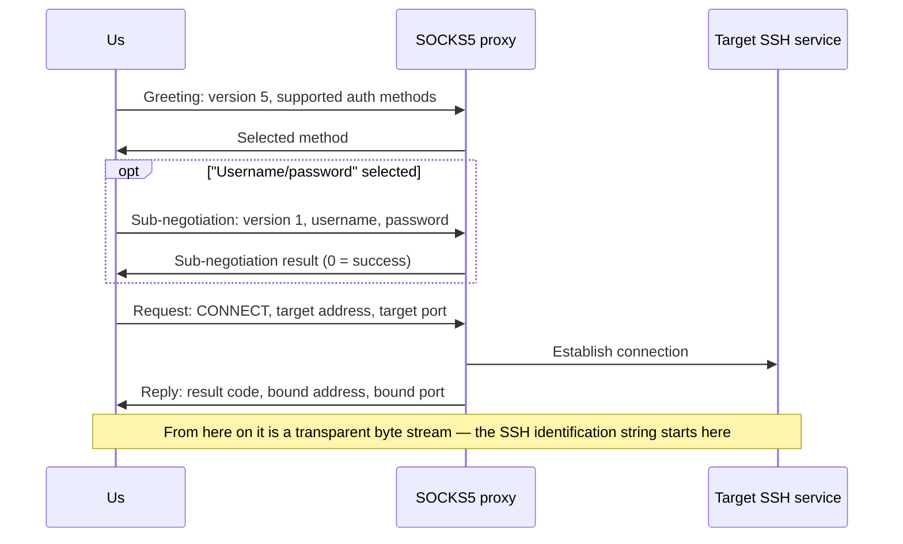
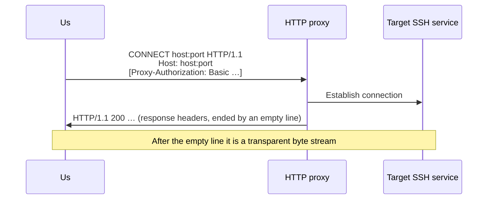
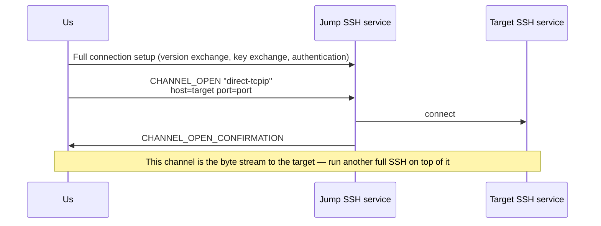

# 09 · Dialing: Proxies, Jump Hosts and Proxy Commands

> Normative basis: RFC 1928 (SOCKS Protocol Version 5); RFC 1929 (Username/Password Authentication for SOCKS V5);
> RFC 9110 §9.3.6 (the `CONNECT` method), §11.7 (`Proxy-Authenticate` / `Proxy-Authorization`),
> §15.5.8 (407); RFC 7617 (the Basic authentication scheme); RFC 4254 §7.2 (`direct-tcpip`);
> OpenSSH `ssh_config(5)`'s `ProxyJump` and `ProxyCommand` (**behavior descriptions only**).
>
> Implementation: `Transport/` (L1). Architectural position: see `design/architecture.md` §5.1.
>
> 中文：[`../../../zh/ssh/spec/09-dialing.md`](../../../zh/ssh/spec/09-dialing.md)

---

## 1. Why this layer gets its own chapter

The dialing layer answers one question: **give me a readable and writable byte stream whose other end is the target SSH service.**
How it gets there — direct, via SOCKS5, via an HTTP proxy, via another SSH host, via an external program —
is the dialer's business; the version exchange and key exchange above it **cannot tell the difference**.

〔Decision〕All ways of getting there are implementations of the same interface, **and they can be nested within each other**:
"reach C via jump host B, where jump host B can only be reached through a SOCKS5 proxy" is a composition of three dialers,
not one dialer with three boolean switches. Nesting works uniformly as follows:

> Every proxy-type dialer has an inner dialer for "**how to reach the proxy itself**", which defaults to direct TCP.

---

## 2. General conventions

### 2.1 Host names are not resolved locally

〔Decision〕Except for the one dialer responsible for establishing the TCP connection, **no dialer may resolve the target host name locally**.
The host name is passed as-is to the proxy / jump host, which resolves it:

- Internal domain names simply cannot be resolved locally;
- Local resolution leaks "which host was accessed" to the local DNS, defeating the purpose of using a proxy.

If the target is an IP literal, send it as an IP; otherwise send it as a domain name.

### 2.2 Failures must say which hop

〔Decision〕A dialing failure throws `SshConnectException`, and `Hops` gives the result of **every hop** on the path
(`spec/08-failures.md` §5.2):

| Field | Meaning |
| --- | --- |
| `Kind` | `Tcp` / `Socks5` / `HttpConnect` / `SshJump` / `Custom` |
| `Target` | The endpoint this hop is trying to reach (`host:port`) |
| `Succeeded` | Whether this hop succeeded |
| `Elapsed` | Time spent on this hop |
| `Detail` | Additional explanation on failure (the proxy's own words, error codes) |

The order is **nearest to farthest**: item 0 is the hop closest to the local machine.
When an inner dialer fails, the outer dialer **preserves** the hop information given by the inner one **as-is**, and only appends its own after it (if it got as far as itself).

Reason code conventions:

| Situation | `Reason` |
| --- | --- |
| The proxy itself cannot be reached | Same as a direct connection (`DnsFailure` / `TcpRefused` / `TcpTimeout` / `TcpUnreachable`) |
| The proxy refuses to forward to the target | `ProxyRefused` |
| The proxy requires authentication and we have no credentials, or the credentials are rejected | `ProxyAuthRequired` |
| What the proxy says does not conform to the protocol | `ProxyRefused`, with `Detail` stating what was received |

### 2.3 No over-reading when reading handshake replies

〔Decision〕Immediately after the proxy handshake, the stream carries the SSH server's identification string —
the server speaks first as soon as it is connected, and **its first byte may arrive in the same TCP segment as the proxy's reply**.
Therefore:

- Replies of determinate length (SOCKS5) are read by that exact length, not one byte more;
- Replies of indeterminate length (HTTP response headers) may over-read in one go, but the over-read bytes **must** be handed back to the upper layer as-is
  (the returned stream first yields these bytes, then continues reading from the underlying stream).

### 2.4 Timeouts and cancellation

- Establishing each hop is bound by the caller's cancellation token and the connect timeout (the connect timeout covers the whole path).
- During the host key decision, the connect timer is **paused** (`03-key-exchange.md` §5.3);
  a decision inside a jump hop likewise pauses the **outer** timer — the entire connection setup of that inner hop happens within the outer dialing phase.

---

## 3. SOCKS5 (RFC 1928 / RFC 1929)

### 3.1 Greeting

| Field | Length | Value |
| --- | :-: | --- |
| Version | 1 | `5` |
| Number of methods | 1 | 1 or 2 |
| Method list | N | Always includes `0` (no authentication); adds `2` (username/password) when credentials are configured |

The reply is two bytes: version (must be `5`) and the selected method.
Selecting `0xFF` means "no acceptable methods": judged `ProxyAuthRequired` if we have no credentials configured, `ProxyRefused` if we do.
Selecting a method we did not offer is a protocol error.

### 3.2 Username/password sub-negotiation (RFC 1929)

| Field | Length | Value |
| --- | :-: | --- |
| Sub-negotiation version | 1 | `1` |
| Username length | 1 | 1–255 |
| Username | N | UTF-8 |
| Password length | 1 | 1–255 |
| Password | N | UTF-8 |

〔Decision〕When the encoded username or password exceeds 255 bytes, **reject locally**; do not truncate.
The reply is two bytes: sub-negotiation version and status; a non-zero status is judged `ProxyAuthRequired` (credentials rejected).

### 3.3 Connect request

| Field | Length | Value |
| --- | :-: | --- |
| Version | 1 | `5` |
| Command | 1 | `1` (CONNECT) |
| Reserved | 1 | `0` |
| Address type | 1 | `1` IPv4 / `3` domain name / `4` IPv6 |
| Target address | 4 / 1+N / 16 | The domain-name form is a one-byte length followed by the name (max 255) |
| Target port | 2 | Big-endian |

### 3.4 Reply

Version, result code, reserved, address type, bound address, bound port — same layout as the request.
The length of the bound address is determined by the address type (the domain-name form reads a one-byte length first). **The whole reply must be read**,
otherwise the remaining bytes would be taken as the SSH identification string.

| Result code | Meaning (written to `Detail`) |
| :-: | --- |
| 0 | Succeeded |
| 1 | General proxy server failure |
| 2 | Not allowed by ruleset |
| 3 | Network unreachable |
| 4 | Host unreachable |
| 5 | Connection refused by target |
| 6 | TTL expired |
| 7 | Command not supported |
| 8 | Address type not supported |

Any non-zero code is judged `ProxyRefused`.

---

## 4. HTTP CONNECT (RFC 9110 §9.3.6)

### 4.1 Request

- Request line: `CONNECT` space target space `HTTP/1.1`, where the target is `host:port` (IPv6 literals in square brackets).
- A `Host` header is mandatory, with the same value as the request target.
- When credentials are configured, send `Proxy-Authorization: Basic <base64(username:password)>` (RFC 7617, UTF-8).
  〔Decision〕**Send it on the first request**, rather than waiting for a 407 and retrying — a retry means the proxy may close this connection,
  and an extra round trip on the connection setup path is pure latency.
- All line endings are `CRLF`; the request ends with an empty line.

### 4.2 Response

- Read up to the first empty line (`CRLF CRLF`); response headers are capped at 16 KiB, and exceeding that is judged `ProxyRefused`.
- A 2xx status code is success; over-read bytes are handed back to the upper layer (§2.3).
- 407: judged `ProxyAuthRequired` if no credentials are configured; if they are configured (meaning they were rejected) it is likewise judged `ProxyAuthRequired`,
  with `Detail` carrying the value of the `Proxy-Authenticate` header.
- Other status codes are judged `ProxyRefused`, with `Detail` carrying the status line.
- 〔Decision〕When the target port is 22 and the proxy replies 403 / 405 / 501, **give a suggestion directly** in the message:
  "this proxy may only allow 80/443 — please use SOCKS5 instead, or have the server listen on 443".
  This is a frequent failure that users have no way of guessing (`08-failures.md` §5.2).

### 4.3 What we do not do

- No NTLM / Negotiate / Digest. They all require multiple round trips and are rare in SSH dialing scenarios;
  users who need them implement their own dialer.
- Redirects are not followed.

---

## 5. Jump hosts (`ProxyJump`, RFC 4254 §7.2)

- The jump host is itself a full SSH connection, with its own credentials, host key policy and its own dialer
  (so a jump host can in turn be reached via a proxy or another jump host — nesting).
- The target address is resolved **from the jump host's point of view** (§2.1).
- The originator address of `direct-tcpip` is filled with `127.0.0.1`, port `0`: we have no real originating socket,
  and fabricating a realistic-looking address would only mislead the server's logs.
- A rejected channel is judged `ProxyRefused`, with `Detail` carrying the reason code and description from `CHANNEL_OPEN_FAILURE`;
  a failure to connect to the jump host is thrown as-is, but `Hops` marks the failure as being at the jump hop.
- 〔Decision〕The returned stream **owns** the jump connection: when the stream is disposed, first close the channel, then dispose the jump connection.
  The jump connection is not shared with other dials — sharing would make one connection's lifetime depend on another's.
- When the jump connection drops, the stream's read side ends and writes fail — the target connection drops with it, which is expected.

### 5.1 A channel as a byte stream

When treating an SSH channel as a bidirectional byte stream:

- Read: the channel's stdout; reaching the end means the peer sent EOF or closed the channel.
- Write: writes go to the channel's stdin; subject to the peer's window (writes wait for window, no data is dropped).
- Dispose: send EOF, close the channel.
- Seeking and length are not supported.

---

## 6. Proxy commands (`ProxyCommand`)

- Start an external program; **its standard input and output are the byte stream to the target**; standard error is collected
  and written into the exception message on failure (many proxy programs explain the reason only on stderr).
- Substitutions in the command line (`ssh_config(5)`): `%h` target host, `%p` port, `%r` username, `%n` original host name, `%%` a percent sign.
- The command is interpreted by the system shell: `/bin/sh -c` on Unix-like systems, `cmd.exe /c` on Windows.
- The program exits before the handshake completes: judged `ProxyRefused`, with `Detail` carrying the exit code and the tail of stderr.
- When the stream is disposed, close the program's standard input to give it a chance to exit gracefully; if it still has not exited after a short wait, terminate the whole process tree.
- 〔Limitation, stated honestly〕On Windows, a child process's standard input and output are anonymous pipes, and anonymous pipes do not support overlapped IO:
  asynchronous reads and writes on them are completed by the runtime in a blocking manner on thread-pool threads. This is a platform limitation, not a choice of this library;
  Unix-like systems do not have this problem. For scenarios that need pure async, use the SOCKS5 / HTTP / jump-host dialers.

---

## 7. From `ssh_config` to connection parameters

The result of parsing `ssh_config` must be able to **turn directly into** connection parameters; otherwise parsing is just decoration. Mapping rules:

| `ssh_config` item | Connection parameter |
| --- | --- |
| `HostName` / `Port` / `User` | Target endpoint and username (when `User` is absent, use the default username given by the caller) |
| `IdentityFile` | Read the private keys one by one (`~` expanded; skipped if the file does not exist); for encrypted private keys, ask the caller for the passphrase, and skip if none is obtained |
| `IdentitiesOnly` | No extra action needed: this library never pulls keys from the agent automatically; which keys are used is determined entirely by the credential list. Keys from the configuration are placed **before** the caller's template credentials (consistent with `ssh` trying `IdentityFile` first) |
| `Compression yes` | Enable `zlib@openssh.com` in the algorithm list |
| `ServerAliveInterval` / `ServerAliveCountMax` | Keep-alive policy |
| `ConnectTimeout` | Connect timeout |
| `UserKnownHostsFile` | The host key policy uses that file instead (`none` / `/dev/null` means no persistence) |
| `StrictHostKeyChecking` | `yes` → reject unknown hosts; `accept-new` / `no` → accept and write; `ask` / absent → keep the template policy |
| `ProxyJump` | Comma-separated jump chain; each jump host is **resolved against the same configuration** (with its own `User`, `Port`, `IdentityFile`); `none` means not used |
| `ProxyCommand` | Proxy command dialer; `none` means not used |
| `ForwardAgent` / `ForwardX11` / `ForwardX11Trusted` | Session parameters (agent and X11 forwarding for shell / exec), not connection parameters |

〔Decision〕When `ProxyJump` and `ProxyCommand` both appear, `ProxyJump` takes precedence.
(The rule in `ssh_config(5)` is "the first one to appear wins", but this library's parse result does not preserve the order of appearance across keys;
picking a deterministic one is better than picking one that depends on ordering details.)

〔Decision〕Jump chain resolution has a depth limit (8) and detects cycles: a configuration where `a`'s jump host is `b` and `b`'s jump host is `a`
should produce an error, not infinite recursion.
