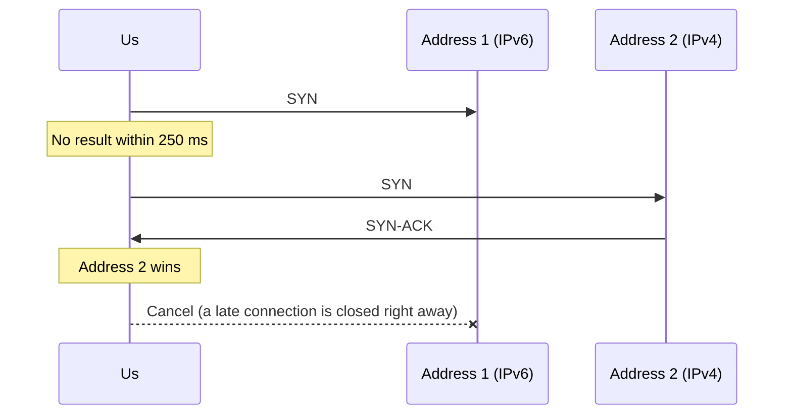
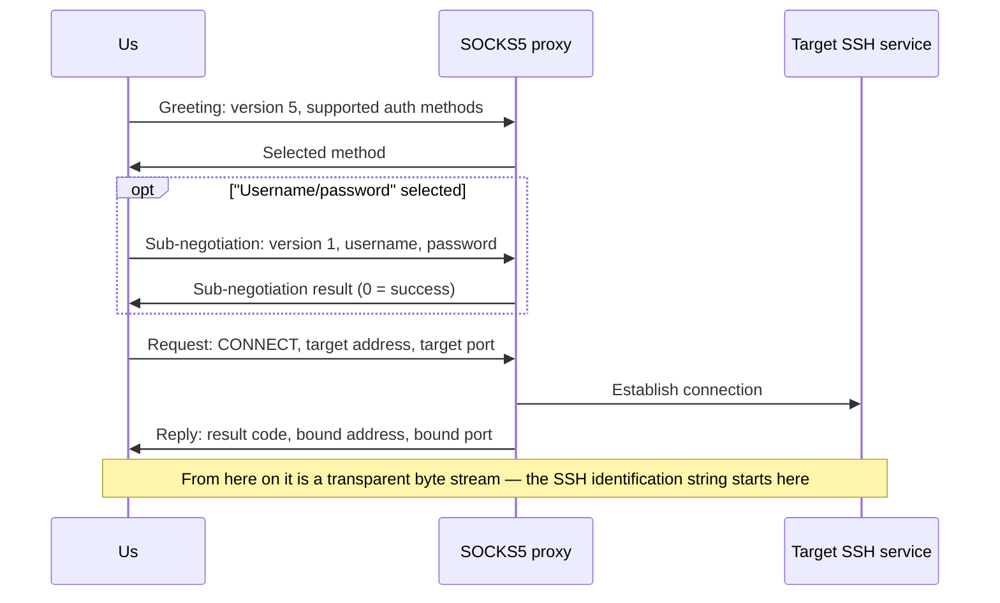
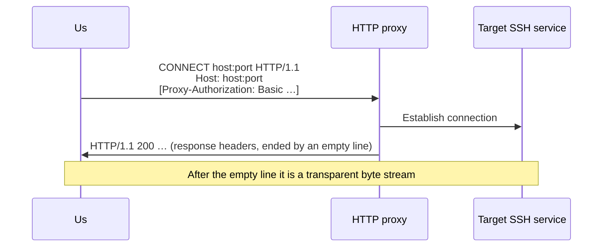
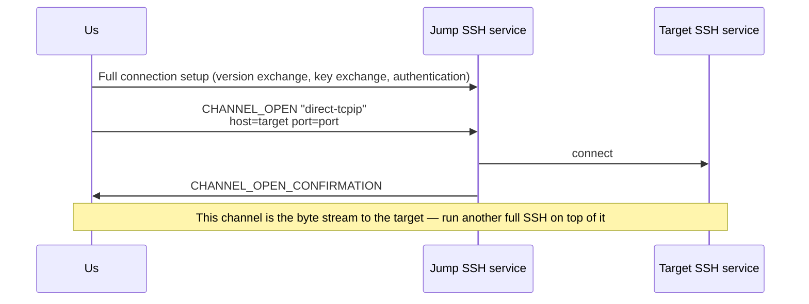

# 09 · Dialing: Proxies, Jump Hosts and Proxy Commands

> Normative basis: RFC 1928 (SOCKS Protocol Version 5); RFC 1929 (Username/Password Authentication for SOCKS V5);
> RFC 9110 §9.3.6 (the `CONNECT` method), §11.7 (`Proxy-Authenticate` / `Proxy-Authorization`),
> §15.5.8 (407); RFC 7617 (the Basic authentication scheme); RFC 4254 §7.2 (`direct-tcpip`);
> RFC 8305 (Happy Eyeballs Version 2);
> OpenSSH `ssh_config(5)`'s `ProxyJump`, `ProxyCommand`, `Include`, `Match` and others (**behavior descriptions only**).
>
> Implementation: `Transport/` (L1). Architectural position: see `design/architecture.md` §5.1.
>
> 中文：[`../../../zh/ssh/spec/09-dialing.md`](../../../zh/ssh/spec/09-dialing.md)

---

## 1. Why this layer gets its own chapter

The dialing layer answers one question: **give me a readable and writable byte stream whose other end is the target SSH service.**
How it gets there — direct, via SOCKS5, via an HTTP proxy, via another SSH host, via an external program —
is the dialer's business; the version exchange and key exchange above it **cannot tell the difference**.

〔Decision〕All ways of getting there are implementations of the same interface, **and they can be nested within each other**:
"reach C via jump host B, where jump host B can only be reached through a SOCKS5 proxy" is a composition of three dialers,
not one dialer with three boolean switches. Nesting works uniformly as follows:

> Every proxy-type dialer has an inner dialer for "**how to reach the proxy itself**", which defaults to direct TCP.

---

## 2. General conventions

### 2.1 Host names are not resolved locally

〔Decision〕Except for the one dialer responsible for establishing the TCP connection, **no dialer may resolve the target host name locally**.
The host name is passed as-is to the proxy / jump host, which resolves it:

- Internal domain names simply cannot be resolved locally;
- Local resolution leaks "which host was accessed" to the local DNS, defeating the purpose of using a proxy.

If the target is an IP literal, send it as an IP; otherwise send it as a domain name.

### 2.2 Failures must say which hop

〔Decision〕A dialing failure throws `SshConnectException`, and `Hops` gives the result of **every hop** on the path
(`spec/08-failures.md` §5.2):

| Field | Meaning |
| --- | --- |
| `Kind` | `Tcp` / `Socks5` / `HttpConnect` / `SshJump` / `Custom` |
| `Target` | The endpoint this hop is trying to reach (`host:port`) |
| `Succeeded` | Whether this hop succeeded |
| `Elapsed` | Time spent on this hop |
| `Detail` | Additional explanation on failure (the proxy's own words, error codes) |

The order is **nearest to farthest**: item 0 is the hop closest to the local machine.
When an inner dialer fails, the outer dialer **preserves** the hop information given by the inner one **as-is**, and only appends its own after it (if it got as far as itself).

Reason code conventions:

| Situation | `Reason` |
| --- | --- |
| The proxy itself cannot be reached | Same as a direct connection (`DnsFailure` / `TcpRefused` / `TcpTimeout` / `TcpUnreachable`) |
| The proxy refuses to forward to the target | `ProxyRefused` |
| The proxy requires authentication and we have no credentials, or the credentials are rejected | `ProxyAuthRequired` |
| What the proxy says does not conform to the protocol | `ProxyRefused`, with `Detail` stating what was received |

### 2.3 No over-reading when reading handshake replies

〔Decision〕Immediately after the proxy handshake, the stream carries the SSH server's identification string —
the server speaks first as soon as it is connected, and **its first byte may arrive in the same TCP segment as the proxy's reply**.
Therefore:

- Replies of determinate length (SOCKS5) are read by that exact length, not one byte more;
- Replies of indeterminate length (HTTP response headers) may over-read in one go, but the over-read bytes **must** be handed back to the upper layer as-is
  (the returned stream first yields these bytes, then continues reading from the underlying stream).

### 2.4 Timeouts and cancellation

- The connect timeout (`SshConnectionOptions.ConnectTimeout`, 30 seconds by default) is **one** timer covering dialing (the whole path:
  direct TCP, proxy handshakes, every jump host), the version exchange and the key exchange; authentication has its own (`AuthenticationTimeout`, 2 minutes by default).
  Every hop is also bound by the caller's cancellation token.
- Dialers set no limit of their own by default: `TcpTransportDialer.ConnectTimeout` defaults to infinite, and the TCP step is governed by the connect timeout;
  if one is set explicitly, whichever fires first wins. 〔Decision〕The TCP step used to be fixed at 30 seconds — users who set a longer connect timeout
  (satellite links, transoceanic jump hosts) still had TCP cut off at 30 seconds, and that 30 seconds appeared in no configuration anywhere.
- During the host key decision, the connect timer is **paused** (`03-key-exchange.md` §5.3);
  a decision inside a jump hop likewise pauses the **outer** timer — the entire connection setup of that inner hop happens within the outer dialing phase.
- 〔Decision〕**Authentication on a jump host pauses the outer timer too.** Jump host authentication is often waiting for a person (typing a password, reading a one-time code off a phone);
  it runs under the jump host's own authentication timer. Counted against the outer connect timeout, a user spending twenty seconds on a one-time code for the jump host
  would long since have run out a fifteen-second outer connect timeout. The outer connect timeout is designed for network round trips; time spent waiting for a person does not belong in it.
- When the outer timer expires inside a jump hop, the failure is `Timeout` (`Phase` `Dialing`), the message says it timed out while connecting via which jump host,
  or while the jump host was forwarding to the target, and `Hops` marks that hop. 〔Decision〕It is not reported as "TCP connect timed out": the outer connection is indeed still "dialing",
  but what is stuck is the jump host's handshake or forwarding, not the local TCP. If the caller cancelled, that propagates as cancellation, not as a timeout —
  the inner hop sees the same cancelled token, so only the timer itself remembering "did I expire" can tell the two apart.

### 2.5 Direct TCP: staggered concurrent attempts for multiple addresses (RFC 8305)

`TcpTransportDialer` is the only dialer that resolves host names locally (§2.1). If the target is an IP literal it connects directly;
otherwise it first resolves the name and gets **all** addresses (it does not do the RFC 8305 §3 "use whichever of A and AAAA answers first"), then connects by these rules:

1. **Interleave by address family**: start with the family of the first address in the resolver's result (the system resolver has already sorted by the address selection rules — usually IPv6),
   then alternate one of this family, one of the other (RFC 8305 §4).
2. **Staggered starts**: connect to the first; whenever `AttemptDelay` (250 ms, the value recommended by RFC 8305 §5) passes without a result, start the next;
   if an attempt in progress **fails, start the next immediately** without waiting out the delay.
3. **The first to connect wins**: all other attempts still in progress are cancelled; any that happened to connect just before being cancelled are closed right away — an unwanted connection must not linger.
4. If all fail, the **last** failure is reported, classified as `DnsFailure` / `TcpRefused` / `TcpTimeout` / `TcpUnreachable` (`08-failures.md` §3),
   with a single `Tcp` entry in `Hops`.

〔Decision〕**Addresses are not tried one by one.** On networks that "advertise IPv6 but IPv6 doesn't work" (not rare), trying sequentially means the first IPv6 address
has to wait out the system's SYN timeout (about 21 seconds on Windows) before IPv4 gets a turn, by which time most of the connect timeout is gone.
Staggering attempts 250 ms apart costs only the occasional extra SYN.

Every connection disables Nagle (on an interactive shell that is about 40 ms of delay per keystroke) and enables TCP keep-alive when requested.

---

## 3. SOCKS5 (RFC 1928 / RFC 1929)

### 3.1 Greeting

| Field | Length | Value |
| --- | :-: | --- |
| Version | 1 | `5` |
| Number of methods | 1 | 1 or 2 |
| Method list | N | Always includes `0` (no authentication); adds `2` (username/password) when credentials are configured |

The reply is two bytes: version (must be `5`) and the selected method.
Selecting `0xFF` means "no acceptable methods": judged `ProxyAuthRequired` if we have no credentials configured, `ProxyRefused` if we do.
Selecting a method we did not offer is a protocol error.

### 3.2 Username/password sub-negotiation (RFC 1929)

| Field | Length | Value |
| --- | :-: | --- |
| Sub-negotiation version | 1 | `1` |
| Username length | 1 | 1–255 |
| Username | N | UTF-8 |
| Password length | 1 | 1–255 |
| Password | N | UTF-8 |

〔Decision〕When the encoded username or password exceeds 255 bytes, **reject locally**; do not truncate.
The reply is two bytes: sub-negotiation version and status; a non-zero status is judged `ProxyAuthRequired` (credentials rejected).

### 3.3 Connect request

| Field | Length | Value |
| --- | :-: | --- |
| Version | 1 | `5` |
| Command | 1 | `1` (CONNECT) |
| Reserved | 1 | `0` |
| Address type | 1 | `1` IPv4 / `3` domain name / `4` IPv6 |
| Target address | 4 / 1+N / 16 | The domain-name form is a one-byte length followed by the name (max 255) |
| Target port | 2 | Big-endian |

### 3.4 Reply

Version, result code, reserved, address type, bound address, bound port — same layout as the request.
The length of the bound address is determined by the address type (the domain-name form reads a one-byte length first). **The whole reply must be read**,
otherwise the remaining bytes would be taken as the SSH identification string.

| Result code | Meaning (written to `Detail`) |
| :-: | --- |
| 0 | Succeeded |
| 1 | General proxy server failure |
| 2 | Not allowed by ruleset |
| 3 | Network unreachable |
| 4 | Host unreachable |
| 5 | Connection refused by target |
| 6 | TTL expired |
| 7 | Command not supported |
| 8 | Address type not supported |

Any non-zero code is judged `ProxyRefused`.

---

## 4. HTTP CONNECT (RFC 9110 §9.3.6)

### 4.1 Request

- Request line: `CONNECT` space target space `HTTP/1.1`, where the target is `host:port` (IPv6 literals in square brackets).
- A `Host` header is mandatory, with the same value as the request target.
- When credentials are configured, send `Proxy-Authorization: Basic <base64(username:password)>` (RFC 7617, UTF-8).
  〔Decision〕**Send it on the first request**, rather than waiting for a 407 and retrying — a retry means the proxy may close this connection,
  and an extra round trip on the connection setup path is pure latency.
- All line endings are `CRLF`; the request ends with an empty line.

### 4.2 Response

- Read up to the first empty line (`CRLF CRLF`); response headers are capped at 16 KiB, and exceeding that is judged `ProxyRefused`.
- A 2xx status code is success; over-read bytes are handed back to the upper layer (§2.3).
- 407: judged `ProxyAuthRequired` if no credentials are configured; if they are configured (meaning they were rejected) it is likewise judged `ProxyAuthRequired`,
  with `Detail` carrying the value of the `Proxy-Authenticate` header.
- Other status codes are judged `ProxyRefused`, with `Detail` carrying the status line.
- 〔Decision〕When the target port is 22 and the proxy replies 403 / 405 / 501, **give a suggestion directly** in the message:
  "this proxy may only allow 80/443 — please use SOCKS5 instead, or have the server listen on 443".
  This is a frequent failure that users have no way of guessing (`08-failures.md` §5.2).

### 4.3 What we do not do

- No NTLM / Negotiate / Digest. They all require multiple round trips and are rare in SSH dialing scenarios;
  users who need them implement their own dialer.
- Redirects are not followed.

---

## 5. Jump hosts (`ProxyJump`, RFC 4254 §7.2)

- The jump host is itself a full SSH connection, with its own credentials, host key policy and its own dialer
  (so a jump host can in turn be reached via a proxy or another jump host — nesting).
- The target address is resolved **from the jump host's point of view** (§2.1).
- The originator address of `direct-tcpip` is filled with `127.0.0.1`, port `0`: we have no real originating socket,
  and fabricating a realistic-looking address would only mislead the server's logs.
- A rejected channel is judged `ProxyRefused`, with `Detail` carrying the reason code and description from `CHANNEL_OPEN_FAILURE`;
  a failure to connect to the jump host is thrown as-is, but `Hops` marks the failure as being at the jump hop.
- 〔Decision〕The returned stream **owns** the jump connection: when the stream is disposed, first close the channel, then dispose the jump connection.
  The jump connection is not shared with other dials — sharing would make one connection's lifetime depend on another's.
- When the jump connection drops mid-way, reads on the stream throw the jump connection's failure (**not** end-of-stream, `05-connection.md` §4.4) and writes fail —
  the target connection drops with it, which is expected. Reads end only when the channel is closed normally (the jump host side sent EOF / CLOSE).
- Host key decisions and authentication on the jump host both pause the outer connect timer; when the outer timer expires in this hop, the failure says which hop timed out (§2.4).

### 5.1 A channel as a byte stream

When treating an SSH channel as a bidirectional byte stream:

- Read: the channel's stdout; reaching the end means the peer sent EOF or closed the channel. If the connection carrying the channel dies mid-way, the read throws that connection's failure;
  if that connection was disposed locally, the read throws `ObjectDisposedException` (`05-connection.md` §4.4).
- Write: writes go to the channel's stdin; subject to the peer's window (writes wait for window, no data is dropped).
- Flush: returns only once every byte written has been **handed to the session for sending** (has left the local stdin pipe);
  if the channel closes first with bytes still unsent, it throws `IOException` rather than pretending to succeed. Synchronous `Flush` does not wait; it is a no-op.
- Dispose: first flush stdin and send EOF (with a deadline), then close the channel. Closing directly would drop the part still waiting for window —
  and "write, then close" is the most common usage on jump hosts and tunnels.
- Seeking and length are not supported.

---

## 6. Proxy commands (`ProxyCommand`)

- Start an external program; **its standard input and output are the byte stream to the target**; standard error is collected
  and written into the exception message on failure (many proxy programs explain the reason only on stderr).
- Substitutions in the command line (`ssh_config(5)`): `%h` target host, `%p` port, `%r` username, `%n` original host name, `%%` a percent sign.
- The command is interpreted by the system shell: `/bin/sh -c` on Unix-like systems, `cmd.exe /c` on Windows.
- 〔Decision〕**Check the values before substituting `%h` / `%n` / `%r`**: host names may only contain letters, digits and `.` `-` `_` `:` (IPv6),
  user names only letters, digits and `.` `-` `_` `@`; if anything else is present (shell metacharacters, `%`, whitespace, control characters), nothing is substituted and dialing fails with `ProxyRefused`.
  Host and user names often don't come from whoever wrote the config (an `ssh://` link, an imported session, a quick-connect box); substituted verbatim into a shell command line,
  `x;touch /tmp/pwn`, `x&calc` or `%VAR%` becomes a command that gets executed (the CVE-2023-51385 class).
  Values are rejected rather than escaped: the two shells have different quoting rules, and `cmd`'s are especially hard to get right; legitimate names only need these characters anyway.
- The program exits before the handshake completes: judged `ProxyRefused`, with `Detail` carrying the exit code and the tail of stderr.
- When the stream is disposed, close the program's standard input to give it a chance to exit gracefully; if it still has not exited after a short wait, terminate the whole process tree.
- 〔Limitation, stated honestly〕On Windows, a child process's standard input and output are anonymous pipes, and anonymous pipes do not support overlapped IO:
  asynchronous reads and writes on them are completed by the runtime in a blocking manner on thread-pool threads. This is a platform limitation, not a choice of this library;
  Unix-like systems do not have this problem. For scenarios that need pure async, use the SOCKS5 / HTTP / jump-host dialers.

---

## 7. From `ssh_config` to connection parameters

The result of parsing `ssh_config` must be able to **turn directly into** connection parameters; otherwise parsing is just decoration. Mapping rules:

| `ssh_config` item | Connection parameter |
| --- | --- |
| `HostName` / `Port` / `User` | Target endpoint and username (when `User` is absent, use the default username given by the caller) |
| `IdentityFile` | Read the private keys one by one (`~` and `%d` `%u` `%h` `%r` `%%` expanded; silently skipped if the file does not exist); for encrypted private keys, ask the caller for the passphrase (`PassphraseProvider`), and skip if none is obtained. **A key that cannot be read skips only itself** (unrecognized format, wrong passphrase, no permission to read), and the caller is told the path and the reason via `SshConfigConnectOptions.IdentityFileSkipped`. Within one resolution each file (by full path) is read once, and jump hosts and the target share the same decrypted signer — one KDF run, one passphrase prompt; nothing is cached across calls |
| `IdentitiesOnly` | No extra action needed: this library never pulls keys from the agent automatically; which keys are used is determined entirely by the credential list. Keys from the configuration are placed **before** the caller's template credentials (consistent with `ssh` trying `IdentityFile` first) |
| `Compression yes` | Enable `zlib@openssh.com` in the algorithm list |
| `ServerAliveInterval` / `ServerAliveCountMax` | Keep-alive policy |
| `ConnectTimeout` | Connect timeout (`SshConnectionOptions.ConnectTimeout`, §2.4); each jump host uses its own host's configuration |
| `UserKnownHostsFile` | The host key policy uses that file instead (only the first path if several are given); `none` / `/dev/null` → **no** `known_hosts` is read or written (`KnownHostsPolicy.WithoutFile`: every host counts as unseen, and accepting it records nothing). When `StrictHostKeyChecking` is `ask` / absent and the caller supplied a policy, this item has no effect (see the next row) |
| `StrictHostKeyChecking` | `yes` → reject unseen hosts; `accept-new` / `no` / `off` → accept and record (a **changed** key is still rejected); `ask` / absent → if the caller supplied `SshConfigConnectOptions.HostKeyPolicy`, use the caller's, even if the configuration sets `UserKnownHostsFile`; otherwise, with `UserKnownHostsFile` set, use that file and ask `AskUnknownHost` about unseen hosts (reject if no ask callback is given), and with neither set, use the default `known_hosts` and reject unseen hosts |
| `ProxyJump` | Comma-separated jump chain; each jump host is **resolved against the same configuration** (with its own `User`, `Port`, `IdentityFile`); `none` means not used. Which of the caller's credentials a jump host gets: see below |
| `ProxyCommand` | Proxy command dialer; `none` means not used |
| `ForwardAgent` / `ForwardX11` / `ForwardX11Trusted` | Session parameters (agent and X11 forwarding for shell / exec), not connection parameters |
| `ForwardX11Timeout` | Validity period of the X11 forwarding turned on by `ForwardX11` (`07-forwarding.md` §7.5.7). `ssh_config` time format: a number followed by `s` / `m` / `h` / `d` / `w`, no unit means seconds, several parts add up (`1h30m`); `0` means no expiry. An invalid value is ignored and the default of 20 minutes applies |

〔Decision〕When `ProxyJump` and `ProxyCommand` both appear, `ProxyJump` takes precedence.
(The rule in `ssh_config(5)` is "the first one to appear wins", but this library's parse result does not preserve the order of appearance across keys;
picking a deterministic one is better than picking one that depends on ordering details.)

〔Decision〕Jump chain resolution has a depth limit (8) and detects cycles: a configuration where `a`'s jump host is `b` and `b`'s jump host is `a`
should produce an error, not infinite recursion.

〔Decision〕**The caller's password and keyboard-interactive credentials go only to the final target.** The caller's credentials (`SshConfigConnectOptions.Credentials`) come after `IdentityFile`;
jump hosts get only the public-key credentials among them (keys in the agent, keys in memory), and a jump host's own `IdentityFile` is still read from the configuration.
The caller's password is meant for the target: it used to be handed to every hop, so the target's password was sent to the jump host —
where the jump host's administrator (or whoever has compromised the jump host) could take it. Presenting a public key reveals no secret, and logging in to jump hosts through the agent is the most common usage.

〔Decision〕**With `StrictHostKeyChecking` `ask` or absent, a host key policy supplied by the caller takes precedence over `UserKnownHostsFile` in the configuration.**
Both of those are "interactive": the caller brings its own trust store and prompt UI, and should not be replaced by a separately built policy just because the configuration names a file — which is what used to happen.
`yes` / `no` / `accept-new` are behaviors the configuration explicitly asks for, and are followed as configured.

〔Decision〕**`UserKnownHostsFile none` / `/dev/null` means "no `known_hosts`", not a file path.** They used to be treated as paths:
on Windows that meant reading and writing a file named `none` in the current directory.

### 7.1 Evaluating `Include` and `Match`

`Include` is expanded only in `SshConfigFile.LoadAsync` (`Parse` is pure text parsing and does not touch the file system).
One line may list several paths; `~` is expanded; relative paths are resolved against the directory of **the file containing the `Include`**; the last component may contain `*` / `?` wildcards,
and wildcard matches are sorted ordinally — directory enumeration order differs between file systems, and under "first value wins" an undetermined order means an undetermined result.

- 〔Decision〕**Expanded in place, as a conditional include.** The included file's contents land at the position of the `Include` line:
  - settings in the included file before its first `Host` / `Match` land in the block that contains the `Include`;
  - the included file's own `Host` / `Match` blocks are **scoped under the enclosing block's condition**: when the `Include` is inside a `Host` / `Match` block,
    a block from the included file applies only if its own condition **and** every enclosing condition hold (nested `Include`s stack level by level); when the `Include` is outside any block, they are ordinary blocks;
  - once the included file ends, parsing returns to the block that contains the `Include`: settings after the `Include` still belong to that block.

  Reason: `ssh_config` is "first value wins", so where the included contents land decides the result. The whole file used to be parsed first and the included contents appended afterwards:
  a later `Host *` in the main file then beat the host-specific settings in the included file. After switching to in-place expansion two things were still wrong: as soon as the included file opened a new block, the enclosing condition was lost
  (those blocks applied to every host unconditionally); and settings after the `Include` ended up in the included file's last block.
- **Cycle detection looks only at the current include chain** (comparing normalized full paths): including the same file from two `Host` blocks is a normal pattern, not a cycle.
  The depth limit is 16: anything deeper is not expanded, and no error is raised — the rest of the configuration remains usable.

Each `Match` condition has three outcomes: satisfied, not satisfied, and **cannot be evaluated**. It cannot be evaluated when:

| Condition | When it cannot be evaluated |
| --- | --- |
| An unrecognized condition | Always |
| `canonical` / `final` | Always — this library does no host name canonicalization and has no "final re-parse" pass |
| `exec` | When the caller supplied no `SshConfigMatchContext.ExecEvaluator` (by default no command is ever run) |
| `user` / `localuser` | When the context has no remote user name / local user name |

- 〔Decision〕**If any condition cannot be evaluated, the whole block does not apply — negated or not.** "Cannot be evaluated" used to count as "not satisfied", and a leading `!` turned it into "satisfied":
  `Match !exec "…"` applied to every host when commands were not run, which is exactly the case the configuration's author wanted to exclude. Cannot be evaluated means cannot be evaluated; a `!` does not make it true.
- Conditions are ANDed; a `Match` with nothing after it does not apply.
- **`Match host` compares against the host name after `HostName` rewriting** (if an earlier block set `HostName`, that is used, with `%h` replaced by the name the user typed);
  `Match originalhost` and `Host` blocks compare against the name the user typed. `Match host` used to compare against the typed alias every time, so blocks written for the real host name never matched.
- `CreateConnectionOptionsAsync` knows only the host name when evaluating, so blocks with `user` / `localuser` / `exec` conditions do not apply on that path.
