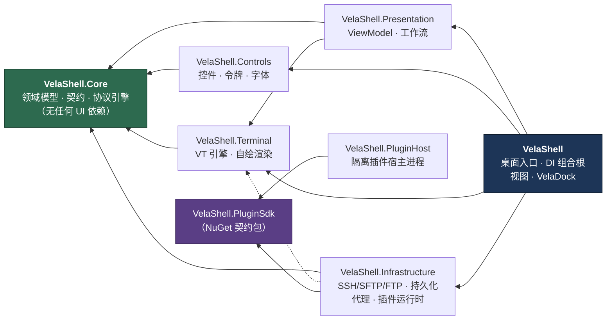
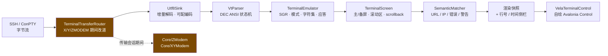
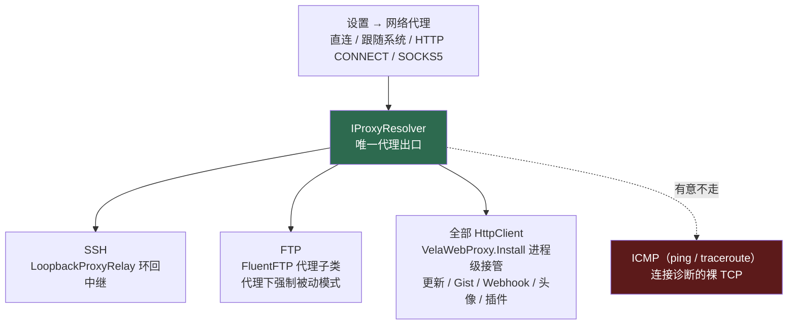
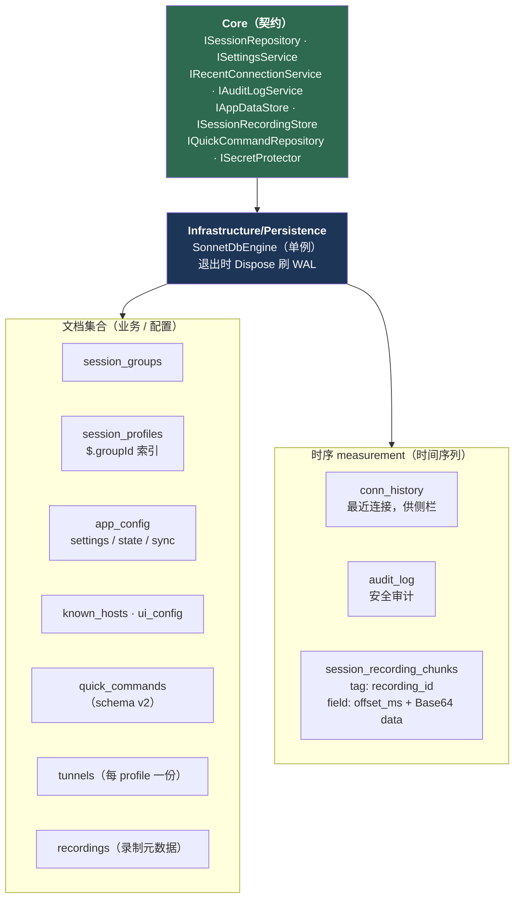
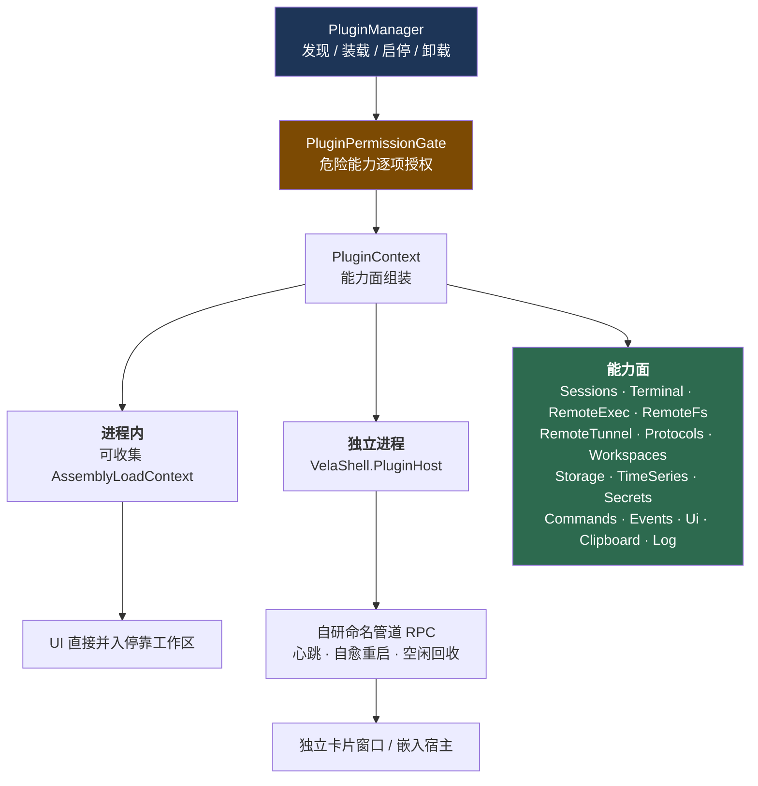
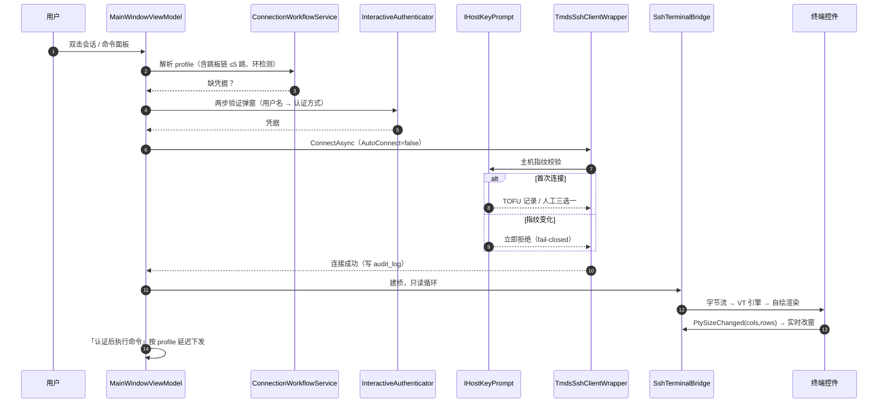

# 宿主分层架构

> 这一篇讲**宿主主程序怎么分层、依赖往哪个方向走、每一层放什么**。
> 想知道「为什么这么重构」看 [架构设计.md](架构设计.md)（工程化蓝图）；
> 想知道「插件系统为什么长这样」看 [`../plugins/`](../plugins/)。
> English: [`../../en/host/architecture.md`](../../en/host/architecture.md)

## 1. 工程划分

| 工程 | 职责 | 能依赖谁 |
| --- | --- | --- |
| `VelaShell` | 桌面入口、DI 组合根、XAML 视图、VelaDock 停靠、全局样式与行为 | 所有层 |
| `VelaShell.Presentation` | 跨层 ViewModel、连接 / 隧道工作流服务 | Core、Terminal |
| `VelaShell.Controls` | 复用控件、设计令牌、内置 Cascadia Mono 字体 | Core（仅共享 UI 契约） |
| `VelaShell.Terminal` | 自研 VT 引擎、自绘渲染控件、X/Y/ZMODEM 路由 | Core |
| `VelaShell.Core` | 领域模型、服务契约、持久化抽象、协议引擎、本地化 | **谁都不依赖** |
| `VelaShell.Infrastructure` | SSH / SFTP / FTP / 隧道实现、SonnetDB 持久化、代理、Gist 同步、插件管理与能力实现 | Core、Terminal（仅当适配器确实属于这里） |
| `VelaShell.PluginHost` | 隔离插件的宿主进程 | **只依赖 SDK 契约** |

> 桌面入口工程实际名为 `VelaShell`（程序集 `VelaShell`，`OutputType=WinExe`）。
> 老文档里的 `VelaShell.App` 是历史别名。每个工程各自带 `README.md` 说明内部结构与依赖。

箭头指向**被依赖方**。虚线是「仅当适配器确实属于这里」的弱依赖。

**这条依赖方向是硬约束**，两条推论值得写下来：

1. **Core 不依赖任何 UI 框架**，所以领域模型、协议引擎与持久化契约可以脱离 Avalonia 单测 ——
   VT 解析、ZMODEM 编解码、隧道计量这些最需要回归保护的东西全在这一层。
2. **`PluginHost` 与第一方插件只认 SDK 契约**，不依赖宿主任何内部程序集。
   这正是插件能跨进程、跨 ALC 而类型仍然同一的前提。

### 为什么单拆 `VelaShell.Controls`

- 设计稿里大量是**可复用面**而非一次性页面。
- 主题令牌、面板外壳、会话树条目、标签条、传输行、隧道卡片，应当独立于应用引导演进。
- 令牌字典与控件样式住在独立程序集，运行时换主题才好做。

## 2. 终端子系统

终端**不是一个控件，是一个子系统**。数据从 SSH 流一路到屏幕，中间每一层都可以单独替换与单测：

这样切分才撑得住：增量流式（逐字符 / 逐行）、ANSI 转义序列、URL / 错误 / 警告高亮、
选区不劫持 `Ctrl+C`、多行粘贴，以及 Linux 进度条那种整行重绘。

渲染器另带**行号 / 时间侧栏**（`Terminal/Rendering/GutterLayout` + `GutterFoldModel`）：
两列独立开关、带折叠标记与空白间隔、接快捷键切换。

**十种终端 profile**（vt52 / 100 / 102 / 220 / 320 / 340 / 420 / 520 / xterm / xterm-256color）
各自的 TERM 名与 Device Attributes 应答在 `TerminalType.cs`，默认 xterm-256color。
TERM 在**连接时**协商，因此改设置只对新连接生效 —— 活动会话热切会造成本地仿真与远端能力档不一致。

## 3. 远程传输栈

### SSH / SFTP

由 **[Tmds.Ssh](https://github.com/tmds/Tmds.Ssh)** 提供（全托管、async-first，2026-07 由 SSH.NET 迁入）。

**库类型绝不离开 `Infrastructure/Ssh/`**：`TmdsSshClientWrapper` / `TmdsSftpClientWrapper` /
`ShellStreamWrapper` 把 `SshClient` / `SftpClient` / `RemoteProcess` 适配成 `Core.Ssh` 的中立接口，
`TmdsSshInterop` 把库异常翻译成 Core 声明的 `VelaSsh*Exception` 族。

> ⚠️ **跨层识别异常一律用类型匹配**（`ex is VelaSshAuthenticationException`），
> **绝不用 `GetType().Name` 字符串** —— 换库或改名时字符串匹配不会产生任何编译错误。
> 这条是踩出来的：曾有一版按 SSH.NET 的旧类型名做字符串匹配，而实际类型早已带 `Vela` 前缀，
> 导致认证失败重试与全部分类错误提示**静默失效**；测试还因为自定义了同名假异常而长期全绿。

**跳板机**走库原生 `SshProxy` 链，由 `InfrastructureServiceCollectionExtensions.BuildProxyChain`
按已保存的跳板配置递归组装（≤5 跳、带环检测、**指纹按各跳逻辑主机分别校验**，绝不按 127.0.0.1 记录）。

### FTP / FTPS

FluentFTP 后端 + 连接池 + `RoutingRemoteFileService` 按会话分派，
上层文件浏览器 / 传输 / 限速零改动。连接池上限会**自己往下调**：
池里已有活连接却开不出新连接（`421 Too many users`）就收到当前连接数并排队复用；
传输被 `450 Transfer busy` 顶回来就收到 1 并重试该传输。取舍见
[FTP客户端可行性调研.md](FTP客户端可行性调研.md)。

### 全局网络代理

**应用级**（不是按会话）。唯一出口是 `Core/Net/IProxyResolver` —— **新功能接网络一律消费它**。

- SSH 走环回中继，是因为 Tmds.Ssh 的 `Proxy` 抽象成员是 `internal`、外部无法派生；
  于是把首个真实 TCP 出站跳（有跳板链时为最内层跳板）改写到 `127.0.0.1` 中继。
  **主机指纹按原始 `ci.Host` 键控，不受影响。**
- **代理配置不完整时抛错拒连，绝不静默直连。**
- ICMP 与连接诊断的裸 TCP **有意不走代理** —— 协议不支持 / 诊断语义即测直连链路。
- ⚠️ 别与**动态 SOCKS 转发**（`-D`）混淆，那是隧道功能，方向相反。

### 端口转发隧道

本地 `-L` / 远程 `-R` / 动态 SOCKS5 `-D`。**数据面是自研的** ——
Tmds.Ssh 把搬运做在库内部、不暴露任何计数，`TunnelInfo.BytesTransferred` 恒为 0 就是这个原因。

| 方向 | 实现 |
| --- | --- |
| 本地 `-L` | 自建 `TcpListener` + `SshClient.OpenTcpConnectionAsync`（direct-tcpip，与库内部同构，无额外跳数） |
| 动态 `-D` | 自建监听 + 自研 SOCKS5 服务端握手（`Socks5Negotiation`，RFC 1928，仅 CONNECT + 无认证） |
| 远程 `-R` | 监听端只有库能开 → 转发到本机一个临时计量监听 → 宿主接力到真实目标（多一次环回拷贝换统计） |

> ⚠️ 搬运保留**半关闭语义**（SSH 侧 `SshDataStream.WriteEof`，套接字侧 `Shutdown(Send)`）。
> 做成整条拆链的话，「发完请求就 shutdown 再等响应」的协议全部读不到东西 ——
> 有回归测试 `MeteredPortForwardTests.Relay_ForwardsHalfClose` 钉住。

详见 [隧道功能规划.md](隧道功能规划.md)。

## 4. 终端内文件传输（ZMODEM / XMODEM / YMODEM）

`rz`/`sz`、`rb`/`sb`、`rx`/`sx` 三套协议**全部自研**，跨三个工程分布，协议中立契约共享：

| 位置 | 内容 |
| --- | --- |
| `Core/FileTransfer/` | 共享契约：`IByteDuplex`、`IFileTransferSink / Source / Observer`、`FileTransferSession / Item`、CRC-16/XMODEM、ZFILE / YMODEM block-0 文件信息编解码、`TransferTrace` |
| `Core/ZModem/` | ZMODEM 引擎（帧、ZDLE 转义、CRC-16/32、`ZModemSender` / `ZModemReceiver`），**只依赖 `IByteDuplex`** |
| `Core/XYModem/` | XMODEM / XMODEM-1K / YMODEM / YMODEM-G 引擎（定长块、逐块 ACK/NAK） |
| `Terminal/FileTransfer/` | `ZModemDetector`（输出流里嗅探 ZRQINIT / ZRINIT 引导）+ `TerminalTransferRouter`（坐在桥读循环与仿真器之间，会话期间把字节交给引擎，结束复位）+ `ShellStreamByteDuplex` |
| `App/Services/FileTransfer/` | 文件源（上传）、落盘目录（下载）、进度上报 |

**ZMODEM 自动接管**：引导序列在输出流里可识别。
**XMODEM / YMODEM 只能手动发起**（命令面板 →「文件传输」）：链路上没有可识别的引导序列 ——
`sb`/`sx` 静默等接收方的 `C`，`rb`/`rx` 发一个裸 `C` 与普通终端输出无从区分，任何自动检测都会误触发。
先在远端敲命令，再点面板条目。

因为引擎只要一个 `IByteDuplex`，同一条路同时服务 SSH、本地 ConPTY 与插件提供的协议会话
（Telnet / 串口）。排障置 `VELASHELL_TRANSFER_TRACE=1`（旧名 `VELASHELL_ZMODEM_TRACE=1` 仍可用）
打印协议帧。

> ⚠️ **测试教训**：互操作期望值必须按 lrzsz `zm.c`/`zmodem.h` 与 ymodem.txt **手工构造**。
> 用自家编码器生成期望值时，编解码同时错也照样全绿 —— CRC 双重增广的 bug 当初正是这么溜进来的。

## 5. 停靠与窗口壳

### VelaDock（自研，零第三方依赖）

替换了 `Dock.Avalonia`，方案见 [dock-replacement-plan.md](dock-replacement-plan.md)。

| 层 | 内容 |
| --- | --- |
| `Docking/Model/` | **纯 INPC，可单测**：`DockWorkspace` / `DockGroup` / `DockSplit` / `DockDocument`；空的次级组自动折叠、单子分栏自动提升 |
| `Docking/Controls/` | `DockWorkspaceControl`（按树渲染 Grid + GridSplitter，**按文档缓存视图**）、`DockGroupControl`（标签条 + 溢出）、`DockTabItem`、`DockDragController` + `DockDropOverlay`（拖拽重排插入线、跨组并入、五区拖放分屏，Esc 取消） |

文档就是活动的 SSH / 本地 / SFTP 会话，每个 `TerminalTabView` 按文档缓存、跨标签切换复用。
**浮动窗口按产品决策不实现** —— 多屏需求由五区拖放分屏承担。

### 窗口壳

主窗是**自绘无边框窗口**（`WindowDecorations="None"`），**不是原生 chrome**。

> ⚠️ 这是踩出来的结论，不要试图改回去。Avalonia 12.x 的 `ExtendClientArea` /
> `WindowDecorationsElementRole` 托管装饰在 Win32 上会拦截标题栏输入（按钮点不动、窗口拖不动），
> `BorderOnly` 还丢 `WS_CAPTION`（HTCAPTION 拖动与最小 / 最大化动画失效）。整套机制不可用。
> 另一处坑：`VisualRoot as Window` **恒为 null**（视觉根是 TopLevelHost），
> 取窗口必须走逻辑树 `FindLogicalAncestorOfType<Window>()` —— 这条曾让标题栏按钮「看似无输入」数小时。

改以**自绘 + 原生行为补齐**：`Views/TitleBarView` 画 36px 标题栏（左 logo + 产品名，
右 全局功能图标组 + 自绘最小化 / 最大化 / 关闭），
空白区 `BeginMoveDrag`（原生移动循环，Win11 边缘贴靠有效）、双击切最大化、
**Win11 Snap Layouts 经 `MainWindow` 的 WndProc 钩子处理 `HTMAXBUTTON`**、
窗口四周 5px + 四角 10px 自绘缩放抓取区（最大化时关闭）。全部对话框同为自绘无边框。

文字菜单栏已整体移除，功能由命令面板（`Ctrl+P` / `Ctrl+K`）承担。

## 6. 主题与设计令牌

**12 套具名主题**（7 暗 5 亮）+ **16 套内置终端配色**，成对联动。

一套主题只需人工填 **25 个种子色**（`UiThemePalette`，在 Core）：底色阶梯、四档文字、
两档描边、强调色与语义色。其余六十多个令牌（`*Dim`、`VelaHeat1-5`、`VelaGauge*`、
`VelaTrace*`、`VelaShell*` 等）由 `ThemeTokenApplier`（宿主侧）按固定规则派生。

> **为什么要派生**：手抄会错，而且错了看不出来。`#644AC922` 这种把透明度写在末尾的错拼，
> 编译期无感、运行期是一片绿。派生出来的令牌天生自洽，加一套主题只需填种子色。

- **XAML 与 C# 里不许出现颜色字面量**，一律 `DynamicResource` 绑定令牌
  （规范见代码仓库的 [`DESIGN.md`](https://github.com/joesdu/VelaShell/blob/main/DESIGN.md)）。
- 强调色是一层独立的覆盖层，用户自定义时按亮度自动配对前景色。
- 「跟随主题」是**显式状态**而非隐式默认 —— 隐式的那一版会让「选了 Dracula 却没反应」。

## 7. 持久化

全部持久化走 **[SonnetDB](https://github.com/IoTSharp/SonnetDB)** 嵌入式多模型数据库
（`SonnetDB.Core`，经 `Tsdb.Open` 开在 `~/.velashell/sonnetdb`）。
旧 JSON（`sessions.json`、`settings.json`、`state.json`、`known_hosts.json`、
`quick-commands.json`）首次运行一次性导入后改名 `*.migrated.bak`。

**敏感字段静态加密**：密码、私钥口令、同步令牌经 `ISecretProtector`（AES-256-GCM + 本地密钥文件
`~/.velashell/secret.key`，密文前缀 `enc1:`）落盘。

> ⚠️ **仓储加密必须写副本，不可原地改传入的 profile** —— 内存里那份明文正被活动连接使用，
> 原地加密会把它改成密文，表现是「重连突然认证失败」。

**设备本地状态**（侧栏分区折叠、记住的高度）存在 `app_config/state`，**不进 Gist 同步**。

快捷命令经 `IQuickCommandRepository` 装载，它自己负责 v1 SonnetDB 与遗留 JSON 的迁移、
备份、schema 校验与 Gist 兼容的 v1/v2 快照 —— UI 与同步服务**从不直接碰** SonnetDB 文档。

### ⚠️ SonnetDB 的几处方言坑

| 坑 | 说明 |
| --- | --- |
| `ORDER BY time` | 要求 SELECT 列表**包含 time 列** |
| `DELETE FROM measurement` | 可能不受支持 —— 录制存储的保留清理以 **drop + 回写压缩**兜底，防孤儿数据块磁盘只增不减 |
| 时序 tag 值 | **不允许空串**（临时连接因此不写 `profile_id`） |
| `FieldType` 命名 | 在 `SonnetDB.Storage.Format`，是 `Int64` 不是 `Long`，写值用 `FieldValue.FromLong` |
| 锁粒度 | **刻意保留全局信号量** —— 文档集合与时序共享同一 Tsdb 实例（同一 WAL / 存储引擎），SonnetDB 未承诺内部线程安全，按集合分锁有并发损坏风险。真正的热点是设置读（每次连接、每个传输文件都读一次），已在 `SonnetDbSettingsService` 加 JSON 缓存解决 |

## 8. 插件运行时（宿主侧）

宿主侧的插件运行时在 `Infrastructure/Plugins/`。**双模装载**：

装载方式由插件清单的 `hostMode` 声明，**两种模式共用同一套 SDK 契约，插件源码零改动**。

**依赖解析**：按插件自己的 `deps.json` 解析，只有 SDK 契约与 `Avalonia*` 框架程序集
回落到宿主（`PluginAssemblyLoadContext.SharedPrefixes`），保证跨边界类型同一。

**协议与工作台扩展**：`Protocols` / `Workspaces` 两个能力让插件**注册新的连接类型** ——
Telnet / 串口 / Redis / S3 就是这么接进会话树的。插件会话经 `PluginTerminalShellStream`
适配成 `IShellStreamWrapper`，复用既有的桥 / VT 引擎 / X-Y-ZMODEM / 重连整条链路。
id 强制插件前缀，冒名等于劫持别家的连接配置；释放时撤销该插件的全部注册 ——
这是可收集 ALC 能真正回收的前提。

**分发**：`.vpx` 包（VelaShell 自有的插件包格式，容器内是 zip 载荷；
`PluginPackageExtractor` 三道闸各挡各的 —— 条目数闸挡「一百万个空文件」、
字节预算挡「一个条目吐十 GB」、路径校验挡 zip-slip）。

完整设计见 [`../plugins/`](../plugins/) 的 15 篇蓝图与[进度总览](../plugins/STATUS.md)。

## 9. 一条连接是怎么建起来的

几处不显然的约定：

- **`AutoConnect = false` 是显式设的。** Tmds.Ssh 的默认值是 `true`，会导致会话掉线后
  **每一次** SFTP 操作各自静默重连一次 —— 拖入 N 个文件就是 N 次隐式重连 + N 发异常。
  连接只由 `ConnectAsync` 发起。
- **桥的读循环不向 shell 预写 `\n`**（修过「末行提示符重复」）。
- **本地终端标签不自动重连** —— `exit` 是用户意图；远端 `exit` 同理。
- **关掉「连接中」的标签就该取消后台握手**，而不是让它连完再挂在那儿。
- 连接失败不崩溃：认证 / 网络 / 超时异常映射成可读提示写状态栏，
  `Program.cs` 另装了 `TaskScheduler.UnobservedTaskException` /
  `AppDomain.UnhandledException` 兜底。

## 10. 组合根与 DI

**所有 DI 注册集中在 [`src/VelaShell/App.axaml.cs`](https://github.com/joesdu/VelaShell/blob/main/src/VelaShell/App.axaml.cs)**，
各层通过各自的 `*ServiceCollectionExtensions` 贡献注册。服务一律接口注入，便于 Mock 与单测。

新增一个跨层服务的正确姿势：契约放 `Core`，实现放 `Infrastructure`，
注册写进该层的 `*ServiceCollectionExtensions`，**不要**在组合根里直接 `new`。

## 相关文档

| 文档 | 内容 |
| --- | --- |
| [架构设计.md](架构设计.md) | 工程化重构蓝图（为什么这么分层） |
| [dock-replacement-plan.md](dock-replacement-plan.md) | VelaDock 替换 Dock.Avalonia 的方案与集成面分析 |
| [交互与界面规格.md](交互与界面规格.md) | 交互逻辑与设计令牌 |
| [settings-audit.md](settings-audit.md) | 设置项审计台账 |
| [隧道功能规划.md](隧道功能规划.md) · [路由追踪设计.md](路由追踪设计.md) · [消息中心与资讯源.md](消息中心与资讯源.md) | 各功能的详细设计 |
| [`../plugins/02-architecture.md`](../plugins/02-architecture.md) | 插件系统的进程模型与组件划分 |
