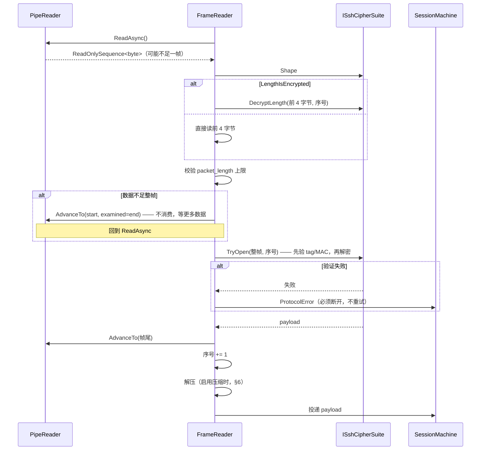
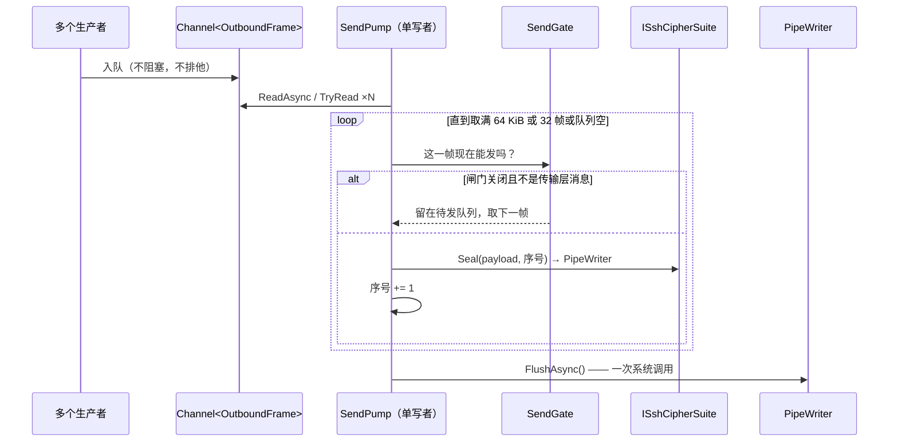

# 01 · 传输层分帧

> 规范依据：RFC 4253 §6（Binary Packet Protocol）、§6.3、§6.4；
> RFC 5647（AES-GCM）；OpenSSH `PROTOCOL.chacha20poly1305`；
> OpenSSH `PROTOCOL` 的 `*-etm@openssh.com`。
>
> 对应实现：`Transport/`（L2 帧层）与 `Crypto/`（L3 密码套件）。

---

## 一 帧的结构

每个 SSH 报文在线路上的形状：

```
uint32    packet_length      —— 不含自身这 4 字节，也不含 MAC
byte      padding_length     —— 填充字节数
byte[n1]  payload            —— n1 = packet_length - padding_length - 1
byte[n2]  random padding     —— n2 = padding_length
byte[m]   mac                —— m = MAC 长度（AEAD 套件下为 0，tag 另计）
```

| # | 类型 | 字段 | 约束 |
| :-: | --- | --- | --- |
| 1 | `uint32` | `packet_length` | 见 §1.1 的上限。**必须**先校验再用 |
| 2 | `byte` | `padding_length` | **必须** ≥ 4 且 ≤ 255，且 < `packet_length` |
| 3 | `byte[]` | `payload` | 压缩后的载荷；第一个字节是消息编号 |
| 4 | `byte[]` | `padding` | **必须**是随机字节，不得是 0 或可预测序列 |
| 5 | `byte[]` | `mac` | 非 AEAD 套件才有 |

### 1.1 长度上限

| 阶段 | `packet_length` 上限 | 依据 |
| --- | --- | --- |
| 认证完成前 | **35000** | RFC 4253 §6.1 要求实现至少支持 35000；握手期不需要更大 |
| 认证完成后 | **262144（256 KiB）** | 〔决策〕见下 |

〔决策〕**认证后放宽到 256 KiB。**
理由：RFC 只规定了下限。SFTP 在高延迟链路上要靠大报文降低往返次数，
把上限永久锁在 35000 会直接封死 §7 的吞吐优化。但也不能不设上限 ——
它是对端能让我们分配的最大单块内存，是一个明确的拒绝服务面。
256 KiB 是「足够大到不限制吞吐、足够小到不值得被用来打内存」的折中。

〔决策〕放宽发生在**认证成功的那一刻**，由连接工厂做（与延迟压缩的切换点相同）。
开通道时宣告的 `maximum packet size`（通道选项 `ReceiveMaxPacketBytes`，默认 32 KiB）必须装得进这个上限（再减去报文头与最大填充），
否则当场拒绝开通道 —— 而不是等对端照着宣告发来一个「超长报文」再判协议错误。
〔历史〕早期实现的注释说「认证后放宽」，但没有任何代码真的去放宽：
通道宣告的包上限一过约 34 KB，服务端的报文就会被当成协议错误。

**超过上限必须立即断开**，不许「读完丢弃再继续」—— 越界的长度字段说明我们
已经在错误的位置解析，后续字节全部不可信（总则 §5.3）。

### 1.2 填充规则

- 填充**必须**使 `packet_length + 4`（含长度字段本身）是
  **`max(8, 密码块大小)` 的整数倍**。
  - ChaCha20-Poly1305 与握手期的空套件按 8 对齐。
  - AES-CTR 与 AES-GCM 按 AES 的块大小 16 对齐（§2.1）。
  - CBC 不实现（00 §6.3）。
- **例外：长度字段不进入对齐计算的两种情况。**
  对齐的是 `padding_length + payload + padding`，**不含**那 4 字节长度，当：
  1. 加密算法是 **AEAD**（`aes*-gcm@openssh.com` 见 RFC 5647，
     `chacha20-poly1305@openssh.com` 见 OpenSSH PROTOCOL）；
  2. **或者** MAC 算法是 **EtM**（`*-etm@openssh.com`）—— 此时长度字段是明文，
     同样被排除在对齐之外。

  > 〔2026-09-21 修正〕本条原先只写了 AEAD。实现 AES-CTR + EtM 时核对 OpenSSH
  > `ssh_packet_send2_wrapped` 的 `padlen = block_size - ((len - aadlen) % block_size)`
  > 发现 `aadlen` 对 **EtM 与 AEAD 都是 4**。
  > 只按 AEAD 实现的话，`aes256-ctr` 配 `hmac-sha2-256-etm@openssh.com` 时
  > 每一帧都会错位 4 字节 —— 而这恰好是现代 OpenSSH 的常用组合。

  这一条是分帧实现最常见的错位来源，必须有单测钉住（见
  `CipherSuiteConformanceTests.帧长满足对齐要求`）。
- 填充长度**必须** ≥ 4。
- 〔决策〕**发送时额外做随机长度填充**：在满足对齐的前提下，
  以 50% 概率再多加一个对齐块（上限 255 字节）。
  理由：等长报文（如交互式 shell 的每次按键）会泄漏击键时序与长度特征。
  代价是平均每帧多几十字节，对交互式流量可忽略。

### 1.3 序号

每个方向各维护一个 `uint32` 序号：

- 从 **0** 开始，**包含版本标识串之后的第一个报文**。
- 每发送/接收一个**完整帧**后加 1，**溢出后回绕到 0**（不是错误）。
- 序号本身**不在线路上传输**，靠双方各自计数保持同步。
- 序号参与 MAC / AEAD nonce 的计算 —— 因此一旦失步，认证必然失败，
  这是协议自带的完整性保护。
- **启用严格 KEX 时，`SSH_MSG_NEWKEYS` 之后双向序号归零**（见 `03-key-exchange.md` §6）。

---

## 二 密码套件的「形状」

不同套件在**分帧**上的差异只有四个维度。把它们抽成数据（`CipherSuiteShape`），
帧层就不必为每种算法写一遍「先读几个字节」的分支。

| 维度 | 含义 |
| --- | --- |
| `LengthIsEncrypted` | 长度字段本身是否被加密（决定能不能直接读前 4 字节） |
| `AadBytes` | 参与完整性计算但不加密的前缀字节数 |
| `TagBytes` | AEAD tag 或 MAC 的长度 |
| `BlockBytes` | 填充对齐的块大小 |
| `EncryptThenMac` | MAC 覆盖的是密文（EtM）还是明文（MtE） |

### 2.1 三种形状的实例

#### ① `chacha20-poly1305@openssh.com`

依据：OpenSSH `PROTOCOL.chacha20poly1305`。

```
LengthIsEncrypted = true    AadBytes = 0   TagBytes = 16   BlockBytes = 8   EtM = —
```

**两把独立的密钥**（密钥材料共 64 字节，前 32 字节是 `K_2`，后 32 字节是 `K_1`）：

| 密钥 | 用途 |
| --- | --- |
| `K_1` | **只**加密那 4 字节 `packet_length`，nonce = 序号，counter = 0 |
| `K_2` | 加密其余部分（counter 从 1 开始）并产出 Poly1305 tag |

Poly1305 的密钥取 `ChaCha20(K_2, nonce=序号, counter=0)` 的前 32 字节。
tag 覆盖**整个密文**（含那 4 字节加密过的长度）。

> 收包顺序因此是：先用 `K_1` 解出长度 → 按长度读齐整帧 → 验 tag → 用 `K_2` 解密其余。
> **必须先验 tag 再解密**，否则等于为对端提供了一个解密预言机。

#### ② `aes256-gcm@openssh.com` / `aes128-gcm@openssh.com`

依据：RFC 5647 + OpenSSH 的 nonce 约定。

```
LengthIsEncrypted = false   AadBytes = 4   TagBytes = 16   BlockBytes = 16(仅对齐用)   EtM = —
```

- 长度字段是**明文**，同时作为 AAD 参与 tag 计算。
- nonce 为 12 字节：**4 字节固定 IV + 8 字节不变量计数器**，
  计数器初值取自密钥派生出的 IV 后 8 字节，**每帧加 1（按 64 位无符号回绕）**。
  〔注意〕它**不是**序号 —— RFC 5647 §7.1 规定的是独立递增的 invocation counter。
  用序号代替在初始 KEX 后恰好数值相同，**但重协商后就会错开**，症状是
  「连接跑一段时间后突然认证失败」。这是 GCM 实现最隐蔽的一个坑。
- 对齐按 16，且**不含**长度字段（§1.2 的例外）。

#### ③ `aes*-ctr` + 独立 MAC

```
LengthIsEncrypted = true(CTR 加密长度)   AadBytes = 0
TagBytes = MAC 长度   BlockBytes = 16   EtM = 由 MAC 算法名决定
```

CBC 在分帧上也是这个形状，但本库不实现它（00 §6.3）。

两种 MAC 顺序：

| | MAC 输入 | 收包流程 |
| --- | --- | --- |
| **MtE**（`hmac-sha2-256`） | `序号 ‖ 未加密的整帧` | 必须先解密才能算 MAC → 先解密再验证 |
| **EtM**（`hmac-sha2-256-etm@openssh.com`） | `序号 ‖ 明文长度字段 ‖ 密文` | 可以先验证再解密 |

〔决策〕**EtM 排在 MtE 之前。** 理由：MtE 要求先解密不可信数据才能验证，
本质上是一个解密预言机；EtM 没有这个问题。这也是 OpenSSH 的默认顺序。

〔注意〕EtM 下**长度字段是明文**（尽管加密算法是 CTR），
这与上表的 `LengthIsEncrypted = true` 冲突 —— 因此 `CipherSuiteShape` 里
这个标志由「加密算法 + MAC 算法」的**组合**决定，不是加密算法单独决定。
实现时这是 `ISshCipherSuite` 组装函数的职责，不是两个独立枚举的笛卡尔积。

### 2.2 握手期的「空套件」

版本交换之后、第一次 `SSH_MSG_NEWKEYS` 之前，使用 `none` + `none`：
不加密、不认证、块大小 8。这不是一个特例分支，就是 `CipherSuiteShape` 的一组取值 ——
帧层对它一视同仁。

---

## 三 收包时序



**关键点**：`AdvanceTo(consumed, examined)` 的两个参数必须分开给。
数据不足时 `consumed = start`（什么都没消费）、`examined = end`（已经看到这里，
再读时请给更多）—— 给错会导致 `PipeReader` 认为「已消费」而丢数据，
或者认为「没看过」而不再等待新数据，后者表现为**卡死**。

---

## 四 发包时序与合并



**为什么合并**：SFTP 满管线时有 64 个在途写请求，逐帧 flush 就是一轮 64 次
socket 写。合并成 1–2 次是 §7 表里第 1 条的全部内容。

**边界**：
- 一次合并的上限同时受「字节数」与「帧数」两个约束，取先到者。
  只按字节数会让大量小帧（交互式按键）攒成高延迟；只按帧数会让大帧超出缓冲。
- 〔决策〕**队列为空时立即 flush，不等待**。不做 Nagle 式的延迟聚合 ——
  交互式 shell 的按键延迟比吞吐重要得多，而批量场景下队列本来就不会空。

**释放**：

〔决策〕**释放传输时不再往流上写。** 发送泵每一轮都显式 flush，所以释放时写缓冲里若还剩字节，
只可能是某次被取消的 flush 丢下的 —— 而那次 flush 被取消，多半正是因为对端不读了
（TCP 零窗口、半开的链路）。释放时再去刷一遍，就是在释放路径上等一个不会再来的对端，
直到 TCP 自己放弃（可达十几分钟），调用方的 `await using` 就一直卡在那里。
所以写端以「已释放」的错误收尾、残留字节直接丢弃，读端照常结束。
整个释放路径**不抛异常**：它通常跑在某条错误路径的收尾里，这时冒出来的次要 I/O 错误只会盖住真正的失败原因。

---

## 五 边界与错误

| 情况 | 处理 |
| --- | --- |
| `packet_length` 超上限 | 断开，`ProtocolError` |
| `packet_length` < `padding_length + 1` | 断开，`ProtocolError` |
| `padding_length` < 4 | 断开，`ProtocolError` |
| 对齐不满足块大小 | 断开，`ProtocolError` |
| MAC / tag 验证失败 | 断开，`ProtocolError`。**禁止**重试或继续读 |
| 载荷长度为 0（无消息编号） | 断开，`ProtocolError` |
| 未知消息编号 | 回 `SSH_MSG_UNIMPLEMENTED`（带触发它的序号），**不断开** |
| 对端在帧中途关闭连接 | `ClosedByPeer`。**不是** `ProtocolError` —— 区分这两者对上层的重连决策有意义 |
| 对端干净关闭（帧边界上 EOF） | `ClosedByPeer` |
| 解压失败（超过 §6 的上限，或 zlib 流损坏） | 断开，`ProtocolError`，原因必须是解压本身的失败（§6） |

〔决策〕**帧中途的 EOF 报错，但错误要标明是「对端中途关闭」。**
帧层不能像帧边界上的 EOF 那样安静地返回「流结束」—— 那会把一个被截断的报文悄悄吞掉，
上层以为对端是正常走的。可它也不是对端乱发：帧层抛出的帧格式错误带一个「对端在报文中途关闭」的标记，
密钥交换、认证与连接建立后的会话**三个阶段**都据此把它归为 `ClosedByPeer`
（`SshConnectionClosedException`，阶段分别标 `KeyExchange` / `Authenticating` / `Open`，与套接字 I/O 失败同类），
其余的帧格式与完整性错误才归为 `ProtocolError`。
自动重连只对「断了」生效 —— 把断线报成协议错误，重连就不会动。

〔决策〕**未知消息编号不断开。** RFC 4253 §11.4 要求回 `SSH_MSG_UNIMPLEMENTED`。
断开会让我们无法与实现了新扩展的服务端共处 —— 而那恰恰是 SSH 生态在演进的方式。

---

## 六 压缩的位置

压缩发生在**载荷层**，即上图中 `payload` 的内容：

```
发送：消息 → 压缩 → payload → 填充 → 加密/MAC
接收：解密/验证 → 去填充 → payload → 解压 → 消息
```

- `zlib@openssh.com`：**认证成功后**才开始压缩。这是唯一实现的压缩算法。
  这是为了避免在未认证阶段把压缩状态暴露给任意连接方。
  〔注意〕切换点是收到/发出 `SSH_MSG_USERAUTH_SUCCESS` **之后的下一个报文**。
  首次密钥交换的 NEWKEYS 处**不装**压缩器。
- `zlib`（RFC 4253 §6.2）：**不实现**（理由见 00 §6.5）。它从首次 NEWKEYS 起就压，
  若谈成了却按不压缩处理，两端会在第一个认证报文上错位，报出来的只是一个看不出缘由的解压错误。
  所以我们的压缩清单里只要有 `none` / `zlib@openssh.com` 以外的名字，连接前的清单校验就拒绝（03 §2.2）；
  绕过连接工厂直接跑密钥交换时，协商结果若不是这两者，仍在协商当场以密钥交换错误失败。
- **每次密钥重协商后，压缩上下文必须重置**。
  不重置的症状是重协商后对端解压失败 —— 而那时早已看不出是压缩的问题。

压缩后的 `payload` 长度仍受 §1.1 的上限约束；
**解压后的长度也必须设上限**，否则一个小报文能解成任意大的内存 —— 即 zip bomb。

〔决策〕**解压上限就是当时的 `packet_length` 上限**（§1.1）。`zlib@openssh.com` 认证后才启用，所以实际是 256 KiB。
上限在把解出的数据写出去**之前**检查，超过即断开，报 `ProtocolError`。
理由：正常的对端按我们宣告的通道包上限切分数据（默认 32 KiB，调大也必须装得进 §1.1 的上限），其余报文都很小，解压后本来就装得下；
把上限放宽到报文上限的若干倍，换不来任何互通性，只会放大一个压缩炸弹能占用的内存。

> 〔2026-09-25 修正〕本条原写「`ReceiveMaxPacketBytes` 的 4 倍」。实现取的是报文上限本身，这里改成与实现一致。

〔注意〕解压发生在这一帧已经从读缓冲里消费掉**之后**。解压失败时**不能**再走「解析失败 → 把读缓冲原样交还」的收尾 ——
读位置已经越过这一帧，那一步会另抛一个内部错误，把真正的原因（撞上解压上限、zlib 流损坏）盖掉，
使用者看到的只是一句无从下手的内部异常。报给上层的必须是解压本身的失败。
