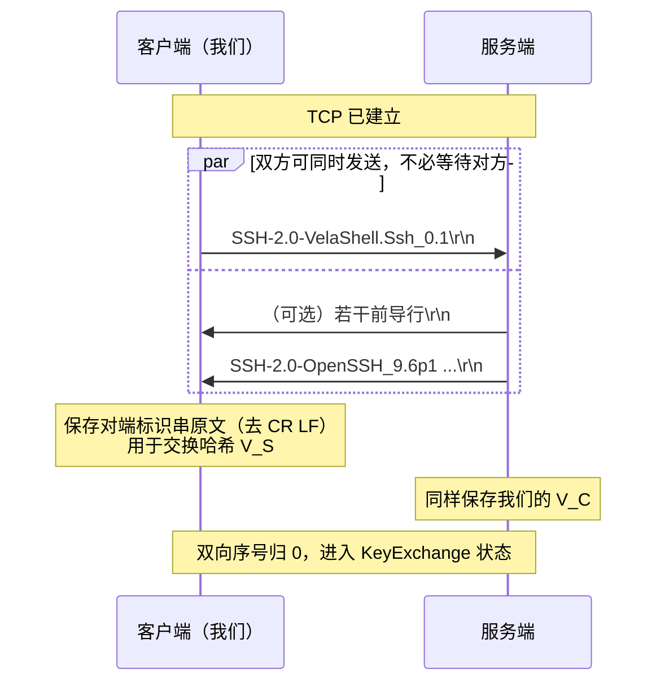

# 02 · 版本标识串交换

> 规范依据：RFC 4253 §4.2（Protocol Version Exchange）。
> 对应实现：`Session/`（L4 状态机的 `VersionExchange` 状态）。

---

## 一 这一步在干什么

TCP 建立之后、任何 SSH 报文之前，双方各发一行 ASCII 文本自报家门：

```
SSH-2.0-软件版本 空格 可选注释 CR LF
```

例如：

```
SSH-2.0-OpenSSH_9.6p1 Ubuntu-3ubuntu13.5\r\n
SSH-2.0-VelaShell.Ssh_0.1.0\r\n
```

这一步有三个作用，**第三个最容易被忽略**：

1. 协议版本协商（我们只支持 2.0）。
2. 软件识别，用于互操作兼容。
3. **两端的标识串（去掉 CR LF）是交换哈希 `H` 的前两个输入**
   —— 见 [`03-key-exchange.md`](03-key-exchange.md) §4。
   因此**必须原样保存**，包括其中的空格与注释；任何规范化都会导致签名验证失败。

---

## 二 报文格式

### 2.1 我们发送的

| 部分 | 值 | 约束 |
| --- | --- | --- |
| 前缀 | `SSH-2.0-` | 固定 |
| softwareversion | `VelaShell.Ssh_<版本号>` | **禁止**含空格、`-`、CR、LF 或非可打印 ASCII |
| 注释 | 〔决策〕**不发** | 见下 |
| 结尾 | `\r\n` | 固定 |

〔决策〕**不发注释，也不发操作系统/运行时信息。**
理由：注释部分（空格之后）唯一的用途是给对端的兼容性判断提供线索，
而我们不需要对端为我们做特殊处理。反过来，它是一个纯粹的指纹面 ——
把 `.NET 9.0.3 / Windows 11` 广播给每一台你连过的机器（包括蜜罐）没有任何收益。

〔决策〕**版本号只到次版本**（`0.1` 而非 `0.1.3+abc1234`）。
理由：同上，补丁号对互操作没有意义，只增加指纹精度。
〔互操作〕若将来发现某服务端需要精确版本才能正确判断兼容性，再按需放开。

**整行（含 CR LF）必须 ≤ 255 字节。**

### 2.2 我们接收的

对端的行**必须**：

- 以 `SSH-` 开头。
- 第二段（`SSH-` 与下一个 `-` 之间）是 `protoversion`。
- 第三段起是 `softwareversion [SP comment]`。

| protoversion | 处理 |
| --- | --- |
| `2.0` | 正常 |
| `1.99` | 〔决策〕**接受**，按 2.0 处理。这是老服务端表示「同时支持 1.x 和 2.0」的写法（RFC 4253 §5.1） |
| 其它（`1.5` 等） | `VersionMismatch`，断开 |

---

## 三 前导行（banner lines）

RFC 4253 §4.2 允许**服务端**在标识串之前发送任意行文本（法律声明、公告）。
这些行：

- **不以 `SSH-` 开头**；
- **不参与**交换哈希；
- 客户端**必须**忽略或展示给用户，然后继续等待真正的标识串。

〔决策〕**把它们收集起来交给使用者**（`SshConnectionOptions.PreAuthBannerHandler`），
但默认不展示。理由：这些文本在企业环境里往往是有法律意义的使用声明，
库吞掉它不合适；但它来自**未认证**的对端，默认往用户终端上打是一个注入面。

**限制**（缺一不可，否则是一个无成本的内存耗尽面）：

| 限制 | 值 | 理由 |
| --- | --- | --- |
| 单行最大长度 | 255 字节（含 CR LF） | 与标识串同一上限 |
| 最大行数 | 〔决策〕**1024** | 足够容纳任何真实的法律声明 |
| 累计最大字节 | 〔决策〕**64 KiB** | 双保险：1024 × 255 也才 255 KiB，但真实场景不会接近 |
| 整个版本交换的超时 | 计入 `ConnectTimeout` | 见 §5 |

**客户端禁止发送前导行**（RFC 4253 §4.2 只允许服务端发）。

---

## 四 时序



**并发性**：双方可以**同时**发送自己的标识串，不必先收后发。
〔决策〕**我们立即发送，不等对端。** 理由：等对端先发会平白增加一个 RTT；
而且某些服务端（以及所有把 SSH 当端口探测目标的中间设备）确实在等客户端先说话。

---

## 五 边界与错误

| 情况 | 处理 |
| --- | --- |
| 单行超过 255 字节 | `ProtocolError`，断开 |
| 前导行超过 1024 行或 64 KiB | `ProtocolError`，断开 |
| 收到的行不以 `SSH-` 开头，且已超出前导行限制 | `ProtocolError`，断开 |
| `protoversion` 不是 `2.0` / `1.99` | `VersionMismatch`，断开 |
| 对端在发完标识串前关闭连接 | `ClosedByPeer` |
| 超时 | 计入 `ConnectTimeout`，报 `Timeout` |
| 行以裸 `\n` 结尾（缺 `\r`） | 〔互操作〕**接受** |

〔互操作〕**裸 `\n` 结尾必须接受。** RFC 要求 `\r\n`，但部分嵌入式 SSH 实现
（含若干型号的网络设备管理口）只发 `\n`。严格要求 `\r\n` 会让这些设备完全连不上，
而接受它没有任何安全代价 —— 标识串本身不参与任何信任判定。
**注意**：此时保存进交换哈希的 `V_S` 是**去掉行尾之后**的内容，
对 `\r\n` 与 `\n` 两种情况结果相同，因此不影响签名验证。

---

## 六 实现要点

1. **逐字节扫 `\n`，不要一次读固定长度。** 标识串之后紧跟的就是第一个二进制报文，
   多读的字节必须留在 `PipeReader` 的缓冲里交给帧层 ——
   这正是用 `PipeReader` 而不是 `Stream.ReadAsync` 的直接好处：
   `AdvanceTo(行尾)` 之后剩下的字节自动归帧层，不需要自己搬缓冲。
2. **保存原文而不是解析结果。** `V_C` / `V_S` 进哈希的是**整行去掉行尾**，
   不是「解析出来的软件名」。实现里应当存 `byte[]` 而不是 `string`，
   避免任何编码往返改变字节。
3. **版本交换完成即视为「对端是一个 SSH 服务」。** 在此之前收到的任何东西
   都可能来自一个完全不相干的服务（连错端口），错误消息要体现这一点 ——
   「对端不是 SSH 服务」比「协议错误」对用户有用得多。
