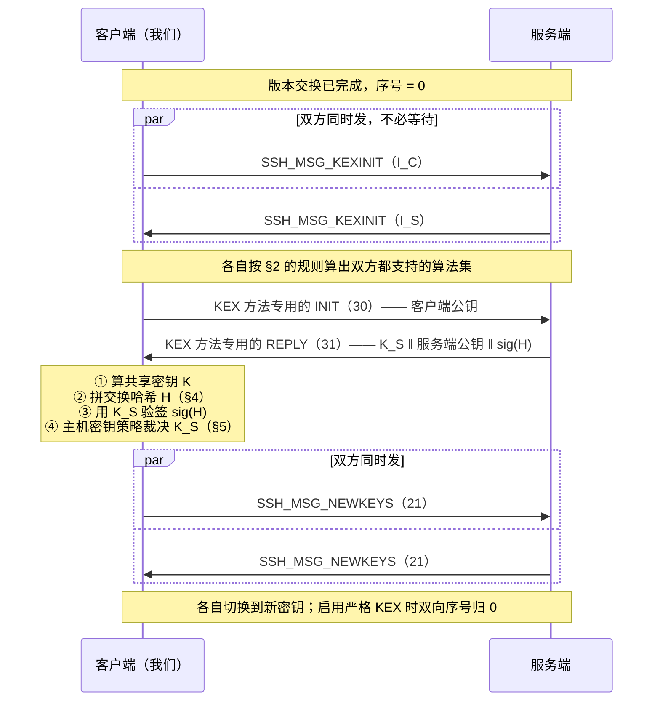
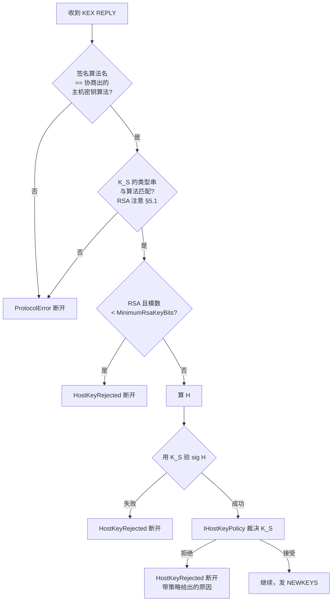
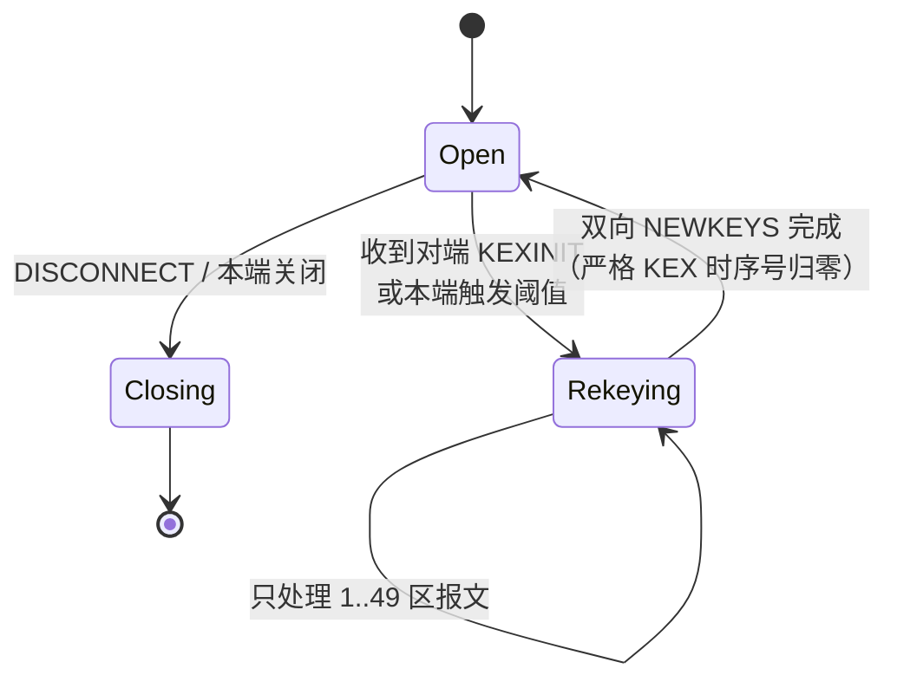

# 03 · 算法协商与密钥交换

> 规范依据：RFC 4253 §7–§9（Key Exchange / Key Derivation / Rekey）、§8（DH group14）；
> RFC 5656（ECDH，NIST 曲线）；RFC 8731（curve25519-sha256）；RFC 8268（group14/16 + SHA-2）；
> RFC 4419（group exchange）；RFC 8308（Extension Negotiation）；
> OpenSSH `PROTOCOL` 的 `kex-strict-*-v00@openssh.com`（Terrapin 缓解，CVE-2023-48795）；
> draft-kampanakis-curdle-ssh-pq-ke（ML-KEM 混合）；OpenSSH `PROTOCOL` 的 sntrup761 混合。
>
> 对应实现：`Crypto/`（L3）与 `Session/`（L4 的 `KeyExchange` / `Rekeying` 状态）。
>
> **这是全套规格里最长、也最不容出错的一份。** 这里的每一个字节顺序错误，
> 表现都是同一个「签名验证失败」，而排查起来极其昂贵。

---

## 一 总览时序



**两个必须记住的并发事实**：

1. `KEXINIT` 是**双向同时发**的，不是请求-应答。谁先到都合法。
2. `NEWKEYS` 也是双向的，且**方向独立**：
   - **发出** `NEWKEYS` 之后，我们发的下一个报文起用新的发送密钥；
   - **收到** `NEWKEYS` 之后，我们收的下一个报文起用新的接收密钥。
   两个切换点**互不等待**。把它们合并成一个「切换时刻」是一个常见错误，
   症状是快速链路上偶发的解密失败。

---

## 二 `SSH_MSG_KEXINIT`（20）

### 2.1 字段表

| # | 类型 | 字段 | 说明 |
| :-: | --- | --- | --- |
| 1 | `byte` | `SSH_MSG_KEXINIT` = 20 | |
| 2 | `byte[16]` | `cookie` | **必须**是密码学随机数。防止任一方单独决定 `H` |
| 3 | `name-list` | `kex_algorithms` | 含指示符，见 §2.3 |
| 4 | `name-list` | `server_host_key_algorithms` | |
| 5 | `name-list` | `encryption_algorithms_client_to_server` | |
| 6 | `name-list` | `encryption_algorithms_server_to_client` | |
| 7 | `name-list` | `mac_algorithms_client_to_server` | |
| 8 | `name-list` | `mac_algorithms_server_to_client` | |
| 9 | `name-list` | `compression_algorithms_client_to_server` | |
| 10 | `name-list` | `compression_algorithms_server_to_client` | |
| 11 | `name-list` | `languages_client_to_server` | 一律发空 |
| 12 | `name-list` | `languages_server_to_client` | 一律发空 |
| 13 | `boolean` | `first_kex_packet_follows` | 见 §2.4 |
| 14 | `uint32` | `0`（保留） | **必须**发 0；收到非 0 **必须**忽略而非报错 |

**整个报文的载荷（从消息编号字节开始，到最后的 `uint32` 为止）必须原样保存** ——
它就是交换哈希里的 `I_C` / `I_S`（§4）。

> 实现要点：保存的是**载荷**，不是整帧。不含 `packet_length`、`padding_length`、填充与 MAC。

### 2.2 协商规则（RFC 4253 §7.1）

对每一类算法，各自独立地：

> 取**客户端列表**中第一个、且**同时出现在服务端列表**中的名字。

注意三点：

1. **以客户端的顺序为准** —— 所以我们的列表顺序就是我们的偏好（总则 §7）。
2. **每一类独立协商**，互不影响 —— 除了一个例外：
   主机密钥算法的可选集受 KEX 方法限制（某些 KEX 要求主机密钥能做签名/加密，
   我们支持的全部 KEX 都只要求能签名，因此此约束在本实现中恒成立）。
3. **任何一类无交集 → 协商失败**，抛 `SshNegotiationException`，
   **并把双方的完整名单与对端版本串装进异常**（见 [`08-failures.md`](08-failures.md)）。
   这是本库相对现有库最直接的一处改进：用户拿到的不是
   「No common encryption algorithm.」，而是「对端只给了 aes128-cbc；
   本端支持 chacha20-poly1305@openssh.com、aes256-gcm@openssh.com……」——
   一眼就能看出问题在对端只剩 CBC，而本库不实现 CBC（00 §6.3）。

**AEAD 的特例**：当协商出的加密算法是 AEAD（`*-gcm@openssh.com`、
`chacha20-poly1305@openssh.com`）时，**该方向的 MAC 列表协商结果被忽略**，
完整性由 AEAD 自身提供。我们仍然**必须**发送非空的 MAC 列表 ——
不发会导致只支持非 AEAD 的对端无法与我们协商。

〔决策〕**我们自己的清单在拨号之前就校验**（`SshAlgorithmSet.Validate()`，连接开始时调用）：

- 八类清单都不能为空 —— 空清单与任何对端都谈不成；
- 密钥交换清单里的每个名字，要么是本库实现了的方法（`SshKeyExchangeFactory` 那张固定的表，运行期不能注册），要么是 §2.3 的指示符；
- 加密、MAC、压缩清单里的每个名字都必须是本库实现了的（压缩只有 `none` 与 `zlib@openssh.com`）。

不满足就当场抛 `ArgumentException`，**根本不去拨号**。
理由：清单里混进一个没实现的名字，只有对端恰好也只剩它时才会被谈成 ——
那时失败发生在密钥派生里，报出来的是一句看不出缘由的「尚未实现」，而且只在连某一台设备时出现。
提前在这里报，错误指向的是配置本身。
主机密钥算法名**不在这里查**：它们由主机密钥的解析与验签把关（§5.3），未知类型在那里有明确的错误。

### 2.3 藏在 `kex_algorithms` 里的三个指示符

这三个名字**不是密钥交换方法**，是塞在同一个列表里的标志位。
客户端**必须**把它们放进列表，但**禁止**把它们当作协商结果。

| 名字 | 由谁发 | 含义 |
| --- | --- | --- |
| `ext-info-c` | 客户端 | 我支持 RFC 8308 的扩展协商，请给我 `SSH_MSG_EXT_INFO` |
| `ext-info-s` | 服务端 | 服务端侧的同一件事（我们作为客户端只读不发） |
| `kex-strict-c-v00@openssh.com` | 客户端 | 我支持严格 KEX（§6） |
| `kex-strict-s-v00@openssh.com` | 服务端 | 服务端支持严格 KEX |

〔决策〕**`ext-info-c` 与 `kex-strict-c-v00@openssh.com` 总是发送，且只在首次 KEXINIT 中发。**
RFC 8308 §2.2 明确要求 `ext-info-c` 只出现在**第一次** KEXINIT 里；
重协商时再发是协议违规，某些服务端会断连。

**指示符必须放在列表末尾**，避免被误选为协商结果（虽然按名字比对本来就选不中，
但放末尾能让人一眼看出它们不是候选项）。

### 2.4 `first_kex_packet_follows`（猜测性 KEX）

发送方可以在 KEXINIT 之后**立刻**跟一个它猜测的 KEX INIT 报文，省一个 RTT。
如果猜错（协商出的 KEX 方法或主机密钥算法与它猜的不同），接收方**必须忽略**那个报文。

〔决策〕**我们发送时恒为 `false`，接收时正确处理对端的 `true`。**

理由：
- 发送侧不用：猜对省 1 个 RTT，猜错则白发一个公钥（对 ML-KEM 混合而言是 1KB+ 的报文）
  并且要处理「我猜的和协商的不一致」的状态分支。**这个分支的复杂度不值那一个 RTT** ——
  我们省 RTT 的手段是 §7 的发送合并与自适应窗口，那些是全程有效的，
  而猜测性 KEX 只在建连时有效一次。
- 接收侧**必须**实现：OpenSSH 服务端在某些配置下会用它。
  收到 `first_kex_packet_follows = true` 时：若协商结果与对端首选一致则正常处理那个报文，
  否则**丢弃它**（丢弃的是整个报文，序号照常递增）。

> 判定「对端猜对了没有」的规则（RFC 4253 §7.1）：
> 对端列表的**第一个** `kex_algorithms` 与**第一个** `server_host_key_algorithms`
> 是否都等于最终协商结果。两者都相等才算猜对。

---

## 三 密钥交换方法

### 3.1 通用形状

我们支持的所有 KEX 方法都是同一个两步形状，只是公钥内容不同：

| 方向 | 编号 | 内容 |
| --- | :-: | --- |
| C → S | 30 | 客户端的临时公钥 `Q_C`（`string`） |
| S → C | 31 | `string K_S` ‖ `string Q_S` ‖ `string signature` |

- `K_S` 是**服务端主机公钥的 blob**（格式见 §5.1）。
- `signature` 是用主机私钥对**交换哈希 `H`** 的签名（格式见 §5.2）。
- 共享密钥 `K` 的算法各异（见下），但**都以 `mpint` 或 `string` 的形式进 `H`**
  —— 这一点各方法不同，是最容易错的地方，逐条列在下面。

> 编号 30/31 是**方法专用**的，不同 KEX 方法可以赋予不同含义
> （见 `Protocol/SshMessageNumber.cs` 的注释：30–49 刻意不进全局枚举）。
> 我们支持的方法恰好都用 30/31 这一对，但 `diffie-hellman-group-exchange-*`
> 多了一组前置报文，见 §3.5。

### 3.2 `curve25519-sha256`（RFC 8731）

| 项 | 值 |
| --- | --- |
| 哈希 | SHA-256 |
| `Q_C` / `Q_S` | 32 字节 X25519 公钥，按 `string` 编码 |
| `K` | X25519 共享密钥（32 字节），**按 `mpint` 编入 `H`** |

**三个必须**：

1. `Q_C` / `Q_S` 长度**必须**恰好 32 字节，否则协议错误。
2. X25519 结果**全零时必须中止**（RFC 7748 §6.1 的 contributory behaviour 要求）。
   全零意味着对端给了一个低阶点。
3. `K` 进 `H` 时是 `mpint` —— 意味着**最高位为 1 时要补 `0x00`，前导零要去掉**
   （总则 §3.1）。直接当 32 字节定长塞进去是最常见的错误，症状是
   「大约 1/256 的连接签名验证失败」—— 这种概率性失败极难排查。

`curve25519-sha256@libssh.org` 与之**完全相同**，只是名字不同（历史原因）。
两个名字都发，实现共用一套。

### 3.3 `ecdh-sha2-nistp256 / 384 / 521`（RFC 5656）

| 曲线 | 哈希 | `Q` 编码 |
| --- | --- | --- |
| nistp256 | SHA-256 | 未压缩点 `0x04 ‖ X ‖ Y`，按 `string` |
| nistp384 | SHA-384 | 同上 |
| nistp521 | SHA-512 | 同上 |

- `K` 是共享点的 **X 坐标**，按 `mpint` 编入 `H`。
- **必须验证对端公钥点在曲线上**且不是无穷远点。
  .NET 的 `ECDiffieHellman.ImportSubjectPublicKeyInfo` / `ECParameters` 校验会做这件事，
  **但必须确认异常被正确翻译成协议错误而不是漏出去**。
- 〔注意〕nistp521 的坐标是 66 字节（521 位），`0x04 ‖ X ‖ Y` 共 133 字节。
  按 64 或 65 字节假设写死的实现会在这条曲线上崩掉。

### 3.4 `diffie-hellman-group14-sha256` / `group16-sha512`（RFC 8268）

| 名字 | 群 | 哈希 |
| --- | --- | --- |
| `diffie-hellman-group14-sha256` | MODP 2048 位（RFC 3526 Group 14） | SHA-256 |
| `diffie-hellman-group16-sha512` | MODP 4096 位（RFC 3526 Group 16） | SHA-512 |
| `diffie-hellman-group14-sha1` | Group 14 | SHA-1。**默认关闭**，〔互操作〕老设备 |

- `e = g^x mod p`（客户端）、`f = g^y mod p`（服务端），都按 `mpint`。
- `K = f^x mod p`，按 `mpint`。
- **必须校验** `1 < e,f < p-1`。不校验等于接受小子群攻击。
- 私指数 `x` 的比特数**应当**至少是哈希输出的两倍（RFC 4253 §8 的建议）。
  〔决策〕统一取 **2× 哈希长度**（group14-sha256 → 512 位），不用群的完整位宽 ——
  完整位宽没有额外安全收益，只是让模幂慢一大截。

### 3.5 `diffie-hellman-group-exchange-sha256`（RFC 4419）

> **实现状态（2026-09-25）**：**尚未实现**。它不在默认清单里，密钥交换工厂也没有注册它，
> 放进清单会被连接前的校验拒绝（§2.2）。下面是实现它时要照的规格。

**比其它方法多两个报文**，因为群是服务端按客户端要求现给的：

| 方向 | 编号 | 内容 |
| --- | :-: | --- |
| C → S | 34 `GEX_REQUEST` | `uint32 min` ‖ `uint32 n`（首选） ‖ `uint32 max` |
| S → C | 31 `GEX_GROUP` | `mpint p` ‖ `mpint g` |
| C → S | 32 `GEX_INIT` | `mpint e` |
| S → C | 33 `GEX_REPLY` | `string K_S` ‖ `mpint f` ‖ `string signature` |

> 注意编号**与其它方法冲突**：这里的 31 是 `GEX_GROUP`，而在 curve25519 里 31 是 `KEX_ECDH_REPLY`。
> 这正是 30–49 区必须按「当前协商出的 KEX 方法」解释、不能有全局枚举的原因。

- 〔决策〕`min = 2048`、`n = 3072`、`max = 8192`。
  **不接受服务端给出小于 2048 位的 `p`** —— logjam（CVE-2015-4000）之后 1024 位不可接受。
- **必须校验** `p` 是素数、`g` 在合理范围、`p` 的位数落在我们请求的 `[min, max]` 内。
  素性检验用 Miller-Rabin（BCL 没有直接 API，`System.Numerics.BigInteger` 上自己实现，
  轮数 ≥ 64）。〔决策〕这一步**可缓存**：同一个 `(p, g)` 通常被服务端复用，
  按 `SHA-256(p ‖ g)` 缓存检验结果，避免每次连接都花几十毫秒。
- `H` 的输入里**包含** `min ‖ n ‖ max ‖ p ‖ g`，见 §4.2。

### 3.6 后量子混合：`mlkem768x25519-sha256` 与 `sntrup761x25519-sha512`

两者形状相同：**把一个 KEM 与 X25519 并联**，共享密钥是两者结果的哈希。

| 方法 | KEM | 哈希 | 客户端发 | 服务端发 |
| --- | --- | --- | --- | --- |
| `mlkem768x25519-sha256` | ML-KEM-768 | SHA-256 | `ek_pq ‖ Q_C`（1184 + 32 字节） | `ct_pq ‖ Q_S`（1088 + 32 字节） |
| `sntrup761x25519-sha512` | sntrup761 | SHA-512 | `pk_pq ‖ Q_C`（1158 + 32） | `ct_pq ‖ Q_S`（1039 + 32） |

- 两段**拼接后整体按一个 `string` 编码**，不是两个 `string`。
- 共享密钥：`K = HASH(K_pq ‖ K_x25519)`，其中 `HASH` 是该方法的哈希。
  〔关键〕**`K` 在这里是一个 `string`（32 或 64 字节定长），不是 `mpint`。**
  这是与 §3.2/§3.3/§3.4 的**根本差别** —— 后量子混合方法刻意改用定长 `string`
  正是为了避开 `mpint` 的前导零问题。**写错这一条，表现同样是概率性签名失败。**
- ML-KEM 在 .NET 11 的 BCL 里有（`System.Security.Cryptography.MLKem`）；
  sntrup761 没有，需要自实现或用 BouncyCastle。
  〔决策〕**M1 先只做 `mlkem768x25519-sha256`**；sntrup761 放到 M5，
  因为 OpenSSH 9.9+ 已经把 ML-KEM 排在前面，sntrup761 只是对 8.5–9.8 的兼容。
- `sntrup761x25519-sha512@openssh.com` 是同一算法的旧名（OpenSSH < 9.9 用它）。

---

## 四 交换哈希 `H`

### 4.1 通用输入（除 GEX 外全部方法）

`H = HASH(...)`，输入按顺序拼接，**每一项都按其 SSH 类型编码**：

| # | 类型 | 内容 |
| :-: | --- | --- |
| 1 | `string` | `V_C` —— 客户端标识串（去 CR LF，原文字节） |
| 2 | `string` | `V_S` —— 服务端标识串（去 CR LF，原文字节） |
| 3 | `string` | `I_C` —— 客户端 KEXINIT 的**载荷**（含消息编号字节） |
| 4 | `string` | `I_S` —— 服务端 KEXINIT 的载荷 |
| 5 | `string` | `K_S` —— 服务端主机公钥 blob |
| 6 | 方法相关 | 客户端公钥（`Q_C` / `e`） |
| 7 | 方法相关 | 服务端公钥（`Q_S` / `f`） |
| 8 | 方法相关 | 共享密钥 `K` |

第 6/7/8 项的类型按方法而定：

| 方法 | `Q_C`/`e` | `Q_S`/`f` | `K` |
| --- | --- | --- | --- |
| curve25519 | `string` | `string` | **`mpint`** |
| ecdh-nistp* | `string` | `string` | **`mpint`** |
| dh-group14/16 | **`mpint`** | **`mpint`** | **`mpint`** |
| mlkem768x25519 / sntrup761x25519 | `string` | `string` | **`string`** |

> **把这张表做成单测的数据源。** 每一行一个已知向量，逐字节断言 `H`。
> 这是整份规格里最值得先写测试的地方。

### 4.2 GEX 的额外输入

`diffie-hellman-group-exchange-*` 在第 5 项与第 6 项之间插入：

| # | 类型 | 内容 |
| :-: | --- | --- |
| 5.1 | `uint32` | `min`（我们请求的最小位数） |
| 5.2 | `uint32` | `n`（首选位数） |
| 5.3 | `uint32` | `max` |
| 5.4 | `mpint` | `p` |
| 5.5 | `mpint` | `g` |

〔注意〕RFC 4419 有一个旧的「只发 `n`」的变体（`SSH_MSG_KEX_DH_GEX_REQUEST_OLD`，编号 30）。
〔决策〕**不实现旧变体**，只发三参数的 34。任何还只支持旧变体的服务端，
其 SSH 实现之老已经超出我们的支持范围。

### 4.3 会话标识 `session_id`

**第一次**密钥交换算出的 `H` 就是 `session_id`，此后**永不改变**
（即使重协商产生了新的 `H`）。

`session_id` 的用途：
- 密钥派生（§4.4）；
- **公钥认证的签名输入**（[`04-authentication.md`](04-authentication.md) §4.3）。

〔实现要点〕重协商时一定要把「新的 `H`」与「不变的 `session_id`」分开存。
把它们混成一个字段，症状是重协商之后再开新通道做公钥认证会失败 ——
而那是一条极其罕见的路径，很可能上线很久才被发现。

---

## 五 主机密钥验证

### 5.1 `K_S` 的格式

| 算法 | blob 内容 |
| --- | --- |
| `ssh-ed25519` | `string "ssh-ed25519"` ‖ `string key`(32 字节) |
| `ecdsa-sha2-nistp256` | `string "ecdsa-sha2-nistp256"` ‖ `string "nistp256"` ‖ `string Q`(未压缩点) |
| `ssh-rsa` / `rsa-sha2-*` | `string "ssh-rsa"` ‖ `mpint e` ‖ `mpint n` |
| `*-cert-v01@openssh.com` | 证书结构，见 OpenSSH `PROTOCOL.certkeys` |

〔关键〕**RSA 的 blob 里类型串永远是 `"ssh-rsa"`，即使协商出的是 `rsa-sha2-512`。**
`rsa-sha2-256` / `rsa-sha2-512` 是**签名算法**名，不是密钥类型名。
按协商出的算法名去比对 blob 里的类型串会失败 —— 这是 RFC 8332 引入的一个
容易踩的不对称。

### 5.2 签名格式

| 算法 | 签名 blob |
| --- | --- |
| `ssh-ed25519` | `string "ssh-ed25519"` ‖ `string sig`(64 字节) |
| `ecdsa-sha2-nistp*` | `string alg` ‖ `string (mpint r ‖ mpint s)` —— **嵌套**，内层是两个 mpint 拼成的 string |
| `rsa-sha2-256/512` | `string "rsa-sha2-256"` ‖ `string sig` —— PKCS#1 v1.5，**不是 PSS** |
| `ssh-rsa` | `string "ssh-rsa"` ‖ `string sig` —— SHA-1 + PKCS#1 v1.5 |

〔注意〕ECDSA 签名的**双层 string 嵌套**是另一个经典坑：
外层 string 的内容是「`mpint r` 后接 `mpint s`」的拼接，
而不是 r、s 直接拼成定长字节。DER 编码同样不对。

### 5.3 验证顺序（顺序本身是安全属性）



**顺序的三个理由**：

1. **先验签名，再问策略。** 签名没过就问用户「要不要信任这把密钥」是荒唐的 ——
   那把密钥根本没证明自己持有对应私钥。
2. **RSA 长度检查在验签之前。** 〔决策〕`MinimumRsaKeyBits` 默认 **2048**。
   放在验签前是为了不给弱密钥任何计算资源。
3. **策略裁决独立计时。** 〔决策〕`IHostKeyPolicy.EvaluateAsync` 的耗时
   **不计入 `ConnectTimeout`**，由独立的 `HostKeyDecisionTimeout`（默认无限）约束。

   理由：这是直接冲着一个现实缺陷去的 —— 交互式客户端在这里要弹窗问用户，
   而弹窗摆着的时间如果算进连接超时，用户点完「信任」这一轮已经被判死，
   只能原地补连一次。把两个计时分开，那个补连逻辑连同它的解释性注释一起消失。

   〔决策〕落到实现上是三件事：
   - 连接计时器在裁决期间**停表**，裁决结束后从剩下的时间接着走；
   - 裁决与「永久信任」的持久化只认**调用方的取消令牌**，不认连接计时器的 ——
     用户点了「永久信任」，那次写 known_hosts 不该拿到一个已取消的令牌；
   - 经跳板连接时，里面那一跳的整个建连都发生在外面那一跳的拨号阶段里 ——
     里面在裁决时**外层计时器也停表**（`09-dialing.md` §2.4）。

### 5.4 `IHostKeyPolicy` 的契约

```
ValueTask<SshHostKeyVerdict> EvaluateAsync(SshHostKeyContext context, CancellationToken cancellationToken)
```

`SshHostKeyContext` **必须**提供（密钥本身的材料都在 `Key`，一个 `SshPublicKey` 上）：

| 字段 | 用途 |
| --- | --- |
| `Host` / `Port` | 被连的**逻辑**主机（跳板链上是这一跳的目标，不是 TCP 对端） |
| `KeyBlob` / `KeyType` / `KeyBits` | 原始材料 |
| `Sha256Fingerprint` / `Md5Fingerprint` | 展示用。SHA-256 是 base64 无填充，与 OpenSSH 一致 |
| `Key.IsCertificate` / `Key.Certificate` | CA 签发的主机证书（§5.5）。证书的指纹是**证书里那把钥**的指纹，与 `ssh-keygen -l` 一致 |
| `RandomArt` | 〔决策〕提供 OpenSSH 风格的 ASCII 指纹图。它对人眼比对确实有效 |

`SshHostKeyVerdict` 只能由四个工厂成员得到：`Accept` / `AcceptAndPersist` / `Reject(message)` / `RejectChanged(message)`。
**拒绝必须带原因文本**，它会原样进 `SshConnectException.Message` ——
这是直接冲着「用户只看到一句 UntrustedPeer、不知道该去哪删记录」去的。
原因码由拒绝的种类定（`SshHostKeyVerdict.Reason`）：`Reject` 是 `HostKeyRejected`；
`RejectChanged` 是 `HostKeyChanged` —— 记着的密钥变了，或者只记着别的类型（下一条决策），可能是中间人。
调用方据此把「不信任」与「变了」分开处理：后者不该被一个「信任并记住」的按钮随手放过。

〔决策〕**`default(SshHostKeyVerdict)` 是拒绝。**裁决的枚举零值是 `Reject`，一个忘了赋值的裁决不会变成放行；
没有说明的拒绝报「主机密钥被策略拒绝」。

〔决策〕**换一种密钥类型不能绕过「变了」。**中间人只要出示一种记录里没有的类型，按「没见过」处理的话，
「密钥变了」的检查就被绕过去，接受新主机的策略还会把它悄悄记下来。两条一起做：

1. 策略可以（可选的 `IHostKeyTypePreference`）说出这台主机已经记着哪些类型；连接时把这些类型的主机密钥算法
   **排到最前面** —— 协商以客户端的顺序为准，正常的服务端因此谈成已记下的那一种。重协商用同一份清单。
2. 仍然谈成了一种没记过的类型（记录里只有别的类型）时，是一个单独的状态 `OtherKeyTypesKnown`，
   与「变了」同样处理：拒绝，并在原因里列出记着的类型与行号。**不能**当成「没见过」去问、去记。

`KnownHostsPolicy` 的另外两条：取反模式（`!pattern`）对上时**整行**都不算这台主机
（`*.corp,!untrusted.corp` 不能经 `*.corp` 把密钥信给 `untrusted.corp`）；
追加记录前先看文件末尾有没有换行，没有就补一个 —— 否则新记录接在最后一行后面，两条一起坏掉。

### 5.5 主机证书（`*-cert-v01@openssh.com`）

依据：OpenSSH `PROTOCOL.certkeys`（证书结构与签名范围）、sshd(8) 的 SSH_KNOWN_HOSTS 一节（`@cert-authority` / `@revoked`）。

**算法清单。**默认清单在普通主机密钥算法**之后**追加证书变体：
`ssh-ed25519-cert-v01@openssh.com`、`ecdsa-sha2-nistp256/384/521-cert-v01@openssh.com`、
`rsa-sha2-512-cert-v01@openssh.com`、`rsa-sha2-256-cert-v01@openssh.com`。
不含 `ssh-rsa-cert-v01@openssh.com`（SHA-1）。

〔决策〕**证书变体排在后面。**没有为这台主机配 CA 时，谈成证书得不到任何额外的保证（见下面第 4 条），
排在后面就保证这类连接的行为与以前完全一样。`known_hosts` 里有对上这台主机的 `@cert-authority` 行时，
`IHostKeyTypePreference` 报出证书类型，证书算法因此被排到前面（§5.4 第 1 条）；
这台主机的普通密钥也记着时，清单里普通算法仍在前 —— 那把钥已经被明确信任，用哪条路径验结果一样。

**握手。**`K_S` 是整张证书的 blob，交换哈希里放的就是它；KEX 应答里的签名由**证书里那把钥**签，
签名 blob 里写的是**普通**算法名（`rsa-sha2-512-cert-v01@openssh.com` 对应 `rsa-sha2-512`）。
§5.3 的验证顺序另加两条：

- 协商出证书算法时 `K_S` 必须是证书，协商出普通算法时 `K_S` 必须不是 —— 不符即 `HostKeyRejected`；
- RSA 长度下限看的是**证书里那把钥**（它的类型串是 `ssh-rsa-cert-v01@openssh.com`，按类型串比 `ssh-rsa` 会让检查落空）。

**`KnownHostsPolicy` 的裁决**（按顺序，前一条成立就不看后面）：

1. 对上这台主机的 `@revoked` 行里，钥等于证书里那把钥、整张证书或签发它的 CA 公钥之一 → `Revoked`。
2. 证书里那把钥作为普通密钥记在这台主机名下 → `Known`。明确记下的钥优先，不再看证书。
3. 有对上这台主机的 `@cert-authority` 行，且它的钥就是证书的签发 CA → 验证证书，**全部**满足才 `Known`：
   - 证书类型是主机（2）；
   - CA 签名验得过：签名覆盖从类型串到签发 CA 公钥（含）的全部字段；
     签名算法限 `ssh-ed25519`、`ecdsa-sha2-nistp256/384/521`、`rsa-sha2-256`、`rsa-sha2-512` ——
     〔决策〕SHA-1 的 `ssh-rsa` 签名不认；CA 公钥本身不能是证书；RSA 的 CA 至少 2048 位；
   - 当前时刻在 `[valid_after, valid_before)` 里；
   - `valid principals` 非空且含被连的主机名（逐字比较，不区分大小写，不做通配）；
   - 没有 critical option（主机证书没有定义任何一个，不认识的 critical option 必须拒绝）。

   任何一条不满足 → `CertificateInvalid`，拒绝并说明是哪一条。〔决策〕**不退回到「没见过」去问、去记**：
   这台主机已经配了 CA，证书不合格说明配置出了错或者路上有人，悄悄改走 TOFU 会把这件事藏起来，
   直到哪天那把钥不在记录里。
   〔决策〕**`valid principals` 为空的主机证书不认。**`PROTOCOL.certkeys` 把空列表定义为「对任何主体有效」；
   对主机证书这意味着 CA 签出的一张证书能冒充 `@cert-authority` 那一行范围里的任何一台主机。
4. 没有 CA 为它担保 → 把证书里那把钥当作普通密钥，按 §5.4 的规则得出 `Changed` / `OtherKeyTypesKnown` / `Unknown`。
   接受新主机时**记下的是那把普通钥**，不是证书：证书每次重签 blob 都会变，记证书等于下次必报「变了」。

   〔决策〕**对上这台主机的 `@cert-authority` 行也算「记着别的类型」。**这台主机由 CA 管，却出示一把没有这个 CA 担保的钥
   （普通钥，或者别的 CA 签的证书），而那把钥又没有单独记着 → `OtherKeyTypesKnown`，拒绝，不去问、不去记。
   理由与 §5.4 的第 2 条相同：不这样的话，中间人只要出示一把普通钥，`accept-new` 就会把它悄悄记下 ——
   而给主机配 CA，要的正是「不再靠第一次盲信」。确实没有证书的主机，核对指纹之后把它的钥单独加进 `known_hosts`。

**重协商**钉住的是首次交换时的整个 `K_S`（§8.4），证书换了也按主机密钥换了处理。
所以重协商时的主机密钥算法清单只留下与钉住的钥**同类型、且同为证书（或同为普通钥）**的那些：
钉住的是证书时，普通算法去掉后缀看起来也「支持」，谈成它的话服务端出示的是那把钥而不是证书，比对失败，连接被当成换了主机密钥断开。

---

## 六 严格 KEX（Terrapin 缓解）

> 依据：OpenSSH `PROTOCOL` 的 `kex-strict-*-v00@openssh.com`；CVE-2023-48795。

**必须实现，且不可关闭。**

Terrapin 攻击的原理是：握手期间中间人可以**插入或删除**报文
（`SSH_MSG_IGNORE`、`SSH_MSG_DEBUG` 等在握手期是允许的），
从而让双方的序号错开，进而在加密建立后删掉前几个报文而不被发现 ——
其中就包括 `SSH_MSG_EXT_INFO`，于是可以把签名算法降级。

缓解有两条，缺一不可：

1. **双方都宣告支持时启用**（我们发 `kex-strict-c-v00@openssh.com`，
   对端的 KEXINIT 里有 `kex-strict-s-v00@openssh.com`）。
   **只看首次 KEXINIT**：标记只在那里有效，之后重协商的 KEXINIT 里有没有标记一律不看 ——
   启用与否是**整条连接**的属性，首次交换定下来就不再变。
2. 启用后：
   - **首次 KEX 期间收到任何非 KEX 相关的报文（含 `SSH_MSG_IGNORE`、
     `SSH_MSG_DEBUG`、`SSH_MSG_UNIMPLEMENTED`）一律断开。**
     只管首次 KEX —— 重协商期间这几种报文是合法的普通报文。
   - **每次 `SSH_MSG_NEWKEYS` 之后，双向序号归零** —— 包括每一次重协商。

〔注意〕按「这一次 KEXINIT 里有没有标记」逐次重算是错的：对端重协商时不再带标记，
本端就不再归零而对端照旧归零，重协商之后的第一个报文校验失败，长连接当场断开。
chacha20-poly1305（nonce 就是序号）与 HMAC 套件（MAC 覆盖序号）立刻暴露；
AES-GCM 的 nonce 不看序号，会把这个错误掩盖掉。

〔决策〕**对端不支持严格 KEX 时，记录一条警告级日志并继续。**
不拒绝连接 —— 老服务端很多，拒绝会把大量合法场景打死；
但要让使用者能在诊断面板上看到「这条连接没有 Terrapin 缓解」。
`SshConnectionInfo.StrictKeyExchange` 暴露这个事实。

---

## 七 密钥派生（RFC 4253 §7.2）

六把密钥，每把用同一个公式、不同的常量字母：

```
K_x = HASH(K ‖ H ‖ "X" ‖ session_id)
```

| 字母 | 用途 |
| :-: | --- |
| `A` | 客户端→服务端方向的初始 IV |
| `B` | 服务端→客户端方向的初始 IV |
| `C` | 客户端→服务端方向的加密密钥 |
| `D` | 服务端→客户端方向的加密密钥 |
| `E` | 客户端→服务端方向的完整性密钥 |
| `F` | 服务端→客户端方向的完整性密钥 |

**关键点**：

1. `K` 按其方法对应的类型编码（§4.1 的表），`H` 与 `session_id` 按 `string`。
   **字母 `X` 是单个裸字节，不是 `string`。**
2. **密钥不够长时要扩展**（HASH 输出 32 字节，但 AES-256 要 32、ChaCha20 要 64）：
   ```
   K1 = HASH(K ‖ H ‖ "X" ‖ session_id)
   K2 = HASH(K ‖ H ‖ K1)
   K3 = HASH(K ‖ H ‖ K1 ‖ K2)
   key = K1 ‖ K2 ‖ K3 ‖ ... 取前 N 字节
   ```
   注意后续轮**不含**字母与 `session_id`，只有 `K ‖ H ‖ 已生成的全部`。
3. **首次 KEX 时 `session_id == H`**；重协商时 `H` 变而 `session_id` 不变。
4. 派生出的密钥材料**必须**在用完后 `CryptographicOperations.ZeroMemory`。

---

## 八 重协商（rekey）

### 8.1 触发条件

任一方都可以在任何时候发 `SSH_MSG_KEXINIT` 发起重协商。

> **实现状态（2026-09-21）**：**已全部落地**（见架构文档 §11.2.11）——
> 接住对端发起的、我们主动发起的、以及两边同时发起的。
> 阈值落在 `SshRekeyPolicy`，默认开着。

〔决策〕我们主动触发的阈值：

| 条件 | 默认值 | 理由 |
| --- | --- | --- |
| 收发字节数 | **1 GiB**（任一方向） | RFC 4253 §9 的建议 |
| 时长 | **1 小时** | 同上 |
| AES-GCM 的 invocation counter | 接近 2⁶⁴ 时**强制** | 计数器回绕会重用 nonce，那是灾难性的 |

〔决策〕**阈值可配但有下限**：字节数不低于 64 MiB，时长不低于 1 分钟。
太频繁的重协商本身是一个拒绝服务面（每次都要做非对称运算）。

### 8.2 发送闸门

这是本实现与常见做法差异最大的一处，也是 [architecture.md §5.4](../design/architecture.md) 的核心。

RFC 4253 §7.1 的原话是：一旦发出 `KEXINIT`，
**在 `NEWKEYS` 之前禁止发送除传输层消息（1–49）之外的任何报文**。

我们把这句话直接实现成一道闸：

```
状态 Rekeying 期间：
  SendPump 从队列取出一帧
    → 该帧的消息编号在 1..49 之内？
        是  → 正常发送
        否  → 放进「待发暂存」，继续取下一帧
  收到/发出 NEWKEYS 且 KEX 完成
    → 开闸 → 暂存区按原顺序全部流出
```

**三个必须**：

1. **暂存区保序** —— 通道数据的顺序是语义的一部分。
2. **暂存区有上限**（〔决策〕默认 16 MiB）。超限时**阻塞入队方**而非丢弃，
   背压由此传到调用方。永远不要在这里丢报文。
3. **不阻塞调用方的 `WriteAsync`** —— 入队是非阻塞的（除非撞到上限），
   闸门只作用于 `SendPump`。这一条是与「用信号量让两个循环互相等待」
   最本质的区别：**没有任何两条路径互相持有对方的同步原语，因此不可能死锁**。

〔决策〕**同一时刻只谈一次。**「在谈」从我们发出 `KEXINIT`（或收到对端的 `KEXINIT`）起，
一直到这次交换结束、开闸为止。这期间再发起（使用者调用、阈值监视循环到点）一律是空操作 ——
交换中途再发一个 `KEXINIT` 是协议违规，对端会断连。
阈值要等交换完成才归零，所以「只看我们发过、对端还没回」是不够的：交换一开始那个标记就没了，
监视循环下一拍看到的仍是过线的计数。关闸与我们的 `KEXINIT` 在同一把锁里入队，
免得对端同时发起的那次交换把它的第一帧排到我们的 `KEXINIT` 前面。

〔决策〕**重协商有超时**（默认 2 分钟）：我们的 `KEXINIT` 一直等不到对端的，或者交换卡在半路，
都以 `Timeout`（`Phase = Rekeying`）断开。闸门关着的时候通道数据一律暂存、保活探测也发不出去 ——
没有超时，连接就无声地停在那里。

### 8.3 接收侧



〔注意〕**重协商期间仍然可以收到通道数据。** 闸门只约束**发送**方向；
RFC 对接收方向没有同样的限制（对端可能在它发 KEXINIT 之前就已经把数据放在路上了）。
把接收也一并挡住会丢数据。

### 8.4 重协商时**不**做的事

| 不做 | 理由 |
| --- | --- |
| 不重新协商 `ext-info-c` | RFC 8308 §2.2 明确禁止（§2.3） |
| 不重置 `session_id` | §4.3 |
| 不中断已有通道 | 通道在传输层之上，对重协商无感 |
| 不重新验证主机密钥指纹给用户看 | 〔决策〕**但仍然验签**。若 `K_S` 与首次不同，直接断开并报 `HostKeyChanged` —— 连接中途换主机密钥没有任何正当场景 |

---

## 九 边界与错误速查

| 情况 | 失败原因 | 是否可重试 |
| --- | --- | :-: |
| 我们的清单为空或含本库未实现的名字 | 不是连接失败：拨号前抛 `ArgumentException`（§2.2） | 否（改配置） |
| 任一类算法无交集 | `NegotiationFailed`（带双方名单） | 否（除非改配置） |
| `Q_C`/`Q_S` 长度不对 | `ProtocolError` | 否 |
| X25519 结果全零 | `ProtocolError` | 否 |
| ECDH 点不在曲线上 | `ProtocolError` | 否 |
| DH `e`/`f` 越界 | `ProtocolError` | 否 |
| GEX 的 `p` 小于 2048 位 | `NegotiationFailed` | 否 |
| GEX 的 `p` 非素数 | `ProtocolError` | 否 |
| 签名算法名与协商结果不符 | `ProtocolError` | 否 |
| 签名验证失败 | `HostKeyRejected` | 否 |
| RSA 模数小于下限 | `HostKeyRejected` | 否（可配置放宽） |
| 协商出证书算法而 `K_S` 不是证书（或反过来） | `HostKeyRejected` | 否 |
| 有 CA 担保的主机证书不合格（§5.5 第 3 条） | `HostKeyRejected` | 是（重签证书后） |
| 策略拒绝 | `HostKeyRejected` / `HostKeyChanged` | 是（用户改信任后） |
| 严格 KEX 下、首次 KEX 期间收到 IGNORE/DEBUG | `ProtocolError` | 否 |
| 重协商时 `K_S` 变了 | `HostKeyChanged` | 否 |
| KEX 超时 | `Timeout` | 是 |

**所有 `ProtocolError` 在断开前应当发送 `SSH_MSG_DISCONNECT`**
（`SSH_DISCONNECT_KEY_EXCHANGE_FAILED = 3` 或 `SSH_DISCONNECT_PROTOCOL_ERROR = 2`），
尽力而为 —— 发不出去不影响断开动作本身。
