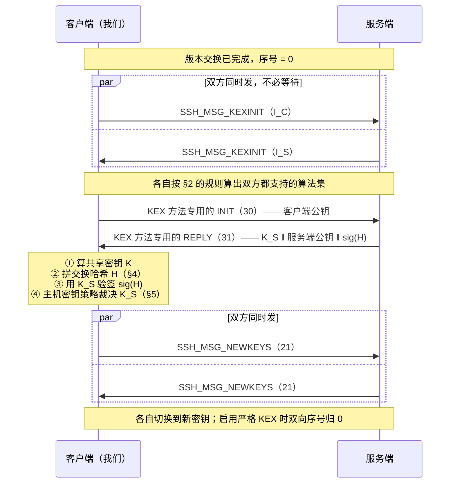
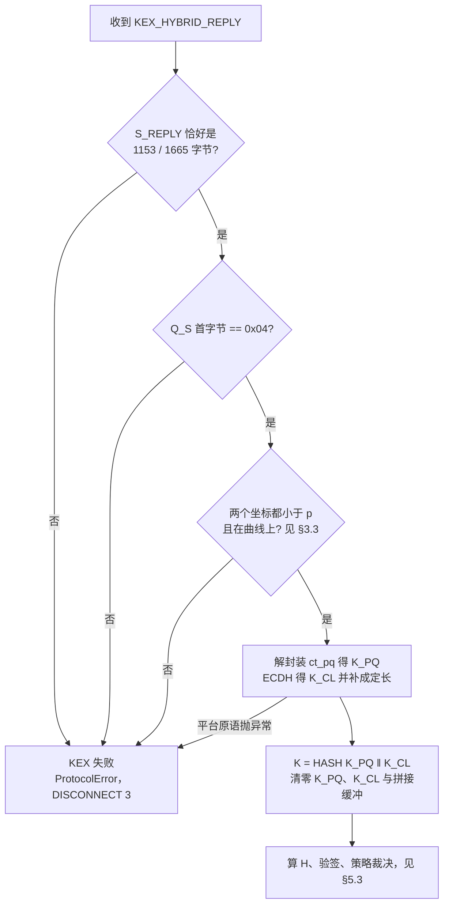
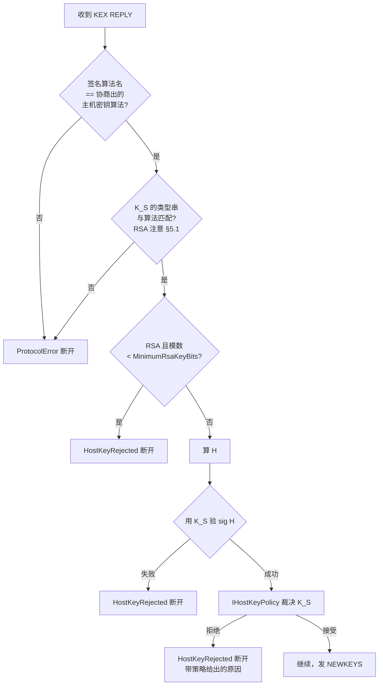
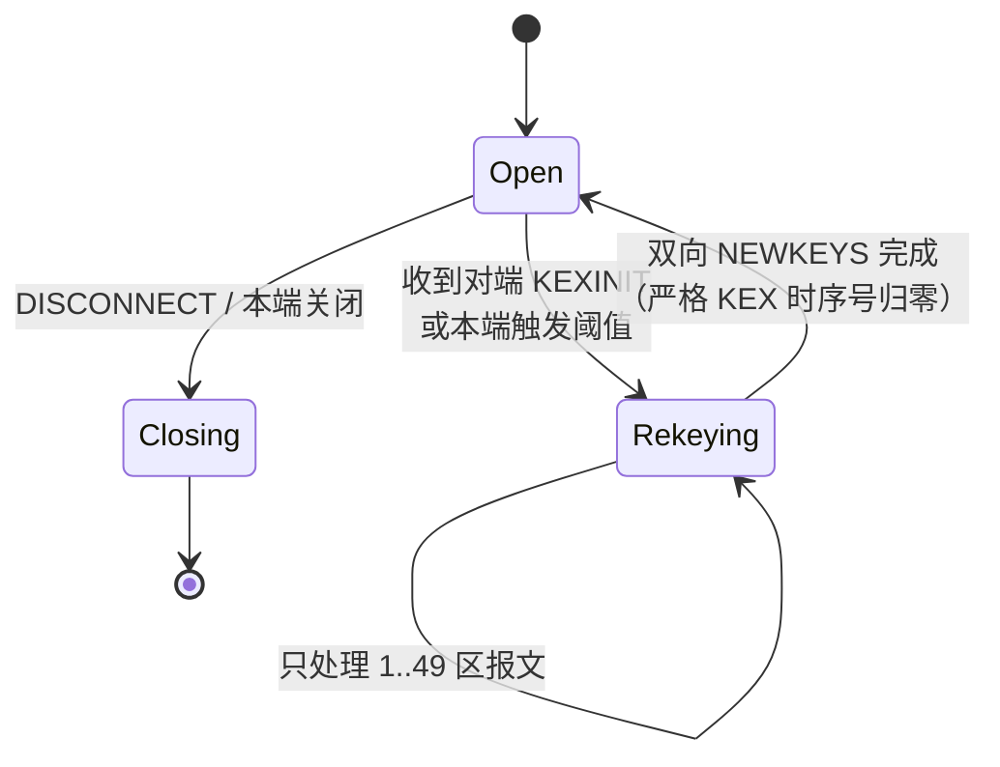

# 03 · 算法协商与密钥交换

> 规范依据：RFC 4253 §7–§9（Key Exchange / Key Derivation / Rekey）、§8（DH group14）；
> RFC 5656（ECDH，NIST 曲线）；RFC 8731（curve25519-sha256）；RFC 8268（group14/16 + SHA-2）；
> RFC 4419（group exchange）；RFC 8308（Extension Negotiation）；
> OpenSSH `PROTOCOL` 的 `kex-strict-*-v00@openssh.com`（Terrapin 缓解，CVE-2023-48795）；
> RFC 10042（ML-KEM 混合：`mlkem768x25519-sha256` 与 NIST 曲线的两种，定稿前是 draft-kampanakis-curdle-ssh-pq-ke）；
> FIPS 203（ML-KEM）；OpenSSH `PROTOCOL` 的 sntrup761 混合。
>
> 对应实现：`Crypto/`（L3）与 `Session/`（L4 的 `KeyExchange` / `Rekeying` 状态）。
>
> **这是全套规格里最长、也最不容出错的一份。** 这里的每一个字节顺序错误，
> 表现都是同一个「签名验证失败」，而排查起来极其昂贵。

---

## 一 总览时序


```mermaid
sequenceDiagram
    participant C as 客户端（我们）
    participant S as 服务端

    Note over C,S: 版本交换已完成，序号 = 0

    par 双方同时发，不必等待
        C->>S: SSH_MSG_KEXINIT（I_C）
    and
        S->>C: SSH_MSG_KEXINIT（I_S）
    end

    Note over C,S: 各自按 §2 的规则算出双方都支持的算法集

    C->>S: KEX 方法专用的 INIT（30）—— 客户端公钥
    S->>C: KEX 方法专用的 REPLY（31）—— K_S ‖ 服务端公钥 ‖ sig(H)

    Note over C: ① 算共享密钥 K<br/>② 拼交换哈希 H（§4）<br/>③ 用 K_S 验签 sig(H)<br/>④ 主机密钥策略裁决 K_S（§5）

    par 双方同时发
        C->>S: SSH_MSG_NEWKEYS（21）
    and
        S->>C: SSH_MSG_NEWKEYS（21）
    end

    Note over C,S: 各自切换到新密钥；启用严格 KEX 时双向序号归 0
```

**两个必须记住的并发事实**：

1. `KEXINIT` 是**双向同时发**的，不是请求-应答。谁先到都合法。
2. `NEWKEYS` 也是双向的，且**方向独立**：
   - **发出** `NEWKEYS` 之后，我们发的下一个报文起用新的发送密钥；
   - **收到** `NEWKEYS` 之后，我们收的下一个报文起用新的接收密钥。
   两个切换点**互不等待**。把它们合并成一个「切换时刻」是一个常见错误，
   症状是快速链路上偶发的解密失败。

---

## 二 `SSH_MSG_KEXINIT`（20）

### 2.1 字段表

| # | 类型 | 字段 | 说明 |
| :-: | --- | --- | --- |
| 1 | `byte` | `SSH_MSG_KEXINIT` = 20 | |
| 2 | `byte[16]` | `cookie` | **必须**是密码学随机数。防止任一方单独决定 `H` |
| 3 | `name-list` | `kex_algorithms` | 含指示符，见 §2.3 |
| 4 | `name-list` | `server_host_key_algorithms` | |
| 5 | `name-list` | `encryption_algorithms_client_to_server` | |
| 6 | `name-list` | `encryption_algorithms_server_to_client` | |
| 7 | `name-list` | `mac_algorithms_client_to_server` | |
| 8 | `name-list` | `mac_algorithms_server_to_client` | |
| 9 | `name-list` | `compression_algorithms_client_to_server` | |
| 10 | `name-list` | `compression_algorithms_server_to_client` | |
| 11 | `name-list` | `languages_client_to_server` | 一律发空 |
| 12 | `name-list` | `languages_server_to_client` | 一律发空 |
| 13 | `boolean` | `first_kex_packet_follows` | 见 §2.4 |
| 14 | `uint32` | `0`（保留） | **必须**发 0；收到非 0 **必须**忽略而非报错 |

**整个报文的载荷（从消息编号字节开始，到最后的 `uint32` 为止）必须原样保存** ——
它就是交换哈希里的 `I_C` / `I_S`（§4）。

> 实现要点：保存的是**载荷**，不是整帧。不含 `packet_length`、`padding_length`、填充与 MAC。

### 2.2 协商规则（RFC 4253 §7.1）

对每一类算法，各自独立地：

> 取**客户端列表**中第一个、且**同时出现在服务端列表**中的名字。

注意三点：

1. **以客户端的顺序为准** —— 所以我们的列表顺序就是我们的偏好（总则 §7）。
2. **每一类独立协商**，互不影响 —— 除了一个例外：
   主机密钥算法的可选集受 KEX 方法限制（某些 KEX 要求主机密钥能做签名/加密，
   我们支持的全部 KEX 都只要求能签名，因此此约束在本实现中恒成立）。
3. **任何一类无交集 → 协商失败**，抛 `SshNegotiationException`，
   **并把双方的完整名单与对端版本串装进异常**（见 [`08-failures.md`](08-failures.md)）。
   这是本库相对现有库最直接的一处改进：用户拿到的不是
   「No common encryption algorithm.」，而是「对端只给了 aes128-cbc；
   本端支持 chacha20-poly1305@openssh.com、aes256-gcm@openssh.com……」——
   一眼就能看出问题在对端只剩 CBC，而本库不实现 CBC（00 §6.3）。

**AEAD 的特例**：当协商出的加密算法是 AEAD（`*-gcm@openssh.com`、
`chacha20-poly1305@openssh.com`）时，**该方向的 MAC 列表协商结果被忽略**，
完整性由 AEAD 自身提供。我们仍然**必须**发送非空的 MAC 列表 ——
不发会导致只支持非 AEAD 的对端无法与我们协商。

〔决策〕**我们自己的清单在拨号之前就校验**（`SshAlgorithmSet.Validate()`，连接开始时调用）：

- 八类清单都不能为空 —— 空清单与任何对端都谈不成；
- 密钥交换清单里的每个名字，要么是本库实现了的方法（`SshKeyExchangeFactory` 那张固定的表，运行期不能注册），要么是 §2.3 的指示符；
- 加密、MAC、压缩清单里的每个名字都必须是本库实现了的（压缩只有 `none` 与 `zlib@openssh.com`）。

不满足就当场抛 `ArgumentException`，**根本不去拨号**。
理由：清单里混进一个没实现的名字，只有对端恰好也只剩它时才会被谈成 ——
那时失败发生在密钥派生里，报出来的是一句看不出缘由的「尚未实现」，而且只在连某一台设备时出现。
提前在这里报，错误指向的是配置本身。
主机密钥算法名**不在这里查**：它们由主机密钥的解析与验签把关（§5.3），未知类型在那里有明确的错误。

〔决策〕**每条清单在设值时抄一份只读的存下来**，之后调用方改自己手里那份不影响已经交出去的清单。
曾经原样存下调用方给的集合：传一个 `List` 进来、校验之后再改，连接把这份清单存进重协商的上下文，
下一次重协商用的就是改过的、没校验过的清单；`SshAlgorithmSet.Default` 里的数组下转型就能改，加密与 MAC 两个方向还共用同一个数组。
设成 `null` 当场抛 `ArgumentNullException`。也因此 `SshAlgorithmSet` 的相等比较按清单内容（含顺序）而不是按引用。同样的规矩也用在 `AgentForwardOptions.AllowedKeys` 与 `SftpFileAttributes.Extended` 上。

### 2.3 藏在 `kex_algorithms` 里的三个指示符

这三个名字**不是密钥交换方法**，是塞在同一个列表里的标志位。
客户端**必须**把它们放进列表，但**禁止**把它们当作协商结果。

| 名字 | 由谁发 | 含义 |
| --- | --- | --- |
| `ext-info-c` | 客户端 | 我支持 RFC 8308 的扩展协商，请给我 `SSH_MSG_EXT_INFO` |
| `ext-info-s` | 服务端 | 服务端侧的同一件事（我们作为客户端只读不发） |
| `kex-strict-c-v00@openssh.com` | 客户端 | 我支持严格 KEX（§6） |
| `kex-strict-s-v00@openssh.com` | 服务端 | 服务端支持严格 KEX |

〔决策〕**`ext-info-c` 与 `kex-strict-c-v00@openssh.com` 总是发送，且只在首次 KEXINIT 中发。**
RFC 8308 §2.2 明确要求 `ext-info-c` 只出现在**第一次** KEXINIT 里；
重协商时再发是协议违规，某些服务端会断连。

**指示符必须放在列表末尾**，避免被误选为协商结果（虽然按名字比对本来就选不中，
但放末尾能让人一眼看出它们不是候选项）。

### 2.4 `first_kex_packet_follows`（猜测性 KEX）

发送方可以在 KEXINIT 之后**立刻**跟一个它猜测的 KEX INIT 报文，省一个 RTT。
如果猜错（协商出的 KEX 方法或主机密钥算法与它猜的不同），接收方**必须忽略**那个报文。

〔决策〕**我们发送时恒为 `false`，接收时正确处理对端的 `true`。**

理由：
- 发送侧不用：猜对省 1 个 RTT，猜错则白发一个公钥（对 ML-KEM 混合而言是 1KB+ 的报文）
  并且要处理「我猜的和协商的不一致」的状态分支。**这个分支的复杂度不值那一个 RTT** ——
  我们省 RTT 的手段是 §7 的发送合并与自适应窗口，那些是全程有效的，
  而猜测性 KEX 只在建连时有效一次。
- 接收侧**必须**实现：OpenSSH 服务端在某些配置下会用它。
  收到 `first_kex_packet_follows = true` 时：若协商结果与对端首选一致则正常处理那个报文，
  否则**丢弃它**（丢弃的是整个报文，序号照常递增）。

> 判定「对端猜对了没有」的规则（RFC 4253 §7.1）：
> 对端列表的**第一个** `kex_algorithms` 与**第一个** `server_host_key_algorithms`
> 是否都等于最终协商结果。两者都相等才算猜对。

---

## 三 密钥交换方法

### 3.1 通用形状

我们支持的所有 KEX 方法都是同一个两步形状，只是公钥内容不同：

| 方向 | 编号 | 内容 |
| --- | :-: | --- |
| C → S | 30 | 客户端的临时公钥 `Q_C`（`string`） |
| S → C | 31 | `string K_S` ‖ `string Q_S` ‖ `string signature` |

- `K_S` 是**服务端主机公钥的 blob**（格式见 §5.1）。
- `signature` 是用主机私钥对**交换哈希 `H`** 的签名（格式见 §5.2）。
- 共享密钥 `K` 的算法各异（见下），但**都以 `mpint` 或 `string` 的形式进 `H`**
  —— 这一点各方法不同，是最容易错的地方，逐条列在下面。

> 编号 30/31 是**方法专用**的，不同 KEX 方法可以赋予不同含义
> （见 `Protocol/SshMessageNumber.cs` 的注释：30–49 刻意不进全局枚举）。
> 我们支持的方法几乎都用 30/31 这一对，只有 `diffie-hellman-group-exchange-*`
> 多了一组前置报文、之后换成 32/33，见 §3.5。

### 3.2 `curve25519-sha256`（RFC 8731）

| 项 | 值 |
| --- | --- |
| 哈希 | SHA-256 |
| `Q_C` / `Q_S` | 32 字节 X25519 公钥，按 `string` 编码 |
| `K` | X25519 共享密钥（32 字节），**按 `mpint` 编入 `H`** |

**三个必须**：

1. `Q_C` / `Q_S` 长度**必须**恰好 32 字节，否则协议错误。
2. X25519 结果**全零时必须中止**（RFC 7748 §6.1 的 contributory behaviour 要求）。
   全零意味着对端给了一个低阶点。
3. `K` 进 `H` 时是 `mpint` —— 意味着**最高位为 1 时要补 `0x00`，前导零要去掉**
   （总则 §3.1）。直接当 32 字节定长塞进去是最常见的错误，症状是
   「大约 1/256 的连接签名验证失败」—— 这种概率性失败极难排查。

`curve25519-sha256@libssh.org` 与之**完全相同**，只是名字不同（历史原因）。
两个名字都发，实现共用一套。

### 3.3 `ecdh-sha2-nistp256 / 384 / 521`（RFC 5656）

| 曲线 | 哈希 | `Q` 编码 |
| --- | --- | --- |
| nistp256 | SHA-256 | 未压缩点 `0x04 ‖ X ‖ Y`，按 `string` |
| nistp384 | SHA-384 | 同上 |
| nistp521 | SHA-512 | 同上 |

- `K` 是共享点的 **X 坐标**，按 `mpint` 编入 `H`。
- **必须验证对端公钥点在曲线上**且不是无穷远点。
  .NET 的 `ECDiffieHellman.ImportSubjectPublicKeyInfo` / `ECParameters` 校验会做这件事，
  **但必须确认异常被正确翻译成协议错误而不是漏出去**。
  〔决策〕**导入之前库自己先查一遍**：两个坐标都小于 p，且满足 y² = x³ − 3x + b (mod p)（SEC 2 的三条曲线，a 都是 −3）。
  平台那一层各是各的（Windows 的 CNG、Linux 的 OpenSSL、macOS 的 Apple），曾经只在 Windows 上验证过；
  坐标不小于 p 的编码与减去 p 之后的点同余、方程照样成立，要单独拦。全零（无穷远点写不出来）代入方程得 0 = b，一并拒掉。
- 〔注意〕nistp521 的坐标是 66 字节（521 位），`0x04 ‖ X ‖ Y` 共 133 字节。
  按 64 或 65 字节假设写死的实现会在这条曲线上崩掉。

### 3.4 `diffie-hellman-group14-sha256` / `group16-sha512`（RFC 8268）

| 名字 | 群 | 哈希 |
| --- | --- | --- |
| `diffie-hellman-group14-sha256` | MODP 2048 位（RFC 3526 Group 14） | SHA-256 |
| `diffie-hellman-group16-sha512` | MODP 4096 位（RFC 3526 Group 16） | SHA-512 |
| `diffie-hellman-group14-sha1` | Group 14 | SHA-1。**默认关闭**，〔互操作〕老设备 |

- `e = g^x mod p`（客户端）、`f = g^y mod p`（服务端），都按 `mpint`。
- `K = f^x mod p`，按 `mpint`。
- **必须校验** `1 < e,f < p-1`。不校验等于接受小子群攻击。
- 私指数 `x` 的比特数**应当**至少是哈希输出的两倍（RFC 4253 §8 的建议）。
  〔决策〕统一取 **2× 哈希长度**（group14-sha256 → 512 位），不用群的完整位宽 ——
  完整位宽没有额外安全收益，只是让模幂慢一大截。

### 3.5 `diffie-hellman-group-exchange-sha256`（RFC 4419）

> **实现状态（2026-10-06）**：**已实现**（`DiffieHellmanGroupExchange`），在默认清单里排在椭圆曲线之后、DH 标准群之前 ——
> 客户端的顺序为准，只有别的都谈不成时才会选中它。已对真 OpenSSH 10.3 核对（首次交换与重协商）；
> OpenSSH 10 起服务端默认不开 DH 那几种，互通环境用 `scripts/ssh/interop/kex-gex.sh` 追加进服务端清单。

**比其它方法多两个报文**，因为群是服务端按客户端要求现给的：

| 方向 | 编号 | 内容 |
| --- | :-: | --- |
| C → S | 34 `GEX_REQUEST` | `uint32 min` ‖ `uint32 n`（首选） ‖ `uint32 max` |
| S → C | 31 `GEX_GROUP` | `mpint p` ‖ `mpint g` |
| C → S | 32 `GEX_INIT` | `mpint e` |
| S → C | 33 `GEX_REPLY` | `string K_S` ‖ `mpint f` ‖ `string signature` |

> 注意编号**与其它方法冲突**：这里的 31 是 `GEX_GROUP`，而在 curve25519 里 31 是 `KEX_ECDH_REPLY`。
> 这正是 30–49 区必须按「当前协商出的 KEX 方法」解释、不能有全局枚举的原因。

- 〔决策〕`min = 2048`、`n = 3072`、`max = 8192`。
  **不接受服务端给出小于 2048 位的 `p`** —— logjam（CVE-2015-4000）之后 1024 位不可接受。
- **必须校验** `p` 是素数、`g` 在合理范围（`1 < g < p-1`）、`p` 的位数落在我们请求的 `[min, max]` 内。
  先查便宜的（位数、奇偶、`g` 的范围），再做素性检验。
- 素性检验用 BouncyCastle 的 `Primes.HasAnySmallFactors` 与 `Primes.IsMRProbablePrime`（Miller-Rabin，随机底，**64 轮**，
  合数蒙混过关的概率 ≤ 4⁻⁶⁴）。〔决策〕**不自己写 Miller-Rabin** —— BCL 没有这个 API，BC 有（ssh 库 AGENTS 3.3「不自己写密码学原语」）。
- 〔决策〕素性检验是这一种方法真正的成本：BC 单线程跑 64 轮，3072 位约 2 秒、8192 位半分钟以上。三件事把它压下来：
  1. **各轮并行**：每轮一个独立的随机底，按核数分给线程池（每次调 `IsMRProbablePrime(p, random, 1)`）；
  2. **与往返重叠**：收到 `GEX_GROUP` 就在后台起跑，同时发 `GEX_INIT`、等 `GEX_REPLY`；算共享密钥之前才等它的结论；
  3. **缓存**：检验过的 `p` 按 `SHA-256(p)` 记在进程里（上限 64 个，满了清空），服务端复用同一个群时不再检验。
     只记「是素数」—— 不是素数的连接本来就失败了。

  对真 OpenSSH（3072 位的群）整次连接约 0.4–0.5 秒。
- `H` 的输入里**包含** `min ‖ n ‖ max ‖ p ‖ g`，见 §4.2。

### 3.6 后量子混合：`mlkem768x25519-sha256` 与 `sntrup761x25519-sha512`

两者形状相同：**把一个 KEM 与 X25519 并联**，共享密钥是两者结果的哈希。
`mlkem768x25519-sha256` 的依据是 RFC 10042 §2.3.3（定稿前是 draft-kampanakis-curdle-ssh-pq-ke），它写的与本节一致；
同一份 RFC 里把 X25519 换成 NIST 曲线的另两种见 §3.7。

| 方法 | KEM | 哈希 | 客户端发 | 服务端发 |
| --- | --- | --- | --- | --- |
| `mlkem768x25519-sha256` | ML-KEM-768 | SHA-256 | `ek_pq ‖ Q_C`（1184 + 32 字节） | `ct_pq ‖ Q_S`（1088 + 32 字节） |
| `sntrup761x25519-sha512` | sntrup761 | SHA-512 | `pk_pq ‖ Q_C`（1158 + 32） | `ct_pq ‖ Q_S`（1039 + 32） |

- 两段**拼接后整体按一个 `string` 编码**，不是两个 `string`。
- 共享密钥：`K = HASH(K_pq ‖ K_x25519)`，其中 `HASH` 是该方法的哈希。
  〔关键〕**`K` 在这里是一个 `string`（32 或 64 字节定长），不是 `mpint`。**
  这是与 §3.2/§3.3/§3.4 的**根本差别** —— 后量子混合方法刻意改用定长 `string`
  正是为了避开 `mpint` 的前导零问题。**写错这一条，表现同样是概率性签名失败。**
- ML-KEM 在 .NET 11 的 BCL 里有（`System.Security.Cryptography.MLKem`）；
  sntrup761 没有，需要自实现或用 BouncyCastle。
  〔决策〕`MLKem.IsSupported`（Windows 的 CNG、OpenSSL 3.5 起）时 ML-KEM-768 走 BCL，否则退回 BouncyCastle；
  两种实现互通（一边生成、另一边封装）有用例钉住。曾经一律走 BouncyCastle。
  〔决策〕**M1 先只做 `mlkem768x25519-sha256`**；sntrup761 放到 M5，
  因为 OpenSSH 9.9+ 已经把 ML-KEM 排在前面，sntrup761 只是对 8.5–9.8 的兼容。
- `sntrup761x25519-sha512@openssh.com` 是同一算法的旧名（OpenSSH < 9.9 用它）。

### 3.7 面向 FIPS 的后量子混合：`mlkem768nistp256-sha256` 与 `mlkem1024nistp384-sha384`

> 依据：RFC 10042 §2.1–§2.5（混合交换的形状、报文号、方法名、共享密钥 `K`、交换哈希）、§3（报文大小）、§5（每次交换都用新的临时密钥）；
> FIPS 203 表 3（ML-KEM 的各项长度）、§7.3（解封装的输入检查）、§3.3（中间值的销毁）；
> RFC 5656 §4 与 SEC 1 §2.3.3–§2.3.5、§3.2.2（EC 点的编码、域元素的定长编码、公钥校验）。
>
> **实现状态（2026-10-07）**：**已实现**（F12，`HybridKeyExchange`），对真服务端的核对结果见 §3.7.7。

形状与 §3.6 完全相同 —— **一个 KEM 与一次椭圆曲线 DH 并联**，只是经典的那一半从 X25519 换成了 §3.3 的 NIST 曲线 ECDH。
两种都只用 FIPS 认可的原语（ML-KEM、P-256 / P-384 上的 ECDH、SHA-2）：开了 FIPS 模式、不给 X25519 与 sntrup761 的服务端，靠它们谈成后量子。

| 方法 | KEM | 曲线 | 哈希 | 客户端发 `C_INIT` | 服务端发 `S_REPLY` | `K_CL` | `K` |
| --- | --- | --- | --- | --- | --- | --- | --- |
| `mlkem768nistp256-sha256` | ML-KEM-768 | P-256 | SHA-256 | `ek_pq ‖ Q_C`：1184 + 65 = **1249** 字节 | `ct_pq ‖ Q_S`：1088 + 65 = **1153** 字节 | 32 字节 | 32 字节 |
| `mlkem1024nistp384-sha384` | ML-KEM-1024 | P-384 | SHA-384 | `ek_pq ‖ Q_C`：1568 + 97 = **1665** 字节 | `ct_pq ‖ Q_S`：1568 + 97 = **1665** 字节 | 48 字节 | 48 字节 |

- `ek_pq` 是 ML-KEM 的封装密钥，`ct_pq` 是 ML-KEM 密文（长度见 FIPS 203 表 3；ML-KEM 的共享密钥恒为 32 字节）。
- `Q_C` / `Q_S` 是未压缩的 EC 点 `0x04 ‖ X ‖ Y`（P-256 的坐标 32 字节、P-384 的 48 字节），编码与 §3.3 相同。

#### 3.7.1 报文

编号沿用 §3.1 的 30 / 31，RFC 10042 管它们叫 `SSH_MSG_KEX_HYBRID_INIT` / `SSH_MSG_KEX_HYBRID_REPLY`
（OpenSSH 的调试日志里对这两种方法仍显示成 `SSH2_MSG_KEX_ECDH_INIT` / `SSH2_MSG_KEX_ECDH_REPLY` —— 号是同一对）。

`SSH_MSG_KEX_HYBRID_INIT`（30，C → S）

| # | 类型 | 字段 | 说明 |
| :-: | --- | --- | --- |
| 1 | `byte` | 30 | |
| 2 | `string` | `C_INIT` | `ek_pq` 后面紧接 `Q_C`，**两段拼成一个 `string`**（不是两个）。KEM 在前、EC 点在后 |

`SSH_MSG_KEX_HYBRID_REPLY`（31，S → C）

| # | 类型 | 字段 | 说明 |
| :-: | --- | --- | --- |
| 1 | `byte` | 31 | |
| 2 | `string` | `K_S` | 服务端主机公钥 blob（§5.1） |
| 3 | `string` | `S_REPLY` | `ct_pq` 后面紧接 `Q_S`，同样是一个 `string`，KEM 在前 |
| 4 | `string` | `signature` | 主机私钥对 `H` 的签名（§5.2） |

交换哈希 `H` 的输入就是 §4.1 那八项：第 6 项是 `string C_INIT`，第 7 项是 `string S_REPLY`，第 8 项是 `string K`，`HASH` 是方法的哈希。

#### 3.7.2 共享密钥 `K`

1. `K_PQ`：用本次交换生成的 ML-KEM 解封装密钥解开 `ct_pq`，得 32 字节。
2. `K_CL`：本端的 EC 私钥与 `Q_S` 做 ECDH，取共享点的 **X 坐标**，按**定长**大端编码 —— P-256 是 32 字节，P-384 是 48 字节，
   **前导零保留**（SEC 1 §2.3.5 的「域元素 → 字节串」；RFC 10042 §2.4 的说法是把单用 ECDH 时会得到的那个 `mpint` 重新编成定长字节串）。
3. `K = HASH(K_PQ ‖ K_CL)`：**KEM 的结果在前**，`HASH` 是方法的哈希。得 32 字节（SHA-256）或 48 字节（SHA-384）。
4. `K` 进交换哈希（§4.1 第 8 项）与密钥派生（§7）时都按 **`string`** 编码（`uint32` 长度 32 / 48，后接原字节），**不是 `mpint`**。

〔关键〕这里有两处「定长」，各对应一种概率性的签名失败，症状都只是「签名验证失败」：

- `K_CL` 若照 §3.3 的习惯按 `mpint` 的样子去掉了前导零（或者平台交回来的 X 坐标偏短而没有补齐），只在 X 的首字节为 0 时出错 —— 约 **1/256** 的交换；
- `K` 若按 `mpint` 编，最高位为 1 时会多出一个 `0x00` —— 约 **1/2** 的交换。

〔决策〕平台的 ECDH 原语交回的 X 坐标一律先按坐标长度**右对齐、左边补零**再用；去掉前导零之后仍比坐标长，是库自己的错（`InvalidOperationException`），不是对端的错。

〔注意〕与相邻两节可以复用、不能复用的地方：

| 项 | §3.6 `mlkem768x25519-sha256` | §3.7 两种 NIST 曲线混合 | §3.3 `ecdh-sha2-nistp*` |
| --- | --- | --- | --- |
| 报文号与外形 | 30 / 31，公开值各是一个 `string` | 同左 | 同左 |
| 拼接顺序 | KEM 在前、经典在后 | **同左** | — |
| 经典部分的公钥 | 32 字节 X25519 | 未压缩点，65 / 97 字节 | 未压缩点，65 / 97 / 133 字节 |
| 经典部分的校验 | 长度；结果不能全零 | 首字节 `0x04`、坐标小于 p、在曲线上（**§3.3 那一套原样复用**） | 同左 |
| 经典结果进 `K` 的形式 | 32 字节（X25519 的输出本来就定长） | X 坐标，**32 / 48 字节定长，保留前导零** | X 坐标**本身就是 `K`，按 `mpint`** |
| `K` | `HASH(K_PQ ‖ K_CL)`，按 `string` | **同左** | X 坐标，按 `mpint` |
| 哈希 | SHA-256 | SHA-256 / **SHA-384** | SHA-256 / 384 / 512 |

所以 §3.6 的混合骨架（拼接、长度检查、`K` 的计算与 `string` 编码）与 §3.3 的点编码、曲线校验都可以直接复用；
**不能**复用 §3.3 的共享密钥输出（那是要按 `mpint` 编的 X 坐标），也**不能**照搬 §3.6 现有的哈希二选一（SHA-256，否则 SHA-512）——
SHA-384 必须单独一支：落进 SHA-512 不报任何错，只是每一次都签名失败。

#### 3.7.3 客户端收到 31 之后的检查顺序

前一步不过就不做后一步：


```mermaid
flowchart TD
    A[收到 KEX_HYBRID_REPLY] --> B{S_REPLY 恰好是<br/>1153 / 1665 字节?}
    B -->|否| X[KEX 失败<br/>ProtocolError，DISCONNECT 3]
    B -->|是| C{Q_S 首字节 == 0x04?}
    C -->|否| X
    C -->|是| D{两个坐标都小于 p<br/>且在曲线上? 见 §3.3}
    D -->|否| X
    D -->|是| E[解封装 ct_pq 得 K_PQ<br/>ECDH 得 K_CL 并补成定长]
    E -->|平台原语抛异常| X
    E --> F[K = HASH K_PQ ‖ K_CL<br/>清零 K_PQ、K_CL 与拼接缓冲]
    F --> G[算 H、验签、策略裁决，见 §5.3]
```

1. **总长**：`S_REPLY` 的长度必须恰好等于该方法的 `ct_pq` 与 `Q_S` 之和（1153 / 1665）。RFC 10042 §2.1 要求在解封装**之前**查（防长度扩展）。
   这一步同时就是 FIPS 203 §7.3 的「密文类型检查」：点的编码是定长的（下一条），总长对了，密文的长度也就对了。
2. **点的编码**：`Q_S` 的首字节必须是 `0x04`（未压缩）。
3. **点在曲线上**：照 §3.3 的〔决策〕库自己先查（两个坐标都小于 p，满足 y² = x³ − 3x + b (mod p)），再交给平台导入。
   P-256 / P-384 的余因子是 1，所以「在曲线上、且不是无穷远点」就是 SEC 1 §3.2.2 的完整校验，不必再乘阶。
4. **解封装**：〔决策〕FIPS 203 §7.3 的另两项（解封装密钥的类型检查与哈希检查）不做 —— 那把钥是本端在这次交换里刚生成的，从没离开过进程；
   FIPS 203 明确允许解封装方经由别的途径得到「已检查过」的保证，每次都必须做的只有密文检查（第 1 步）。
   ML-KEM 的解封装**没有失败可言**：密文被改过时它照常交回一个伪随机的 `K_PQ`（隐式拒绝），于是 `K` 与服务端的不同，
   表现为**签名验证失败**（§5.3 → `HostKeyRejected`）。这是预期的行为，不是要另外去查的错误；何况 `S_REPLY` 本身就在 `H` 里，被改过的应答无论如何都验不过签名。
5. **ECDH 与组合**：见 §3.7.2。平台原语在第 4、5 步抛出的任何异常都按 KEX 失败处理（与 §3.3 一样捕获得宽：各平台抛的异常类型不同）。

〔决策〕**只发、只收未压缩点。**RFC 10042 沿用 RFC 5656，允许点压缩；我们不用，也不收（总长不对或首字节是 `0x02` / `0x03` 都拒绝）。理由：

- RFC 10042 要求解封装之前按「该方法的预期长度」查总长 —— 只有点的编码定长，这个预期长度才是一个确定的数；
- 与 §3.3 同一条规矩（`ecdh-sha2-*` 早就只收未压缩点，有用例钉住）；
- 〔互操作〕AlmaLinux 10.2 的 OpenSSH 9.9p1（RHEL 10.2 的下游补丁）两种方法都发未压缩点：在容器里抓明文的首次交换，
  它的服务端发的 `S_REPLY` 是 1153 / 1665 字节、密文之后那一字节是 `0x04`；它的客户端发的 `C_INIT` 是 1249 / 1665 字节，同样在 `ek_pq` 之后是 `0x04`。
  真遇到发压缩点的服务端，写明是哪家、哪个版本再议。

#### 3.7.4 失败怎么报

| 情况 | 本端的原因 | 发给对端的 `DISCONNECT` |
| --- | --- | --- |
| `S_REPLY` 总长不对、`Q_S` 不是未压缩编码、`Q_S` 不在曲线上、平台原语抛异常 | `ProtocolError`（`SshKeyExchangeException`，`Phase = KeyExchange`；重协商时阶段记 `Rekeying`，见 [`08-failures.md`](08-failures.md) §2.1） | `KEY_EXCHANGE_FAILED`（3） |
| `ct_pq` 被改过（隐式拒绝）→ 签名验不过 | `HostKeyRejected` | `HOST_KEY_NOT_VERIFIABLE`（9） |

〔决策〕**密钥交换里对端的公开值不合格时，`DISCONNECT` 的原因码是 `KEY_EXCHANGE_FAILED`（3），不是 `PROTOCOL_ERROR`（2）。**
RFC 10042 §2.1 对混合方法是「必须」（长度不对、解封装失败都要以 3 断开），RFC 8731 §3 对 curve25519 是「应当」。
这条规矩**对所有方法一律适用**：§3.2–§3.7 里对端公开值检查不过时抛的 `SshKeyExchangeException`（长度、编码、不在曲线上、X25519 全零、DH 越界、GEX 的 `p` 非素数与 `g` 越界）都发 3 ——
RFC 4253 / 5656 / 4419 没有指定原因码，一条规矩比按方法分表好记，也不会漏。本端的 `SshFailureReason` 不变，仍是 `ProtocolError`（对端给的值不合法）。
描述文本写「key exchange failed」一类的话，不能借用协商失败的那句「no matching algorithms」。〔历史〕曾经这类失败一律发 2（[`08-failures.md`](08-failures.md) §6）。

#### 3.7.5 临时密钥与平台

- 〔决策〕**每次交换都新生成一对 ML-KEM 密钥与一对 ECDH 密钥**，包括每一次重协商（RFC 10042 §5 的「必须」）；交换结束即销毁，
  解封装密钥不留到下一次（FIPS 203 §3.3：中间值用完即毁）。`K_PQ`、`K_CL` 与拼接缓冲在算出 `K` 之后清零。
- 〔决策〕ML-KEM 与 §3.6 同一个做法：`MLKem.IsSupported` 时走 BCL（`MLKemAlgorithm.MLKem768` / `MLKemAlgorithm.MLKem1024`），否则退回 BouncyCastle（`ml_kem_768` / `ml_kem_1024`）。
  BCL 与 BouncyCastle 互通（一边生成、另一边封装）的用例 1024 也要有一条，与 768 那条并列。ECDH 走 BCL 的 `ECDiffieHellman`（`nistP256` / `nistP384`），与 §3.3 相同，各平台都有。
  **这两个名字总在清单里，不看平台**：两条路径总有一条可用，KEXINIT 因此在哪个系统上都一样，同一台服务端谈成的方法不随客户端的系统变 —— 排查时少一个变量。
- 报文大小：最大的 `C_INIT` 是 1665 字节，应答再加上主机密钥与签名也远小于 RFC 4253 §6.1 要求必须支持的 32768 / 35000 字节，不需要任何特殊处理（RFC 10042 §3）。
- 名字常量：`SshAlgorithmNames.MlKem768Nistp256Sha256`（`mlkem768nistp256-sha256`）与 `SshAlgorithmNames.MlKem1024Nistp384Sha384`（`mlkem1024nistp384-sha384`），
  与现有的 `MlKem768X25519Sha256`、`EcdhSha2Nistp256` 同一套写法；`SshKeyExchangeFactory` 的表里各加一行，算法目录（00 §6.6）随之列出它们。都是 `internal`，不新增公开成员。

默认清单与 `SshAlgorithmSet.FipsApprovedOnly` 里放在哪、为什么，见 [`00-overview.md`](00-overview.md) §6.1 与 §6.6：
两份清单都把它们排在不带后量子的椭圆曲线之前；默认清单里排在 `mlkem768x25519-sha256` 之后、sntrup761 之前；两份清单里都是 768 / P-256 在前。

〔互操作〕实现了这两种的服务端（2026-10-06 在 Docker 里看过）：

- **AlmaLinux 10.2**（RHEL 10.2 的重建）的 OpenSSH 9.9p1，带 RHEL 的下游补丁：两种都有。系统加密策略给 sshd 的清单（镜像里的 `/usr/share/crypto-policies/<策略>/opensshserver.txt`）：
  DEFAULT 是 `mlkem768x25519-sha256`、`mlkem768nistp256-sha256`、`mlkem1024nistp384-sha384`，然后 curve25519、ECDH、DH（没有 sntrup761）；
  FIPS 是两种 nistp 混合在前，然后 ECDH、`diffie-hellman-group-exchange-sha256` 与 DH 标准群（没有 X25519，也没有 sntrup761）；FUTURE 只剩三种 ML-KEM 混合。
- **上游 OpenSSH 10.6p1**（Alpine edge 的包）：`ssh -Q kex` 里有 `mlkem768nistp256-sha256`，没有 `mlkem1024nistp384-sha384`；客户端与服务端的默认清单都不含它，
  要显式加（`KexAlgorithms +mlkem768nistp256-sha256`）。它的发布说明没有提这一种，以 `ssh -Q kex` 为准。

〔历史〕F12 之前不实现这两种：交换哈希错一个字节，表现也只是「签名验不过」，没有能对照线上格式的服务端，写了也只能自己证明自己 ——
00 §6.6 的 FIPS 预设因此一度不含它们。2026-10-06 找到了 AlmaLinux 10.2 这台靶机，草案也已定稿为 RFC 10042，于是写下本节。

#### 3.7.6 测试向量

RFC 10042 没有给测试向量。§4.1 那张表的新行用两样东西钉住：内存里的服务端一侧（`TestKexResponder` 补上这两种）给出的自洽向量，
以及 §3.7.7 对真服务端的核对。服务端一侧**必须独立地**按定长去算 `K_CL` 与 `K`，不能调用被测的那段代码 —— 否则两边错得一样，用例照样通过。

#### 3.7.7 〔已核对〕对真服务端的核对结果

靶机是仓库根 `docker-compose.test.yml` 的 `ssh-pq`（AlmaLinux 10.2 的 OpenSSH 9.9p1，账号 `vela-pq` / `velapass`），同一个容器里起三个 sshd：
本机 2226 照开了 FIPS 模式的服务端配（两种 nistp 混合加普通 ECDH，没有 X25519 与 sntrup761）；2227 只给 `mlkem1024nistp384-sha384`（外加 `ecdh-sha2-nistp384`）；
2228 照 RHEL 10.2 的 DEFAULT 策略（三种 ML-KEM 混合、X25519 那种在前，再是 curve25519 与普通 ECDH）。靶机不在时互操作用例记为跳过（Inconclusive）。

1. **握手 + 命令**：两种各自连上、认证、跑命令，`SshConnection.Algorithms` 里的密钥交换就是这个名字。
2. **重协商**：两种各重协商三次，每次之后命令照常，`SshConnection.Rekeyed` 报出的是这个名字。
3. **定长的 `K_CL`**：每种在同一条连接上连续重协商 1200 次，全部成功（碰到 X 坐标首字节为 0 的概率约 99%）；
   内存里另有一条反复交换、直到碰上前导零再断言两端 `K` 一致的用例。把 `K_CL` 改成去掉前导零，这两条都红。
4. **服务端只给 1024 那种**（2227）：`Default` 与 `FipsApprovedOnly` 都谈成 `mlkem1024nistp384-sha384`，不退到 ECDH。
   只给 768 那种的服务端没有单独起：2226 两种都给，两份清单都选 768。
5. **默认清单**：对 2226（没有 X25519）谈成 `mlkem768nistp256-sha256`（以前是 `ecdh-sha2-nistp256`）；对 2228（RHEL 的 DEFAULT）仍谈成 `mlkem768x25519-sha256`。
6. **FIPS 预设**：对 2226 与 2228 都谈成 `mlkem768nistp256-sha256`，命令照常。只给普通 ECDH 的服务端没有单独起。
7. **负面（内存）**：`S_REPLY` 多一字节、少一字节；`Q_S` 首字节 `0x02` / `0x03`；Y 改一个比特；X 等于 p；全零的点 → `SshKeyExchangeException`（`ProtocolError`）；
   改 KEM 密文的一个比特 → 交换本身不报错、算出的 `K` 不同。断开码：五种方法（两种 nistp 混合、`mlkem768x25519-sha256`、`ecdh-sha2-nistp256`、`curve25519-sha256`）
   各收到一个短了一字节的公开值，服务端收到的原因码都是 3（§3.7.4）。
8. **负面（真服务端）**：在客户端与 2226 之间放一个改字节的中继（首次交换是明文）：改 `S_REPLY` 里 EC 点的一个比特 → 本端 `ProtocolError`；
   改 KEM 密文的一个比特 → 本端 `HostKeyRejected`。服务端日志里的对端原因码没有自动核对（用例不读 `docker logs`）。
9. **线上长度**：同一个中继记下 `C_INIT` 是 1249 / 1665 字节、`S_REPLY` 是 1153 / 1665 字节。
10. 没做：上游 OpenSSH 10.6p1 与 Apache MINA SSHD 2.20 这两个实现的对照。

〔已核对〕顺带发现：`Rekeyed` 事件曾在「在谈」的标记清掉之前就报，订阅者收到事件就再发起一次时被当成空操作吞掉 —— 第 3 条的连续重协商就卡在这里。
现在标记清掉之后才报（§8.1）。

---

## 四 交换哈希 `H`

### 4.1 通用输入（除 GEX 外全部方法）

`H = HASH(...)`，输入按顺序拼接，**每一项都按其 SSH 类型编码**：

| # | 类型 | 内容 |
| :-: | --- | --- |
| 1 | `string` | `V_C` —— 客户端标识串（去 CR LF，原文字节） |
| 2 | `string` | `V_S` —— 服务端标识串（去 CR LF，原文字节） |
| 3 | `string` | `I_C` —— 客户端 KEXINIT 的**载荷**（含消息编号字节） |
| 4 | `string` | `I_S` —— 服务端 KEXINIT 的载荷 |
| 5 | `string` | `K_S` —— 服务端主机公钥 blob |
| 6 | 方法相关 | 客户端公钥（`Q_C` / `e`） |
| 7 | 方法相关 | 服务端公钥（`Q_S` / `f`） |
| 8 | 方法相关 | 共享密钥 `K` |

第 6/7/8 项的类型按方法而定：

| 方法 | `Q_C`/`e` | `Q_S`/`f` | `K` |
| --- | --- | --- | --- |
| curve25519 | `string` | `string` | **`mpint`** |
| ecdh-nistp* | `string` | `string` | **`mpint`** |
| dh-group14/16 | **`mpint`** | **`mpint`** | **`mpint`** |
| mlkem768x25519 / mlkem768nistp256 / mlkem1024nistp384 / sntrup761x25519 | `string` | `string` | **`string`** |

> **把这张表做成单测的数据源。** 每一行一个已知向量，逐字节断言 `H`。
> 这是整份规格里最值得先写测试的地方。

### 4.2 GEX 的额外输入

`diffie-hellman-group-exchange-*` 在第 5 项与第 6 项之间插入：

| # | 类型 | 内容 |
| :-: | --- | --- |
| 5.1 | `uint32` | `min`（我们请求的最小位数） |
| 5.2 | `uint32` | `n`（首选位数） |
| 5.3 | `uint32` | `max` |
| 5.4 | `mpint` | `p` |
| 5.5 | `mpint` | `g` |

〔注意〕RFC 4419 有一个旧的「只发 `n`」的变体（`SSH_MSG_KEX_DH_GEX_REQUEST_OLD`，编号 30）。
〔决策〕**不实现旧变体**，只发三参数的 34。任何还只支持旧变体的服务端，
其 SSH 实现之老已经超出我们的支持范围。

### 4.3 会话标识 `session_id`

**第一次**密钥交换算出的 `H` 就是 `session_id`，此后**永不改变**
（即使重协商产生了新的 `H`）。

`session_id` 的用途：
- 密钥派生（§4.4）；
- **公钥认证的签名输入**（[`04-authentication.md`](04-authentication.md) §4.3）。

〔实现要点〕重协商时一定要把「新的 `H`」与「不变的 `session_id`」分开存。
把它们混成一个字段，症状是重协商之后再开新通道做公钥认证会失败 ——
而那是一条极其罕见的路径，很可能上线很久才被发现。

---

## 五 主机密钥验证

### 5.1 `K_S` 的格式

| 算法 | blob 内容 |
| --- | --- |
| `ssh-ed25519` | `string "ssh-ed25519"` ‖ `string key`(32 字节) |
| `ecdsa-sha2-nistp256` | `string "ecdsa-sha2-nistp256"` ‖ `string "nistp256"` ‖ `string Q`(未压缩点) |
| `ssh-rsa` / `rsa-sha2-*` | `string "ssh-rsa"` ‖ `mpint e` ‖ `mpint n` |
| `*-cert-v01@openssh.com` | 证书结构，见 OpenSSH `PROTOCOL.certkeys` |

〔关键〕**RSA 的 blob 里类型串永远是 `"ssh-rsa"`，即使协商出的是 `rsa-sha2-512`。**
`rsa-sha2-256` / `rsa-sha2-512` 是**签名算法**名，不是密钥类型名。
按协商出的算法名去比对 blob 里的类型串会失败 —— 这是 RFC 8332 引入的一个
容易踩的不对称。

### 5.2 签名格式

| 算法 | 签名 blob |
| --- | --- |
| `ssh-ed25519` | `string "ssh-ed25519"` ‖ `string sig`(64 字节) |
| `ecdsa-sha2-nistp*` | `string alg` ‖ `string (mpint r ‖ mpint s)` —— **嵌套**，内层是两个 mpint 拼成的 string |
| `rsa-sha2-256/512` | `string "rsa-sha2-256"` ‖ `string sig` —— PKCS#1 v1.5，**不是 PSS** |
| `ssh-rsa` | `string "ssh-rsa"` ‖ `string sig` —— SHA-1 + PKCS#1 v1.5 |

〔注意〕ECDSA 签名的**双层 string 嵌套**是另一个经典坑：
外层 string 的内容是「`mpint r` 后接 `mpint s`」的拼接，
而不是 r、s 直接拼成定长字节。DER 编码同样不对。

〔决策〕**签名 blob 必须恰好是这两个字段，后面多一个字节都不作数**（ECDSA 内层的两个 mpint 之后同样如此）；
**签名算法必须是这把钥能出的那一类**（P-256 的钥不验 `ecdsa-sha2-nistp384` 的签名，RSA 的钥不验 `ssh-ed25519` 的）。
〔历史〕早期外层不看末尾，绑定也只靠「这把钥有没有对应的原生对象」间接成立。

### 5.3 验证顺序（顺序本身是安全属性）


```mermaid
flowchart TD
    A[收到 KEX REPLY] --> B{签名算法名<br/>== 协商出的<br/>主机密钥算法?}
    B -->|否| X[ProtocolError 断开]
    B -->|是| C{K_S 的类型串<br/>与算法匹配?<br/>RSA 注意 §5.1}
    C -->|否| X
    C -->|是| D{RSA 且模数<br/>< MinimumRsaKeyBits?}
    D -->|是| X2[HostKeyRejected 断开]
    D -->|否| E[算 H]
    E --> F{用 K_S 验 sig H}
    F -->|失败| X3[HostKeyRejected 断开]
    F -->|成功| G[IHostKeyPolicy 裁决 K_S]
    G -->|拒绝| X4[HostKeyRejected 断开<br/>带策略给出的原因]
    G -->|接受| H[继续，发 NEWKEYS]
```

**顺序的三个理由**：

1. **先验签名，再问策略。** 签名没过就问用户「要不要信任这把密钥」是荒唐的 ——
   那把密钥根本没证明自己持有对应私钥。
2. **RSA 长度检查在验签之前。** 〔决策〕`MinimumRsaKeyBits` 默认 **2048**。
   放在验签前是为了不给弱密钥任何计算资源。
3. **策略裁决独立计时。** 〔决策〕`IHostKeyPolicy.EvaluateAsync` 的耗时
   **不计入 `ConnectTimeout`**，由独立的 `HostKeyDecisionTimeout`（默认无限）约束。
   策略自己抛的取消（裁决计时器没到点、调用方也没取消：用户关掉了询问框）不是超时，报 `Aborted`（`08-failures.md` §2.1）。

   理由：这是直接冲着一个现实缺陷去的 —— 交互式客户端在这里要弹窗问用户，
   而弹窗摆着的时间如果算进连接超时，用户点完「信任」这一轮已经被判死，
   只能原地补连一次。把两个计时分开，那个补连逻辑连同它的解释性注释一起消失。

   〔决策〕落到实现上是三件事：
   - 连接计时器在裁决期间**停表**，裁决结束后从剩下的时间接着走；停过几次就扣几次，剩下的时间不补满。
     〔决策〕**停表那一刻预算已经用完，当场判超时，不再去问。**到点的回调要等线程池轮到它才执行，
     线程池忙的时候会晚很久；这时把计时器冻住，一条已经超时的连接就会把指纹拿去问用户，
     用户点完「信任」，紧接着照样报超时。所以停表按实际用掉的时间结账，不看回调来没来；
     裁决之前再看一眼连接的令牌，已经到点、或者调用方已经取消的，不再去问。反过来，停着表时才跑到的
     到点回调不作数 —— 账在停表时已经结过：真到点的当时就判了，没到的续表时按剩下的重新排；
   - 裁决与「永久信任」的持久化只认**调用方的取消令牌**，不认连接计时器的 ——
     用户点了「永久信任」，那次写 known_hosts 不该拿到一个已取消的令牌；
   - 经跳板连接时，里面那一跳的整个建连都发生在外面那一跳的拨号阶段里 ——
     里面在裁决时**外层计时器也停表**（`09-dialing.md` §2.4）。

### 5.4 `IHostKeyPolicy` 的契约

```
ValueTask<SshHostKeyVerdict> EvaluateAsync(SshHostKeyContext context, CancellationToken cancellationToken)
```

`SshHostKeyContext` **必须**提供（密钥本身的材料都在 `Key`，一个 `SshPublicKey` 上）：

| 字段 | 用途 |
| --- | --- |
| `Host` / `Port` | 被连的**逻辑**主机（跳板链上是这一跳的目标，不是 TCP 对端） |
| `KeyBlob` / `KeyType` / `KeyBits` | 原始材料 |
| `Sha256Fingerprint` / `Md5Fingerprint` | 展示用。SHA-256 是 base64 无填充，与 OpenSSH 一致 |
| `Key.IsCertificate` / `Key.Certificate` | CA 签发的主机证书（§5.5）。证书的指纹是**证书里那把钥**的指纹，与 `ssh-keygen -l` 一致 |
| `Key.RandomArt` | 〔决策〕提供 OpenSSH 风格的 ASCII 指纹图（算法见下）。它对人眼比对确实有效 |

**指纹图（`SshPublicKey.RandomArt`）的画法**，与 `ssh-keygen -lv` 逐字节一致（用例拿真 `ssh-keygen` 的输出比对）：

- 输入是 SHA-256 指纹的 32 字节摘要（与 `Sha256Fingerprint` 同一个：证书画的是证书里那把钥）。
- 画布 17 列 × 9 行，每格一个计数，起点在正中（第 8 列、第 4 行，从 0 数）。
- 按字节顺序，每个字节从最低位起取四组 2 位：第 0 位为 1 往右、为 0 往左；第 1 位为 1 往下、为 0 往上 ——
  每一步都是斜着走。撞墙时那个方向不动（坐标夹在 0–16、0–8 之间）。走到的格子计数加 1。
- 计数 0–14 依次画成 ` .o+=*BOX@%&#/^` 里的一个字符，更多的也画 `^`；起点画 `S`、终点画 `E`（重合时画 `E`）。
- 上框是 `+`、居中的 `[类型 位数]`（`ED25519 256`、`ECDSA 384`、`RSA 3072`）用 `-` 补到 17 个字符、`+`；
  居中时左边取 `(17 − 长度) / 2` 向下取整，其余补在右边。下框同样居中 `[SHA256]`。左右两边是 `|`。行与行之间用 `\n`。

`SshHostKeyVerdict` 只能由四个工厂成员得到：`Accept` / `AcceptAndPersist` / `Reject(message)` / `RejectChanged(message)`。
**拒绝必须带原因文本**，它会原样进 `SshConnectException.Message` ——
这是直接冲着「用户只看到一句 UntrustedPeer、不知道该去哪删记录」去的。
原因码由拒绝的种类定（`SshHostKeyVerdict.Reason`）：`Reject` 是 `HostKeyRejected`；
`RejectChanged` 是 `HostKeyChanged` —— 记着的密钥变了，或者只记着别的类型（下一条决策），可能是中间人。
调用方据此把「不信任」与「变了」分开处理：后者不该被一个「信任并记住」的按钮随手放过。

〔决策〕**`default(SshHostKeyVerdict)` 是拒绝。**裁决的枚举零值是 `Reject`，一个忘了赋值的裁决不会变成放行；
没有说明的拒绝报「主机密钥被策略拒绝」。

〔决策〕**换一种密钥类型不能绕过「变了」。**中间人只要出示一种记录里没有的类型，按「没见过」处理的话，
「密钥变了」的检查就被绕过去，接受新主机的策略还会把它悄悄记下来。两条一起做：

1. 策略可以（可选的 `IHostKeyTypePreference`）说出这台主机已经记着哪些类型；连接时把这些类型的主机密钥算法
   **排到最前面** —— 协商以客户端的顺序为准，正常的服务端因此谈成已记下的那一种。重协商用同一份清单。
2. 仍然谈成了一种没记过的类型（记录里只有别的类型）时，是一个单独的状态 `OtherKeyTypesKnown`，
   与「变了」同样处理：拒绝，并在原因里列出记着的类型与行号。**不能**当成「没见过」去问、去记。

`KnownHostsPolicy` 的另外两条：取反模式（`!pattern`）对上时**整行**都不算这台主机
（`*.corp,!untrusted.corp` 不能经 `*.corp` 把密钥信给 `untrusted.corp`）；
追加记录前先看文件末尾有没有换行，没有就补一个 —— 否则新记录接在最后一行后面，两条一起坏掉。
〔决策〕行首的标记只认 sshd(8) 定义的 `@revoked` 与 `@cert-authority`（大小写照原样），**认不出的整行跳过** ——
把 `@revoked` 写成 `@revoke` 想吊销一把钥时，按普通受信行去用就是让这把钥对模式匹配到的所有主机都成了「已知」。
〔决策〕查询与写出时主机名**一律小写**（与 OpenSSH 一致：它写之前先小写化，散列行算的就是小写名字的 HMAC）。
原样拿去算的话，用户填的是大写时散列行一条都对不上 —— 有中间人时「密钥变了」降级成「没见过，要信任吗」，
类型偏好的保护也一并失效；本库写出的散列行也就读不回 OpenSSH 那边。
〔决策〕**主机名里有 `known_hosts` 另有含义的字符时不写**（`KnownHostsFile.IsRecordableHost`）：`,` `*` `?` `!` `[` `]` `#`、空白、
控制字符，以及开头的 `@` `|`。主机名那一栏本身是一张模式表，`x,*` 写进去这把钥就对所有主机生效；而主机名可能来自外部启动链接、
`ssh_config` 的 `HostName`。`FormatEntry` / `AppendAsync` 抛 `ArgumentException`；`KnownHostsPolicy` 在「信任并记住」时遇到这样的名字，
**这次连接也不放行**（`InvalidConfiguration`）—— 记不下来就不该悄悄当成「只信这一次」。散列行同样拒绝：这样的名字本来就不是一台主机。
〔决策〕**读写 `known_hosts` 失败报 `HostKeyStoreFailed`**（`KnownHostsFile.LoadAsync` / `AppendAsync` 抛 `SshConnectException`，原异常在 `InnerException` 里）。
读不出来时没法判断认不认识这台主机，连接不放行 —— 当成「没见过」去问，等于在真有记录的时候把一把来路不明的钥递给用户去点「信任」。
〔决策〕**平时只追加，删记录另走一条改写路径**（Q4）：只有两个场合删 —— 「密钥变了」、使用者确认是重装之后一键删掉旧的记录
（`KnownHostsPolicy.RemoveHostKeysAsync`，报错文案让人手工去做的那件事；本库从不自己删，「变了」的裁决照旧是拒绝），
以及主机密钥轮换时删掉服务端不再出示的旧钥（[spec/05 §6.4.1](05-connection.md)）。两者都落到 `KnownHostsFile.RemoveHostKeysAsync`：
- **只动专属于这台主机的记录**：散列行（一行只代表一个名字）对上了整行删；明文行把这台主机的名字拿掉 —— 一行记着几个名字（`host,10.0.0.5`）时别的名字照旧受信，名字拿光了才整行删。
  `@revoked`、`@cert-authority`、带通配或取反的行不动（它们管的不止这一台）；别的行连同换行符原样保留。给了指纹只删那几把。
- **临时文件 + 原子替换 + 冲突重试**：新内容先写进同一目录下的临时文件；替换之前再读一次原文件，与改写所依据的不一样（多半是别的进程刚追加了一条）就按新内容重来，
  最多 5 次（Windows 上文件正被别的进程开着也算冲突）；一样才原子地换上去，Unix 上权限照旧。中途失败原文件不受影响；没有可删的时文件一个字节都不动。
  比较与替换之间仍有一个极短的窗口，那时追加进来的一条会丢 —— 所以平时不改写。〔历史〕曾经只追加、从不改写。

〔决策〕**「信任并记住」时写不进去，这次连接照常进行**（与 OpenSSH 一样只是提醒）：信任已经给了，只是没记下来。
`PersistAsync` 抛出的异常里，取消照实抛出；本库别的原因（上一条的 `InvalidConfiguration`）是策略有意不放行，也照实抛出；
其余 —— `HostKeyStoreFailed` 与调用方策略自己的异常 —— 记在 `SshConnection.HostKeyPersistFailure` 上（经跳板时记在那一跳自己的连接上），下次连接还会再问。
曾经整条连接因此失败，报的还是「对端关闭了连接」、判为可重试。

### 5.5 主机证书（`*-cert-v01@openssh.com`）

依据：OpenSSH `PROTOCOL.certkeys`（证书结构与签名范围）、sshd(8) 的 SSH_KNOWN_HOSTS 一节（`@cert-authority` / `@revoked`）。

**算法清单。**默认清单在普通主机密钥算法**之后**追加证书变体：
`ssh-ed25519-cert-v01@openssh.com`、`ecdsa-sha2-nistp256/384/521-cert-v01@openssh.com`、
`rsa-sha2-512-cert-v01@openssh.com`、`rsa-sha2-256-cert-v01@openssh.com`。
不含 `ssh-rsa-cert-v01@openssh.com`（SHA-1）。

〔决策〕**证书变体排在后面。**没有为这台主机配 CA 时，谈成证书得不到任何额外的保证（见下面第 4 条），
排在后面就保证这类连接的行为与以前完全一样。`known_hosts` 里有对上这台主机的 `@cert-authority` 行时，
`IHostKeyTypePreference` 报出证书类型，证书算法因此被排到前面（§5.4 第 1 条）；
这台主机的普通密钥也记着时，清单里普通算法仍在前 —— 那把钥已经被明确信任，用哪条路径验结果一样。

**握手。**`K_S` 是整张证书的 blob，交换哈希里放的就是它；KEX 应答里的签名由**证书里那把钥**签，
签名 blob 里写的是**普通**算法名（`rsa-sha2-512-cert-v01@openssh.com` 对应 `rsa-sha2-512`）。
§5.3 的验证顺序另加两条：

- 协商出证书算法时 `K_S` 必须是证书，协商出普通算法时 `K_S` 必须不是 —— 不符即 `HostKeyRejected`；
- RSA 长度下限看的是**证书里那把钥**（它的类型串是 `ssh-rsa-cert-v01@openssh.com`，按类型串比 `ssh-rsa` 会让检查落空）。

〔决策〕**询问回调与「没见过时怎么办」（`UnknownHost`）只能二选一。** 给了询问回调（构造函数的 `askUnknownHost`）又设成
`Reject` / `AcceptAndPersist`，回调永远不会被调用 —— 设值时就抛 `ArgumentException`，不再静默忽略回调；不认识的取值抛
`ArgumentOutOfRangeException`。`ssh_config` 那一路照此只在「问」的时候把调用方的询问回调交给策略（`spec/09` §7）。

**`KnownHostsPolicy` 的裁决**（按顺序，前一条成立就不看后面）：

1. 对上这台主机的 `@revoked` 行里，钥等于证书里那把钥、整张证书或签发它的 CA 公钥之一 → `Revoked`。
2. 证书里那把钥作为普通密钥记在这台主机名下 → `Known`。明确记下的钥优先，不再看证书。
3. 有对上这台主机的 `@cert-authority` 行，且它的钥就是证书的签发 CA → 验证证书，**全部**满足才 `Known`：
   - 证书类型是主机（2）；
   - CA 签名验得过：签名覆盖从类型串到签发 CA 公钥（含）的全部字段；
     签名算法限 `ssh-ed25519`、`ecdsa-sha2-nistp256/384/521`、`rsa-sha2-256`、`rsa-sha2-512` ——
     〔决策〕SHA-1 的 `ssh-rsa` 签名不认；CA 公钥本身不能是证书；RSA 的 CA 至少 2048 位；
   - 当前时刻在 `[valid_after, valid_before)` 里（两端都按原始的 uint64 秒数比。字段可以取到 9999 年以后的值，
     那是合法的，验证不许因此抛异常：换算成时刻给人看时，晚于 9999 年末的 `valid_before` 当作不限，
     `valid_after` 取可表示的最晚时刻）；
   - `valid principals` 非空且含被连的主机名（逐字比较，不区分大小写，不做通配）；
   - 没有 critical option（主机证书没有定义任何一个，不认识的 critical option 必须拒绝）。

   任何一条不满足 → `CertificateInvalid`，拒绝并说明是哪一条。〔决策〕**不退回到「没见过」去问、去记**：
   这台主机已经配了 CA，证书不合格说明配置出了错或者路上有人，悄悄改走 TOFU 会把这件事藏起来，
   直到哪天那把钥不在记录里。
   〔决策〕**`valid principals` 为空的主机证书不认。**`PROTOCOL.certkeys` 把空列表定义为「对任何主体有效」；
   对主机证书这意味着 CA 签出的一张证书能冒充 `@cert-authority` 那一行范围里的任何一台主机。
4. 没有 CA 为它担保 → 把证书里那把钥当作普通密钥，按 §5.4 的规则得出 `Changed` / `OtherKeyTypesKnown` / `Unknown`。
   接受新主机时**记下的是那把普通钥**，不是证书：证书每次重签 blob 都会变，记证书等于下次必报「变了」。

   〔决策〕**对上这台主机的 `@cert-authority` 行也算「记着别的类型」。**这台主机由 CA 管，却出示一把没有这个 CA 担保的钥
   （普通钥，或者别的 CA 签的证书），而那把钥又没有单独记着 → `OtherKeyTypesKnown`，拒绝，不去问、不去记。
   理由与 §5.4 的第 2 条相同：不这样的话，中间人只要出示一把普通钥，`accept-new` 就会把它悄悄记下 ——
   而给主机配 CA，要的正是「不再靠第一次盲信」。确实没有证书的主机，核对指纹之后把它的钥单独加进 `known_hosts`。

**重协商**钉住的是首次交换时的整个 `K_S`（§8.4），证书换了也按主机密钥换了处理。
所以重协商时的主机密钥算法清单只留下与钉住的钥**同类型、且同为证书（或同为普通钥）**的那些：
钉住的是证书时，普通算法去掉后缀看起来也「支持」，谈成它的话服务端出示的是那把钥而不是证书，比对失败，连接被当成换了主机密钥断开。

---

## 六 严格 KEX（Terrapin 缓解）

> 依据：OpenSSH `PROTOCOL` 的 `kex-strict-*-v00@openssh.com`；CVE-2023-48795。

**必须实现，且不可关闭。**

Terrapin 攻击的原理是：握手期间中间人可以**插入或删除**报文
（`SSH_MSG_IGNORE`、`SSH_MSG_DEBUG` 等在握手期是允许的），
从而让双方的序号错开，进而在加密建立后删掉前几个报文而不被发现 ——
其中就包括 `SSH_MSG_EXT_INFO`，于是可以把签名算法降级。

缓解有两条，缺一不可：

1. **双方都宣告支持时启用**（我们发 `kex-strict-c-v00@openssh.com`，
   对端的 KEXINIT 里有 `kex-strict-s-v00@openssh.com`）。
   **只看首次 KEXINIT**：标记只在那里有效，之后重协商的 KEXINIT 里有没有标记一律不看 ——
   启用与否是**整条连接**的属性，首次交换定下来就不再变。
2. 启用后：
   - **首次 KEX 期间收到任何非 KEX 相关的报文（含 `SSH_MSG_IGNORE`、
     `SSH_MSG_DEBUG`、`SSH_MSG_UNIMPLEMENTED`）一律断开。**
     只管首次 KEX —— 重协商期间这几种报文是合法的普通报文。
   - **对端的第一个报文必须就是 `KEXINIT`。**读它的时候还不知道会协商出严格 KEX，前面的 `IGNORE` / `DEBUG`
     只能先照 RFC 跳过；协商出严格 KEX 之后回头追究，跳过过就断开（`ProtocolError`）。
   - **每次 `SSH_MSG_NEWKEYS` 之后，双向序号归零** —— 包括每一次重协商。

〔注意〕按「这一次 KEXINIT 里有没有标记」逐次重算是错的：对端重协商时不再带标记，
本端就不再归零而对端照旧归零，重协商之后的第一个报文校验失败，长连接当场断开。
chacha20-poly1305（nonce 就是序号）与 HMAC 套件（MAC 覆盖序号）立刻暴露；
AES-GCM 的 nonce 不看序号，会把这个错误掩盖掉。

〔决策〕**对端不支持严格 KEX 时，记录一条警告级日志并继续。**
不拒绝连接 —— 老服务端很多，拒绝会把大量合法场景打死；
但要让使用者能在诊断面板上看到「这条连接没有 Terrapin 缓解」。
`SshConnectionInfo.StrictKeyExchange` 暴露这个事实。

---

## 七 密钥派生（RFC 4253 §7.2）

六把密钥，每把用同一个公式、不同的常量字母：

```
K_x = HASH(K ‖ H ‖ "X" ‖ session_id)
```

| 字母 | 用途 |
| :-: | --- |
| `A` | 客户端→服务端方向的初始 IV |
| `B` | 服务端→客户端方向的初始 IV |
| `C` | 客户端→服务端方向的加密密钥 |
| `D` | 服务端→客户端方向的加密密钥 |
| `E` | 客户端→服务端方向的完整性密钥 |
| `F` | 服务端→客户端方向的完整性密钥 |

**关键点**：

1. `K` 按其方法对应的类型编码（§4.1 的表：后量子混合是 `string`，其余是 `mpint`）；`H` 与 `session_id` 是**裸字节**，不带长度前缀。
   **字母 `X` 是单个裸字节，不是 `string`。**
   〔历史〕本条曾写成「`H` 与 `session_id` 按 `string`」，与 RFC 4253 §7.2 不符；实现早已改成裸字节（[architecture.md §11.2.13](../design/architecture.md)：多写的两个长度前缀让第一次连真 OpenSSH 全线失败）。
2. **密钥不够长时要扩展**（SHA-256 输出 32 字节、SHA-384 输出 48 字节，而 ChaCha20 要 64）：
   ```
   K1 = HASH(K ‖ H ‖ "X" ‖ session_id)
   K2 = HASH(K ‖ H ‖ K1)
   K3 = HASH(K ‖ H ‖ K1 ‖ K2)
   key = K1 ‖ K2 ‖ K3 ‖ ... 取前 N 字节
   ```
   注意后续轮**不含**字母与 `session_id`，只有 `K ‖ H ‖ 已生成的全部`。
3. **首次 KEX 时 `session_id == H`**；重协商时 `H` 变而 `session_id` 不变。
4. 派生出的密钥材料**必须**在用完后 `CryptographicOperations.ZeroMemory`。

---

## 八 重协商（rekey）

### 8.1 触发条件

任一方都可以在任何时候发 `SSH_MSG_KEXINIT` 发起重协商。

> **实现状态（2026-09-21）**：**已全部落地**（见架构文档 §11.2.11）——
> 接住对端发起的、我们主动发起的、以及两边同时发起的。
> 阈值落在 `SshRekeyPolicy`，默认开着。

〔决策〕**认证期间对端发起的重协商就地做完。**用户找动态码花了几分钟，服务端按时间的 `RekeyLimit` 就会在认证中途发 `KEXINIT`。
那时只有认证器一个读者、一个写者，交换直接在建连的那条传输上跑（钉住首次的主机密钥，§8.4），做完接着读在途请求的应答 ——
它在交换之后、用新密钥到来；认证成功之后挂上的延迟压缩按最新一次的协商结果来。
曾经 `KEXINIT` 被当成意外的报文，连接以协议错误失败。

〔决策〕我们主动触发的阈值：

| 条件 | 默认值 | 理由 |
| --- | --- | --- |
| 收发字节数 | **1 GiB**（任一方向） | RFC 4253 §9 的建议 |
| 时长 | 〔决策〕**默认不看**（显式给 `maxInterval` 才看，下限 1 分钟） | OpenSSH 的客户端与服务端默认也只按数据量换钥（`ssh -G` 是 `rekeylimit 0 0`，`sshd_config` 默认 `RekeyLimit default none`）。处理不好客户端发起重协商的老设备上，按时长换钥等于定时断线：我们的 `KEXINIT` 发出去之后闸门已关、收不回，等到时限自判超时（Q1）。〔历史〕曾经默认 1 小时 |
| AES-GCM 的 invocation counter | 接近 2⁶⁴ 时**强制** | 计数器回绕会重用 nonce，那是灾难性的 |
| 同一套密钥下的单向报文数 | **2³¹**，**与策略无关、关不掉** | 序号是 32 位的：chacha20-poly1305 的 nonce 就是序号，同一套密钥下回绕就是 nonce 重用、报文可以被伪造；HMAC 套件则可以被重放（RFC 4344 §3.1） |

〔决策〕**阈值可配但有下限**：字节数不低于 64 MiB，时长不低于 1 分钟。
太频繁的重协商本身是一个拒绝服务面（每次都要做非对称运算）。
报文数阈值另有**上限** 2³¹（`SshRekeyPolicy.MaximumPackets`），构造时就拒绝更大的值。

〔决策〕**报文数是硬约束，不是策略的一项。**会话不论 `SshRekeyPolicy` 如何（`Disabled` 也一样），
任一方向在同一套密钥下到 2³¹ 个报文就主动重协商；传输层另有最后一道保险：同一套密钥下第 2³² 个报文
（再多一个序号就回绕到这套密钥用过的值）拒绝收发、断开连接。曾经报文数只是策略的一项，
`Disabled` 或一个大于 2³² 的阈值就能把它关掉 —— 一条能被公开 API 关掉的密码学硬约束。

〔决策〕**每次重协商做完都报一次**（`SshConnection.Rekeyed` 事件：起因、第几次、耗时、新协商出的算法）：对端发起的、按阈值发起的、显式请求的都报，
失败的不报（连接随之判死）。耗时从收到对端的 `KEXINIT` 算到新密钥装好 —— 这段时间通道数据暂存、发不出去，「终端偶尔卡一下」要从这里对得上；
最近一次的也留在 `LastRekeyDuration`。事件在接收循环上同步调用，订阅者不要阻塞；订阅者抛的异常吞掉。
〔决策〕事件在**可以再发起之后**才报：订阅者收到事件就发起下一次，不会被当成「还在谈」的空操作吞掉。〔历史〕曾经在那之前报，「每次重协商完就再来一次」的订阅者第二次就停了（§3.7.7）。

### 8.2 发送闸门

这是本实现与常见做法差异最大的一处，也是 [architecture.md §5.4](../design/architecture.md) 的核心。

RFC 4253 §7.1 的原话是：一旦发出 `KEXINIT`，
**在 `NEWKEYS` 之前禁止发送除传输层消息（1–49）之外的任何报文**。

我们把这句话直接实现成一道闸：

```
状态 Rekeying 期间：
  SendPump 从队列取出一帧
    → 该帧的消息编号在 1..49 之内？
        是  → 正常发送
        否  → 放进「待发暂存」，继续取下一帧
  收到/发出 NEWKEYS 且 KEX 完成
    → 开闸 → 暂存区按原顺序全部流出
```

**三个必须**：

1. **暂存区保序** —— 通道数据的顺序是语义的一部分。
2. **暂存区有上限**（〔决策〕默认 16 MiB）。超限时**阻塞入队方**而非丢弃，
   背压由此传到调用方。永远不要在这里丢报文。
3. **不阻塞调用方的 `WriteAsync`** —— 入队是非阻塞的（除非撞到上限），
   闸门只作用于 `SendPump`。这一条是与「用信号量让两个循环互相等待」
   最本质的区别：**没有任何两条路径互相持有对方的同步原语，因此不可能死锁**。

〔决策〕**同一时刻只谈一次。**「在谈」从我们发出 `KEXINIT`（或收到对端的 `KEXINIT`）起，
一直到这次交换结束、开闸为止。这期间再发起（使用者调用、阈值监视循环到点）一律是空操作 ——
交换中途再发一个 `KEXINIT` 是协议违规，对端会断连。
阈值要等交换完成才归零，所以「只看我们发过、对端还没回」是不够的：交换一开始那个标记就没了，
监视循环下一拍看到的仍是过线的计数。关闸与我们的 `KEXINIT` 在同一把锁里入队，
免得对端同时发起的那次交换把它的第一帧排到我们的 `KEXINIT` 前面。

〔决策〕**重协商有超时**（默认 2 分钟）：我们的 `KEXINIT` 一直等不到对端的，或者交换卡在半路，
都以 `Timeout`（`Phase = Rekeying`）断开。闸门关着的时候通道数据一律暂存、保活探测也发不出去 ——
没有超时，连接就无声地停在那里。到点是**直接判死**，不只是取消交换的令牌：交换的报文走发送泵，
本端发送卡住（对端不读、链路半断）时「等这一帧发出去」不响应取消，判死停下发送泵，卡着的写才放得出来。
曾经对端发起的重协商只取消令牌，本端发送一卡住就永远等下去。

〔决策〕**只在交换成功时开闸。**交换失败（主机密钥变了、验签失败、超时）时闸门不开，连接随即判死；
暂存区由发送泵的收尾丢掉，等着背压的发送方也由那里放出来，拿到连接关闭的异常。曾经失败时也照样开闸：
发送泵可能抢在判死之前把暂存的通道数据写出去 —— `KEXINIT` 之后、`NEWKEYS` 之前发应用数据违反 RFC 4253 §7.1，
刚判定「主机密钥变了」之后更不该再往外发东西。

### 8.3 接收侧


```mermaid
stateDiagram-v2
    [*] --> Open
    Open --> Rekeying : 收到对端 KEXINIT<br/>或本端触发阈值
    Rekeying --> Rekeying : 只处理 1..49 区报文
    Rekeying --> Open : 双向 NEWKEYS 完成<br/>（严格 KEX 时序号归零）
    Open --> Closing : DISCONNECT / 本端关闭
    Closing --> [*]
```

〔注意〕**重协商期间仍然可以收到通道数据。** 闸门只约束**发送**方向；
RFC 对接收方向没有同样的限制（对端可能在它发 KEXINIT 之前就已经把数据放在路上了）。
把接收也一并挡住会丢数据。

### 8.4 重协商时**不**做的事

| 不做 | 理由 |
| --- | --- |
| 不重新协商 `ext-info-c` | RFC 8308 §2.2 明确禁止（§2.3） |
| 不重置 `session_id` | §4.3 |
| 不中断已有通道 | 通道在传输层之上，对重协商无感 |
| 不重新验证主机密钥指纹给用户看 | 〔决策〕**但仍然验签**。若 `K_S` 与首次不同，直接断开并报 `HostKeyChanged` —— 连接中途换主机密钥没有任何正当场景 |

---

## 九 边界与错误速查

| 情况 | 失败原因 | 是否可重试 |
| --- | --- | :-: |
| 我们的清单为空或含本库未实现的名字 | 不是连接失败：拨号前抛 `ArgumentException`（§2.2） | 否（改配置） |
| 任一类算法无交集 | `NegotiationFailed`（带双方名单） | 否（除非改配置） |
| `Q_C`/`Q_S` 长度不对 | `ProtocolError` | 否 |
| X25519 结果全零 | `ProtocolError` | 否 |
| ECDH 点不在曲线上 | `ProtocolError` | 否 |
| DH `e`/`f` 越界 | `ProtocolError` | 否 |
| 混合方法的 `S_REPLY` 总长不对（§3.6 / §3.7） | `ProtocolError` | 否 |
| NIST 曲线混合的 `Q_S` 不是未压缩编码或不在曲线上（§3.7） | `ProtocolError` | 否 |
| ML-KEM 密文被改过（隐式拒绝，表现为签名验证失败，§3.7.3） | `HostKeyRejected` | 否 |
| GEX 的 `p` 小于 2048 位或大于 8192 位 | `NegotiationFailed` | 否 |
| GEX 的 `p` 非素数（偶数、有小因子、Miller-Rabin 找到合数证据） | `ProtocolError` | 否 |
| GEX 的 `g` 不满足 `1 < g < p-1` | `ProtocolError` | 否 |
| 签名算法名与协商结果不符 | `ProtocolError` | 否 |
| 签名验证失败 | `HostKeyRejected` | 否 |
| RSA 模数小于下限 | `HostKeyRejected` | 否（可配置放宽） |
| 协商出证书算法而 `K_S` 不是证书（或反过来） | `HostKeyRejected` | 否 |
| 有 CA 担保的主机证书不合格（§5.5 第 3 条） | `HostKeyRejected` | 是（重签证书后） |
| 策略拒绝 | `HostKeyRejected` / `HostKeyChanged` | 是（用户改信任后） |
| 严格 KEX 下、首次 KEX 期间收到 IGNORE/DEBUG | `ProtocolError` | 否 |
| 严格 KEX 下、对端在 KEXINIT 之前还发了别的报文 | `ProtocolError` | 否 |
| 重协商时 `K_S` 变了 | `HostKeyChanged` | 否 |
| KEX 超时 | `Timeout` | 是 |

**所有 `ProtocolError` 在断开前应当发送 `SSH_MSG_DISCONNECT`**，
尽力而为 —— 发不出去不影响断开动作本身。原因码：密钥交换里对端公开值不合格的（上表 `Q_C`/`Q_S` 长度、X25519 全零、
ECDH 点、DH 越界、GEX 的 `p` 非素数与 `g` 越界、混合方法的两行）发 `SSH_DISCONNECT_KEY_EXCHANGE_FAILED = 3`（§3.7.4），
其余发 `SSH_DISCONNECT_PROTOCOL_ERROR = 2`。
