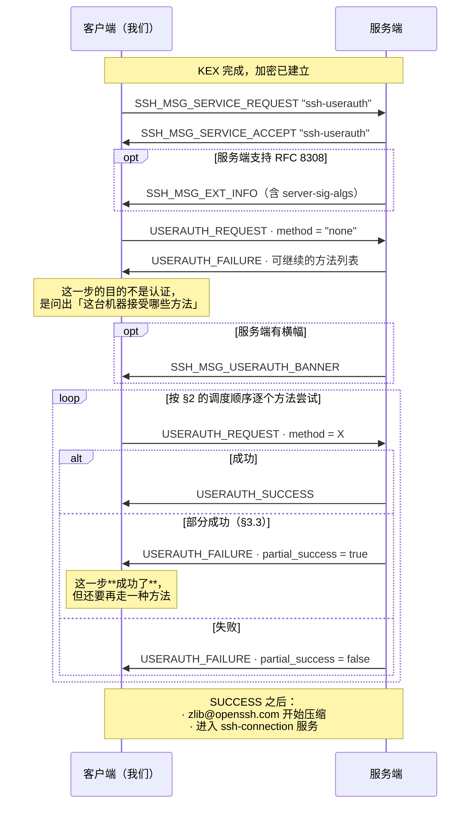
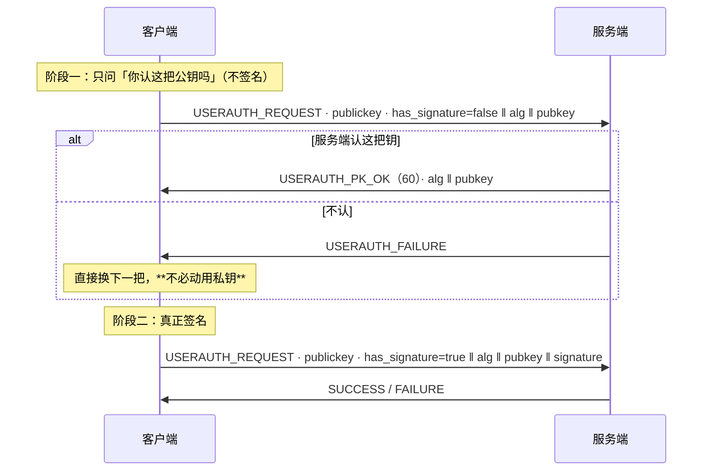
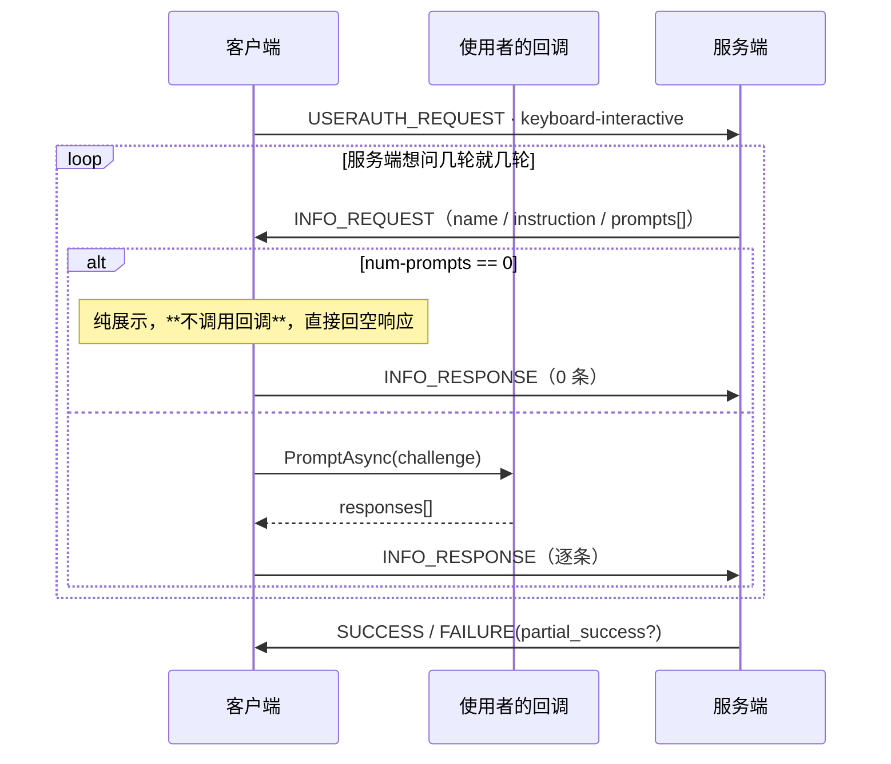

# 04 · 认证

> 规范依据：RFC 4252（Authentication Protocol）；RFC 4256（keyboard-interactive）；
> RFC 8332（rsa-sha2-*）；RFC 8308（Extension Negotiation / `server-sig-algs`）；
> RFC 4462（GSS-API）；OpenSSH `PROTOCOL.certkeys`、`PROTOCOL.agent`。
>
> 对应实现：`Auth/`（L7）。
>
> **本文件里最重要的两节是 §3.3（部分成功）与 §6（keyboard-interactive）。**
> 它们合起来就是 2FA / OTP 能不能用 —— 而这正是我们决定自己实现 SSH 库的头号动因之一。

---

## 一 总览



---

## 二 方法调度

### 2.1 `none` 探测

**总是先发一次 `none`。** 它几乎总会失败，但 `USERAUTH_FAILURE` 里带回
**服务端愿意接受的方法列表** —— 这是唯一能问到这份清单的途径。

〔注意〕`none` 也可能**成功**（服务端配置了无认证）。必须正确处理这种情况，
不能假设它一定失败。

### 2.2 调度规则

〔决策〕**按使用者给出的凭据顺序尝试，但过滤掉服务端不接受的方法。**

```
候选 = 使用者配置的凭据（有序）
可用 = 服务端在最近一次 FAILURE 中给出的方法列表

重复扫描:
    for 凭据 in 候选（每次扫描都从头开始）:
        if 凭据已经试过: 跳过（每条凭据至多试一次，第 4 条）
        if 凭据.Method not in 可用: 跳过（记录「因服务端不接受而跳过」，不算试过）
        if 凭据.Method ≠ publickey 且该方法已失败 N 次: 跳过（第 3 条）
        结果 = 尝试(凭据)
        if 结果 == Success: 完成
        if 结果 == PartialSuccess: 刷新「可用」，结束本次扫描、从头再扫（§3.3）
        if 结果 == Failure: 刷新「可用」，继续
直到某次扫描走完都没有出现 PartialSuccess
抛 AuthenticationMethodExhausted，附上逐条尝试记录
```

**四个〔决策〕**：

1. **使用者配置的凭据列表就是全部，不做任何隐式回退。**
   不自动读 `~/.ssh/id_*`，不自动连 ssh-agent，除非使用者显式加了对应凭据。

   理由：隐式回退在桌面客户端里是实打实的问题 —— 用户在界面上选了「密码」，
   库却先拿某把默认私钥去试，于是服务器日志里出现莫名其妙的失败记录；
   Windows 上 `SSH_AUTH_SOCK` 常指向 msys/WSL 的 Unix 套接字，
   自动连 agent 每次都撞一发异常。**要用默认密钥或 agent，显式把它们加进凭据列表即可**：
   私钥文件用 `SshPrivateKeyFile.LoadAsync` 读出签名器、包成 `PublicKeyCredential`；
   agent 用 `SshAgentClient.GetCredentialsAsync` 取回一组 `PublicKeyCredential`（每把钥一条）。
   一两行的事，但那是使用者的显式决定。

2. **跳过的原因必须记录下来。** `AuthenticationMethodExhausted` 的异常里
   带一张逐条表：哪些试了、结果如何；哪些**因为服务端不接受而没试**。
   没有这张表，「skipped: publickey」这种信息就只存在于日志里，
   而用户看到的是一句「用户名或密码不正确」。

3. **失败次数上限只管 `password` 与 `keyboard-interactive`**：同一次认证里某个方法累计失败 N 次
   （〔决策〕N = 3，`SshAuthenticator.MaxFailuresPerMethod`）后，排在后面的同方法凭据不再尝试，
   记成 `SkippedNotOffered`，`Detail` 写明「在这次认证里已经失败 N 次」。密码经 keyboard-interactive 作答（§6.5）时
   计在 `keyboard-interactive` 名下。这两种方法的重试是对**同一个秘密**的反复猜测，
   服务端通常也有自己的计数，撞满会被临时封禁。

   〔决策〕**`publickey` 不受这个上限约束。** 每把钥是不同的凭据，各自只试一次。
   曾经它也按「失败 3 次就停」算 —— agent 里有五把钥、对的是第四把时，第四把永远轮不到，
   那台机器就永远登不上。公钥的总次数交给服务端自己的 `MaxAuthTries`：撞满时服务端断开连接（§9）。
   钥多的时候，把对的那把排在前面。

4. **部分成功之后从头再扫一遍。** 部分成功（§3.3）之后服务端的可用方法列表变了，
   之前因方法「当时不被接受」而跳过的凭据，要按新列表**再给一次机会**。
   典型场景是 `AuthenticationMethods publickey,password`：服务端起初只报 `publickey`，
   排在前面的口令凭据被跳过；公钥那一步通过之后服务端才开放 `password`。
   曾经循环只走一遍，那条口令凭据再也轮不到，认证以「凭据试完了」失败，而使用者明明两样都配了。

   〔决策〕**重扫只捡回「因方法不被接受而跳过」的凭据，每条凭据至多真正尝试一次。**
   试过的 —— 不论结果是部分成功、失败还是 `SkippedNoMaterial` —— 不再试：同一把钥、同一个口令
   换个时机也不会变成对的，再试只是白耗服务端的 `MaxAuthTries`。每次重扫都由一条新凭据的部分成功触发，
   所以扫描次数不会超过凭据条数。代价是同一条凭据可能在尝试记录里留下多条「跳过」，每次扫描一条。

### 2.3 `USERAUTH_REQUEST` 的通用字段

| # | 类型 | 字段 |
| :-: | --- | --- |
| 1 | `byte` | `SSH_MSG_USERAUTH_REQUEST` = 50 |
| 2 | `string` | 用户名（**UTF-8**） |
| 3 | `string` | 服务名，恒为 `"ssh-connection"` |
| 4 | `string` | 方法名 |
| 5+ | 方法相关 | 见各节 |

〔注意〕**用户名在每个请求里重复出现，且必须始终相同。**
RFC 4252 §5 允许中途改用户名，但服务端行为未定义 —— 我们**禁止**这么做。

---

## 三 `USERAUTH_FAILURE` 与部分成功

### 3.1 字段表

| # | 类型 | 字段 |
| :-: | --- | --- |
| 1 | `byte` | `SSH_MSG_USERAUTH_FAILURE` = 51 |
| 2 | `name-list` | 可继续的认证方法 |
| 3 | `boolean` | `partial_success` |

### 3.2 方法列表的语义

这是**「接下来可以用哪些方法」**，不是「这台机器支持哪些方法」。
它会随认证进度变化 —— 部分成功之后，列表通常会缩小到剩下的那一种。

**每次收到 `FAILURE` 都要用新列表覆盖旧的**，不要合并、不要只取第一次。

### 3.3 部分成功 —— 2FA 的协议表达

> **`partial_success == true` 意味着这一步认证成功了。**

服务端在说：「你这一步过了，但我还要求你再过一种方法。」
多因素认证（公钥 + OTP、密码 + OTP）在 SSH 里就是这么表达的 ——
**没有单独的「2FA 报文」**。

**把 `partial_success = true` 当成失败处理，是 2FA 支持最常见、也最隐蔽的实现错误。**
症状是：用户输对了密码、也输对了动态码，但客户端在第一步之后就把这条凭据判死，
接着去试下一条（通常没有了），最后报「认证失败」。

正确处理：

```
收到 FAILURE(partial_success = true):
    记录「方法 X 已通过」
    刷新可用方法列表
    **不要**把这条凭据标记为失败，也不要计入失败计数
    回到凭据列表开头，按新列表重新挑（§2.2 第 4 条）
```

〔决策〕**部分成功后，允许同一个凭据类型再次出现。**
例如服务端要求「publickey 两次，两把不同的密钥」—— 这在高安全环境里是真实配置。
允许的是同一**类型**的另一条凭据；同一条凭据不会试第二次（§2.2 第 4 条）。

### 3.4 认证尝试记录

每一次尝试（包括跳过）都记一条 `SshAuthAttempt`；成功时整张表在 `SshAuthenticationResult.Attempts` 里，
失败时在 `SshAuthenticationException.Attempts` 里：

| 字段 | 内容 |
| --- | --- |
| `Method` | 方法名 |
| `CredentialLabel` | 使用者给凭据起的名字（如私钥路径），**不含任何密钥材料** |
| `Outcome` | `Success` / `PartialSuccess` / `Failure` / `SkippedNotOffered` / `SkippedNoMaterial` |
| `ServerOfferedAfter` | 这一步之后服务端给出的方法列表 |
| `Detail` | 例如「私钥文件读不出来」「服务端不接受这把公钥」 |

它的存在理由很具体：**要让「这台机器需要动态码」和「密码打错了」在 UI 上能区分开。**

〔决策〕**`SkippedNoMaterial` 只记「凭据自己出的问题」**：取口令的回调、keyboard-interactive 的应答回调、
签名器（本地私钥、agent、外部签名）抛出的异常 —— 包括 agent 拒签这类库自己的异常类型。
这些调用都发生在**没有请求在途**的时刻（发请求之前，或读完上一个应答之后），
跳过它、接着发下一条凭据的请求不会让应答错位。

**其余一律照实抛出，不许当成跳过**：连接中断（包成 `ClosedByPeer`）、服务端报文格式非法（包成 `ProtocolError`）、
横幅回调抛出的异常。它们发生时请求往往已经发出、应答还没读 —— 当成「跳过」接着试下一条，
下一条凭据读到的就是上一条的应答；服务端其实已经认证通过，客户端却报「所有方法都失败」。
取消（`OperationCanceledException`）同样照实抛出。

---

## 四 `publickey`（RFC 4252 §7）

### 4.1 两段式：先问后签



〔决策〕**当私钥在本地且已解密时，跳过阶段一，直接签。**
省一个 RTT，代价是服务端不认这把钥时白签一次（本地计算，很便宜）。

〔决策〕**当签名要走外部（ssh-agent / PKCS#11 / HSM / KeyVault）时，必须走阶段一。**
理由：外部签名可能要用户按硬件键、输 PIN、走网络。为一把服务端根本不认的密钥
去打扰用户或发一次网络请求是不可接受的。

这条区分由 `ISshSigner.IsLocalAndCheap` 表达。

### 4.2 请求字段

| # | 类型 | 字段 |
| :-: | --- | --- |
| 1–4 | | 通用（§2.3），方法名 `"publickey"` |
| 5 | `boolean` | `has_signature` |
| 6 | `string` | 公钥算法名 |
| 7 | `string` | 公钥 blob |
| 8 | `string` | 签名（仅 `has_signature = true` 时） |

### 4.3 签名输入 —— 必须逐字节精确

被签名的数据是：

```
string    session_id          ← §03 4.3，不是当前的 H
byte      SSH_MSG_USERAUTH_REQUEST (50)
string    user name
string    "ssh-connection"
string    "publickey"
boolean   TRUE
string    公钥算法名
string    公钥 blob
```

**三个要点**：

1. 第一项是 `session_id`（**首次** KEX 的 `H`），**按 `string` 编码**（带 4 字节长度前缀）。
2. 从第二项起，内容与实际发送的 `USERAUTH_REQUEST` 报文**逐字节相同**。
   因此实现上最稳的写法是：**先把请求报文的载荷拼出来，再在前面拼上
   `string session_id`，整体交给签名器** —— 而不是分两处各拼一遍。
   分两处拼是这里出错的唯一原因。
3. `boolean TRUE` 必须发 `0x01`。

### 4.4 RSA 的签名算法选择（RFC 8332）

`ssh-rsa` 用 SHA-1，已被广泛弃用。`rsa-sha2-256` / `rsa-sha2-512` 是替代。
问题在于：**同一把 RSA 密钥可以用三种签名算法，而客户端无从知道服务端接受哪种**
—— 除非服务端发了 `server-sig-algs`。

规则：

| 情况 | 我们用什么 |
| --- | --- |
| 收到 `server-sig-algs`（§7） | 取其中我们支持的、优先级最高的（`rsa-sha2-512` > `rsa-sha2-256` > `ssh-rsa`） |
| 收到 `server-sig-algs`，但其中没有我们能用的 | 〔决策〕仍用我们自己的第一偏好（`rsa-sha2-512`）。宣告不完整的服务端确实存在，试错的代价只是一次多余的往返 |
| 未收到 `server-sig-algs` | 〔决策〕先试 `rsa-sha2-512`；〔未实现〕若因此失败，**降级重试一次** `ssh-rsa`（仅当使用者允许 SHA-1）。今天只用第一偏好，失败了不重试 |

〔决策〕**降级默认关闭**（`AllowSha1RsaSignatures = false`）。
理由：无条件降级会把 Terrapin 那类降级攻击的收益还回去。
需要连老服务器的人显式打开。〔未实现〕在诊断信息里能看到「本次使用了 SHA-1 签名」—— 今天选中的签名算法不进尝试记录。
由于上表第三行的重试也还没有，今天打开这个开关只在 `server-sig-algs` 列了 `ssh-rsa`、却没列 `rsa-sha2-*` 时
（或签名器只提供 `ssh-rsa` 时）起作用；不发 `server-sig-algs` 的老服务器照样只收到 `rsa-sha2-512`。

〔注意〕**判断「是不是 SHA-1」之前先去掉证书后缀**（`SshPublicKey.StripCertificateSuffix`）。
RSA 证书（§4.5）的三个算法名是 `rsa-sha2-512-cert-v01@openssh.com`、`rsa-sha2-256-cert-v01@openssh.com`
与 `ssh-rsa-cert-v01@openssh.com`，最后一个同样是 SHA-1 签名，`AllowSha1RsaSignatures = false` 时
与 `ssh-rsa` 一样被滤掉。只比对 `ssh-rsa` 这个名字的话，拿 RSA 证书登录、服务端的 `server-sig-algs`
又只列了 `ssh-rsa-cert-v01@openssh.com` 时，SHA-1 照样会被挑出来用 —— 开关形同虚设。

〔注意〕公钥 blob 里的类型串**永远是 `"ssh-rsa"`**，与签名算法名无关（§03 5.1）。

### 4.5 证书认证（OpenSSH `PROTOCOL.certkeys`）

证书认证**不是**另一种方法，仍然是 `publickey`，只是：

- 算法名是 `ssh-ed25519-cert-v01@openssh.com` 之类；
- 「公钥 blob」位置放的是**整个证书**；
- **签名仍然由对应的私钥产生**，证书只是 CA 的背书。

因此实现上它完全复用 §4.1–§4.4 的路径，只多一件事：
把证书文件与私钥配对。〔决策〕**配对由使用者显式完成**：`OpenSshCertificate.LoadAsync` 读证书，
`SshCertificateSigner.Create(证书, 私钥签名器)` 把两者合成一个签名器，再包成 `PublicKeyCredential`。
`Create` 当场核对证书与私钥是不是一对，配错了立刻报 —— 否则表现只是服务端一句 `Permission denied`，
与「CA 不被信任」「主体不匹配」分不开。库**不会**去私钥旁边找同名的 `id_*-cert.pub`，
与 §2.2 第 1 条一致：不读使用者没点名的文件。

〔决策〕**客户端不校验自己证书的有效期。** 那是服务端的职责；
本地校验只会在时钟不同步时制造假阴性。〔未实现〕设计是**把过期事实放进
`SshAuthAttempt.Detail`** —— 认证失败时这是头号线索。今天认证器不看证书的有效期，`Detail` 里没有这一条；
有效期由 `OpenSshCertificate.ValidBeforeTime` / `IsTimeValid` 交给使用者，要在界面上说「证书过期了」得自己判断。

**agent 里的证书。** `ssh-add` 加 `id_*` 时会顺手把同名的 `id_*-cert.pub` 一起加进去，
所以 agent 的身份列表里常有 `*-cert-v01@openssh.com` 类型的条目。

〔决策〕**agent 里的证书作为证书身份列出，可以直接用来认证。**
`SshAgentClient.ListIdentitiesAsync` 用 `SshPublicKey.Parse` 解析每条身份，它认得证书 blob
（`IsCertificate = true`）；`GetCredentialsAsync` 把证书身份与普通钥一样包成 `publickey` 凭据。
出示的是整张证书，签名仍由 agent 用证书里那把钥来做 —— 签名请求里带的也是那张证书的 blob，与 agent 列出的一致。
曾经 `Parse` 不认证书，而列表只跳过特定几种异常：agent 里只要有一张证书，整个列表就解析失败，
agent 认证、agent 转发、自动加钥三条路一起断。

〔决策〕**解析不了的身份只跳过那一条。** 格式坏掉的证书、本库不支持的证书类型
（证书里的钥只认 Ed25519、ECDSA P-256/384/521 与 RSA；FIDO 的 `sk-*`、`ssh-dss` 都不认），
与不认识的普通钥（`sk-*`、`ssh-dss`、厂商私有类型）一样，跳过即可 —— 为其中一条报错等于让整个 agent 用不了。

〔注意〕**RSA 证书的签名请求要按去掉证书后缀的算法名设标志位**（`SshAgentClient.SignAsync`）。
agent 协议里 RSA 用哪种 SHA-2 靠 `SSH_AGENT_RSA_SHA2_256` / `SSH_AGENT_RSA_SHA2_512` 标志位表达，
不带标志位就是 SHA-1。证书的算法名是 `rsa-sha2-512-cert-v01@openssh.com`，直接拿它去比 `rsa-sha2-512`
对不上，标志位就空着，agent 签出来的是 SHA-1 的 `ssh-rsa` —— 与请求里声明的算法不符，
而且正是 §4.4 默认要禁掉的那一种。

〔决策〕**证书的指纹就是证书里那把钥的指纹**（`SshPublicKey.Sha256Fingerprint` / `Md5Fingerprint`），
与 `ssh-keygen -l` 对证书显示的一致。按整张证书的 blob 算的话，每次重签指纹都会变，
而用户拿去对照的永远是那把钥。因此同一把钥的普通身份与证书身份在列表里显示同一个指纹，这是对的。

### 4.6 私钥文件

本地私钥由 `SshPrivateKeyFile.LoadAsync` / `Parse` 读入，按文件头认格式。密钥类型支持 Ed25519、RSA、
ECDSA P-256/384/521。

| 格式 | 文件头 | 加密 | 谁来解 |
| --- | --- | --- | --- |
| OpenSSH（`openssh-key-v1`，OpenSSH 7.8 起 `ssh-keygen` 的默认） | `BEGIN OPENSSH PRIVATE KEY` | 不加密；或 `bcrypt` KDF + `aes{128,192,256}-ctr`、`aes{128,192,256}-cbc`、`aes{128,256}-gcm@openssh.com`、`chacha20-poly1305@openssh.com` | 本库 |
| PuTTY `.ppk` v2 / v3 | `PuTTY-User-Key-File-2` / `-3` | 不加密；或 `aes256-cbc`（v2 用 SHA-1 派生，v3 用 Argon2id） | 本库 |
| PKCS#8 | `BEGIN PRIVATE KEY` / `BEGIN ENCRYPTED PRIVATE KEY` | 不加密；或 PKCS#8 自带的口令加密 | BCL（PKCS#8 里的 Ed25519 读不了） |
| PKCS#1 RSA / SEC1 EC，不加密 | `BEGIN RSA PRIVATE KEY` / `BEGIN EC PRIVATE KEY` | 无 | BCL |
| 传统加密 PEM | 上一行的文件头 + `Proc-Type: 4,ENCRYPTED` | 口令经一次 MD5 派生 + 3DES / AES-CBC | **拒绝**（见下） |

〔决策〕**只支持上表里的现代格式，传统加密 PEM 有意不实现。**
它是 OpenSSH 7.8 之前 `ssh-keygen` 加口令时的默认格式（今天 `ssh-keygen -m PEM` 仍会写出它）：
口令只经一次 MD5 就成了密钥，没有迭代、没有可调的代价，常配 3DES。为读这种弱格式在安全库里带上它不划算；
而转换只要一条命令。遇到时抛 `SshPrivateKeyException`，**在要口令之前**就说清楚是格式不受支持，
并给出转换办法：`ssh-keygen -p -f <私钥文件>` 改一次口令（新旧口令可以相同），它会把文件重写成 `openssh-key-v1`。

〔决策〕**这个异常的 `NeedsPassphrase` 为 `false`。** `NeedsPassphrase = true` 的含义是
「缺口令或口令不对，再问一次有用」，界面靠它决定要不要再弹输入框；格式不受支持时问多少次都没用。
曾经这种文件被交给 BCL，BCL 不认，结论却报成「口令多半不对」且 `NeedsPassphrase = true` ——
用户一遍遍重输正确的口令，界面一遍遍再弹输入框。

---

## 五 `password`（RFC 4252 §8）

| # | 类型 | 字段 |
| :-: | --- | --- |
| 1–4 | | 通用，方法名 `"password"` |
| 5 | `boolean` | `FALSE`（改密码时为 `TRUE`） |
| 6 | `string` | 密码（**UTF-8**） |

### 5.1 密码修改请求

服务端可以回 `SSH_MSG_USERAUTH_PASSWD_CHANGEREQ`（**60**，方法专用编号）：

| # | 类型 | 字段 |
| :-: | --- | --- |
| 1 | `byte` | 60 |
| 2 | `string` | 提示文本（UTF-8） |
| 3 | `string` | 语言标记（忽略） |

〔决策〕**认得它，但不实现改密码流程** —— 收到它一律记为这条口令凭据的一次失败，
`Detail` 写明原因（「服务端要求先修改密码（本库尚未实现改密码流程）」），而不是当成一个无法理解的报文。
没有改密码的回调可配，请求里的「改密码」标志永远发 `FALSE`。

理由：密码过期在企业环境里很常见，而「客户端直接断开且不说为什么」
是用户最难自救的一种失败。

### 5.2 安全要求

- 密码**必须**以 UTF-8 编码，且**禁止**做任何规范化（NFC/NFKC）——
  服务端拿到的是什么就比什么。
- 密码在内存里的生命周期要尽量短，用完 `ZeroMemory`。
  〔决策〕凭据接口收 `Func<CancellationToken, ValueTask<...>>` 而不是 `string`，
  让使用者可以在真正需要时才解密取出。
- **禁止**把密码写进任何日志或 `IPacketTap`（总则 §5.5）。

---

## 六 `keyboard-interactive`（RFC 4256）—— 2FA / OTP 的落点

> **这是自己实现 SSH 库的头号动因之一。** 堡垒机上的 Google Authenticator、Duo、
> RSA SecurID 走的都是这条路。

### 6.1 请求

| # | 类型 | 字段 |
| :-: | --- | --- |
| 1–4 | | 通用，方法名 `"keyboard-interactive"` |
| 5 | `string` | 语言标记，〔决策〕发空串 |
| 6 | `string` | 子方法提示，〔决策〕发空串（让服务端自己挑） |

### 6.2 `SSH_MSG_USERAUTH_INFO_REQUEST`（60，方法专用）

| # | 类型 | 字段 |
| :-: | --- | --- |
| 1 | `byte` | 60 |
| 2 | `string` | `name` —— 对话框标题（UTF-8，可空） |
| 3 | `string` | `instruction` —— 说明文字（UTF-8，可空） |
| 4 | `string` | 语言标记（忽略） |
| 5 | `uint32` | `num-prompts` |
| 6 | 重复 `num-prompts` 次 | `string prompt`（UTF-8） ‖ `boolean echo` |

### 6.3 `SSH_MSG_USERAUTH_INFO_RESPONSE`（61，方法专用）

| # | 类型 | 字段 |
| :-: | --- | --- |
| 1 | `byte` | 61 |
| 2 | `uint32` | `num-responses` —— **必须**等于请求里的 `num-prompts` |
| 3 | 重复 | `string response`（UTF-8） |

### 6.4 时序 —— 可以来回多轮



**六条必须**：

1. **`num-prompts == 0` 是合法的**，用于纯展示信息（「请按下硬件令牌上的按钮」）。
   此时**不应**弹窗要用户输入，直接回一个 0 条响应的 `INFO_RESPONSE`。
   〔决策〕但**要把 `instruction` 交给回调**（用一个 `IsInformationalOnly = true` 的
   challenge），让 UI 能显示「请按令牌」这句话 —— 否则用户对着一个没反应的界面干等。
2. **响应条数必须与提示条数完全相等**，多一条少一条都是协议错误。
3. **`echo == false` 的提示必须以密码方式采集**（不回显）。
   `echo == true` 的通常是用户名或一次性附加信息。
4. **轮数必须有上限**（〔决策〕**64 轮**）。服务端理论上可以无限问下去，
   那是一个拿用户注意力做的拒绝服务。
5. **单轮提示数上限**（〔决策〕**32 条**）、**各字符串长度上限**（〔决策〕**4 KiB**）。
6. `name` / `instruction` / `prompt` 都来自**未认证的对端**，
   是注入面。库原样交给使用者，但**文档里必须写明**：
   展示这些文本时要按不可信内容处理（不解释控制字符、不当作富文本）。

### 6.5 与密码的关系

很多服务器同时开放 `password` 与 `keyboard-interactive`，
且后者的唯一提示就是「Password:」。

〔决策〕**提供 `PasswordCredential.AlsoAnswerKeyboardInteractive`（默认 `true`）**：
当 `keyboard-interactive` 的提示只有一条、且 `echo == false` 时，
自动用密码作答，不打扰使用者。

理由：这是 OpenSSH 客户端的实际行为，用户期望的也是这个。
但**必须**能关掉 —— 在真正的 2FA 场景里，第一条提示可能就是动态码，
自动填密码只会白白消耗一次尝试。

---

## 七 扩展协商（RFC 8308）

### 7.1 `SSH_MSG_EXT_INFO`（7）

| # | 类型 | 字段 |
| :-: | --- | --- |
| 1 | `byte` | 7 |
| 2 | `uint32` | `nr-extensions` |
| 3 | 重复 | `string name` ‖ `string value` |

**可能出现在两个位置**（RFC 8308 §2.3）：

1. 首次 `NEWKEYS` **之后**立刻；
2. `SSH_MSG_USERAUTH_SUCCESS` **之前**。

两个位置都要能收。**其它位置收到 → 协议错误。**

### 7.2 我们关心的扩展

| 扩展 | 用途 |
| --- | --- |
| `server-sig-algs` | §4.4 —— 没有它就无法安全选择 RSA 签名算法 |
| `delay-compression` | 〔决策〕**不实现**。`zlib@openssh.com` 已经解决同一问题 |
| `no-flow-control` | 〔决策〕**不实现**。我们的窗口管理依赖流控 |
| `elevation` | 〔决策〕**不实现**（Windows 服务端专用） |
| `publickey-hostbound@openssh.com` | 〔决策〕M5 再看。与 agent 转发的安全性相关 |

**未知扩展一律忽略**，不报错。

---

## 八 横幅（`SSH_MSG_USERAUTH_BANNER`，53）

| # | 类型 | 字段 |
| :-: | --- | --- |
| 1 | `byte` | 53 |
| 2 | `string` | 文本（UTF-8） |
| 3 | `string` | 语言标记（忽略） |

- **可以在认证期间的任何时刻到达，可以多次。**
- 交给 `SshConnectionOptions.BannerHandler`。
- 〔决策〕限制：单条 ≤ 64 KiB，累计 ≤ 256 KiB，条数 ≤ 1024。超限断开。
- 同 §6.4 第 6 条：这是不可信文本，文档必须写明。

---

## 九 边界与错误速查

| 情况 | 失败原因 | 说明 |
| --- | --- | --- |
| `SERVICE_REQUEST` 被拒 | `ProtocolError` | 服务端不提供 `ssh-userauth`，极罕见 |
| 全部方法试完仍未成功 | `AuthenticationMethodExhausted` | **带逐条尝试记录**（§3.4） |
| 服务端撞满自己的 `MaxAuthTries` 后断开 | `Disconnected` | §2.2 第 3 条。公钥不受本库的失败上限约束，总次数由它兜底 |
| 私钥是传统加密 PEM（`Proc-Type: 4,ENCRYPTED`） | `Unsupported` | §4.6。`SshPrivateKeyException.NeedsPassphrase = false` —— 不要再弹口令框 |
| 服务端只给 `keyboard-interactive` 且我们没配对应凭据 | `TwoFactorRequired` | 〔决策〕单独一个原因码 —— 让 UI 能说「这台机器需要动态码」 |
| `INFO_RESPONSE` 条数不符 | `ProtocolError` | |
| 交互轮数 / 提示数 / 长度超限 | `ProtocolError` | §6.4 |
| 横幅超限 | `ProtocolError` | §8 |
| `EXT_INFO` 出现在非法位置 | `ProtocolError` | §7.1 |
| 认证期间收到通道消息（80–127） | `ProtocolError` | 认证完成前连接协议尚未启动 |
| 认证超时 | `Timeout` | 〔决策〕独立于 `ConnectTimeout`：`AuthenticationTimeout` 默认 2 分钟 —— 用户要去掏手机看动态码 |

〔决策〕**认证超时独立计时**，与主机密钥裁决（§03 5.3）同一个理由：
任何需要人参与的步骤都不该被一个为网络往返设计的超时打断。
