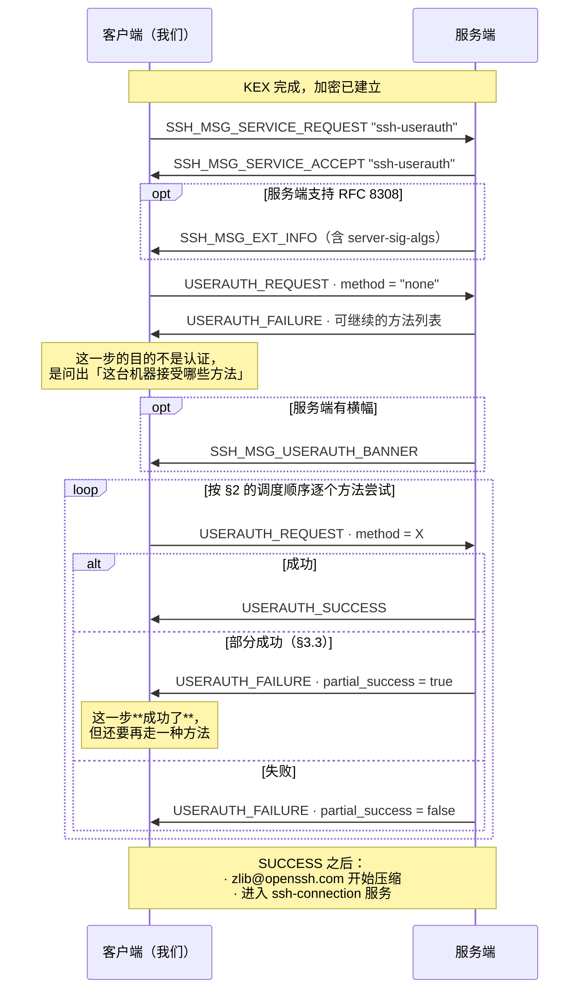
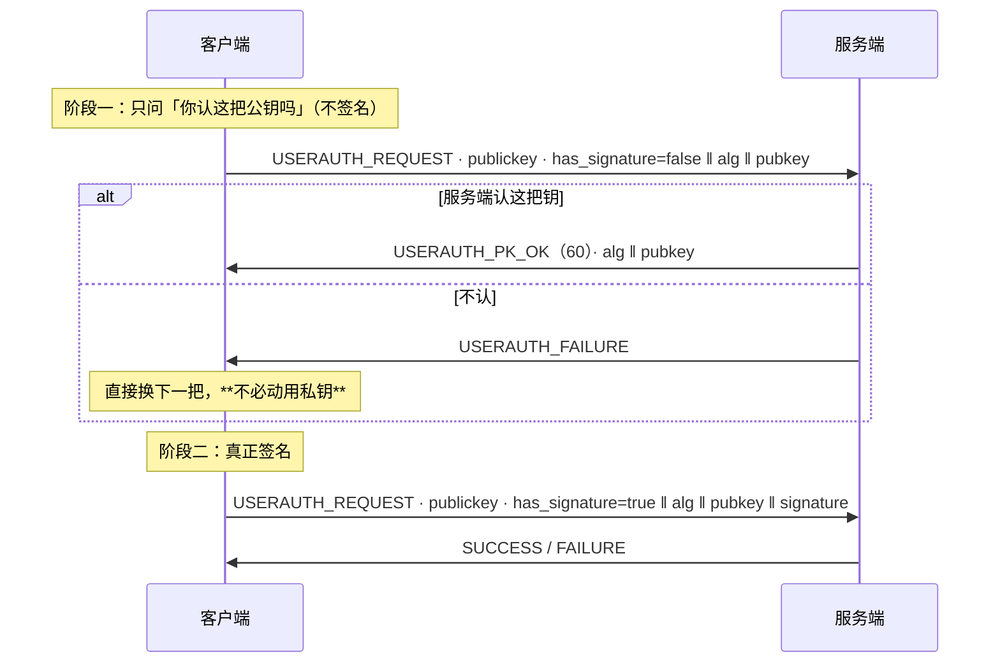
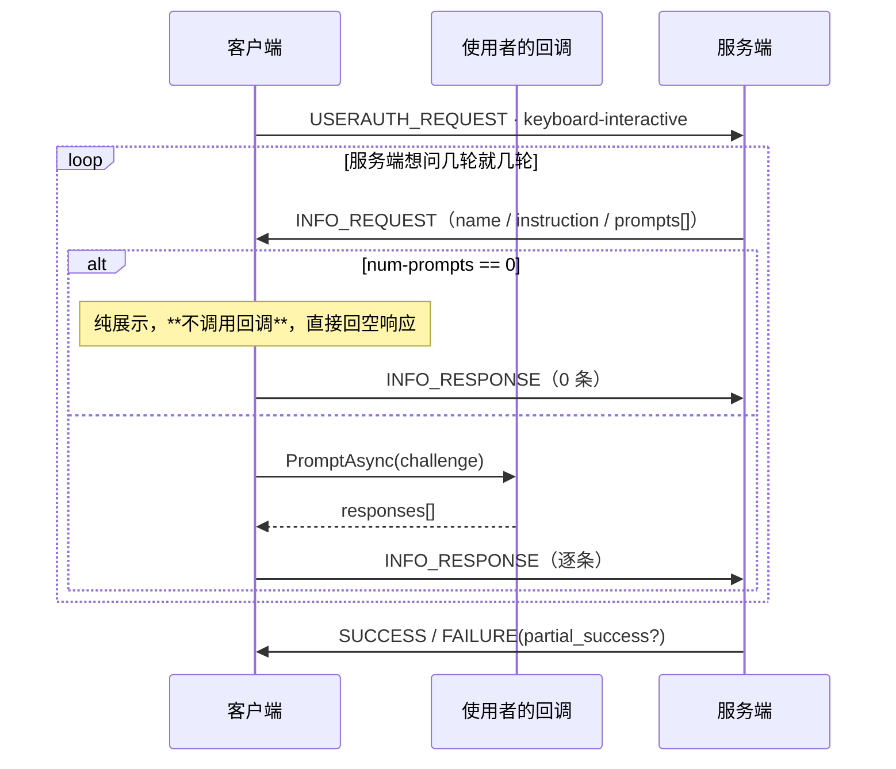

# 04 · 认证

> 规范依据：RFC 4252（Authentication Protocol）；RFC 4256（keyboard-interactive）；
> RFC 8332（rsa-sha2-*）；RFC 8308（Extension Negotiation / `server-sig-algs`）；
> RFC 4462（GSS-API）；OpenSSH `PROTOCOL.certkeys`、`PROTOCOL.agent`。
>
> 对应实现：`Auth/`（L7）。
>
> **本文件里最重要的两节是 §3.3（部分成功）与 §6（keyboard-interactive）。**
> 它们合起来就是 2FA / OTP 能不能用 —— 而这正是我们自研的头号动因之一。

---

## 一 总览



---

## 二 方法调度

### 2.1 `none` 探测

**总是先发一次 `none`。** 它几乎总会失败，但 `USERAUTH_FAILURE` 里带回
**服务端愿意接受的方法列表** —— 这是唯一能问到这份清单的途径。

〔注意〕`none` 也可能**成功**（服务端配置了无认证）。必须正确处理这种情况，
不能假设它一定失败。

### 2.2 调度规则

〔决策〕**按使用者给出的凭据顺序尝试，但过滤掉服务端不接受的方法。**

```
候选 = 使用者配置的凭据（有序）
可用 = 服务端在最近一次 FAILURE 中给出的方法列表

for 凭据 in 候选:
    if 凭据.Method not in 可用: 跳过（记录「因服务端不接受而跳过」）
    结果 = 尝试(凭据)
    if 结果 == Success: 完成
    if 结果 == PartialSuccess: 刷新「可用」，继续外层循环（§3.3）
    if 结果 == Failure: 刷新「可用」，继续
抛 AuthenticationMethodExhausted，附上逐条尝试记录
```

**三个〔决策〕**：

1. **使用者配置的凭据列表就是全部，不做任何隐式回退。**
   不自动读 `~/.ssh/id_*`，不自动连 ssh-agent，除非使用者显式加了对应凭据。

   理由：隐式回退在桌面客户端里是实打实的问题 —— 用户在界面上选了「密码」，
   库却先拿某把默认私钥去试，于是服务器日志里出现莫名其妙的失败记录；
   Windows 上 `SSH_AUTH_SOCK` 常指向 msys/WSL 的 Unix 套接字，
   自动连 agent 每次都撞一发异常。**要用默认密钥或 agent，加一个
   `DefaultIdentityCredential` / `AgentCredential` 即可**，一行的事，
   但那是使用者的显式决定。

2. **跳过的原因必须记录下来。** `AuthenticationMethodExhausted` 的异常里
   带一张逐条表：哪些试了、结果如何；哪些**因为服务端不接受而没试**。
   没有这张表，「skipped: publickey」这种信息就只存在于日志里，
   而用户看到的是一句「用户名或密码不正确」。

3. **失败次数与退避**：同一个方法连续失败 N 次（〔决策〕N = 3）后不再重试。
   服务端通常也有自己的计数，撞满会被临时封禁。

### 2.3 `USERAUTH_REQUEST` 的通用字段

| # | 类型 | 字段 |
| :-: | --- | --- |
| 1 | `byte` | `SSH_MSG_USERAUTH_REQUEST` = 50 |
| 2 | `string` | 用户名（**UTF-8**） |
| 3 | `string` | 服务名，恒为 `"ssh-connection"` |
| 4 | `string` | 方法名 |
| 5+ | 方法相关 | 见各节 |

〔注意〕**用户名在每个请求里重复出现，且必须始终相同。**
RFC 4252 §5 允许中途改用户名，但服务端行为未定义 —— 我们**禁止**这么做。

---

## 三 `USERAUTH_FAILURE` 与部分成功

### 3.1 字段表

| # | 类型 | 字段 |
| :-: | --- | --- |
| 1 | `byte` | `SSH_MSG_USERAUTH_FAILURE` = 51 |
| 2 | `name-list` | 可继续的认证方法 |
| 3 | `boolean` | `partial_success` |

### 3.2 方法列表的语义

这是**「接下来可以用哪些方法」**，不是「这台机器支持哪些方法」。
它会随认证进度变化 —— 部分成功之后，列表通常会缩小到剩下的那一种。

**每次收到 `FAILURE` 都要用新列表覆盖旧的**，不要合并、不要只取第一次。

### 3.3 部分成功 —— 2FA 的协议表达

> **`partial_success == true` 意味着这一步认证成功了。**

服务端在说：「你这一步过了，但我还要求你再过一种方法。」
多因素认证（公钥 + OTP、密码 + OTP）在 SSH 里就是这么表达的 ——
**没有单独的「2FA 报文」**。

**把 `partial_success = true` 当成失败处理，是 2FA 支持最常见、也最隐蔽的实现错误。**
症状是：用户输对了密码、也输对了动态码，但客户端在第一步之后就把这条凭据判死，
接着去试下一条（通常没有了），最后报「认证失败」。

正确处理：

```
收到 FAILURE(partial_success = true):
    记录「方法 X 已通过」
    刷新可用方法列表
    **不要**把这条凭据标记为失败，也不要计入失败计数
    继续外层循环，用新列表挑下一个方法
```

〔决策〕**部分成功后，允许同一个凭据类型再次出现。**
例如服务端要求「publickey 两次，两把不同的密钥」—— 这在高安全环境里是真实配置。

### 3.4 认证尝试记录

每一次尝试都往 `AuthAttemptLog` 里记一条：

| 字段 | 内容 |
| --- | --- |
| `Method` | 方法名 |
| `CredentialLabel` | 使用者给凭据起的名字（如私钥路径），**不含任何密钥材料** |
| `Outcome` | `Success` / `PartialSuccess` / `Failure` / `SkippedNotOffered` / `SkippedNoMaterial` |
| `ServerOfferedAfter` | 这一步之后服务端给出的方法列表 |
| `Detail` | 例如「私钥文件读不出来」「服务端不接受 rsa-sha2-512」 |

这张表会装进 `SshAuthenticationException`。
它的存在理由很具体：**要让「这台机器需要动态码」和「密码打错了」在 UI 上能区分开。**

---

## 四 `publickey`（RFC 4252 §7）

### 4.1 两段式：先问后签



〔决策〕**当私钥在本地且已解密时，跳过阶段一，直接签。**
省一个 RTT，代价是服务端不认这把钥时白签一次（本地计算，很便宜）。

〔决策〕**当签名要走外部（ssh-agent / PKCS#11 / HSM / KeyVault）时，必须走阶段一。**
理由：外部签名可能要用户按硬件键、输 PIN、走网络。为一把服务端根本不认的密钥
去打扰用户或发一次网络请求是不可接受的。

这条区分由 `ISshSigner.IsLocalAndCheap` 表达。

### 4.2 请求字段

| # | 类型 | 字段 |
| :-: | --- | --- |
| 1–4 | | 通用（§2.3），方法名 `"publickey"` |
| 5 | `boolean` | `has_signature` |
| 6 | `string` | 公钥算法名 |
| 7 | `string` | 公钥 blob |
| 8 | `string` | 签名（仅 `has_signature = true` 时） |

### 4.3 签名输入 —— 必须逐字节精确

被签名的数据是：

```
string    session_id          ← §03 4.3，不是当前的 H
byte      SSH_MSG_USERAUTH_REQUEST (50)
string    user name
string    "ssh-connection"
string    "publickey"
boolean   TRUE
string    公钥算法名
string    公钥 blob
```

**三个要点**：

1. 第一项是 `session_id`（**首次** KEX 的 `H`），**按 `string` 编码**（带 4 字节长度前缀）。
2. 从第二项起，内容与实际发送的 `USERAUTH_REQUEST` 报文**逐字节相同**。
   因此实现上最稳的写法是：**先把请求报文的载荷拼出来，再在前面拼上
   `string session_id`，整体交给签名器** —— 而不是分两处各拼一遍。
   分两处拼是这里出错的唯一原因。
3. `boolean TRUE` 必须发 `0x01`。

### 4.4 RSA 的签名算法选择（RFC 8332）

`ssh-rsa` 用 SHA-1，已被广泛弃用。`rsa-sha2-256` / `rsa-sha2-512` 是替代。
问题在于：**同一把 RSA 密钥可以用三种签名算法，而客户端无从知道服务端接受哪种**
—— 除非服务端发了 `server-sig-algs`。

规则：

| 情况 | 我们用什么 |
| --- | --- |
| 收到 `server-sig-algs`（§7） | 取其中我们支持的、优先级最高的（`rsa-sha2-512` > `rsa-sha2-256` > `ssh-rsa`） |
| 未收到 `server-sig-algs` | 〔决策〕先试 `rsa-sha2-512`；若因此失败，**降级重试一次** `ssh-rsa`（仅当使用者允许 SHA-1） |

〔决策〕**降级默认关闭**（`AllowSha1RsaSignatures = false`）。
理由：无条件降级会把 Terrapin 那类降级攻击的收益还回去。
需要连老服务器的人显式打开，并且在诊断信息里能看到「本次使用了 SHA-1 签名」。

〔注意〕公钥 blob 里的类型串**永远是 `"ssh-rsa"`**，与签名算法名无关（§03 5.1）。

### 4.5 证书认证（OpenSSH `PROTOCOL.certkeys`）

证书认证**不是**另一种方法，仍然是 `publickey`，只是：

- 算法名是 `ssh-ed25519-cert-v01@openssh.com` 之类；
- 「公钥 blob」位置放的是**整个证书**；
- **签名仍然由对应的私钥产生**，证书只是 CA 的背书。

因此实现上它完全复用 §4.1–§4.4 的路径，只多一件事：
把证书文件与私钥配对。〔决策〕按 OpenSSH 惯例，
私钥 `id_ed25519` 的证书默认在 `id_ed25519-cert.pub`，找不到则要求显式指定。

〔决策〕**客户端不校验自己证书的有效期。** 那是服务端的职责；
本地校验只会在时钟不同步时制造假阴性。但**要把过期事实放进
`AuthAttemptLog.Detail`** —— 认证失败时这是头号线索。

---

## 五 `password`（RFC 4252 §8）

| # | 类型 | 字段 |
| :-: | --- | --- |
| 1–4 | | 通用，方法名 `"password"` |
| 5 | `boolean` | `FALSE`（改密码时为 `TRUE`） |
| 6 | `string` | 密码（**UTF-8**） |

### 5.1 密码修改请求

服务端可以回 `SSH_MSG_USERAUTH_PASSWD_CHANGEREQ`（**60**，方法专用编号）：

| # | 类型 | 字段 |
| :-: | --- | --- |
| 1 | `byte` | 60 |
| 2 | `string` | 提示文本（UTF-8） |
| 3 | `string` | 语言标记（忽略） |

〔决策〕**实现它，但默认不处理** —— 没有配置 `PasswordChangeHandler` 时，
把它当作一次带明确原因的失败（`Detail = "服务器要求修改密码"`），
而不是一个无法理解的报文。

理由：密码过期在企业环境里很常见，而「客户端直接断开且不说为什么」
是用户最难自救的一种失败。

### 5.2 安全要求

- 密码**必须**以 UTF-8 编码，且**禁止**做任何规范化（NFC/NFKC）——
  服务端拿到的是什么就比什么。
- 密码在内存里的生命周期要尽量短，用完 `ZeroMemory`。
  〔决策〕凭据接口收 `Func<CancellationToken, ValueTask<...>>` 而不是 `string`，
  让使用者可以在真正需要时才解密取出。
- **禁止**把密码写进任何日志或 `IPacketTap`（总则 §5.5）。

---

## 六 `keyboard-interactive`（RFC 4256）—— 2FA / OTP 的落点

> **这是自研的头号动因之一。** 堡垒机上的 Google Authenticator、Duo、
> RSA SecurID 走的都是这条路。

### 6.1 请求

| # | 类型 | 字段 |
| :-: | --- | --- |
| 1–4 | | 通用，方法名 `"keyboard-interactive"` |
| 5 | `string` | 语言标记，〔决策〕发空串 |
| 6 | `string` | 子方法提示，〔决策〕发空串（让服务端自己挑） |

### 6.2 `SSH_MSG_USERAUTH_INFO_REQUEST`（60，方法专用）

| # | 类型 | 字段 |
| :-: | --- | --- |
| 1 | `byte` | 60 |
| 2 | `string` | `name` —— 对话框标题（UTF-8，可空） |
| 3 | `string` | `instruction` —— 说明文字（UTF-8，可空） |
| 4 | `string` | 语言标记（忽略） |
| 5 | `uint32` | `num-prompts` |
| 6 | 重复 `num-prompts` 次 | `string prompt`（UTF-8） ‖ `boolean echo` |

### 6.3 `SSH_MSG_USERAUTH_INFO_RESPONSE`（61，方法专用）

| # | 类型 | 字段 |
| :-: | --- | --- |
| 1 | `byte` | 61 |
| 2 | `uint32` | `num-responses` —— **必须**等于请求里的 `num-prompts` |
| 3 | 重复 | `string response`（UTF-8） |

### 6.4 时序 —— 可以来回多轮



**六条必须**：

1. **`num-prompts == 0` 是合法的**，用于纯展示信息（「请按下硬件令牌上的按钮」）。
   此时**不应**弹窗要用户输入，直接回一个 0 条响应的 `INFO_RESPONSE`。
   〔决策〕但**要把 `instruction` 交给回调**（用一个 `IsInformationalOnly = true` 的
   challenge），让 UI 能显示「请按令牌」这句话 —— 否则用户对着一个没反应的界面干等。
2. **响应条数必须与提示条数完全相等**，多一条少一条都是协议错误。
3. **`echo == false` 的提示必须以密码方式采集**（不回显）。
   `echo == true` 的通常是用户名或一次性附加信息。
4. **轮数必须有上限**（〔决策〕**64 轮**）。服务端理论上可以无限问下去，
   那是一个拿用户注意力做的拒绝服务。
5. **单轮提示数上限**（〔决策〕**32 条**）、**各字符串长度上限**（〔决策〕**4 KiB**）。
6. `name` / `instruction` / `prompt` 都来自**未认证的对端**，
   是注入面。库原样交给使用者，但**文档里必须写明**：
   展示这些文本时要按不可信内容处理（不解释控制字符、不当作富文本）。

### 6.5 与密码的关系

很多服务器同时开放 `password` 与 `keyboard-interactive`，
且后者的唯一提示就是「Password:」。

〔决策〕**提供 `PasswordCredential.AlsoAnswerKeyboardInteractive`（默认 `true`）**：
当 `keyboard-interactive` 的提示只有一条、且 `echo == false` 时，
自动用密码作答，不打扰使用者。

理由：这是 OpenSSH 客户端的实际行为，用户期望的也是这个。
但**必须**能关掉 —— 在真正的 2FA 场景里，第一条提示可能就是动态码，
自动填密码只会白白消耗一次尝试。

---

## 七 扩展协商（RFC 8308）

### 7.1 `SSH_MSG_EXT_INFO`（7）

| # | 类型 | 字段 |
| :-: | --- | --- |
| 1 | `byte` | 7 |
| 2 | `uint32` | `nr-extensions` |
| 3 | 重复 | `string name` ‖ `string value` |

**可能出现在两个位置**（RFC 8308 §2.3）：

1. 首次 `NEWKEYS` **之后**立刻；
2. `SSH_MSG_USERAUTH_SUCCESS` **之前**。

两个位置都要能收。**其它位置收到 → 协议错误。**

### 7.2 我们关心的扩展

| 扩展 | 用途 |
| --- | --- |
| `server-sig-algs` | §4.4 —— 没有它就无法安全选择 RSA 签名算法 |
| `delay-compression` | 〔决策〕**不实现**。`zlib@openssh.com` 已经解决同一问题 |
| `no-flow-control` | 〔决策〕**不实现**。我们的窗口管理依赖流控 |
| `elevation` | 〔决策〕**不实现**（Windows 服务端专用） |
| `publickey-hostbound@openssh.com` | 〔决策〕M5 再看。与 agent 转发的安全性相关 |

**未知扩展一律忽略**，不报错。

---

## 八 横幅（`SSH_MSG_USERAUTH_BANNER`，53）

| # | 类型 | 字段 |
| :-: | --- | --- |
| 1 | `byte` | 53 |
| 2 | `string` | 文本（UTF-8） |
| 3 | `string` | 语言标记（忽略） |

- **可以在认证期间的任何时刻到达，可以多次。**
- 交给 `SshConnectionOptions.BannerHandler`。
- 〔决策〕限制：单条 ≤ 64 KiB，累计 ≤ 256 KiB，条数 ≤ 1024。超限断开。
- 同 §6.4 第 6 条：这是不可信文本，文档必须写明。

---

## 九 边界与错误速查

| 情况 | 失败原因 | 说明 |
| --- | --- | --- |
| `SERVICE_REQUEST` 被拒 | `ProtocolError` | 服务端不提供 `ssh-userauth`，极罕见 |
| 全部方法试完仍未成功 | `AuthenticationMethodExhausted` | **带逐条尝试记录**（§3.4） |
| 服务端只给 `keyboard-interactive` 且我们没配对应凭据 | `TwoFactorRequired` | 〔决策〕单独一个原因码 —— 让 UI 能说「这台机器需要动态码」 |
| `INFO_RESPONSE` 条数不符 | `ProtocolError` | |
| 交互轮数 / 提示数 / 长度超限 | `ProtocolError` | §6.4 |
| 横幅超限 | `ProtocolError` | §8 |
| `EXT_INFO` 出现在非法位置 | `ProtocolError` | §7.1 |
| 认证期间收到通道消息（80–127） | `ProtocolError` | 认证完成前连接协议尚未启动 |
| 认证超时 | `Timeout` | 〔决策〕独立于 `ConnectTimeout`：`AuthenticationTimeout` 默认 2 分钟 —— 用户要去掏手机看动态码 |

〔决策〕**认证超时独立计时**，与主机密钥裁决（§03 5.3）同一个理由：
任何需要人参与的步骤都不该被一个为网络往返设计的超时打断。
