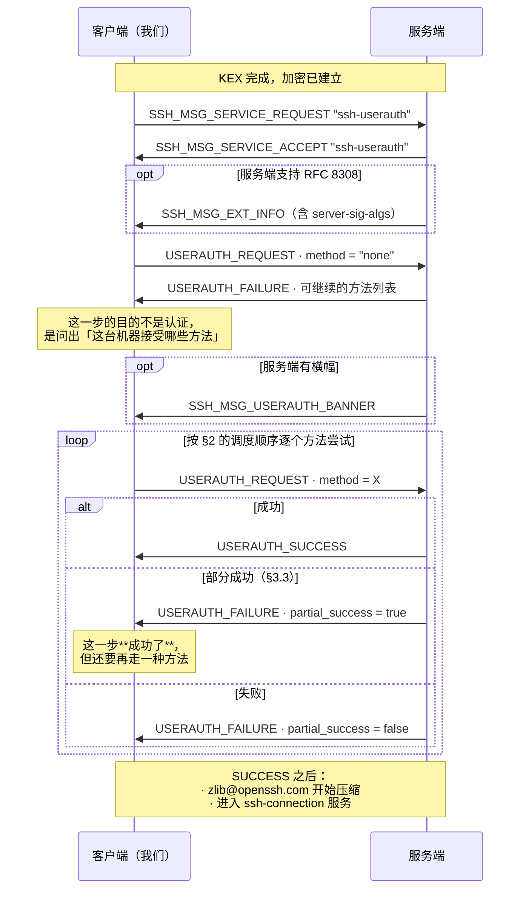
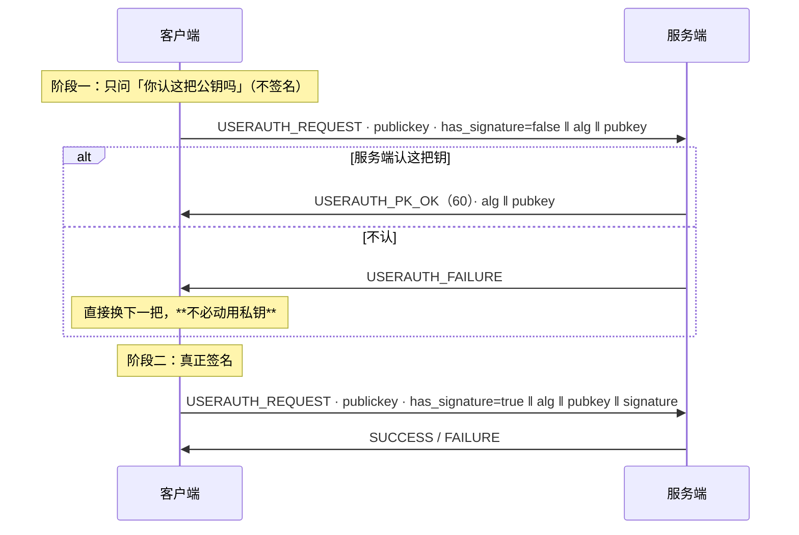
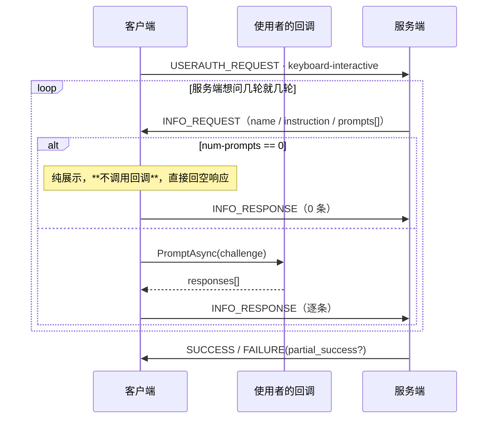

# 04 · 认证

> 规范依据：RFC 4252（Authentication Protocol）；RFC 4256（keyboard-interactive）；
> RFC 8332（rsa-sha2-*）；RFC 8308（Extension Negotiation / `server-sig-algs`）；
> RFC 4462（GSS-API）；OpenSSH `PROTOCOL.certkeys`、`PROTOCOL.agent`。
>
> 对应实现：`Auth/`（L7）。
>
> **本文件里最重要的两节是 §3.3（部分成功）与 §6（keyboard-interactive）。**
> 它们合起来就是 2FA / OTP 能不能用 —— 而这正是我们决定自己实现 SSH 库的头号动因之一。

---

## 一 总览


```mermaid
sequenceDiagram
    participant C as 客户端（我们）
    participant S as 服务端

    Note over C,S: KEX 完成，加密已建立

    C->>S: SSH_MSG_SERVICE_REQUEST "ssh-userauth"
    S->>C: SSH_MSG_SERVICE_ACCEPT "ssh-userauth"

    opt 服务端支持 RFC 8308
        S->>C: SSH_MSG_EXT_INFO（含 server-sig-algs）
    end

    C->>S: USERAUTH_REQUEST · method = "none"
    S->>C: USERAUTH_FAILURE · 可继续的方法列表
    Note over C: 这一步的目的不是认证，<br/>是问出「这台机器接受哪些方法」

    opt 服务端有横幅
        S->>C: SSH_MSG_USERAUTH_BANNER
    end

    loop 按 §2 的调度顺序逐个方法尝试
        C->>S: USERAUTH_REQUEST · method = X
        alt 成功
            S->>C: USERAUTH_SUCCESS
        else 部分成功（§3.3）
            S->>C: USERAUTH_FAILURE · partial_success = true
            Note over C: 这一步**成功了**，<br/>但还要再走一种方法
        else 失败
            S->>C: USERAUTH_FAILURE · partial_success = false
        end
    end

    Note over C,S: SUCCESS 之后：<br/>· zlib@openssh.com 开始压缩<br/>· 进入 ssh-connection 服务
```

---

## 二 方法调度

### 2.1 `none` 探测

**总是先发一次 `none`。** 它几乎总会失败，但 `USERAUTH_FAILURE` 里带回
**服务端愿意接受的方法列表** —— 这是唯一能问到这份清单的途径。

〔注意〕`none` 也可能**成功**（服务端配置了无认证）。必须正确处理这种情况，
不能假设它一定失败。

### 2.2 调度规则

〔决策〕**按使用者给出的凭据顺序尝试，但过滤掉服务端不接受的方法。**

```
候选 = 使用者配置的凭据（有序）
可用 = 服务端在最近一次 FAILURE 中给出的方法列表

重复扫描:
    for 凭据 in 候选（每次扫描都从头开始）:
        if 凭据已经试过: 跳过（每条凭据至多试一次，第 4 条）
        if 凭据.Method not in 可用: 跳过（记录「因服务端不接受而跳过」，不算试过）
        if 凭据.Method ≠ publickey 且该方法已失败 N 次: 跳过（第 3 条）
        结果 = 尝试(凭据)
        if 结果 == Success: 完成
        if 结果 == PartialSuccess: 刷新「可用」，结束本次扫描、从头再扫（§3.3）
        if 结果 == Failure: 刷新「可用」，继续
直到某次扫描走完都没有出现 PartialSuccess
抛 AuthenticationMethodExhausted，附上逐条尝试记录
```

**四个〔决策〕**：

1. **使用者配置的凭据列表就是全部，不做任何隐式回退。**
   不自动读 `~/.ssh/id_*`，不自动连 ssh-agent，除非使用者显式加了对应凭据。

   理由：隐式回退在桌面客户端里是实打实的问题 —— 用户在界面上选了「密码」，
   库却先拿某把默认私钥去试，于是服务器日志里出现莫名其妙的失败记录；
   Windows 上 `SSH_AUTH_SOCK` 常指向 msys/WSL 的 Unix 套接字，
   自动连 agent 每次都撞一发异常。**要用默认密钥或 agent，显式把它们加进凭据列表即可**：
   私钥文件用 `SshPrivateKeyFile.LoadAsync` 读出签名器、包成 `PublicKeyCredential`；
   agent 用 `SshAgentClient.GetCredentialsAsync` 取回一组 `PublicKeyCredential`（每把钥一条）。
   一两行的事，但那是使用者的显式决定。

2. **跳过的原因必须记录下来。** `AuthenticationMethodExhausted` 的异常里
   带一张逐条表：哪些试了、结果如何；哪些**因为服务端不接受而没试**。
   没有这张表，「skipped: publickey」这种信息就只存在于日志里，
   而用户看到的是一句「用户名或密码不正确」。

3. **失败次数上限只管 `password` 与 `keyboard-interactive`**：同一次认证里某个方法累计失败 N 次
   （〔决策〕N = 3，`SshAuthenticator.MaxFailuresPerMethod`）后，排在后面的同方法凭据不再尝试，
   记成 `SkippedNotOffered`，`Detail` 写明「在这次认证里已经失败 N 次」。密码经 keyboard-interactive 作答（§6.5）时
   计在 `keyboard-interactive` 名下。这两种方法的重试是对**同一个秘密**的反复猜测，
   服务端通常也有自己的计数，撞满会被临时封禁。

   〔决策〕**`publickey` 不受这个上限约束。** 每把钥是不同的凭据，各自只试一次。
   曾经它也按「失败 3 次就停」算 —— agent 里有五把钥、对的是第四把时，第四把永远轮不到，
   那台机器就永远登不上。公钥的总次数交给服务端自己的 `MaxAuthTries`：撞满时服务端断开连接（§9）。
   钥多的时候，把对的那把排在前面。

4. **部分成功之后从头再扫一遍。** 部分成功（§3.3）之后服务端的可用方法列表变了，
   之前因方法「当时不被接受」而跳过的凭据，要按新列表**再给一次机会**。
   典型场景是 `AuthenticationMethods publickey,password`：服务端起初只报 `publickey`，
   排在前面的口令凭据被跳过；公钥那一步通过之后服务端才开放 `password`。
   曾经循环只走一遍，那条口令凭据再也轮不到，认证以「凭据试完了」失败，而使用者明明两样都配了。

   〔决策〕**重扫只捡回「因方法不被接受而跳过」的凭据，每条凭据至多真正尝试一次。**
   试过的 —— 不论结果是部分成功、失败还是 `SkippedNoMaterial` —— 不再试：同一把钥、同一个口令
   换个时机也不会变成对的，再试只是白耗服务端的 `MaxAuthTries`。每次重扫都由一条新凭据的部分成功触发，
   所以扫描次数不会超过凭据条数。代价是同一条凭据可能在尝试记录里留下多条「跳过」，每次扫描一条。

〔决策〕**凭据只有库里的几种：`PasswordCredential`、`PublicKeyCredential`、`KeyboardInteractiveCredential`。**
`SshCredential` 的构造函数是 `private protected`，库外写不出子类 —— 曾经能写、也能放进凭据列表，认证器不认识，
把它当成「取不到材料」静默跳过：一条永远不会生效的凭据，没有任何提示。`none` 探测（§2.1）由认证器自己发，
`NoneCredential` 是内部类型；它曾经公开，放进列表也只会被跳过。

### 2.3 `USERAUTH_REQUEST` 的通用字段

| # | 类型 | 字段 |
| :-: | --- | --- |
| 1 | `byte` | `SSH_MSG_USERAUTH_REQUEST` = 50 |
| 2 | `string` | 用户名（**UTF-8**） |
| 3 | `string` | 服务名，恒为 `"ssh-connection"` |
| 4 | `string` | 方法名 |
| 5+ | 方法相关 | 见各节 |

〔注意〕**用户名在每个请求里重复出现，且必须始终相同。**
RFC 4252 §5 允许中途改用户名，但服务端行为未定义 —— 我们**禁止**这么做。

---

## 三 `USERAUTH_FAILURE` 与部分成功

### 3.1 字段表

| # | 类型 | 字段 |
| :-: | --- | --- |
| 1 | `byte` | `SSH_MSG_USERAUTH_FAILURE` = 51 |
| 2 | `name-list` | 可继续的认证方法 |
| 3 | `boolean` | `partial_success` |

### 3.2 方法列表的语义

这是**「接下来可以用哪些方法」**，不是「这台机器支持哪些方法」。
它会随认证进度变化 —— 部分成功之后，列表通常会缩小到剩下的那一种。

**每次收到 `FAILURE` 都要用新列表覆盖旧的**，不要合并、不要只取第一次。

### 3.3 部分成功 —— 2FA 的协议表达

> **`partial_success == true` 意味着这一步认证成功了。**

服务端在说：「你这一步过了，但我还要求你再过一种方法。」
多因素认证（公钥 + OTP、密码 + OTP）在 SSH 里就是这么表达的 ——
**没有单独的「2FA 报文」**。

**把 `partial_success = true` 当成失败处理，是 2FA 支持最常见、也最隐蔽的实现错误。**
症状是：用户输对了密码、也输对了动态码，但客户端在第一步之后就把这条凭据判死，
接着去试下一条（通常没有了），最后报「认证失败」。

正确处理：

```
收到 FAILURE(partial_success = true):
    记录「方法 X 已通过」
    刷新可用方法列表
    **不要**把这条凭据标记为失败，也不要计入失败计数
    回到凭据列表开头，按新列表重新挑（§2.2 第 4 条）
```

〔决策〕**部分成功后，允许同一个凭据类型再次出现。**
例如服务端要求「publickey 两次，两把不同的密钥」—— 这在高安全环境里是真实配置。
允许的是同一**类型**的另一条凭据；同一条凭据不会试第二次（§2.2 第 4 条）。

### 3.4 认证尝试记录

每一次尝试（包括跳过）都记一条 `SshAuthAttempt`；成功时整张表在 `SshAuthenticationResult.Attempts` 里，
失败时在 `SshAuthenticationException.Attempts` 里：

| 字段 | 内容 |
| --- | --- |
| `Method` | 方法名 |
| `CredentialLabel` | 使用者给凭据起的名字（如私钥路径），**不含任何密钥材料** |
| `Outcome` | `Success` / `PartialSuccess` / `Failure` / `SkippedNotOffered` / `SkippedNoMaterial` |
| `ServerOfferedAfter` | 这一步之后服务端给出的方法列表 |
| `Detail` | 例如「私钥文件读不出来」「服务端不接受这把公钥」 |

它的存在理由很具体：**要让「这台机器需要动态码」和「密码打错了」在 UI 上能区分开。**

〔决策〕**`SkippedNoMaterial` 只记「凭据自己出的问题」**：取口令的回调、keyboard-interactive 的应答回调、
签名器（本地私钥、agent、外部签名）抛出的异常 —— 包括 agent 拒签这类库自己的异常类型。
这些调用都发生在**没有请求在途**的时刻（发请求之前，或读完上一个应答之后），
跳过它、接着发下一条凭据的请求不会让应答错位。

**其余一律照实抛出，不许当成跳过**：连接中断（包成 `ClosedByPeer`）、服务端报文格式非法（包成 `ProtocolError`）、
横幅回调抛出的异常（原样交还，不归成连接断开，见 [08 §2.1](08-failures.md)）。它们发生时请求往往已经发出、应答还没读 —— 当成「跳过」接着试下一条，
下一条凭据读到的就是上一条的应答；服务端其实已经认证通过，客户端却报「所有方法都失败」。
取消（`OperationCanceledException`）同样不当成跳过：调用方的令牌触发的照实抛出；调用方的令牌与认证计时器都没触发的，
是回调自己不连了（用户在口令框、动态码框上点了「取消」）—— 连接以 `Aborted` 结束，并先发 `DISCONNECT(AUTH_CANCELLED_BY_USER)`
（[08 §2.1](08-failures.md)）。

---

## 四 `publickey`（RFC 4252 §7）

### 4.1 两段式：先问后签


```mermaid
sequenceDiagram
    participant C as 客户端
    participant S as 服务端

    Note over C: 阶段一：只问「你认这把公钥吗」（不签名）
    C->>S: USERAUTH_REQUEST · publickey · has_signature=false ‖ alg ‖ pubkey
    alt 服务端认这把钥
        S->>C: USERAUTH_PK_OK（60）· alg ‖ pubkey
    else 不认
        S->>C: USERAUTH_FAILURE
        Note over C: 直接换下一把，**不必动用私钥**
    end

    Note over C: 阶段二：真正签名
    C->>S: USERAUTH_REQUEST · publickey · has_signature=true ‖ alg ‖ pubkey ‖ signature
    S->>C: SUCCESS / FAILURE
```

〔决策〕**当私钥在本地且已解密时，跳过阶段一，直接签。**
省一个 RTT，代价是服务端不认这把钥时白签一次（本地计算，很便宜）。

〔决策〕**当签名要走外部（ssh-agent / PKCS#11 / HSM / KeyVault）时，必须走阶段一。**
理由：外部签名可能要用户按硬件键、输 PIN、走网络。为一把服务端根本不认的密钥
去打扰用户或发一次网络请求是不可接受的。

这条区分由 `ISshSigner.IsLocalAndCheap` 表达。

〔决策〕**`PK_OK` 回显的必须是我们问的那一把**（RFC 4252 §7：算法名与公钥 blob 都取自请求）：公钥 blob 对不上是 `ProtocolError` ——
签下去的会是服务端没认过的那一把；算法名除了请求里的那个，也认这把钥自己的类型名（`rsa-sha2-256` 的请求回显成 `ssh-rsa`），
说的是同一把钥，签名算法照我们选的。〔历史〕早期回显什么都不看。

〔决策〕**服务端对探测直接回 `SUCCESS`（不合规，个别实现会这样）就算认证完成**，不再签名、也不再试下一条凭据 ——
RFC 4252 §5.1 说成功之后的认证请求一律忽略。〔历史〕早期记成「不接受这把公钥」、接着发下一条请求，一直等到认证超时。

〔决策〕**钥在 ssh-agent 里时，签名之前先向 agent 声明会话**（`session-bind@openssh.com`，`is_forwarding = false`，
`07-forwarding.md` §7.4）。agent 靠它执行 `ssh-add -h` 给钥加的目的地约束 —— 不声明的话，真实的 OpenSSH agent
拒绝用受约束的钥签名。同一条 agent 连接上只声明一次（只在真要签名时才发：探测没过的钥用不着）；
agent 不支持声明时照常签名，这一步本身不会让认证失败。证书签名器背后是 agent 的钥时同样要声明。

### 4.2 请求字段

| # | 类型 | 字段 |
| :-: | --- | --- |
| 1–4 | | 通用（§2.3），方法名 `"publickey"` |
| 5 | `boolean` | `has_signature` |
| 6 | `string` | 公钥算法名 |
| 7 | `string` | 公钥 blob |
| 8 | `string` | 签名（仅 `has_signature = true` 时） |

### 4.3 签名输入 —— 必须逐字节精确

被签名的数据是：

```
string    session_id          ← §03 4.3，不是当前的 H
byte      SSH_MSG_USERAUTH_REQUEST (50)
string    user name
string    "ssh-connection"
string    "publickey"
boolean   TRUE
string    公钥算法名
string    公钥 blob
```

**三个要点**：

1. 第一项是 `session_id`（**首次** KEX 的 `H`），**按 `string` 编码**（带 4 字节长度前缀）。
2. 从第二项起，内容与实际发送的 `USERAUTH_REQUEST` 报文**逐字节相同**。
   因此实现上最稳的写法是：**先把请求报文的载荷拼出来，再在前面拼上
   `string session_id`，整体交给签名器** —— 而不是分两处各拼一遍。
   分两处拼是这里出错的唯一原因。
3. `boolean TRUE` 必须发 `0x01`。

### 4.4 RSA 的签名算法选择（RFC 8332）

`ssh-rsa` 用 SHA-1，已被广泛弃用。`rsa-sha2-256` / `rsa-sha2-512` 是替代。
问题在于：**同一把 RSA 密钥可以用三种签名算法，而客户端无从知道服务端接受哪种**
—— 除非服务端发了 `server-sig-algs`。

规则：

| 情况 | 我们用什么 |
| --- | --- |
| 收到 `server-sig-algs`（§7） | 取其中我们支持的、优先级最高的（`rsa-sha2-512` > `rsa-sha2-256` > `ssh-rsa`） |
| 收到 `server-sig-algs`，但其中没有我们能用的 | 〔决策〕仍用我们自己的第一偏好（`rsa-sha2-512`）。宣告不完整的服务端确实存在，试错的代价只是一次多余的往返 |
| 未收到 `server-sig-algs` | 〔决策〕先试 `rsa-sha2-512`；若被拒（探测或签名请求回 `FAILURE`），**降级重试一次** `ssh-rsa`（仅当使用者允许 SHA-1；证书同理降到 `ssh-rsa-cert-v01@openssh.com`） |

〔决策〕**降级默认关闭**（`AllowSha1RsaSignatures = false`）。
理由：无条件降级会把 Terrapin 那类降级攻击的收益还回去。
需要连老服务器的人显式打开 —— 最需要它的恰恰是不发 `server-sig-algs` 的老服务器，所以上表第三行的重试不可少。
降级重试时，尝试记录（`SshAuthAttempt.Detail`）写明「`rsa-sha2-512` 被拒后降级为 `ssh-rsa`（SHA-1）重试」。
〔未实现〕没有降级、直接按 `server-sig-algs` 选中 SHA-1 时，选中的签名算法还不进尝试记录。

〔注意〕**判断「是不是 SHA-1」之前先去掉证书后缀**（`SshPublicKey.StripCertificateSuffix`）。
RSA 证书（§4.5）的三个算法名是 `rsa-sha2-512-cert-v01@openssh.com`、`rsa-sha2-256-cert-v01@openssh.com`
与 `ssh-rsa-cert-v01@openssh.com`，最后一个同样是 SHA-1 签名，`AllowSha1RsaSignatures = false` 时
与 `ssh-rsa` 一样被滤掉。只比对 `ssh-rsa` 这个名字的话，拿 RSA 证书登录、服务端的 `server-sig-algs`
又只列了 `ssh-rsa-cert-v01@openssh.com` 时，SHA-1 照样会被挑出来用 —— 开关形同虚设。

〔决策〕**证书与 `server-sig-algs` 比对时也去掉后缀**（原样列出带后缀的名字也认）：`server-sig-algs` 列的是签名算法（RFC 8308 §3.1），
证书的签名算法就是不带后缀的那个。〔历史〕早期只按原样比，证书永远比不中、永远取第一偏好 ——
只认 `rsa-sha2-256` 的服务端照样收到 512，允许 SHA-1 时只认 `ssh-rsa` 的服务端也收不到 SHA-1。

〔注意〕公钥 blob 里的类型串**永远是 `"ssh-rsa"`**，与签名算法名无关（§03 5.1）。

### 4.5 证书认证（OpenSSH `PROTOCOL.certkeys`）

证书认证**不是**另一种方法，仍然是 `publickey`，只是：

- 算法名是 `ssh-ed25519-cert-v01@openssh.com` 之类；
- 「公钥 blob」位置放的是**整个证书**；
- **签名仍然由对应的私钥产生**，证书只是 CA 的背书。

因此实现上它完全复用 §4.1–§4.4 的路径，只多一件事：
把证书文件与私钥配对。〔决策〕**配对由使用者显式完成**：`OpenSshCertificate.LoadAsync` 读证书，
`SshCertificateSigner.Create(证书, 私钥签名器)` 把两者合成一个签名器，再包成 `PublicKeyCredential`。
`Create` 当场核对证书与私钥是不是一对，配错了立刻报 —— 否则表现只是服务端一句 `Permission denied`，
与「CA 不被信任」「主体不匹配」分不开。库**不会**去私钥旁边找同名的 `id_*-cert.pub`，
与 §2.2 第 1 条一致：不读使用者没点名的文件。

〔决策〕**客户端不校验自己证书的有效期。** 那是服务端的职责；
本地校验只会在时钟不同步时制造假阴性。〔未实现〕设计是**把过期事实放进
`SshAuthAttempt.Detail`** —— 认证失败时这是头号线索。今天认证器不看证书的有效期，`Detail` 里没有这一条；
有效期由 `OpenSshCertificate.ValidBeforeTime` / `IsTimeValid` 交给使用者，要在界面上说「证书过期了」得自己判断。
换算成时刻的那两个属性不会因为 9999 年以后的值抛异常（规则同 [03 §5.5](03-key-exchange.md)）。

**agent 里的证书。** `ssh-add` 加 `id_*` 时会顺手把同名的 `id_*-cert.pub` 一起加进去，
所以 agent 的身份列表里常有 `*-cert-v01@openssh.com` 类型的条目。

〔决策〕**agent 里的证书作为证书身份列出，可以直接用来认证。**
`SshAgentClient.ListIdentitiesAsync` 用 `SshPublicKey.Decode` 解析每条身份（wire 字节用 `Decode`，`Parse` 留给文本），它认得证书 blob
（`IsCertificate = true`）；`GetCredentialsAsync` 把证书身份与普通钥一样包成 `publickey` 凭据。
出示的是整张证书，签名仍由 agent 用证书里那把钥来做 —— 签名请求里带的也是那张证书的 blob，与 agent 列出的一致。
曾经它（当时叫 `Parse`）不认证书，而列表只跳过特定几种异常：agent 里只要有一张证书，整个列表就解析失败，
agent 认证、agent 转发、自动加钥三条路一起断。

〔决策〕**解析不了的身份只跳过那一条。** 格式坏掉的证书、本库不支持的证书类型
（证书里的钥只认 Ed25519、ECDSA P-256/384/521 与 RSA；FIDO 的 `sk-*`、`ssh-dss` 都不认），
与不认识的普通钥（`sk-*`、`ssh-dss`、厂商私有类型）一样，跳过即可 —— 为其中一条报错等于让整个 agent 用不了。

〔注意〕**RSA 证书的签名请求要按去掉证书后缀的算法名设标志位**（`SshAgentClient.SignAsync`）。
agent 协议里 RSA 用哪种 SHA-2 靠 `SSH_AGENT_RSA_SHA2_256` / `SSH_AGENT_RSA_SHA2_512` 标志位表达，
不带标志位就是 SHA-1。证书的算法名是 `rsa-sha2-512-cert-v01@openssh.com`，直接拿它去比 `rsa-sha2-512`
对不上，标志位就空着，agent 签出来的是 SHA-1 的 `ssh-rsa` —— 与请求里声明的算法不符，
而且正是 §4.4 默认要禁掉的那一种。

〔决策〕**agent 签回来的签名要核对算法名**：与请求的（去掉证书后缀）不一致就不交出去，报 `SshAgentException`（`Unsupported`），
这条凭据按「材料有问题」跳过（§3.4）。不认 SHA-2 标志位的老 agent 会照旧回一个 `ssh-rsa` 签名：曾经原样交出去，
认证器当 `rsa-sha2-512` 发给服务端，用户只看到 Permission denied，`AllowSha1RsaSignatures = false` 的意图也被悄悄绕过。

〔决策〕**证书的指纹就是证书里那把钥的指纹**（`SshPublicKey.Sha256Fingerprint` / `Md5Fingerprint`），
与 `ssh-keygen -l` 对证书显示的一致。按整张证书的 blob 算的话，每次重签指纹都会变，
而用户拿去对照的永远是那把钥。因此同一把钥的普通身份与证书身份在列表里显示同一个指纹，这是对的。

### 4.6 私钥文件

本地私钥由 `SshPrivateKeyFile.LoadAsync` / `Parse` 读入，按文件头认格式。密钥类型支持 Ed25519、RSA、
ECDSA P-256/384/521。〔决策〕ECDSA 的曲线**按曲线本身（OID）认**，不按位数：PKCS#8 / SEC1 能装任意曲线，
secp256k1、brainpoolP256r1 也是 256 位 —— 曾经被标成 `nistp256` 交给服务端，签名验不过，症状只是「不接受这把公钥」。
三条 NIST 曲线以外的报 `Unsupported`。

| 格式 | 文件头 | 加密 | 谁来解 |
| --- | --- | --- | --- |
| OpenSSH（`openssh-key-v1`，OpenSSH 7.8 起 `ssh-keygen` 的默认） | `BEGIN OPENSSH PRIVATE KEY` | 不加密；或 `bcrypt` KDF + `aes{128,192,256}-ctr`、`aes{128,192,256}-cbc`、`aes{128,256}-gcm@openssh.com`、`chacha20-poly1305@openssh.com` | 本库 |
| PuTTY `.ppk` v2 / v3 | `PuTTY-User-Key-File-2` / `-3` | 不加密；或 `aes256-cbc`（v2 用 SHA-1 派生，v3 用 Argon2id） | 本库 |
| PKCS#8 | `BEGIN PRIVATE KEY` / `BEGIN ENCRYPTED PRIVATE KEY` | 不加密；或 PKCS#8 自带的口令加密 | 解密用 BouncyCastle；RSA / ECDSA 导入用 BCL，Ed25519（RFC 8410）由本库取出种子 |
| PKCS#1 RSA / SEC1 EC，不加密 | `BEGIN RSA PRIVATE KEY` / `BEGIN EC PRIVATE KEY` | 无 | BCL |
| 传统加密 PEM | 上一行的文件头 + `Proc-Type: 4,ENCRYPTED` | 口令经一次 MD5 派生 + 3DES / AES-CBC | **拒绝**（见下） |

〔决策〕**只支持上表里的现代格式，传统加密 PEM 有意不实现。**
它是 OpenSSH 7.8 之前 `ssh-keygen` 加口令时的默认格式（今天 `ssh-keygen -m PEM` 仍会写出它）：
口令只经一次 MD5 就成了密钥，没有迭代、没有可调的代价，常配 3DES。为读这种弱格式在安全库里带上它不划算；
而转换只要一条命令。遇到时抛 `SshPrivateKeyException`，**在要口令之前**就说清楚是格式不受支持，
并给出转换办法：`ssh-keygen -p -f <私钥文件>` 改一次口令（新旧口令可以相同），它会把文件重写成 `openssh-key-v1`。

〔决策〕**这个异常的 `NeedsPassphrase` 为 `false`。** `NeedsPassphrase = true` 的含义是
「缺口令或口令不对，再问一次有用」，界面靠它决定要不要再弹输入框；格式不受支持时问多少次都没用。
曾经这种文件被交给 BCL，BCL 不认，结论却报成「口令多半不对」且 `NeedsPassphrase = true` ——
用户一遍遍重输正确的口令，界面一遍遍再弹输入框。

〔决策〕**`.ppk` 的两条完整性检查**：
① v2 / v3 的 `Private-MAC` 是必填的，缺了报 `KeyFormatInvalid` —— 曾经缺了就跳过整段校验，删掉这一行就能改公钥段
（RSA 的 n、e，ECDSA 的曲线与点都取自那里）而不被发现，口令错了也查不出来；
② 私钥半派生出的公钥必须与 `Public-Lines` 是同一把，不是就报 `KeyFormatInvalid` —— 未加密 `.ppk` 的 MAC 键是公开的，
改了公钥段再重算 MAC，MAC 照样对得上；不核对的话拿到的是「不是你以为的那把」钥，症状只是服务端一句「不接受这把公钥」。

〔决策〕**`.ppk` 里的 Ed25519 私钥是定长 32 字节的种子（RFC 8032 的私钥，原样的字节），不是 mpint**：首字节 ≥ 0x80 时也不补前导零。
依据是真 `puttygen`（0.83）的产物 —— 80 把里每一把都是 32 字节，其中 47 把首字节 ≥ 0x80；样本与 `ssh-keygen -y` 导出的公钥一起存在测试里。
照 mpint 规矩写的（带一个前导零、或去掉前导零而短于 32 字节）也照收，归一到 32 字节；读错了的话上面第 ② 条会当场拦住。
〔历史〕早期按 mpint 读：首字节 ≥ 0x80 的文件（约一半）被判「mpint 为负」、根本读不进来。那时的用例全是按同一个理解现拼的 `.ppk`，一起错也测不出来。

〔决策〕**`openssh-key-v1` 同样核对内部一致性**，对不上一律 `KeyFormatInvalid`：
① 文件头部明文的公钥段必须与私钥导出的是同一把（曾经直接丢掉不看 —— 而 `ssh-keygen -y`、agent 列出来的都是公钥段那一把）；
② Ed25519 私钥区里公钥出现两次（单独一份、种子后面一份），种子还能导出第三份，三份必须相同；
③ ECDSA 的密钥类型与曲线名要对得上（`ecdsa-sha2-nistp256` 配 `nistp256`）；
④ RSA 的 `n` 必须正好是 `p·q`（p、q 都大于 1）。坏文件的症状本来只是一句「服务端不接受这把公钥」。

〔决策〕**不用口令读公钥：`SshPrivateKeyFile.TryReadPublicKey(pem, out key)`。** `openssh-key-v1` 的公钥段与 `.ppk` 的
`Public-Lines` 本来就是明文，私钥加了密也读得出；未加密的 PKCS#1 / SEC1 / PKCS#8 由私钥导出。加密的 PKCS#8 与传统加密 PEM
不带明文公钥，返回 `false`；认不出的格式、内容不完整的文件同样只返回 `false`，不抛。明文的那一份**没有**与私钥核对过（核对要先解密），
只拿来显示指纹、写 `.pub`；认证用的是 `Parse` / `LoadAsync` 解出的那一把，上面几条核对都在那里。
用处是导入只有私钥、没有 `.pub` 的文件 —— PuTTY 用户手里通常只有一个 `.ppk`。

〔决策〕**加密 PKCS#8 的 KDF 迭代数上限一千万次**（PBES2 的 PBKDF2，以及 PBES1 / PKCS#12 PBE），交给 BCL 之前先从 DER 里读出来核对，
超了报 `KeyFormatInvalid`。迭代数来自文件，而 **.NET 导入加密 PKCS#8 不设上限**（实测 300 万次照常导入）：被改成 `int.MaxValue` 的文件
按每秒约七百万次要跑五分钟，同步、停不下来。常见取值是 OpenSSL 的 2048、OWASP 建议的 60 万。
〔决策〕**加密 PKCS#8 只解密一次**（BouncyCastle 解出里面的明文 PrivateKeyInfo）：填充校验失败就是口令不对（`KeyPassphraseIncorrect`）；
解开之后**按 PrivateKeyInfo 里的算法标识分派** —— RSA 与 NIST 曲线上的 ECDSA 交给 BCL 导入，Ed25519 见下一条，Ed448 / DSA / 别的曲线报 `Unsupported`
（`NeedsPassphrase = false`，说出是什么钥）。明文 PKCS#8 同样按算法分派。
〔决策〕**PKCS#8 里的 Ed25519 按 RFC 8410 §7 读**（BCL 导入不了这种钥）：`privateKey` 里再包一层 `CurvePrivateKey`（OCTET STRING），
里面是 32 字节种子；按 BER 读（RFC 5958 要求，RFC 8410 附录 A 有一个不定长编码的例子），属性 `[0]` 与以后扩展的字段跳过。
v2 带着公钥 `[1]` 时**核对它是不是种子导出的那一把**，对不上报 `KeyFormatInvalid`（与上面 `openssh-key-v1`、`.ppk` 同一口径）——
RFC 8410 附录 A 的两个错例（公钥少一个字节）真 `ssh-keygen` 照样读得出，交出来的是文件里写的那个公钥。种子不是 32 字节同样是 `KeyFormatInvalid`。
〔历史〕曾经一律报 `Unsupported`，加密的在更早时还被报成「口令不对」（见下）。
〔历史〕早期加密 PKCS#8 看不出钥的类型，逐个按 RSA、ECDSA 交给 BCL 去试、每试一次 KDF 都整个跑一遍，都失败就报「口令多半不对」——
装的是 Ed25519 / DSA 时口令明明是对的，界面一遍遍弹口令框。BouncyCastle 不认的加密方案仍走那条老路：
密文不超过 320 字节的先按 ECDSA 试（椭圆曲线钥连 P-521 带公钥也不到 260 字节，最小的 512 位 RSA 钥也有三百四十多字节）。

〔决策〕**私钥文件是外来输入，读不懂一律是 `SshPrivateKeyException`（`KeyFormatInvalid`）**，不论哪种格式、错在哪一层：
截断（复制粘贴丢了尾行，base64 恰好在 4 字符边界断开）、字段畸形（`.ppk` 的 `Public-Lines: abc`、RSA 的 p 或 q 为 1）。
原来的异常挂在内层。同理，**agent 回的应答格式不对**（身份列表、签名被截断）是 `SshAgentException`（`ProtocolError`）。
曾经让解析层 internal 的异常或 BCL 的 `FormatException` / `DivideByZeroException` 原样漏出去 —— 调用方只接这两种异常，那就一路漏到了界面上。

〔决策〕**写私钥文件：`SshPrivateKeyFile.Format(key, passphrase, comment, kdfRounds)`，只写 `openssh-key-v1` 一种**
（今天 `ssh-keygen` 的默认，拷到别处照样能用）。有口令时 `bcrypt` KDF（16 字节随机盐，默认 16 轮，与 `ssh-keygen` 一致）+ `aes256-ctr`；
没有口令时 cipher 与 KDF 都是 `none`。私钥区以两个相同的随机校验字开头，字段顺序与读取一侧同一份（Ed25519 是公钥 ‖ (种子 ‖ 公钥)；
RSA 是 n、e、d、iqmp、p、q；ECDSA 是曲线名、公钥点、d），然后是注释，末尾按分组（加密时 16、否则 8）填充 1、2、3……；
正文按 70 列折行、`\n` 换行。明文私钥区、派生出的密钥材料、导出的 RSA / ECDSA 私钥参数都用完清零。文件权限（Unix 上 0600）是调用方的事。
新钥由 `InMemorySshSigner.GenerateEd25519()` / `GenerateEcdsa(256 | 384 | 521)` / `GenerateRsa(bits)`（2048–16384、8 的倍数，默认 3072）生成。
对不对只认真工具：用例拿真 `ssh-keygen -y` 读本库写的文件（带口令与不带），导出的公钥要与本库的逐字节一致 ——
填充起点写错时本库自己读自己照样读得回来。
〔历史〕曾经库只能读、不能写，宿主手写了一份只能写**未加密**私钥的容器，中间导出的私钥参数也不清零。

---

## 五 `password`（RFC 4252 §8）

| # | 类型 | 字段 |
| :-: | --- | --- |
| 1–4 | | 通用，方法名 `"password"` |
| 5 | `boolean` | `FALSE`（改密码时为 `TRUE`） |
| 6 | `string` | 密码（**UTF-8**） |

### 5.1 密码修改请求

服务端可以回 `SSH_MSG_USERAUTH_PASSWD_CHANGEREQ`（**60**，方法专用编号）：

| # | 类型 | 字段 |
| :-: | --- | --- |
| 1 | `byte` | 60 |
| 2 | `string` | 提示文本（UTF-8） |
| 3 | `string` | 语言标记（忽略） |

〔决策〕**认得它，但不实现改密码流程** —— 收到它一律记为这条口令凭据的一次失败，
`Detail` 写明原因（「服务端要求先修改密码（本库尚未实现改密码流程）」），而不是当成一个无法理解的报文。
没有改密码的回调可配，请求里的「改密码」标志永远发 `FALSE`。

理由：密码过期在企业环境里很常见，而「客户端直接断开且不说为什么」
是用户最难自救的一种失败。

### 5.2 安全要求

- 密码**必须**以 UTF-8 编码，且**禁止**做任何规范化（NFC/NFKC）——
  服务端拿到的是什么就比什么。
- 密码在内存里的生命周期要尽量短，用完 `ZeroMemory`。
  〔决策〕凭据接口收 `Func<CancellationToken, ValueTask<...>>` 而不是 `string`，
  让使用者可以在真正需要时才解密取出。
- 〔决策〕**私钥的口令同理**：`SshPrivateKeyFile.Parse` / `LoadAsync` 除了收 `string` 的重载，还有收 `ReadOnlySpan<char>` /
  `ReadOnlyMemory<char>` 的 —— 口令放在调用方自己的 `char[]` 里，用完自己清零（`string` 不可变，清不掉）。
  库里由口令派生出的中间副本（UTF-8 字节、派生出的密钥与 IV、解出的明文私钥区）一律清零。
  **取消令牌交给口令派生**：`bcrypt_pbkdf` 逐轮检查，Argon2 与 PBKDF2 开算之前检查；取消时抛 `OperationCanceledException`，
  不被包成「私钥格式不对」。〔历史〕早期 `LoadAsync` 的令牌只管读文件，高轮数的私钥一旦开算就停不下来。
  〔未实现〕私钥文本本身仍以 `string` 进来（各格式的解析基于 `string`）—— 未加密私钥文件的内容清不掉，这是现在的边界。
- **禁止**把密码写进任何日志或 `IPacketTap`（总则 §5.5）。

---

## 六 `keyboard-interactive`（RFC 4256）—— 2FA / OTP 的落点

> **这是自己实现 SSH 库的头号动因之一。** 堡垒机上的 Google Authenticator、Duo、
> RSA SecurID 走的都是这条路。

### 6.1 请求

| # | 类型 | 字段 |
| :-: | --- | --- |
| 1–4 | | 通用，方法名 `"keyboard-interactive"` |
| 5 | `string` | 语言标记，〔决策〕发空串 |
| 6 | `string` | 子方法提示，〔决策〕发空串（让服务端自己挑） |

### 6.2 `SSH_MSG_USERAUTH_INFO_REQUEST`（60，方法专用）

| # | 类型 | 字段 |
| :-: | --- | --- |
| 1 | `byte` | 60 |
| 2 | `string` | `name` —— 对话框标题（UTF-8，可空） |
| 3 | `string` | `instruction` —— 说明文字（UTF-8，可空） |
| 4 | `string` | 语言标记（忽略） |
| 5 | `uint32` | `num-prompts` |
| 6 | 重复 `num-prompts` 次 | `string prompt`（UTF-8） ‖ `boolean echo` |

### 6.3 `SSH_MSG_USERAUTH_INFO_RESPONSE`（61，方法专用）

| # | 类型 | 字段 |
| :-: | --- | --- |
| 1 | `byte` | 61 |
| 2 | `uint32` | `num-responses` —— **必须**等于请求里的 `num-prompts` |
| 3 | 重复 | `string response`（UTF-8） |

### 6.4 时序 —— 可以来回多轮


```mermaid
sequenceDiagram
    participant C as 客户端
    participant H as 使用者的回调
    participant S as 服务端

    C->>S: USERAUTH_REQUEST · keyboard-interactive
    loop 服务端想问几轮就几轮
        S->>C: INFO_REQUEST（name / instruction / prompts[]）
        alt num-prompts == 0
            Note over C: 纯展示，**不调用回调**，直接回空响应
            C->>S: INFO_RESPONSE（0 条）
        else
            C->>H: PromptAsync(challenge)
            H-->>C: responses[]
            C->>S: INFO_RESPONSE（逐条）
        end
    end
    S->>C: SUCCESS / FAILURE(partial_success?)
```

**六条必须**：

1. **`num-prompts == 0` 是合法的**，用于纯展示信息（「请按下硬件令牌上的按钮」）。
   此时**不应**弹窗要用户输入，直接回一个 0 条响应的 `INFO_RESPONSE`。
   〔决策〕但**要把 `instruction` 交给回调**（用一个 `IsInformationalOnly = true` 的
   challenge），让 UI 能显示「请按令牌」这句话 —— 否则用户对着一个没反应的界面干等。
2. **响应条数必须与提示条数完全相等**，多一条少一条都是协议错误。
3. **`echo == false` 的提示必须以密码方式采集**（不回显）。
   `echo == true` 的通常是用户名或一次性附加信息。
4. **轮数必须有上限**（〔决策〕**64 轮**）。服务端理论上可以无限问下去，
   那是一个拿用户注意力做的拒绝服务。
5. **单轮提示数上限**（〔决策〕**32 条**）、**各字符串长度上限**（〔决策〕**4 KiB**）。
6. `name` / `instruction` / `prompt` 都来自**未认证的对端**，
   是注入面。库原样交给使用者，但**文档里必须写明**：
   展示这些文本时要按不可信内容处理（不解释控制字符、不当作富文本）。

### 6.5 与密码的关系

很多服务器同时开放 `password` 与 `keyboard-interactive`，
且后者的唯一提示就是「Password:」。

〔决策〕**提供 `PasswordCredential.AlsoAnswerKeyboardInteractive`（默认 `true`）**：
当 `keyboard-interactive` 的提示只有一条、且 `echo == false` 时，
自动用密码作答，不打扰使用者。

理由：这是 OpenSSH 客户端的实际行为，用户期望的也是这个。
但**必须**能关掉 —— 在真正的 2FA 场景里，第一条提示可能就是动态码，
自动填密码只会白白消耗一次尝试。

〔决策〕**同一次键盘交互里密码至多作答一次**；之后的轮次（哪怕形状同样是单条不回显）回空串，让服务端干脆地拒绝，再换下一条凭据。
理由：PAM 两步验证常见的流程是「Password:」一轮、「Verification code:」再一轮，两轮都是单条不回显。
只看形状不看轮次的话，第二轮也把密码发出去 —— 白耗一次失败计数，而且 pam_radius、Duo 一类模块
会把这一轮的应答转发到 RADIUS 或第三方服务，密码就这样离开了目标主机。

---

## 七 扩展协商（RFC 8308）

### 7.1 `SSH_MSG_EXT_INFO`（7）

| # | 类型 | 字段 |
| :-: | --- | --- |
| 1 | `byte` | 7 |
| 2 | `uint32` | `nr-extensions` |
| 3 | 重复 | `string name` ‖ `string value` |

**可能出现在两个位置**（RFC 8308 §2.3）：

1. 首次 `NEWKEYS` **之后**立刻；
2. `SSH_MSG_USERAUTH_SUCCESS` **之前**。

两个位置都要能收。**其它位置收到 → 协议错误。**

### 7.2 我们关心的扩展

| 扩展 | 用途 |
| --- | --- |
| `server-sig-algs` | §4.4 —— 没有它就无法安全选择 RSA 签名算法 |
| `delay-compression` | 〔决策〕**不实现**。`zlib@openssh.com` 已经解决同一问题 |
| `no-flow-control` | 〔决策〕**不实现**。我们的窗口管理依赖流控 |
| `elevation` | 〔决策〕**不实现**（Windows 服务端专用） |
| `publickey-hostbound@openssh.com` | 〔决策〕**不做**。它为的是 agent 的目的地约束能在**转发出去的**那几跳上核对；第一跳的目的地由会话声明交给 agent（`07-forwarding.md` §7.4），而本库永远是第一跳 —— 经跳板时每一跳也都是本机直接认证 |

**未知扩展一律忽略**，不报错。

---

## 八 横幅（`SSH_MSG_USERAUTH_BANNER`，53）

| # | 类型 | 字段 |
| :-: | --- | --- |
| 1 | `byte` | 53 |
| 2 | `string` | 文本（UTF-8） |
| 3 | `string` | 语言标记（忽略） |

- **可以在认证期间的任何时刻到达，可以多次。**
- 交给 `SshConnectionOptions.BannerHandler`。
- 〔决策〕限制：单条 ≤ 64 KiB，累计 ≤ 256 KiB，条数 ≤ 1024。超限断开。
- 同 §6.4 第 6 条：这是不可信文本，文档必须写明。

---

## 九 边界与错误速查

| 情况 | 失败原因 | 说明 |
| --- | --- | --- |
| `SERVICE_REQUEST` 被拒 | `ProtocolError` | 服务端不提供 `ssh-userauth`，极罕见 |
| 全部方法试完仍未成功 | `AuthenticationMethodExhausted` | **带逐条尝试记录**（§3.4） |
| 服务端撞满自己的 `MaxAuthTries` 后断开 | `Disconnected` | §2.2 第 3 条。公钥不受本库的失败上限约束，总次数由它兜底 |
| 私钥是传统加密 PEM（`Proc-Type: 4,ENCRYPTED`） | `Unsupported` | §4.6。`SshPrivateKeyException.NeedsPassphrase = false` —— 不要再弹口令框 |
| 服务端只给 `keyboard-interactive` 且我们没配对应凭据 | `TwoFactorRequired` | 〔决策〕单独一个原因码 —— 让 UI 能说「这台机器需要动态码」 |
| `INFO_RESPONSE` 条数不符 | `ProtocolError` | |
| 交互轮数 / 提示数 / 长度超限 | `ProtocolError` | §6.4 |
| 横幅超限 | `ProtocolError` | §8 |
| `EXT_INFO` 出现在非法位置 | `ProtocolError` | §7.1 |
| 认证期间收到通道消息（80–127） | `ProtocolError` | 认证完成前连接协议尚未启动 |
| 认证超时 | `Timeout` | 〔决策〕独立于 `ConnectTimeout`：`AuthenticationTimeout` 默认 2 分钟 —— 用户要去掏手机看动态码 |

〔决策〕**认证超时独立计时**，与主机密钥裁决（§03 5.3）同一个理由：
任何需要人参与的步骤都不该被一个为网络往返设计的超时打断。
