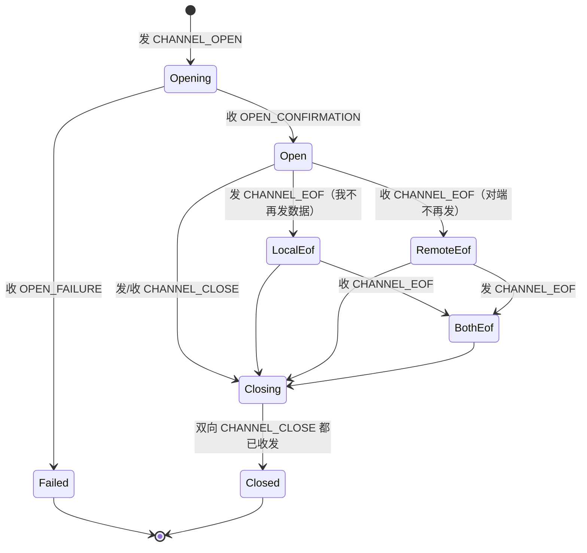
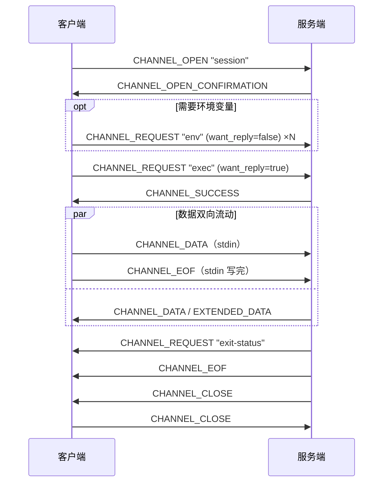

# 05 · 连接协议：通道、流控与请求

> 规范依据：RFC 4254（Connection Protocol）；RFC 4250 §4.2（信号名、断开码）；
> OpenSSH `PROTOCOL` 的 `*-streamlocal@openssh.com`、`auth-agent-req@openssh.com`。
>
> 对应实现：`Channels/`（L5）、`Threading/`（L6 请求账本）。

---

## 一 通道的生命周期



**六条硬规则**：

1. **EOF 是单向的半关闭。** 发了 `CHANNEL_EOF` 之后**仍然可以收数据**。
   把 EOF 当成「通道结束」是最常见的错误，症状是
   `ssh host 'cat > f' < big` 这类场景下丢掉服务端的最后输出。
2. **`CHANNEL_CLOSE` 必须双向。** 收到对端的 `CLOSE` 后**必须**回一个
   （除非我们已经发过）。只有**双方都发过** `CLOSE` 之后，通道号才可以回收。
   〔决策〕使用者释放通道时，本端**立刻收尾**（管道结束、事件流以 `Closed` 收口），
   但号**一直扣着**，直到对端的 `CLOSE` 到了（或会话结束、或对端从没建起这条通道）。
   发 `CLOSE` 本身不受释放时限约束：背压一时松不开，就留在后台等它松开再发 ——
   带时限发的话，超时就等于这条通道在服务端永远开着。
3. **通道号回收过早 = 串话。** 对端可能还在路上发这个通道号的数据；
   号一旦被新通道复用，那些数据就会被投递到错误的通道。
   〔决策〕通道号回收后**延迟 30 秒再复用**（维护一个待复用队列），
   作为对端实现不规范时的兜底。
4. **`CLOSE` 之后收到该通道的任何数据都必须丢弃，且不报错。**
   这不是协议违规，是在途数据。
5. **通道是独立的失败域。** 一条通道出错（如对端拒绝打开）
   **不得**影响会话或其它通道。
6. **发出 `CLOSE` 之后，本端在这条通道上不再发任何报文**（RFC 4254 §5.3）——
   数据、`EOF`、`WINDOW_ADJUST`、通道请求，以及对对端请求的应答。
   「`CLOSE` 发过没有」必须与**入队**在同一把锁里判定：先查后入队的话，中间插进来的 `CLOSE`
   会让这一帧排到 `CLOSE` 后面，而对端收到 `CLOSE` 就可能已经把通道释放了。
   关闭之后调用发请求的接口不抛异常，返回「没有发出」（`false`）—— 远端进程退出后界面才发来的改窗是常态，不是错误。

---

## 二 `SSH_MSG_CHANNEL_OPEN`（90）

| # | 类型 | 字段 | 说明 |
| :-: | --- | --- | --- |
| 1 | `byte` | 90 | |
| 2 | `string` | 通道类型 | `"session"` / `"direct-tcpip"` / … |
| 3 | `uint32` | `sender channel` | **我们**给这条通道的编号 |
| 4 | `uint32` | `initial window size` | 我们愿意在不发 WINDOW_ADJUST 前接收的字节数 |
| 5 | `uint32` | `maximum packet size` | 单个 `CHANNEL_DATA` 的数据段上限 |
| 6+ | 类型相关 | | |

### 2.1 通道类型

| 类型 | 用途 | 额外字段 |
| --- | --- | --- |
| `session` | exec / shell / subsystem | 无 |
| `direct-tcpip` | 本地转发、到远端 TCP 的隧道 | `string host` ‖ `uint32 port` ‖ `string orig_host` ‖ `uint32 orig_port` |
| `direct-streamlocal@openssh.com` | 到远端 **Unix 套接字**的隧道 | `string socket_path` ‖ `string reserved` ‖ `uint32 reserved` |

> `direct-streamlocal@openssh.com` 是接 `/var/run/docker.sock` 这类端点的唯一正路：
> 它**不在本机开监听端口**，流直接交给调用方，同机其它进程连不上去。
> 对 root 等价的端点，这个区别不是优化而是前提。

服务端发起的通道类型见 [`07-forwarding.md`](07-forwarding.md)。

### 2.2 `maximum packet size` 的取值

〔决策〕我们**宣告** 32 KiB（`ReceiveMaxPacketBytes` 的一部分）。

- 它约束的是**对端**发给我们的单个 `CHANNEL_DATA` 的数据段长度。
- 对端宣告的值约束**我们**发给它的。OpenSSH 通常宣告 32 KiB。
- **必须遵守对端宣告的值**：超了对端会断连。

### 2.3 应答

`SSH_MSG_CHANNEL_OPEN_CONFIRMATION`（91）：

| # | 类型 | 字段 |
| :-: | --- | --- |
| 2 | `uint32` | `recipient channel` —— 我们的通道号 |
| 3 | `uint32` | `sender channel` —— 对端的通道号 |
| 4 | `uint32` | 对端的初始窗口 |
| 5 | `uint32` | 对端的最大报文长度 |

`SSH_MSG_CHANNEL_OPEN_FAILURE`（92）：

| # | 类型 | 字段 |
| :-: | --- | --- |
| 2 | `uint32` | `recipient channel` |
| 3 | `uint32` | 原因码 |
| 4 | `string` | 描述（UTF-8） |
| 5 | `string` | 语言标记 |

| 原因码 | 含义 | 我们的映射 |
| :-: | --- | --- |
| 1 | `ADMINISTRATIVELY_PROHIBITED` | 常见于服务端禁了转发。**错误消息里要点明这一点** |
| 2 | `CONNECT_FAILED` | 目标连不上（转发场景） |
| 3 | `UNKNOWN_CHANNEL_TYPE` | |
| 4 | `RESOURCE_SHORTAGE` | 服务端 `MaxSessions` 撞满 |

〔决策〕**原因码 1 与 4 要给出可操作的提示** ——
「服务端禁止了端口转发（AllowTcpForwarding no）」和
「服务端的并发会话数已满（MaxSessions）」比「通道打开失败」有用得多。

---

## 三 流控窗口

### 3.1 机制

- 每个方向各有一个窗口计数（字节）。
- **发送方**每发 `n` 字节数据，把自己的发送窗口减 `n`；窗口为 0 时**必须停止发送**。
- **接收方**在数据被**消费**后，发 `SSH_MSG_CHANNEL_WINDOW_ADJUST`（93）
  把窗口补回去。
- `CHANNEL_EXTENDED_DATA`（stderr）**同样计入窗口**。忘记这一点会导致
  stderr 大量输出时窗口被吃空而死锁。

### 3.2 回补时机 —— 挂在消费上，不挂在接收上

〔决策〕**窗口在 `PipeReader.AdvanceTo` 之后回补，不是在报文到达时。**

这是「背压是结构性的」（架构原则 2）的具体落点：
消费者不读，窗口就不补，对端自然停下来。不需要额外的限流器，
也不会出现「内部队列无限涨」。

回补触发阈值：〔决策〕**剩余窗口 ≤ 窗口大小的 1/2 时补满**。
太频繁会浪费报文；太稀疏会让发送方空等。

〔决策〕**回补插队，不排在本端待发的数据后面。**
发送泵前面的队列里可以积到 16 MiB 还没上线的字节，超过了数据面的发送方才要等（背压）。
同一条连接上大量上传时（端口转发里一堆连接一起在传），这 16 MiB 可能已经积满；
另一条通道的 `WINDOW_ADJUST` 排在它们后面的话，对端要等这些都发完才拿到窗口 ——
下载被我们自己的上传拖到几乎停住，两个方向被捆在了一起。〔历史〕早期回补还要先在背压上等出空位才能入队。

所以回补走一条单独的插队队列：发送泵每取一项都先看它，回补也不在背压上等；
它的字节照样计进待发总量，数据面的发送方看得到它。这样做是安全的：

- 它有界：一条回补 9 字节，每条通道同一时刻至多一条在途（回补泵等上一条发出去才发下一条）；
- 插队只让它**提前**，不让它越过不该越过的东西：`CLOSE` 发过之后，入队锁里的判定（§1 规则 6）照样把它拦下；
  重协商期间它照样被发送闸门暂存，暂存保序；
- 它与我们发出的数据之间没有顺序约束 —— 它说的是我们的**收**，不是我们的**发**。

### 3.3 自适应窗口

固定窗口的问题是**它同时决定了吞吐上限**：

```
吞吐上限 ≈ 窗口 / RTT
2 MiB / 200 ms ≈ 10 MB/s      ← 跨洋链路上怎么也跑不过这个数
```

〔决策〕默认 `WindowPolicy.Adaptive(min: 256 KiB, max: 64 MiB)`：

| 阶段 | 规则 |
| --- | --- |
| 初始 | 256 KiB |
| 一轮 | 两次回补之间。伸缩在每次回补时判定；不另外估 RTT —— 窗口是瓶颈时，一轮大约就是一个往返 |
| 扩窗 | 这一轮窗口**见底**（剩余 ≤ 窗口大小的 1/8），**并且**读的一方**最近读空过**（这一轮或上一轮）→ 窗口 ×2，直到 `max`；扩出来的那一截先向会话预算申请（见下），并随这次回补一起授予对端 |
| 缩窗 | 连续 3 轮没见底 → 窗口 ×0.75（下限 `min`）；做法是这一轮少授一点 —— 已经授出去的额度收不回来 |

〔决策〕**扩窗要两个条件同时成立：窗口见底，而且读的一方读空过。**
只看「见底」分不清是谁让它见底的：读的一方慢，数据堆在管道里没人读，窗口不回补，一样见底 ——
那时瓶颈是读的一方，扩窗换不来吞吐，只会让这条通道多缓着一大截没读的数据。
〔历史〕早期只看见底：消费者一慢，窗口就一路翻到上限。交互 shell 上的表现是远端大量输出时，
几十 MiB 没读的输出堆在本端，按 Ctrl-C 之后要等它们全部显示完才停下来。

分得清的信号是「读的一方有没有读空了在等」：窗口太小（带宽时延积大于窗口）时，读得快的一方把数据读空，
要空等一个往返下一轮才到；读得慢时管道里总有没读完的，永远读不空。具体判法：

- 「见底」是剩余 ≤ 窗口大小的 1/8，不要求恰好为 0：剩这么点时，对端已经在拿「还能发多少」当限制了。
- 每来一包数据时看一眼：此前交给读的一方的数据已经全部读走，就记一次「读空」。通道的第一包不算 —— 那时本来就空着。
- 「最近」指这一轮或上一轮：回补常常发生在一轮数据还没收完的时候，读空（在一轮的开头）与见底（在一轮的末尾）会被那次回补隔在两边。
- 不按比例划一条「未读少于几分之几」的线：那条线会被时序偶然跨过，窗口就时涨时落。

同时提供 `WindowPolicy.Fixed(n)` 供需要确定性内存占用的场景使用。

〔决策〕**接收侧缓冲的水位要按 `max` 算，不是按初始值算。**
实现上这条很容易写错：窗口是背压机制，所以「未消费数据不可能超过窗口」——
于是接收缓冲的暂停水位取「窗口的两倍」就一定够。
**但自适应窗口会长到 `max`**，按初始值算出来的水位很快就不够了，
而那之后「不可能」三个字就不成立了。按 `max` 算，固定策略下两者相等，
对它没有任何影响。

（这不是理论风险：按初始值算的版本会让大文件偶尔只收到一半，
见架构文档 §11.2.8。）

**内存上界必须说清楚**：每条通道最坏占用 = 当前窗口大小。
`max = 64 MiB` 意味着一条满速 SFTP 通道最多占 64 MiB 接收缓冲。
〔决策〕**会话级还有一个总预算**（`SessionWindowBudget`，默认 256 MiB），
所有通道的窗口之和不得超过它 —— 否则开 100 条通道就能把进程撑爆。

预算的记账必须跟着窗口走，而不只是在开通道那一刻：

- 开通道时按初始窗口计一笔；**扩窗之前先申请追加的那一截，申请不到就不扩**（窗口停在当前大小，数据照常流动）；
  缩窗时把缩掉的那一截还回去。
- 关闭时退回**这条通道此刻计着的数**，不是「当前窗口大小」，也不能退两次（对端拒绝开通道时尤其要小心）。

只在开通道时计一笔的话，每条通道之后都能长到 `max`，总预算只管得住「开通道那一刻」；
按窗口大小退款、或者退两次，预算会越退越多，上限形同虚设。

---

## 四 数据报文

### 4.1 `SSH_MSG_CHANNEL_DATA`（94）

| # | 类型 | 字段 |
| :-: | --- | --- |
| 2 | `uint32` | `recipient channel` |
| 3 | `string` | 数据 |

### 4.2 `SSH_MSG_CHANNEL_EXTENDED_DATA`（95）

| # | 类型 | 字段 |
| :-: | --- | --- |
| 2 | `uint32` | `recipient channel` |
| 3 | `uint32` | `data_type_code` —— **1 = stderr**，其余保留 |
| 4 | `string` | 数据 |

〔决策〕**`data_type_code != 1` 的扩展数据：丢弃，计入窗口，记一条 debug 日志。**
不报错 —— 保留值的语义未来可能被定义，断开会让我们无法与新实现共处。

### 4.3 数据面的 API 形状

每条通道对外是三条管子加一条事件流：

```
PipeReader StandardOutput;   // CHANNEL_DATA
PipeReader StandardError;    // CHANNEL_EXTENDED_DATA(1)
PipeWriter StandardInput;    // 写出的内容变成 CHANNEL_DATA；完成它 = 冲干净后发 CHANNEL_EOF
ValueTask<SshChannelEvent> ReadEventAsync(...)  // Eof / Closed / ExitStatus / ExitSignal / 请求
```

〔决策〕**stdout 与 stderr 是两条独立的 `PipeReader`**，不是一个带标志位的读取接口。

理由有两条，第二条是硬的：
1. 零拷贝 —— `ReadOnlySequence<byte>` 直接交给消费者，不必拷进调用方的 `Memory`。
2. **两条流要能被并发地各读各的。** 一次性命令要同时收 stdout 与 stderr：
   如果只有一个读接口，调用方轮流读两边，一边读空时另一边可能正在被对端写满
   —— 那就是经典的双管道死锁。两条独立的 `PipeReader` 让调用方可以两边同时读。

〔重要〕**两条流共用一个通道窗口**（RFC 4254 §5.2：`CHANNEL_EXTENDED_DATA` 同样计入窗口）。
两条管道各有缓冲，但窗口只有一个：一边不读，那边的数据堆满窗口之后，**另一边也会停住**。
所以要么两边都读（`ReadToEndAsync` 就是并发读两边的），要么把不关心的 stderr 设成 `Discard`。

〔决策〕**stderr 可以被显式丢弃**（`SshChannelOptions.StderrMode = SshStderrMode.Discard`）。
此时库内部照常收包并**立即回补窗口**，但不缓冲 —— 否则丢弃就变成了死锁。

〔决策〕**完成 `StandardInput` 就是发 EOF。**调用方完成这个 `PipeWriter`（`Complete` / `CompleteAsync`）时，
库照 `SendEofAsync` 的样子办：先把已写入的内容全部发完，再发 `CHANNEL_EOF`（§1 第 1 条：EOF 不是关通道）。
`SendEofAsync` 与 `CompleteStandardInputAsync` 仍然在，区别只在于它们会**等** EOF 入队再返回。
EOF 只发一次：谁先把通道推进到「本端 EOF」谁发；通道正在关或已关时两者都不发。

理由：完成 writer 是 `PipeWriter` 表达「写完了」的惯用法。不把它当 EOF 的话，调用方写完、完成了 writer，
远端等着读完输入的程序（`cat`、`sort`、`tar x`）会一直等下去 —— 而调用方那边看不出任何错。

### 4.4 读完与断线

〔决策〕**连接断了不是 EOF。** 读的一方必须分得清「对端说完了」与「链路断了」：

| 发生了什么 | stdout / stderr 的读者（以及 `AsStream()` 那条流）看到的 |
| --- | --- |
| 对端发了 `CHANNEL_EOF` 或 `CHANNEL_CLOSE`；或者本端释放了通道 | 正常读完（`IsCompleted`，流读到 0） |
| 连接中途断了（保活判死、对端断开、协议错误……） | 读抛出**连接的故障** —— 与这条连接上其它调用拿到的是同一个 `SshException` |
| 本端释放了连接 | 读抛出 `ObjectDisposedException` |
| 对端先发了 EOF，之后连接才断 | 正常读完 —— 断线之前数据已经完整了 |

（设成 `Discard` 的 stderr 从一开始就是一条立刻结束的空流，不在此列。）

理由：当成读完的话，下载到一半的文件、跑到一半的命令输出会被当成完整结果交出去；
隧道的搬运循环（`07-forwarding.md` §6）会把这个「读完」照样转成对本机 socket 的 `shutdown(SEND)`（FIN），
本机程序于是把截断的数据当成完整的收下。拿到故障时，搬运循环改为中止两端（本机 socket 发 RST）。
终端也靠这一点分辨「用户敲了 `exit`」与「链路断了」—— 后者才该自动重连。

断线时已经收到、还没读走的那部分随之作废 —— 反正结果已经不完整了。
本端释放连接给的是 `ObjectDisposedException` 而不是连接故障，好让使用者分得清「自己拆的」与「断线」。

**`SshChannel.Closed`**（一个 `CancellationToken`）在通道**整个**结束时被取消：双向 `CLOSE` 走完、本端释放通道、
对端拒绝打开、或者连接没了。它与 EOF 不同 —— EOF 只是对端不再发，往它写仍然有意义；到了 `Closed`，两个方向都没有了。
回调在线程池上执行，不在接收循环上（§8）。转发的搬运循环用它停下「往这条通道写」的那个方向：
那个方向这时多半正卡在本机 socket 的读上，不停下它，socket 与转发名额就一直占着。

---

## 五 通道请求

### 5.1 `SSH_MSG_CHANNEL_REQUEST`（98）

| # | 类型 | 字段 |
| :-: | --- | --- |
| 2 | `uint32` | `recipient channel` |
| 3 | `string` | 请求类型 |
| 4 | `boolean` | `want_reply` |
| 5+ | 类型相关 | |

应答是 `CHANNEL_SUCCESS`（99）/ `CHANNEL_FAILURE`（100），
**仅当 `want_reply = true` 时才有**。

〔重要〕**通道请求的应答没有 id，靠 FIFO 顺序对齐。**
同一条通道上并发发多个 `want_reply = true` 的请求时，
应答按发送顺序返回。请求账本（L6）在这条通道上用**队列**而不是字典。

### 5.2 我们会发的请求

| 类型 | `want_reply` | 字段 |
| --- | :-: | --- |
| `pty-req` | true | 见 §5.3 |
| `shell` | true | 无 |
| `exec` | true | `string command` |
| `subsystem` | true | `string name`（如 `"sftp"`） |
| `env` | 〔决策〕**false** | `string name` ‖ `string value` |
| `window-change` | **false**（RFC 要求） | 见 §5.3 |
| `signal` | **false**（RFC 要求） | `string signal_name`（**不带 `SIG` 前缀**） |
| `auth-agent-req@openssh.com` | true | 无 |
| `x11-req` | true | 见 `07-forwarding.md` §7.5.3 |

〔决策〕**一个 session 通道上的请求顺序是固定的**：

| 用法 | 顺序 |
| --- | --- |
| 交互 shell | `pty-req` → `x11-req` → `auth-agent-req@openssh.com` → `env` → （使用者钩子）→ `shell` |
| 一次性命令 | `x11-req` → `auth-agent-req@openssh.com` → `env` → （使用者钩子）→ `exec` |

`x11-req` 与 `auth-agent-req` 只在使用者**显式要求**时才发；要求了而服务端拒绝时抛出，不静默降级。
「使用者钩子」给库没有内置的通道请求留位置（`BeforeStart`），它抛异常等于放弃这个会话。
〔历史〕早期版本把 `env` 放在 `pty-req` 之前，且 shell 根本没有插入 `x11-req` 的时机 ——
`ssh -X` 最常见的用法（交互 shell）因此开不了 X11 转发。

〔决策〕**`env` 不要求回复。** 绝大多数服务端的 `AcceptEnv` 只放行少数变量，
被拒是常态而不是错误；要求回复只会让每设一个变量多一个 RTT，
并且把一个正常情况报成失败。设失败的后果由使用者在远端自行观察。

〔决策〕**`exec` / `shell` / `subsystem` 必须要求回复并等待它。**
不等就发数据，在服务端拒绝执行时会表现为「命令没输出也没报错」。

### 5.3 `pty-req` 与 `window-change`

`pty-req`：

| # | 类型 | 字段 |
| :-: | --- | --- |
| 5 | `string` | `TERM`（如 `"xterm-256color"`） |
| 6 | `uint32` | 宽（字符列数） |
| 7 | `uint32` | 高（字符行数） |
| 8 | `uint32` | **宽（像素）** |
| 9 | `uint32` | **高（像素）** |
| 10 | `string` | 编码过的终端模式（见下） |

`window-change`（`want_reply` 必须为 false）：

| # | 类型 | 字段 |
| :-: | --- | --- |
| 5–8 | `uint32` ×4 | 宽(列) ‖ 高(行) ‖ 宽(像素) ‖ 高(像素) |

〔决策〕**像素尺寸是一等公民，不恒为 0。**
`SshTerminalSize` 是一个带四个字段的只读结构体，从 `OpenShellAsync` 一路贯通到 `ResizeAsync`。

理由：依赖像素尺寸的程序是真实存在的 —— sixel 图像、kitty 图形协议、
以及任何要按像素排版的 TUI。把它写死成 0 就等于告诉远端「不知道」，
而那会让这些程序退化或者干脆不工作。像素值由使用者给（终端控件知道自己的字形尺寸），
库不猜。使用者给 0 时照常发 0，语义仍是「不知道」。

〔决策〕**四个字段都不接受负数，在构造时就拒绝。**

线上是 `uint32`：`-1` 会无声无息地变成 `4294967295`。远端照单全收，
然后按四十亿列排版 —— 那不是「尺寸不对」，是**乱码**，
而且报错出现在远端程序里，指不回调用点。

拦的是全部四个字段，不只是像素那两个：列数与行数同样是 `uint32`。
校验写在 `init` 访问器里而不是自动属性上，`with` 因此也绕不过去。
`0` 仍然合法 —— 它的意思是「不知道」，把它也拒了会逼着调用方瞎编一个数。

**终端模式编码**（RFC 4254 §8）：

```
重复：byte opcode ‖ uint32 argument
结尾：byte 0（TTY_OP_END）
```

- opcode 1–159 带 `uint32` 参数；160–255 保留（遇到未知的直接停止解析）。
- 〔决策〕opcode 表放在 `Channels/SshTerminalModeOpcode.cs`，
  常用的（`VINTR`=1、`VERASE`=3、`ECHO`=53、`ICRNL`=36、`ONLCR`=72、
  `IUTF8`=42、`ISPEED`=128、`OSPEED`=129）给具名成员，其余允许传裸数值。
- **必须**以 `TTY_OP_END`（0）结尾。漏掉这个字节，OpenSSH 会拒绝整个 `pty-req`。

### 5.4 我们会收的请求（服务端 → 客户端）

| 类型 | `want_reply` | 处理 |
| --- | :-: | --- |
| `exit-status` | false | `uint32` 退出码 → `SshChannelEvent.ExitStatus` |
| `exit-signal` | false | 见下 |
| `keepalive@openssh.com` | true | 回 `CHANNEL_FAILURE`（RFC 允许，对端只要一个应答） |
| 其它 | 按 `want_reply` | 未知类型：`want_reply` 为 true 时回 `CHANNEL_FAILURE`，否则忽略 |

`exit-signal`：

| # | 类型 | 字段 |
| :-: | --- | --- |
| 5 | `string` | 信号名，**不带 `SIG` 前缀**（`"TERM"` 而非 `"SIGTERM"`） |
| 6 | `boolean` | core dumped |
| 7 | `string` | 错误消息（UTF-8） |
| 8 | `string` | 语言标记 |

〔重要〕**`exit-status` 与 `exit-signal` 二选一，且都可能不来。**

- 进程被信号杀死 → 只有 `exit-signal`，没有 `exit-status`。
- 连接中断 → 两个都没有。
- 因此 `SshExitStatus.ExitCode` 必须是 `int?` 而不是 `int`。
  〔决策〕**不把信号编成 128+n 这样的伪退出码** —— 那是 shell 的约定，
  不是 SSH 的；伪造它会让「进程返回 137」和「进程被 KILL」无法区分。

〔决策〕**退出状态可能在 `CHANNEL_CLOSE` 之后才到** —— 不，反过来：
RFC 要求 `exit-status` 在 `CHANNEL_CLOSE` **之前**发。
但仍然**必须**处理「收到 CLOSE 时还没有退出状态」的情况（对端实现不规范或连接断了），
此时 `ExitCode` 为 `null`，并在 `SshChannelEvent.Closed` 里带上原因。

---

## 六 全局请求

### 6.1 `SSH_MSG_GLOBAL_REQUEST`（80）

| # | 类型 | 字段 |
| :-: | --- | --- |
| 2 | `string` | 请求类型 |
| 3 | `boolean` | `want_reply` |
| 4+ | 类型相关 | |

应答 `REQUEST_SUCCESS`（81）/ `REQUEST_FAILURE`（82）。
**同样没有 id，靠 FIFO 对齐** —— 会话级维护一个队列。

〔决策〕全局请求与通道请求共用同一种「FIFO 请求账本」（`architecture.md` §5.6）：

- **登记与入队是同一个动作**（同一把锁里做）。分开做的话，两个并发的请求可能
  登记顺序与上线顺序相反，应答会被安到对方头上 —— 静默的错误答案；
  而「先登记、再在背压上等」被取消时，账本里会留下一个永远等不到应答的空位。
- **调用方取消等待不会把项从账本里摘掉**：请求已经发出去了，应答迟早会来，
  它必须落在这一项上，后面的应答才对得上号。
- 连接断开或通道关闭时，账本里在等的一律以「失败」收尾，之后再登记的直接得到「失败」。

### 6.2 我们会发的

| 类型 | 用途 |
| --- | --- |
| `tcpip-forward` | 远程转发 `-R`，见 `07-forwarding.md` |
| `cancel-tcpip-forward` | 取消 |
| `streamlocal-forward@openssh.com` | 远程 Unix 套接字转发 |
| `keepalive@openssh.com` | 保活探测（`want_reply = true`，**应答内容不关心，只关心有没有应答**） |

### 6.3 保活

〔决策〕保活用 `keepalive@openssh.com` 全局请求，`want_reply = true`。

| 参数 | 默认 | 说明 |
| --- | --- | --- |
| `KeepAliveInterval` | 0（关闭） | 距**上次收到任何报文**的间隔，不是固定周期 |
| `KeepAliveMaxMissed` | 3 | 连续这么多次没等到任何应答 → 判定连接已死 |

**要点**：

1. **计时基准是「上次收到任何报文」**，不是「上次发保活」。
   连接正忙时根本不需要发保活 —— 数据本身就证明了链路活着。
2. **任何入站报文都重置计数**，不只是保活应答。
3. 判死时抛的是 `KeepAliveTimeout` 而不是笼统的 `Timeout`，
   因为上层的自动重连策略只应该对这一类生效。
4. 〔决策〕**每一次探测都有自己的期限**（等于 `KeepAliveInterval`）。
   保活要对付的正是半开连接：报文写得进本机的发送缓冲，应答却永远不会来。
   不设期限的话第一次探测就永远等下去，「连续 N 次」的计数永远不会增加 ——
   判死逻辑形同虚设。〔历史〕早期实现正是这样，而用例只覆盖了「服务端会应答」的情形。
5. 〔决策〕**期限从探测入队那一刻算起，罩住「发出去」与「等应答」两段；探测不在背压上等。**
   死链的典型样子是对端不再读、发送泵卡在一次写上、待发的积压（大上传时可达 16 MiB）顶满了背压。
   探测若先在背压上等出空位、或等自己刷上线之后才开始计时，它就跟着一起卡住，「连续 N 次」永远不加一 ——
   恰恰在最需要判死的时候判不了。〔历史〕早期正是这样：上传把发送队列灌满时，链路死了也发现不了。
   所以探测登记进账本、入了队就算发出，不等背压、也不等刷出；它的字节照样计进待发总量。
   不受背压也不会无界：每个保活周期至多一帧，连着 `KeepAliveMaxMissed` 帧没有应答就判死了。
   但它**不走** `WINDOW_ADJUST` 的插队队列（§3.2）：全局请求的应答靠 FIFO 对齐（§6.1），探测在入队的那一刻登记进账本，
   上线顺序必须等于登记顺序 —— 插到另一个已经排着的全局请求前面，两个应答就对调了。
   它也不需要早到：要的只是期限从入队算起。
6. 超时的探测**仍然留在全局请求账本里**（§6.1）：应答只是迟到，
   它到的时候必须落在这一项上，后面真正的全局请求才对得上号。
7. 判死之后会话**真的停下来**：放出 `Disconnected`、停收发泵、关掉所有通道
   （通道的读者拿到判死的原因，而不是永远挂着，也不是一个像 EOF 的「读完」—— 见 §4.4）。

### 6.4 我们会收的

| 类型 | 处理 |
| --- | --- |
| `hostkeys-00@openssh.com` | 〔决策〕M5 实现 —— 服务端主动告知它的全部主机密钥，用于轮换。解析后交给 `IHostKeyPolicy.OnHostKeysAnnouncedAsync` |
| 其它未知 | `want_reply = true` 时回 `REQUEST_FAILURE`，否则忽略 |

〔重要〕**对未知全局请求回 `REQUEST_FAILURE` 是必须的**，不能沉默。
沉默会让对端的 FIFO 队列永远错位 —— 它下一个请求的应答会被认成这一个的。

---

## 七 session 通道的两种用法

### 7.1 一次性命令（`SshCommand`）



### 7.2 交互式 shell（`SshShell`）

请求顺序见 §5.2。X11 与 agent 转发在 shell 上与在一次性命令上用法相同。

与上图的差别只有三处，但都关乎正确性：

1. `exec` 换成 `pty-req` + `shell`。
2. **有 pty 时 stderr 合并进 stdout**（伪终端只有一条输出流）——
   `StandardError` 这条 `PipeReader` 会**一直没有数据**。
   〔决策〕`SshShell` 干脆不暴露 `StandardError`，避免使用者对着一条永远空的流等待。
3. 尺寸变化发 `window-change`。

〔决策〕**`SshCommand` 与 `SshShell` 是两个类型，不是一个带 `HasTerminal` 的类。**
它们的生命周期、读写形状、退出语义都不一样；挤在一起的结果就是一堆
「有 pty 时这个属性无意义」的条件分支，而那种分支永远会有人踩。

---

## 八 边界与错误速查

| 情况 | 处理 |
| --- | --- |
| 收到未知通道号的报文 | 〔决策〕**忽略并记 debug 日志**，不断开。可能是刚回收的通道的在途数据 |
| 对端发的数据超出我们宣告的窗口 | `ProtocolError`，断开（这是明确的协议违规） |
| 对端发的单个数据段超出我们宣告的 max packet | `ProtocolError`，断开 |
| 我们要发的数据超出对端窗口 | 等待 `WINDOW_ADJUST`（背压），**不报错** |
| `WINDOW_ADJUST` 导致窗口溢出 `uint32` | `ProtocolError`，断开 |
| `CHANNEL_CLOSE` 之后收到该通道数据 | 丢弃，不报错（§1 规则 4） |
| 通道请求应答队列空时收到 SUCCESS/FAILURE | `ProtocolError`，断开（FIFO 失步） |
| 全局请求应答队列空时收到 SUCCESS/FAILURE | `ProtocolError`，断开（FIFO 失步） |
| 收到未知编号的报文 | 回 `UNIMPLEMENTED`，**带被拒报文的序号**（RFC 4253 §11.4），不断开 |
| 收到 `UNIMPLEMENTED` / `IGNORE` / `DEBUG` / `EXT_INFO` | 忽略（对 `UNIMPLEMENTED` 再回 `UNIMPLEMENTED` 只会让两边互相回声） |
| 收到 `DISCONNECT` | 会话判死；异常里带**原因码与对端原话**（`DisconnectReason` / `PeerDescription`） |
| 对端一直发要应答的报文、却不读我们发回去的 | 接收循环投递的应答排队超过 `MaxQueuedReplyBytes`（默认 16 MiB）→ `ProtocolError`，断开。接收循环不能在背压上等，所以这里只能设硬上限；应答同时计入背压，数据面的发送方会因此等 |
| 对端灌不认识的通道请求 | 事件流里没读走的未知请求最多留 64 条，之后的丢掉（照样回 `FAILURE`）。退出状态、`EOF`、关闭不受影响 |
| 对端开不认识的通道 | 回 `CHANNEL_OPEN_FAILURE`；描述文字截到 256 字符 —— 不把对端给的超长类型名原样回显 |
| 会话窗口总预算超限 | 拒绝开新通道，抛 `SshChannelException`，**不断开会话** |
| 通道数超过 `MaxChannels`（〔决策〕默认 512） | 同上 |

〔决策〕**以 `ProtocolError` 断开时，先把 `DISCONNECT(2)` 送出去，再判死。**
顺序反了的话发送路径第一步就会因为「已经故障」而拒绝，`DISCONNECT` 永远到不了对端 ——
对端只看到连接莫名其妙地断了。发 `DISCONNECT` 最多等 2 秒：链路这时多半已经不好了，
为它把接收循环挂住不值得。

〔决策〕**判死就要真的停下来**：放出 `Disconnected`、停接收循环与发送泵、
让所有等应答的调用方拿到原因、关掉所有通道。只记一个「已故障」而让接收循环接着读，
会让会话挂在「`IsAlive` 为假、却还在收数据」的半死状态里。

〔决策〕**接收循环与发送泵上绝不执行使用者的代码。**
这两个线程一旦被使用者的代码占住，整条会话就停了 —— 而使用者的代码可以同步阻塞（轮询、`Wait`）。
凡是在这两处叫醒别人的动作，都必须让被叫醒的一方在线程池上继续：

- 所有 `TaskCompletionSource` 带 `RunContinuationsAsynchronously`；池化的完成通知同样异步续体；
- 管道的读端续体走线程池调度器；事件队列不允许同步续体；
- **取消令牌源一律 `CancelAsync()`，不用 `Cancel()`** —— 后者在调用线程上同步执行回调，
  而回调唤醒的往往是一串同步完成的续体，一直走到使用者的 `await` 之后。
  〔历史〕通道收尾时的一个 `Cancel()` 正是这样把 host 集成测试的用例方法拉到了接收循环上：
  用例接着 `Thread.Sleep` 轮询，接收循环被挂住 15 秒，同一连接上 shell 的回显躺在套接字里没人读 ——
  症状是「exec 探针开关一次之后，shell 就再也没有回显」，而且只在调用方有同步阻塞时出现。

### 8.1 服务端发起的通道

- 同一通道类型可以登记**多个**处理器（两个远程转发都接 `forwarded-tcpip`、
  几个会话都开了 agent 转发）。通道到达时**后登记的先问**，处理器用「拒绝」表达
  「这条不归我」，第一个同意的接走；全都不要才回 `CHANNEL_OPEN_FAILURE`。
  摘掉一个处理器不影响同类型的其它处理器。
- 〔决策〕**问处理器这一步不在接收循环上等。** 处理器是使用者写的，它的 `GetOptionsAsync` 可能要弹窗问人、查配置、连别的东西。
  〔历史〕早期就地在接收循环上等它：处理器一慢，整条连接上所有通道的收包、连同保活的应答都停住 ——
  正是上面那条「接收循环上绝不执行使用者的代码」要防的事。
  现在接收循环只做解析与查处理器（没有处理器就当场回 `UNKNOWN_CHANNEL_TYPE`），问处理器、建通道、回确认都在后台做。
  这不引入顺序问题：对端在收到确认之前不能往这条通道上发任何东西；两条开通道请求的确认谁先谁后也不要紧 —— 各自带着对端的通道号。
- 同时在后台决定的开通道请求**最多 64 条**；多出来的当场回 `CHANNEL_OPEN_FAILURE`（`RESOURCE_SHORTAGE`，原因码 4）。
  没有上限的话，对端刷一堆开通道请求、处理器又慢，就是一堆挂着的任务。
- 处理器同意之后，本端仍可能因为通道数或窗口预算用尽而拒绝这条通道 ——
  这时要**通知处理器「这条没开成」**，让它把同意时占的资源（并发槽位）还回去。
  不通知的话每拒一次漏一个，漏满之后这一类通道就再也开不出来。
- 类型相关字段交给处理器之前**复制一份**：它背后是传输的接收缓冲，下一次读包就会被覆盖，
  而处理器是在另一个任务上、在接收循环读了别的报文之后才用它的。
  同理，交给使用者的「对端发来的通道请求」事件里的载荷也是副本。
