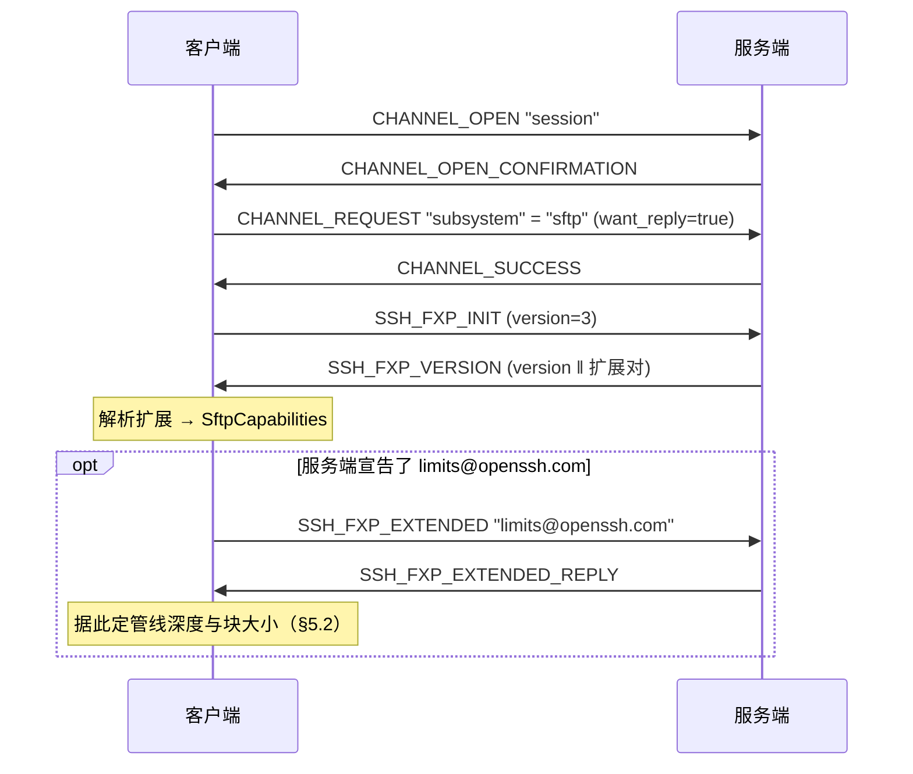
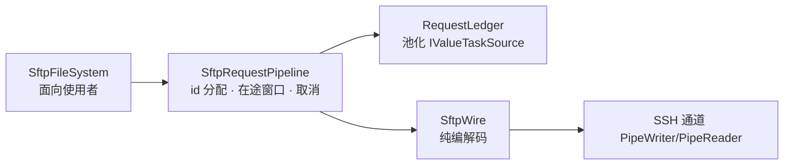

# 06 · SFTP

> 规范依据：draft-ietf-secsh-filexfer-02（**SFTP v3，事实标准**）；
> OpenSSH `PROTOCOL` 的 SFTP 扩展章节（`posix-rename`、`statvfs`、`fsync`、
> `hardlink`、`limits`、`copy-data`、`home-directory`、`expand-path`）。
>
> 对应实现：`Sftp/`，分三层：`SftpWire`（纯编解码）、
> `SftpRequestPipeline`（流水线）、`SftpFileSystem`（面向使用者）。

> **为什么是 v3 而不是更高版本**：v3 是 draft-02，OpenSSH 只实现它，
> 而 OpenSSH 是绝大多数 SFTP 服务端的实现或行为基准。v4–v6 在真实世界里
> 几乎见不到；为它们写代码是为不存在的对端付成本。
> 〔决策〕**只实现 v3**，协商到更高版本时降级到 3。

---

## 一 承载与握手

SFTP 跑在一条 `session` 通道的 `subsystem` 请求之上：



〔互操作〕若 `subsystem` 被拒（部分服务端只允许 `exec`），
〔决策〕**不自动回退到 `exec sftp-server`**。
理由：回退等于在服务端管理员明确禁用 subsystem 的情况下绕过它的配置。
把失败如实报出来（`SftpUnavailable`，并在消息里说明可能是服务端禁用了 sftp 子系统）。

---

## 二 SFTP 报文的外层结构

**注意：这一层与 SSH 的二进制报文无关**，SFTP 有自己的分帧，
跑在 SSH 通道的字节流上。

```
uint32   length      —— 不含自身这 4 字节
byte     type        —— SSH_FXP_*
uint32   request-id  —— 除 INIT / VERSION 外都有
byte[]   type 相关
```

| 约束 | 值 |
| --- | --- |
| `length` 上限 | 〔决策〕**256 KiB + 1024**（数据块上限加协议头余量）。超限断开通道 |
| `request-id` | `uint32`，我们从 1 递增、**回绕**。0 保留不用 |

**一条通道上可以有大量在途请求**，应答顺序**不保证**与发送顺序一致 ——
这正是 SFTP 能跑出吞吐的原因，也是必须用 id 而不是队列来对齐应答的原因
（与通道请求的 FIFO 语义不同，见 `05-connection.md` §5.1）。

---

## 三 报文类型

### 3.1 请求（客户端 → 服务端）

| # | 类型 | 用途 |
| :-: | --- | --- |
| 1 | `SSH_FXP_INIT` | 握手（**无 request-id**） |
| 3 | `SSH_FXP_OPEN` | 打开文件 → handle |
| 4 | `SSH_FXP_CLOSE` | 关闭 handle |
| 5 | `SSH_FXP_READ` | 按偏移读 |
| 6 | `SSH_FXP_WRITE` | 按偏移写 |
| 7 | `SSH_FXP_LSTAT` | stat，**不跟随**符号链接 |
| 8 | `SSH_FXP_FSTAT` | 按 handle stat |
| 9 | `SSH_FXP_SETSTAT` | 设属性 |
| 10 | `SSH_FXP_FSETSTAT` | 按 handle 设属性 |
| 11 | `SSH_FXP_OPENDIR` | 打开目录 → handle |
| 12 | `SSH_FXP_READDIR` | 读一批目录项 |
| 13 | `SSH_FXP_REMOVE` | 删文件 |
| 14 | `SSH_FXP_MKDIR` | 建目录 |
| 15 | `SSH_FXP_RMDIR` | 删空目录 |
| 16 | `SSH_FXP_REALPATH` | 规范化路径 |
| 17 | `SSH_FXP_STAT` | stat，**跟随**符号链接 |
| 18 | `SSH_FXP_RENAME` | 重命名 |
| 19 | `SSH_FXP_READLINK` | 读链接目标 |
| 20 | `SSH_FXP_SYMLINK` | 建符号链接（**参数顺序有坑，见 §4.5**） |
| 200 | `SSH_FXP_EXTENDED` | 厂商扩展 |

### 3.2 应答（服务端 → 客户端）

| # | 类型 | 内容 |
| :-: | --- | --- |
| 2 | `SSH_FXP_VERSION` | `uint32 version` ‖ 重复的 `string name ‖ string data` |
| 101 | `SSH_FXP_STATUS` | `uint32 code` ‖ `string message` ‖ `string lang` |
| 102 | `SSH_FXP_HANDLE` | `string handle`（**≤ 256 字节**） |
| 103 | `SSH_FXP_DATA` | `string data` |
| 104 | `SSH_FXP_NAME` | `uint32 count` ‖ 重复的 `string filename ‖ string longname ‖ ATTRS` |
| 105 | `SSH_FXP_ATTRS` | ATTRS |
| 201 | `SSH_FXP_EXTENDED_REPLY` | 扩展相关 |

### 3.3 状态码

| 码 | 名称 | 我们的映射（`SftpException.StatusCode`，类型 `SftpStatusCode`） |
| :-: | --- | --- |
| 0 | `OK` | 成功 |
| 1 | `EOF` | **不是错误**：`READ` 时表示读到末尾，`READDIR` 时表示目录读完 |
| 2 | `NO_SUCH_FILE` | `NoSuchFile` |
| 3 | `PERMISSION_DENIED` | `PermissionDenied` |
| 4 | `FAILURE` | `Failure` —— **服务端的万能错误码**，见下 |
| 5 | `BAD_MESSAGE` | `BadMessage` |
| 6 | `NO_CONNECTION` | `NoConnection` |
| 7 | `CONNECTION_LOST` | `ConnectionLost` |
| 8 | `OP_UNSUPPORTED` | `OperationUnsupported` |

〔重要〕**码 4（`FAILURE`）承载了 v3 里的绝大多数真实错误** ——
「目录非空」「文件已存在」「磁盘满」「配额超限」在 v3 里全是 4。
因此 `SftpException.Message` **必须**带上服务端给的 `message` 文本，
那是唯一能区分它们的信息。〔决策〕同时提供
`SftpException.ServerMessage` 原文字段，让上层能做自己的模式匹配
而不必去解析我们拼过的消息。

---

## 四 关键报文的细节

### 4.1 `SSH_FXP_OPEN`

| # | 类型 | 字段 |
| :-: | --- | --- |
| 4 | `string` | 路径（UTF-8） |
| 5 | `uint32` | pflags |
| 6 | ATTRS | 创建时的属性（通常只给权限） |

pflags：

| 位 | 名称 | 含义 |
| :-: | --- | --- |
| 0x01 | `READ` | |
| 0x02 | `WRITE` | |
| 0x04 | `APPEND` | 每次写都追加到末尾，**忽略偏移** |
| 0x08 | `CREAT` | 不存在则创建 |
| 0x10 | `TRUNC` | 截断已有内容（须配 `CREAT`） |
| 0x20 | `EXCL` | 已存在则失败（须配 `CREAT`） |

〔决策〕**创建文件时的默认权限 0644**，目录 0755，都可配。
不传 ATTRS 会让服务端用它自己的默认值（通常受 umask 影响），
结果不可预测 —— 传明确的值。

**打开之后先问一次长度。** 不截断的打开（读、续写、不带 `TRUNC` 的写）拿到 handle 后立刻对它发一次 `FSTAT`，
得到的大小就是流的 `Length` 的起点 —— `Seek(SeekOrigin.End)`、§5.5 的预读边界、§6.6 续传的前缀都靠它。
带 `TRUNC` 的打开不必问，长度就是 0。

- 服务端拒绝 `FSTAT`（回错误状态）**不算打开失败**：长度从 0 起算、记为「未知」，流照常可读写，
  只是 `Length` 与 `Seek(SeekOrigin.End)` 不准，顺序读也建不起预读（§5.5 只在已知长度之内预发）。
- 〔决策〕**`OPEN` 成功之后、流交到调用方手里之前出的其它错（取消、流水线断了、`FSTAT` 应答格式不对），
  先对这个 handle 发 `CLOSE`，再把错误抛出去。** 那一刻 handle 只存在于服务端，本端还没有任何对象持有它；
  不关就每失败一次漏一个，直到服务端的 `max-open-handles` 用光。这与 §5.3「被取消的 `OPEN` 迟到应答要关」是同一个问题的两半。
- 同理，不需要服务端就能查的参数（例如续写的偏移不能为负，§6.6）在发 `OPEN` **之前**查。

### 4.2 ATTRS 结构

```
uint32   flags
uint64   size           —— flags & 0x01
uint32   uid            —— flags & 0x02
uint32   gid            —— flags & 0x02（uid/gid 是同一个标志位！）
uint32   permissions    —— flags & 0x04
uint32   atime          —— flags & 0x08
uint32   mtime          —— flags & 0x08（atime/mtime 也是同一个标志位）
uint32   extended_count —— flags & 0x80000000
重复：string type ‖ string data
```

**三个坑**：

1. **`uid` 与 `gid` 共用一个标志位，`atime` 与 `mtime` 共用一个。**
   要设 mtime 就必须同时给 atime。〔决策〕只想改 mtime 时，
   先 `STAT` 取回当前 atime 一并写回。
2. **时间是 32 位 Unix 秒**，2038 年会溢出。v3 没有解法，照实现。
   〔决策〕读到的值按无符号解释可以撑到 2106 年 ——
   但服务端通常按有符号发，所以**按有符号读**，与 OpenSSH 一致。
3. `permissions` 的高位是文件类型（`S_IFMT`）：
   `0o100000` 普通文件、`0o040000` 目录、`0o120000` 符号链接。
   **v3 没有单独的类型字段，类型只能从这里取。**

### 4.3 `SSH_FXP_READ` / `SSH_FXP_WRITE`

| READ | | | WRITE | | |
| :-: | --- | --- | :-: | --- | --- |
| 4 | `string` | handle | 4 | `string` | handle |
| 5 | `uint64` | offset | 5 | `uint64` | offset |
| 6 | `uint32` | length | 6 | `string` | data |

**都是绝对偏移，服务端不维护文件位置。**
这意味着读写天然可以乱序并发 —— 这正是 §5 的流水线基础，
也是 §6 的水位线问题的来源。

〔重要〕**`READ` 返回的数据可能少于请求的长度**，这不是错误，
必须循环读直到拿够或遇到 `EOF`。

### 4.4 `SSH_FXP_READDIR`

- 每次返回**一批**目录项，不是全部。
- 返回 `STATUS = EOF` 表示读完。
- `longname` 是 `ls -l` 风格的一行文本，**格式未标准化**。
  〔决策〕**不解析 `longname`**，一切信息取自 ATTRS。
  解析它是各家 SFTP 客户端 bug 的经典来源（时间格式、locale、列对齐全都因服务端而异）。
  但**保留原文**供使用者需要时用。
- `.` 与 `..` **会**出现在结果里。〔决策〕`SftpFileSystem` 层默认过滤掉，
  提供开关。

### 4.5 `SSH_FXP_SYMLINK` 的参数顺序

> **这是 SFTP 里最有名的一个坑。**

draft-02 规定的顺序是 `linkpath` 然后 `targetpath`。
**但 OpenSSH 的实现把两者写反了**（OpenSSH bugzilla #861），
而 OpenSSH 是事实标准，所有客户端都跟着它错。

〔决策〕**按 OpenSSH 的顺序发**：先 `targetpath`，后 `linkpath`。

```
uint32   request-id
string   targetpath     ← 链接指向哪里（OpenSSH 顺序）
string   linkpath       ← 在哪里创建链接
```

〔决策〕**不提供「按 draft 顺序」的开关。** 没有已知的服务端按 draft 实现；
加一个永远不该被打开的开关，只会让人在排查别的问题时误开它。
若将来真遇到，用 `posix-rename` 那一路的扩展机制处理。

这条必须在代码注释里也写清楚，否则将来一定会有人"顺手修正"它。

### 4.6 `SSH_FXP_REALPATH`

用于把相对路径、`~`、`.`、`..` 规范化成绝对路径。
返回 `SSH_FXP_NAME` 且 `count == 1`。

〔决策〕**连接建立后立刻对 `"."` 做一次 `REALPATH`**，
拿到工作目录作为 `SftpFileSystem.WorkingDirectory` 的初值。
这是唯一可靠的「用户家目录在哪」的答案 —— 比拼 `/home/{user}` 靠谱得多。

---

## 五 请求流水线

### 5.1 结构



`SftpWire` 是**纯函数**：`bytes ↔ SftpMessage`，无状态、无 I/O。
这让它可以用报文样本逐字节断言，不需要任何对端 —— 这是整个 SFTP 层
最容易也最值得测透的一部分。

### 5.2 深度与块大小的自适应

〔决策〕**按服务端宣告的 `limits@openssh.com` 定，而不是写死。**

`limits@openssh.com` 的应答给出四个值：

| 字段 | 用途 |
| --- | --- |
| `max-packet-length` | 单个 SFTP 报文上限 |
| `max-read-length` | 单次 `READ` 的 length 上限 |
| `max-write-length` | 单次 `WRITE` 的 data 上限 |
| `max-open-handles` | 同时打开的 handle 数上限（0 = 未知） |

没有这个扩展时的保守默认（〔决策〕）：

| 项 | 默认 |
| --- | --- |
| 块大小 | 32 KiB（SSH 通道 max packet 的典型值） |

在途请求数（深度）与这个扩展无关，按下面的判据自己伸缩。

**为什么深度要自适应**：在途请求数 × 块大小就是 SFTP 层的「窗口」。
和通道窗口一样（`05-connection.md` §3.3），固定值在高 RTT 链路上直接封死吞吐。
写死 64 × 32 KB = 2 MiB，200 ms RTT 下同样是 10 MB/s 封顶。

**深度怎么伸缩**：〔决策〕**看请求有没有撞到上限，不按 RTT 去估带宽时延积。**

| 项 | 规则 |
| --- | --- |
| 起始 | `SftpOptions.MaxInFlight`（默认 64），也是往回收的下限 |
| 判定 | 每发 32 个请求评估一次，数这一窗里有几个请求是**等着**才拿到在途额度的 |
| 扩 | 超过一半在等 → 深度是瓶颈，翻倍，直到 `SftpOptions.MaxPipelineDepth`（默认 256） |
| 收 | 一次都没等过 → 收到四分之三（不低于起始值）。收额度**不阻塞**：额度正被占着就下一窗再说，不在这里把调用方卡住 |
| 关掉 | `SftpOptions.AdaptivePipelineDepth = false`：深度固定在起始值，内存占用确定（在途数 × 块大小），代价是高 RTT 链路上吞吐被「深度 × 块大小 ÷ RTT」封死 |

理由：按带宽时延积算深度要先估出带宽，而带宽估计在一条还有别的流量的链路上很不稳；
「有没有等额度」是更直接、也更难估错的信号 —— 与通道窗口按「见底」来扩（`05-connection.md` §3.3）是同一个思路。

**块大小的取法**：〔决策〕从使用者指定的 `SftpOptions.BlockSize` 出发（0 = 不指定），
取它与下面几项上限的最小值，再夹到 [1, 256 KiB]：

| 上限 | 为什么要算进来 |
| --- | --- |
| `max-write-length` | 超长的 `WRITE` 会被拒 —— OpenSSH 收到超长报文直接断开 SFTP 会话，连同别的在途请求一起 |
| `max-read-length` | 超长的 `READ` 会被截短，而顺序读把短读当成「中间有洞」（§5.5），每一块都整队作废，预读永远建不起来 |
| `max-packet-length` 减 1 KiB | 数据之外还要装下请求头（长度、类型、id、最长 256 字节的 handle、偏移），1 KiB 绰绰有余 |
| 256 KiB | 本端肯收的报文上限（§2 的 256 KiB + 1024）：一块 `DATA` 应答连同协议头要装得下 |

- 服务端给的 **0 是「没说」，不是「一个字节」**，不参与取最小值。按字面取的话块大小就成了 1 ——
  1 MB 的文件要一百万个请求。
- 使用者没指定时：服务端给了上限就取上限（例如报文 256 KiB、读写各 255 KiB 的宣告得到 255 KiB 的块），
  三项都是 0 就用 32 KiB。
- 使用者指定的块**同样服从这些上限**。没宣告扩展、或者宣告了却查询失败时，读、写、报文三项上限按上表的保守默认（32 KiB）计 ——
  所以这时指定更大的块也只得到 32 KiB。

**一次请求至多一块。** 写：`WriteAsync` 与 `WriteAtAsync` 都把超过一块的数据切成若干个块大小的 `WRITE`。
读：每个 `READ` 至多请求一块；`ReadAtAsync` 给的缓冲比一块大时只读一块，返回的字节数少于缓冲 ——
这是 §4.3 允许的短读，调用方本来就要循环读，语义不变。

### 5.3 取消

`RequestLedger` 的取消语义**必须**明确：

- 取消一个在途请求 **不会**让服务端停下来 —— SFTP 没有取消报文。
  我们只是不再等它的应答。
- 因此取消后**必须**继续消费并丢弃那个 id 的应答，
  且**必须处理「应答里带着一个需要关闭的 handle」的情况** ——
  `OPEN` 被取消但服务端已经打开了文件，那个 handle 不关就泄漏在服务端。
  〔决策〕账本在取消时保留一个「善后回调」，收到迟到应答时执行它（发 `CLOSE`）。
- **没上线的请求当场撤回。** 排在发送锁上时被取消、或者拼报文时出错的请求，这个 id 永远等不到应答；
  而它占着的在途额度只有应答才还得回来 —— 留在账本里就永远还不回来，取消几次之后所有 SFTP 操作一起挂住。
  〔决策〕这种请求当场摘出账本、还回额度；只有已经上线的请求才走上一条「留着等迟到应答」的路。
- **「上线」的界线必须清楚。** 报文直接写进通道的管道（不经中转缓冲），整帧写完就算上线；
  之后调用方的取消只打断等背压的那一段，不会留下半帧。〔决策〕写管道时不带调用方的令牌 ——
  带着的话，同一个取消异常既可能是「一个字节都没写」，也可能是「已经提交、照样会发出去」，
  而这两种情况对在途额度的处理正好相反。

### 5.4 通道关闭时的收尾

流水线一旦收工，账本里所有在途请求**一次性**以同一个异常收尾 —— 第一个故障原因；
之后再发的请求也立刻抛这个异常。这是 L6 统一账本的直接收益：这段逻辑只写一次、只证明一次。

| 收工原因 | 在途请求拿到的异常 |
| --- | --- |
| 通道正常结束（对端发了 EOF / CLOSE，例如 sftp-server 退出；或通道在本端被关掉） | `SftpTransferInterruptedException`。流水线这一层不知道写到了哪里，它的 `DurableLength` 是 0；文件流在 `FlushAsync` / 关闭时会换成带本流精确 `DurableLength` 的那一个（§6.2），原因挂在内层 |
| 连接断了 | 通道读端交出来的连接故障，原样（本端释放连接时是 `ObjectDisposedException`） |
| 收到畸形帧（长度超上限、放不下 `request-id`，§9） | `SshProtocolException`（`ProtocolError`） |
| 本端释放 `SftpFileSystem`（连同流水线） | `SftpUnavailableException` |

还没拿到 id 的调用方 —— 排在在途额度或发送锁上等着的 —— 也要**一起放出来**：拿到上表的那个故障；
释放时的竞态下也可能是 `ObjectDisposedException`。在途额度只有应答才还得回来，而收工之后不会再有应答；不放的话，
列目录时并发解析的那一批链接（§8）之类的排队者就永远等下去。

### 5.5 顺序读的预读

**问题**：文件流的顺序读（`ReadAsync`）若一次只发一个 `READ`、等它回来再发下一个，
吞吐被钉死在「块大小 ÷ RTT」—— 100 ms 的链路上 32 KiB 的块只有约 320 KB/s，
流水线写入那一侧的深度完全用不上。下载正是走这条路。

〔决策〕**顺序读维护一个预读窗口：在途的 `READ` 按偏移排成一队，逐个交给读者。**

- **只管顺序读**。`ReadAtAsync`（带偏移的随机读）照旧一次一个请求；
  读位置被改动（`Seek` / `Position`）、或者往同一个句柄写过、改过长度时，整队作废、从新位置重来。
- **慢启动**：窗口从 1 个请求起，每交出一整块翻一倍，上限等于在途请求数上限（`SftpOptions.MaxInFlight`）。
  只读文件头几个字节的用法不会平白多发一串请求。
- **不越过已知长度预读**：只对「已知长度之内」的偏移预发；已知长度之外至多一个请求 ——
  用来读到 `EOF`，或者发现文件在打开之后变长了。已知长度来自打开时的 `FSTAT`，读到的数据会把它往后推。
- **短读**（服务端回的字节少于请求的，而且不是 `EOF`）：交出这些字节，其后已发的请求整队作废 ——
  它们的偏移与读位置之间隔着一个洞，最简单也最不会错的做法是从读位置重来（§4.3 的循环读语义不变）。
- **作废的请求不能丢着不管**：它们的应答照样会到，到了就释放（载荷是从池里租的）。
- **取消只取消这一次等待**：预读请求属于流、不属于某一次 `ReadAsync`；调用方取消一次读，队伍原样留着，下一次读接着用。
- 读到 `EOF` 或错误状态：整队作废，`EOF` 返回 0，错误照常抛。

---

## 六 写入水位线 —— 消灭「盲退 2 MB」

### 6.1 问题

流水线满载时有 N 个在途 `WRITE`，**应答顺序不保证**。
传输中途断开时：

```
偏移 0 ....... 1 MiB ....... 2 MiB ....... 3 MiB
已确认：  [==========]        [====]        [====]
                      ↑ 空洞          ↑ 空洞
文件长度 = 3 MiB  ← 但 1–2 MiB 那段其实没写进去
```

服务端报告的**文件长度**只代表「已确认的**最高**偏移」，
不代表它之前的每个字节都落盘了。中间可能留有读作 0 的空洞。

现有做法是**从文件长度盲退一个完整的在途窗口**（例如 64 × 32 KB = 2 MiB），
使续传起点之前的数据可信。代价是每次续传都要重传 2 MiB，
而且这个数字是「猜」出来的 —— 换个实现或换个配置就不对了。

### 6.2 解法：连续确认偏移

管线为每个写 handle 维护：

| 字段 | 含义 |
| --- | --- |
| `_ackedRanges` | 已确认的区间集合（有序、合并相邻） |
| `DurableLength` | **从 0 开始连续已确认**的最高偏移 |

```
每收到一个 WRITE 的 OK 应答：
    把 [offset, offset+len) 并入 _ackedRanges（合并相邻区间）
    DurableLength = 从 0 起第一个空洞的位置（即第一个区间的右端，若它从 0 开始）
```

`SftpFileStream.DurableLength` 暴露它。断点续传从这个数续，**精确，不用猜**（续传怎么开见 §6.6）。

〔实现要点〕区间集合要用**有序数组 + 二分插入**而不是字典 ——
顺序写入时新区间几乎总是接在最后一个的尾部，
合并后集合大小恒为 1，代价 O(1)。乱序写入时集合才会增长，
且上限就是在途请求数（N ≤ 256），完全可控。

〔决策〕**通道断开时把 `DurableLength` 写进异常**
（`SftpTransferInterruptedException.DurableLength`），
让上层不必再去 stat 一次、更不必盲退。

### 6.3 顺序保证的另一条路

〔决策〕同时提供 `SftpWriteMode.Sequential`：
在途请求数固定为 1，牺牲吞吐换「文件长度就是可信长度」。
用于那些必须保证任何时刻文件都是前缀完整的场景（例如写配置文件）。

---

### 6.4 文件流只有异步形态

〔决策〕（`architecture.md` 原则 1）文件流是 `Stream` 的派生类，而 `Stream` 自带同步的
`Read` / `Write` / `SetLength` / `Flush` / `Dispose`。同步版本只能靠「阻塞一个线程等网络往返」实现 ——
UI 线程上是界面卡住一个 RTT，线程池上并发一多就是饿死。所以：

| 同步成员 | 行为 |
| --- | --- |
| `Read` / `Write` / `SetLength`（及单字节、`Span` 重载） | 抛 `NotSupportedException`，消息里指明该用的异步版本 |
| `Flush` | **不阻塞的空操作**（本端没有缓冲）；已知的写入失败照样抛出。要确认落盘用 `FlushAsync` |
| `Dispose` | **不阻塞**：收尾（等在途写入确认、关句柄）交给后台，立刻返回；看不到收尾的错误（写入中断、`CLOSE` 失败，§6.5），要看就用 `await using` |

`Flush` 保留为不抛的空操作，是因为包装流（`StreamWriter` 之类）在自己的收尾里会同步调用它；
让它抛会把一个无害的调用变成失败。

异步的**数组重载**（`ReadAsync` / `WriteAsync` 的 `byte[], int, int, CancellationToken` 版本）与老式的
`BeginRead` / `EndRead` / `BeginWrite` / `EndWrite` **照常工作**，都转到异步实现上。
〔决策〕必须显式重写它们：`Stream` 的默认实现把它们绕到同步的 `Read` / `Write` 上，
不重写的话，调用方明明走的是异步形态，拿到的却是「只支持异步」的 `NotSupportedException`。

### 6.5 关闭：`CLOSE` 的应答要看

`DisposeAsync`（`await using`）的收尾顺序：

1. 作废还在路上的预读（§5.5），它们的应答到了就释放；
2. 等所有在途写入确认（同 `FlushAsync`）；
3. **无论上一步成败都发 `CLOSE`** —— 写入失败了 handle 也得关，否则泄漏在服务端；
4. 按下表决定报什么。

| 情况 | 行为 |
| --- | --- |
| 在途写入有失败 | 抛 `SftpTransferInterruptedException`（带 `DurableLength`）。`CLOSE` 照发，但它的状态不再看 —— 先发生的才是根因 |
| 写入都确认了，**可写的流**上 `CLOSE` 回了错误状态 | 抛 `SftpException`（码与服务端原话照 §3.3） |
| 只读的流上 `CLOSE` 回了错误状态 | 不报 |
| `CLOSE` 发不出去或等不到应答（通道已断、流水线已坏） | 不报 |
| 已经关过的流再关（含同步 `Dispose` 之后） | 空操作，不抛 |

〔决策〕**可写的流要看 `CLOSE` 的状态。** 有的服务端（NFS 的延迟写、配额）直到关闭时才报出写入失败；
吞掉它，调用方就以为文件完整地写好了。「可写」按打开方式算，不管这次写没写过
（也不看 `CanWrite` —— 关闭之后它已经是假，见下）。
只读的流关不上无关紧要；通道已经没了的话服务端自己会回收 handle，而真正的原因已经由别的路径报过，
在释放路径上再抛只会盖住它。同步 `Dispose` 把这一整套交给后台（§6.4），**看不到 `CLOSE` 的失败** —— 写文件要用 `await using`。

关闭之后流上各成员的行为：

| 成员 | 关闭之后 |
| --- | --- |
| 要用到 handle 的：读、写（含按偏移的 `ReadAtAsync` / `WriteAtAsync`、数组重载与 `BeginRead` / `BeginWrite`）、`Seek`、`SetLengthAsync`、`GetAttributesAsync`、`FsyncAsync` | 抛 `ObjectDisposedException`，不发任何请求 |
| `CanRead` / `CanWrite` | 变成假（`Stream` 的约定：已释放的流不可读写） |
| `Position` / `Length` / `DurableLength` | **仍然可读** |

〔决策〕**要用 handle 的一律拒绝。** 理由很具体：OpenSSH 的 handle 是服务端表里的下标，
关掉之后会分给下一个打开的文件 —— 拿旧 handle 再写一次，写进去的是别人的文件。
〔决策〕**位置、长度与 `DurableLength` 照旧可读**：它们不碰 handle，而关闭报错之后，
调用方正要靠它们决定从哪里续传（§6.6）—— 让它们也抛，就把续传需要的信息一起锁在了已释放的流里。

### 6.6 续传：`OpenAppendAsync`

`OpenAppendAsync(path, offset)` 打开（不存在则创建）文件，**不截断**，写位置放在 `offset`，返回一个只写的流。
配合 `DurableLength`（流上的，或 `SftpTransferInterruptedException` 里的）就是精确的断点续传。
流的 `Length` 是打开时 `FSTAT` 到的真实长度（§4.1），`Seek(0, SeekOrigin.End)` 落在文件末尾。

- 〔决策〕**用 `WRITE | CREAT`，不用 `APPEND` pflag。** 续传点是 `DurableLength`，它可能**小于**文件长度 ——
  后面那段里有空洞（§6.1），必须从续传点起**覆盖**写。`APPEND` 让服务端忽略偏移（§4.1），
  数据会接到文件末尾、空洞原样留着；本端也就不知道每块落在哪，§6.2 的区间账没法记。
- 〔决策〕**返回的流把 `[0, offset)` 算作已确认**，`DurableLength` 从这里起算，而不是 0。
  不这样的话，续传途中再断一次，`DurableLength` 报 0，下一次续传就从头来过。
  - 打开时知道文件长度，而 `offset` 超过了它：只算到文件末尾 —— `[文件长度, offset)` 是洞，不是确认过的数据。
  - 长度未知（`FSTAT` 被拒，§4.1）：照 `offset` 算。
- **这个前提由调用方担保**：`offset` 应当是上一次传输报出的 `DurableLength`。拿服务端报的文件长度当 `offset`，
  就把 §6.1 的空洞一并算成了「已确认」—— 那正是水位线要消灭的猜测。
- `offset` 为负在发 `OPEN` 之前就拒（`ArgumentOutOfRangeException`），不留下一个没人关的 handle（§4.1）。

## 七 扩展

### 7.1 我们使用的扩展

| 扩展 | 用途 | 没有时的行为 |
| --- | --- | --- |
| `posix-rename@openssh.com` | **原子**重命名（覆盖目标） | 退化到 `SSH_FXP_RENAME`，**并把这个事实报出来** |
| `hardlink@openssh.com` | 建硬链接 | 抛 `Unsupported` |
| `fsync@openssh.com` | 强制落盘 | 抛 `Unsupported` |
| `statvfs@openssh.com` | 文件系统用量 | 抛 `Unsupported` |
| `limits@openssh.com` | §5.2 | 用保守默认 |
| `copy-data` | **服务端内**复制，不经过网络 | 退化到「下载再上传」 |
| `home-directory` | 取指定用户的家目录 | 用 `REALPATH "."` |
| `expand-path@openssh.com` | 展开 `~` | 用 `REALPATH` |

### 7.2 能力查询是公开 API

```
SftpCapabilities Capabilities { get; }
  bool HasPosixRename / HasHardlink / HasFsync / HasStatVfs / HasCopyData ...
  IReadOnlyDictionary<string,string> RawExtensions { get; }
```

〔决策〕**能力必须可查，而不只是内部降级。**

理由很具体：`posix-rename` 与普通 `rename` 的语义**不一样** ——
前者原子覆盖，后者在目标存在时失败（且某些服务端连跨目录移动都拒）。
库内部静默降级，上层就无从知道自己拿到的是哪一种语义，
也无法在 UI 上提示「这台服务器不支持原子覆盖，移动操作可能不是原子的」。

### 7.3 `SSH_FXP_EXTENDED` 的形状

| # | 类型 | 字段 |
| :-: | --- | --- |
| 4 | `string` | 扩展名 |
| 5+ | 扩展相关 | |

`ISftpExtension` 是公开的扩展点（架构 §8 第 10 项），
让使用者能加厂商私有扩展而不必改库。

---

## 八 符号链接的口径

〔决策〕**列目录与 stat 都用 `LSTAT`（不跟随），链接项再补一次跟随的 `STAT` 与 `READLINK`。**

得到的条目：

| 字段 | 含义 |
| --- | --- |
| `IsSymbolicLink` | **链接本身**是不是链接 |
| `LinkTarget` | `READLINK` 的原文（可能是相对路径） |
| 其余字段（`Length` / `IsDirectory` / 时间） | 描述**链接指向的对象** |
| 断链（跟随 `STAT` 失败） | 保留链接自身的属性，`IsDirectory = false`，**不是 `null`** |

理由：
- 直接用跟随的 `STAT` 会让「这是个链接」这个事实彻底消失，
  于是删除一个指向目录的链接会变成递归删除目标目录里的东西 —— 这是数据事故。
- 断链返回 `null` 也不对：链接本身是存在的，删除它不能先报「找不到」。

〔性能〕链接项的补充请求**必须并发发出**（它们在同一条通道上流水线）。
`/usr/lib` 那种几百个 `.so` 链接的目录，串行补就是几百轮往返，并发补只是一轮。

〔决策〕**补充请求自己出错，只影响这一项。** 服务端拒绝，或者这一条应答格式不对（例如 `READLINK` 回了两项）：
`LinkTarget` 为 `null`，跟随 `STAT` 失败就按断链处理 —— 一个怪链接不该让整个目录列不出来。
**流水线本身坏了**（通道断开、收到畸形帧）不在此列，照常抛：那不是这一项的事。

---

## 九 边界与错误速查

| 情况 | 处理 |
| --- | --- |
| `length` 超上限 | 断开通道，`ProtocolError` |
| handle 超过 256 字节 | `ProtocolError`（draft-02 规定的上限） |
| 收到未知 `request-id` 的应答 | 〔决策〕忽略 + debug 日志（可能是已取消请求的迟到应答，§5.3） |
| 收到未知报文类型 | `ProtocolError`（SFTP 层没有 `UNIMPLEMENTED` 机制） |
| 服务端 version > 3 | 降到 3 继续 |
| 服务端 version < 3 | 〔决策〕**拒绝**，抛 `SftpUnsupportedVersion`。v0–v2 差异过大，不值得支持 |
| `READ` 返回的数据多于请求的 length | `ProtocolError` |
| `READDIR` 返回的 `count` 与实际项数不符 | `ProtocolError` |
| 应答载荷格式不对（字段截断、长度越界等） | 〔决策〕抛公开的 `SshProtocolException`（`ProtocolError`），**不让内部的解析异常漏出去** —— 那是内部类型，使用者按类型接不住它。只影响这一次调用：解析在调用方的路径上做，流水线照常可用 |
| 应答短到连 `request-id` 都放不下 | 流水线故障，所有在途请求一起失败（§5.4） |
| 路径含 `\0` | 本地拒绝（`ArgumentException`），不发给服务端 |
| 在途请求数达上限 | 等待（背压），不报错 |
| `ReadAllBytesAsync` 拿到的文件大小 | 〔决策〕只用来估初始容量，**封顶 1 MiB** —— 那是对端给的数，一个谎报 2 GiB 的小文件不该让本端先分配 2 GiB。实际数据更多时缓冲随读随长；不另设总量上限，但整个文件要装进一个数组，大文件应当用流。读取走顺序读，吃得到 §5.5 的预读 |
