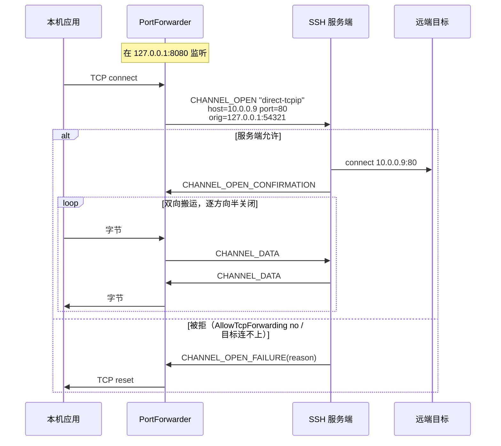
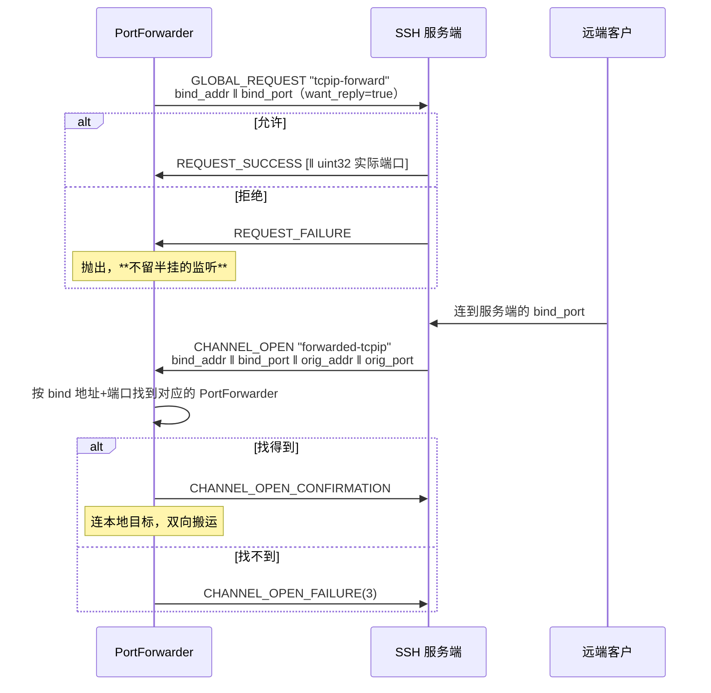

# 07 · 转发与隧道

> 规范依据：RFC 4254 §7（TCP/IP Port Forwarding）；
> OpenSSH `PROTOCOL` 的 `*-streamlocal@openssh.com`、`auth-agent-req@openssh.com`；
> RFC 1928（SOCKS5，用于动态转发）。
>
> 对应实现：`Forwarding/`（L8）。

---

## 一 四种转发

| 形态 | OpenSSH 参数 | 谁监听 | 出站是什么 |
| --- | :-: | --- | --- |
| **本地转发** | `-L` | 我们（本机） | `direct-tcpip` 通道 |
| **动态转发** | `-D` | 我们（本机，跑 SOCKS5） | `direct-tcpip` 通道，目标由 SOCKS 握手给出 |
| **远程转发** | `-R` | 服务端 | 服务端发起 `forwarded-tcpip` 通道，我们连本地目标 |
| **直连隧道** | 无（`-W` 近似） | 无人监听 | `direct-tcpip` / `direct-streamlocal`，流直接交给调用方 |

**第四种最容易被忽略，但常常是最该用的那一种。**
接 `/var/run/docker.sock` 或某个内网 HTTP API 时，本机**不需要**一个监听端口 ——
开了反而意味着同机的任何进程都能连上去。对 root 等价的端点，这不是优化而是前提。

---

## 二 本地转发 `-L`



### 2.1 `direct-tcpip` 的额外字段

| # | 类型 | 字段 | 说明 |
| :-: | --- | --- | --- |
| 6 | `string` | `host to connect` | **从服务端视角解析** —— `localhost` 指服务端的环回 |
| 7 | `uint32` | `port to connect` | |
| 8 | `string` | `originator IP` | 本机发起方地址 |
| 9 | `uint32` | `originator port` | |

〔决策〕**originator 如实填写**（真实的本机地址与端口）。
服务端会把它写进日志；填假的会让服务端管理员无法追溯，也没有任何隐私收益
（服务端本来就知道我们的连接来源）。

### 2.2 半关闭的正确处理

TCP 与 SSH 通道都支持半关闭，**必须逐方向对应**：

| 事件 | 动作 |
| --- | --- |
| 本机应用 shutdown(SEND) | 发 `CHANNEL_EOF` |
| 收到 `CHANNEL_EOF` | 对本机 socket `shutdown(SEND)` |
| 本机 socket 完全关闭 | 发 `CHANNEL_CLOSE` |
| 收到 `CHANNEL_CLOSE` | 关闭本机 socket，回 `CHANNEL_CLOSE` |

**把 EOF 当成「连接结束」会截断数据。** 典型症状：
`curl` 通过隧道 POST 一个请求体后等响应，而我们在它 shutdown 写端时
把整条通道关了，响应永远收不到。

### 2.3 绑定地址

| `BindAddress` | 行为 |
| --- | --- |
| `127.0.0.1`（〔决策〕**默认**） | 只有本机能连 |
| `0.0.0.0` / `::` | 局域网可连。**必须由使用者显式指定** |
| 具体网卡地址 | 只在那张网卡上监听 |

〔决策〕**默认绑环回。** 一条隧道的另一端往往是内网数据库或管理接口；
默认绑 `0.0.0.0` 等于把它暴露给同网段的所有人。
OpenSSH 的默认也是这个（`GatewayPorts no`）。

〔决策〕**端口 0 表示由系统分配**，分配结果通过 `PortForwarder.BoundEndPoint` 回传。

---

## 三 动态转发 `-D`（SOCKS5）

与本地转发的唯一差别：目标地址不是配置死的，而是**客户端在 SOCKS 握手里给出的**。

### 3.1 我们实现的 SOCKS 子集

> 依据：RFC 1928。

| 项 | 支持 |
| --- | --- |
| 版本 | **只支持 SOCKS5**（0x05）。SOCKS4/4a 〔决策〕不实现 |
| 认证方法 | 只接受 `0x00`（无认证）。〔决策〕见下 |
| 命令 | 只支持 `CONNECT`（0x01）。`BIND` / `UDP ASSOCIATE` 回 `0x07`（命令不支持） |
| 地址类型 | IPv4（0x01）、域名（0x03）、IPv6（0x04）全支持 |

〔决策〕**不实现 SOCKS 认证。**
理由：这个监听默认只在环回上（§2.3），同机进程本来就能连；
加一层用户名密码认证给人一种它是安全边界的错觉，而它不是。
真要限制访问，用操作系统的手段（防火墙、命名空间）。

〔决策〕**域名不在本地解析，原样交给服务端。**
这是动态转发最重要的一条语义 —— `curl --socks5-hostname` 依赖它。
本地解析会导致「DNS 走本地、连接走隧道」的分裂，
在内网域名场景下直接失效，而且泄漏了访问目标。

### 3.2 应答码映射

| SSH `CHANNEL_OPEN_FAILURE` 原因 | SOCKS5 REP |
| :-: | :-: |
| 1 `ADMINISTRATIVELY_PROHIBITED` | 0x02 connection not allowed |
| 2 `CONNECT_FAILED` | 0x05 connection refused |
| 3 `UNKNOWN_CHANNEL_TYPE` | 0x01 general failure |
| 4 `RESOURCE_SHORTAGE` | 0x01 general failure |
| 通道打开超时 | 0x06 TTL expired |

映射对不对是有实际后果的：`curl` 和浏览器会根据 REP 码决定要不要重试、
以及报给用户哪句话。一律回 `0x01` 等于把信息丢了。

---

## 四 远程转发 `-R`

### 4.1 建立



### 4.2 两个必须

1. **`bind_port = 0` 时，实际端口在 `REQUEST_SUCCESS` 的载荷里**
   （一个 `uint32`）。`want_reply` 必须为 true，否则拿不到端口号。
2. **服务端发起的 `forwarded-tcpip` 通道要按「绑定地址 + 端口」路由到对应的转发器。**
   同一条 SSH 会话上可以有多条远程转发，它们共用这一个通道类型。
   〔决策〕路由表的 key 是 `(bind_addr 原样字符串, bind_port)` ——
   **不要**对地址做规范化（`""`、`"*"`、`"0.0.0.0"`、`"localhost"` 在服务端是不同的语义，
   而它回给我们的是我们请求时用的那个串）。

### 4.3 取消

`cancel-tcpip-forward` 全局请求，字段同 `tcpip-forward`。
〔决策〕取消后**仍要继续接受在途的 `forwarded-tcpip` 通道**若干秒，
否则正在建立的连接会被莫名拒绝。

### 4.4 Unix 套接字变体

`streamlocal-forward@openssh.com` / `cancel-streamlocal-forward@openssh.com`
（全局请求）+ `forwarded-streamlocal@openssh.com`（通道类型），
字段把 `addr ‖ port` 换成一个 `string socket_path`。

---

## 五 计量 —— 在库里，不在调用方

> 这是本库相对现有实现最直接的一处收益。

`PortForwarder` 对外提供：

```
ForwardKind Kind { get; }
EndPoint?   BoundEndPoint { get; }      // 端口 0 时这里是实际端口
bool        IsActive { get; }

int  ActiveConnections { get; }
long TotalConnections  { get; }
long BytesUp   { get; }                 // 本机 → 远端
long BytesDown { get; }                 // 远端 → 本机

event EventHandler<ForwardConnectionEventArgs> ConnectionOpened;
event EventHandler<ForwardConnectionEventArgs> ConnectionClosed;   // 含该连接的字节数与时长
event EventHandler<ForwardErrorEventArgs>      Error;              // 单条连接失败，转发器仍在跑
```

同时走 `System.Diagnostics.Metrics`：

| 仪表 | 类型 | 标签 |
| --- | --- | --- |
| `velashell.ssh.forward.connections.active` | UpDownCounter | `kind`、`bind` |
| `velashell.ssh.forward.connections.total` | Counter | `kind`、`bind` |
| `velashell.ssh.forward.bytes` | Counter | `kind`、`bind`、`direction` |
| `velashell.ssh.forward.errors` | Counter | `kind`、`bind`、`reason` |

〔决策〕**两条路都给**：事件给桌面 UI（要实时刷一个面板），
Metrics 给服务端场景（接 OpenTelemetry）。二选一都会逼使用者自己重写一遍数据面 ——
而那正是我们要消除的那 376 行。

〔实现要点〕计数用 `Interlocked`，读取用 `Volatile.Read`。
字节计数在**搬运循环里**累加，不是在通道层 —— 通道层的字节数含协议开销，
而面板上要显示的是应用数据量。

---

## 六 搬运循环

三种转发都收敛到同一个循环，**这是刻意的**：

```
监听/接受 → 建立出站（工厂委托） → 双向搬运（含计量与半关闭） → 收尾
```

只有「出站怎么建」不同：

| 形态 | 出站工厂 |
| --- | --- |
| 本地 | `(_, ct) => conn.OpenTunnelAsync(host, port, ct)` |
| 动态 | `(inbound, ct) => { 先在 inbound 上跑完 SOCKS5 握手拿到目标; 再 OpenTunnelAsync }` |
| 远程 | 入站是服务端给的通道，出站是本机 TCP —— 方向反过来，循环不变 |

〔决策〕**搬运层与 SSH 无关，单独可测。**
它只见到两个 `Stream`（或 `IDuplexPipe`）。因此半关闭、计量、
错误收尾这条主路径不必架一台真服务器就能验证。

**缓冲**：〔决策〕每方向 32 KiB，从 `ArrayPool` 租借。
与 SSH 通道的 max packet 同量级，又不至于让每条连接都占住大块内存
（1000 条并发连接 × 2 方向 × 32 KiB = 64 MiB，可接受）。

---

## 七 Agent 转发

> 依据：OpenSSH `PROTOCOL` 的 `auth-agent-req@openssh.com`、`PROTOCOL.agent`。

### 7.1 机制

1. 在 **session 通道**上发 `CHANNEL_REQUEST "auth-agent-req@openssh.com"`（`want_reply = true`）。
2. 服务端随后可以发起 `CHANNEL_OPEN "auth-agent@openssh.com"` 通道。
3. 我们把这条通道桥到本机的 ssh-agent（Unix 套接字 / Windows 命名管道）。

由 `IIncomingChannelHandler` 处理（架构 §8 第 8 项）。

### 7.2 安全要求

> **Agent 转发是一把上膛的枪。** 远端主机上的 root 可以在转发期间
> 用你的私钥签任何东西。

〔决策〕三条硬约束：

1. **默认关闭**，必须逐连接显式开启。
2. **必须支持「只转发指定的密钥」**（`AgentForwardPolicy.AllowedKeys`），
   而不是把整个 agent 暴露出去。
3. **可选的签名确认回调**（`AgentForwardPolicy.ConfirmEachSignature`）：
   每次远端请求签名时问一次使用者。对跳板场景这是唯一能让人安心的做法。

〔决策〕**我们只做转发，不做 agent 服务端。**
本机 agent 由操作系统提供（OpenSSH agent / Pageant / 1Password 等）。

### 7.3 往本机 agent 加钥（`ssh-add`）

> 依据：draft-miller-ssh-agent 的「添加密钥」「私钥格式」「密钥约束」三节；OpenSSH `PROTOCOL.agent`。

这是 agent **客户端**的一条请求（`ssh-add` 做的事），不是 agent 服务端 —— 与 7.2 的决策不冲突。
用途：把一把加密私钥解开一次、交给 agent 保管，之后的认证与转发都经 agent 签名，不必再输口令。

**请求报文**：

| 字段 | 类型 | 说明 |
| --- | --- | --- |
| 消息号 | byte | `17` `SSH_AGENTC_ADD_IDENTITY`；带约束时 `25` `SSH_AGENTC_ADD_ID_CONSTRAINED` |
| 密钥类型 | string | `ssh-ed25519` / `ssh-rsa` / `ecdsa-sha2-nistp256` / `-nistp384` / `-nistp521` |
| 私钥内容 | 按类型，见下表 | |
| 注释 | string | UTF-8；`ssh-add -l` 显示的那一列，通常写私钥文件路径 |
| 约束 | byte + 参数，可重复 | **只在 `25` 里出现**，见下表 |

**私钥内容**（紧跟在密钥类型之后）：

| 密钥类型 | 字段（按顺序） |
| --- | --- |
| `ssh-ed25519` | string 公钥（32 字节）；string 种子 ‖ 公钥（64 字节，种子在前） |
| `ssh-rsa` | mpint n；mpint e；mpint d；mpint iqmp（q⁻¹ mod p）；mpint p；mpint q |
| `ecdsa-sha2-*` | string 曲线名（`nistp256` / `nistp384` / `nistp521`）；string 公钥点（未压缩，`0x04 ‖ X ‖ Y`）；mpint 私钥标量 d |

⚠️ RSA 这里是 **n 在前、e 在后**，与公钥 blob（e 在前）相反。写反了 agent 照样回 SUCCESS，
直到第一次签名才露馅。

**约束**：

| 编号 | 名称 | 参数 | 含义 |
| :-: | --- | --- | --- |
| `1` | `SSH_AGENT_CONSTRAIN_LIFETIME` | uint32 秒 | 到期后 agent 自己删掉这把钥 |
| `2` | `SSH_AGENT_CONSTRAIN_CONFIRM` | 无 | 每次签名都由 agent 向使用者确认（`ssh-add -c`） |

**应答**：`6` `SSH_AGENT_SUCCESS` 为成功；`5` `SSH_AGENT_FAILURE` 抛 `SshAgentException`。
agent 不说拒绝原因，异常消息要点出常见的三种：agent 不支持约束（部分 agent 对 `25` 一律拒绝）、
agent 已被锁定（`ssh-add -x`）、agent 不支持这种密钥类型。

〔决策〕

1. **只接受进程内私钥**（`InMemorySshSigner`）。签名器背后是 agent / PKCS#11 / HSM 时私钥根本不在手里；
   证书签名器（`*-cert-v01@openssh.com`）要「证书 + 私钥」的组合格式，暂不做。其余一律 `ArgumentException`。
2. **没有约束就发 `17`**，不发约束为空的 `25` —— 有的 agent 认 `17` 却不认 `25`。
3. **请求缓冲用完即清零**。缓冲按上限一次性预留，不让扩容在堆上留下未清零的旧副本。
4. **不查重**。同一把钥加两次时怎么处理是 agent 的事（OpenSSH 会更新注释与约束）；
   要不要先 `REQUEST_IDENTITIES` 看一眼由调用方决定。
5. **库从不自动加钥**。什么时候往使用者的 agent 里放东西是使用者的决定 ——
   与 04 §2.2「不自动连 agent」是同一条原则。加进去的钥活多久由 agent 决定
   （Windows 的 OpenSSH agent 会把它存进注册表，重启后仍在）。

---

## 七点五 X11 转发

> 依据：RFC 4254 §6.3（`x11-req` 与 `x11` 通道）、X11 核心协议的连接建立报文、
> `.Xauthority` 文件格式、OpenSSH 的 `ssh -X` / `-Y` 行为。
>
> 〔范围〕**只做转发那一端，不做 X server**（架构 §12「明确不做」）。
> 我们把服务端开回来的 `x11` 通道接到**本机已有的** X 显示上。

### 7.5.1 为什么这件事的默认值必须是「关」

X11 没有客户端隔离：**连上同一个显示的任何客户端都能读别人的按键、
抓别人的窗口、往别人的窗口里塞事件**。所以把本机显示交给远端，
等于把本机所有图形会话的输入输出交给远端。

〔决策〕默认**不请求** X11 转发；要开必须显式写。
〔决策〕默认用**非受信**（untrusted）模式，与 `ssh -X` 一致；
受信模式（`-Y`）要再显式开一次。

### 7.5.2 假 cookie —— 这是整个机制的安全核心

**绝不能把本机真实的 X 授权 cookie 发给服务端。**

做法（与 OpenSSH 一致）：

1. 本端生成一个**随机的假 cookie**，`x11-req` 里发的是它；
2. 服务端把假 cookie 写进远端的 `.Xauthority`，远端的 X 客户端拿它来连；
3. 服务端开回 `x11` 通道，我们读它的**第一个报文**（X11 连接建立报文），
   校验里面的 cookie 是不是我们发出去的那个假 cookie；
4. 校验通过 → 把假 cookie **换成本机真实的 cookie**，再把报文转给本机 X server；
5. 校验不通过 → **拒绝这条通道**。

〔决策〕cookie 比较必须是**常数时间**的。逐字节短路比较会泄漏
「前几个字节对了几个」，而攻击者可以开很多条通道慢慢试。

〔决策〕每个显示各有自己的假 cookie —— 一条连接上转发多个显示时不会串。

### 7.5.3 `x11-req`（RFC 4254 §6.3.1）

```
byte      SSH_MSG_CHANNEL_REQUEST
uint32    recipient channel
string    "x11-req"
boolean   want_reply
boolean   single_connection
string    x11_authentication_protocol   // "MIT-MAGIC-COOKIE-1"
string    x11_authentication_cookie     // 假 cookie 的**十六进制**文本
uint32    x11_screen_number
```

〔注意〕cookie 字段是**十六进制字符串**，不是原始字节。写成原始字节的症状是
远端 `xauth` 存进去的 cookie 和我们校验的对不上，而错误信息只会说
「连接被拒绝」。

〔决策〕时序：`pty-req` → **`x11-req`** → `auth-agent-req@openssh.com` → `env` → `shell`/`exec`
（`05-connection.md` §5.2）。**交互 shell 与一次性命令都支持** —— `ssh -X` 最常见的用法就是 shell。
〔决策〕`single_connection` 默认发 `false`：一个远端会话常常开多个 X 客户端。
使用者要求单连接时，除了发 `true`，**本端也强制**：第一条 X11 连接之后，同一个转发的后续连接一律拒绝 ——
不把安全约束寄托在对端身上。
〔决策〕SFTP 子系统**不继承**连接级的 X11 开关 —— 文件传输不需要显示。

### 7.5.4 `x11` 通道（RFC 4254 §6.3.2）

通道类型 `x11`，type-specific 字段：

```
string    originator address
uint32    originator port
```

〔决策〕**只有在这条连接上请求过 X11 转发才接受**；没请求过就一律拒绝 ——
否则任何服务端都能主动往我们本机显示上开通道。

〔决策〕**同一条连接上可以有多个 X11 转发**（每个会话一个，各有各的假 cookie、显示与有效期）。
`x11` 通道本身不带任何能指回「哪个会话请求的」的字段，唯一能区分它们的是
**建立报文里的 cookie** —— 所以分派在读到建立报文之后才做：逐个转发做常数时间比较，
对上哪个就交给哪个；一个都对不上就拒绝，并给每个活着的转发记一笔拒绝。

- 所有转发都已过期时，在开通道这一步就拒绝；
- 并发上限按**认出归属之后**的那个转发自己的上限算 —— 于是不存在「占了槽位却没走到处理」的泄漏路径；
- 释放一个转发只摘掉它自己；最后一个释放时，这条连接不再接受 `x11` 通道。

〔历史〕早期实现只有一个处理器位置：后请求的会把先请求的挤掉（先那个会话的 X 程序
拿着正确的 cookie 被当成「cookie 不对」拒绝），任何一个释放又会把处理器整个摘掉。

### 7.5.5 X11 连接建立报文

X11 客户端连上来的第一个报文：

```
byte    byte_order          // 'B' = 大端，'l' = 小端
byte    (unused)
uint16  protocol_major
uint16  protocol_minor
uint16  auth_protocol_name_length    n
uint16  auth_protocol_data_length    d
uint16  (unused)
byte[n] auth_protocol_name           // 补齐到 4 的倍数
byte[d] auth_protocol_data           // 补齐到 4 的倍数
```

〔注意〕**两种字节序都要认。** 那两个长度字段的字节序由第一个字节决定，
只按一种解析的症状是「某些客户端能连，某些连不上」。

〔决策〕只支持 `MIT-MAGIC-COOKIE-1`；其它授权协议（`XDM-AUTHORIZATION-1`）
一律拒绝 —— 与 OpenSSH 一致。

〔决策〕报文可能**分几次到达**：要先攒够 12 字节的定长头，
再按头里的长度攒够两段数据。一上来就假设「第一次读就是完整报文」
在小 MTU 或慢链路上会随机失败。

### 7.5.6 本机显示怎么找

`DISPLAY` 的形态：`:0`、`:10.2`、`unix:0`、`host:0`、`[::1]:0`、
以及 macOS launchd 的套接字路径。

〔决策〕解析出 `host` / `display_number` / `screen_number` 三段之后：

| 情况 | 连哪里 |
| --- | --- |
| 本机（空 host、`unix`、`localhost`） | 先试 Linux 抽象套接字，再试 `/tmp/.X11-unix/X<N>` |
| 本机 + Windows | TCP `127.0.0.1:(6000+N)`（VcXsrv 之类） |
| 远程 host | TCP `host:(6000+N)` |

### 7.5.7 真实 cookie 从哪来

| 模式 | 来源 |
| --- | --- |
| 受信（`-Y`） | 读 `XAUTHORITY` 或 `~/.Xauthority`，**不跑外部程序** |
| 非受信（`-X`，默认） | 跑 `xauth -f <临时文件> generate <display> MIT-MAGIC-COOKIE-1 untrusted timeout <n>`，从临时文件里读出生成的 cookie |

〔决策〕受信模式下**不调用 `xauth`** —— 读文件就够了，而少跑一个外部程序
就少一条攻击面。
〔决策〕`.Xauthority` 里找不到对应条目时，用随机数据（与 OpenSSH 一致）：
让 X server 去拒绝，比我们在这里猜一个「大概对」的 cookie 好。
〔决策〕调用 `xauth` 要有**超时**（30 秒）—— 它可能卡在一个没响应的 X server 上。
超时或取消时**结束它的进程树**，不留挂着的子进程；它的标准输出与标准错误**同时读**，
只等退出不读的话输出一多就会写满管道、进程永远不退出。

〔决策〕⚠️ **生成的受限 cookie 写进一个只有当前用户可访问的临时文件（`-f`），用完即删，
绝不写进使用者的 `.Xauthority`。** 后者里装的是本机显示的**完全授权** cookie；
不带 `-f` 的 `xauth generate` 会用受限 cookie 把它覆盖掉 —— 有效期一到，
使用者自己本机的 X 程序就再也连不上自己的显示了。
（`xauth` 连本机显示时用的授权仍然是使用者的：指定了 `.Xauthority` 路径时经 `XAUTHORITY` 环境变量交给它。）

〔决策〕交给 `xauth` 的显示名保留主机与套接字路径：本机 Unix 套接字写成 `:N`，
远程显示写成 `host:N`，macOS launchd 的写成完整的套接字路径 —— 只剩一个 `:N` 的话，
`xauth` 会去找（或生成）另一个显示的条目。
〔决策〕非受信模式有**有效期**（默认 20 分钟），过期后拒绝新的 `x11` 通道。

### 7.5.8 失败了怎么办

〔决策〕**分两种情况，因为它们的用户意图不同：**

| 谁开的 | 失败时 |
| --- | --- |
| 调用方在这一次执行上**显式**要求 | **抛异常** —— 他明确要 X11，静默降级等于骗他 |
| 只是连接级开关（比如 `ssh_config` 里的 `ForwardX11 yes`） | **记日志，照常启动** —— 否则一份存量配置会让所有命令都跑不起来 |

## 八 边界与错误速查

| 情况 | 处理 |
| --- | --- |
| 本地端口被占用 | 抛 `SshForwardException`，**不留半挂的监听** |
| `tcpip-forward` 被拒 | 抛，消息里点明「服务端可能禁用了 AllowTcpForwarding / GatewayPorts」 |
| 单条连接的通道打开失败 | 触发 `Error` 事件，关掉这一条入站，**转发器继续跑** |
| SSH 会话断开 | 所有转发器停止，`IsActive` 变 false，触发 `Error` |
| SOCKS 握手非法 | 关掉这一条，计入 `errors`，转发器继续 |
| `forwarded-tcpip` 找不到对应转发器 | 回 `CHANNEL_OPEN_FAILURE(3)` |
| 并发连接数超上限（〔决策〕默认 1024/转发器） | 拒绝新入站并触发 `Error`，已有连接不受影响 |

〔决策〕**单条连接的失败绝不影响转发器本身。**
一条隧道要能跑几天，期间必然有连不上的目标、被重置的连接。
把这些当成致命错误，隧道就没法用了。
