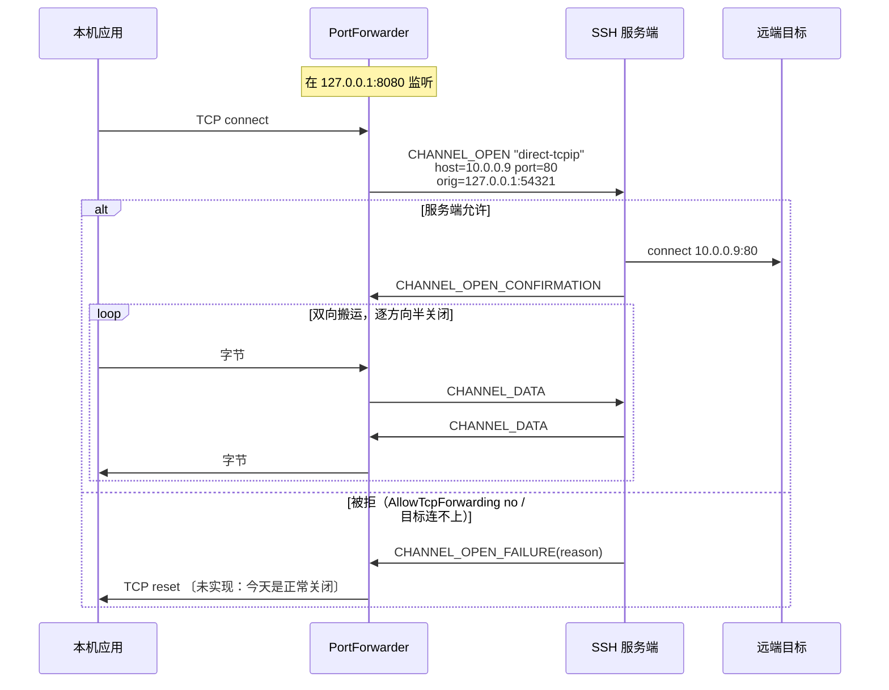
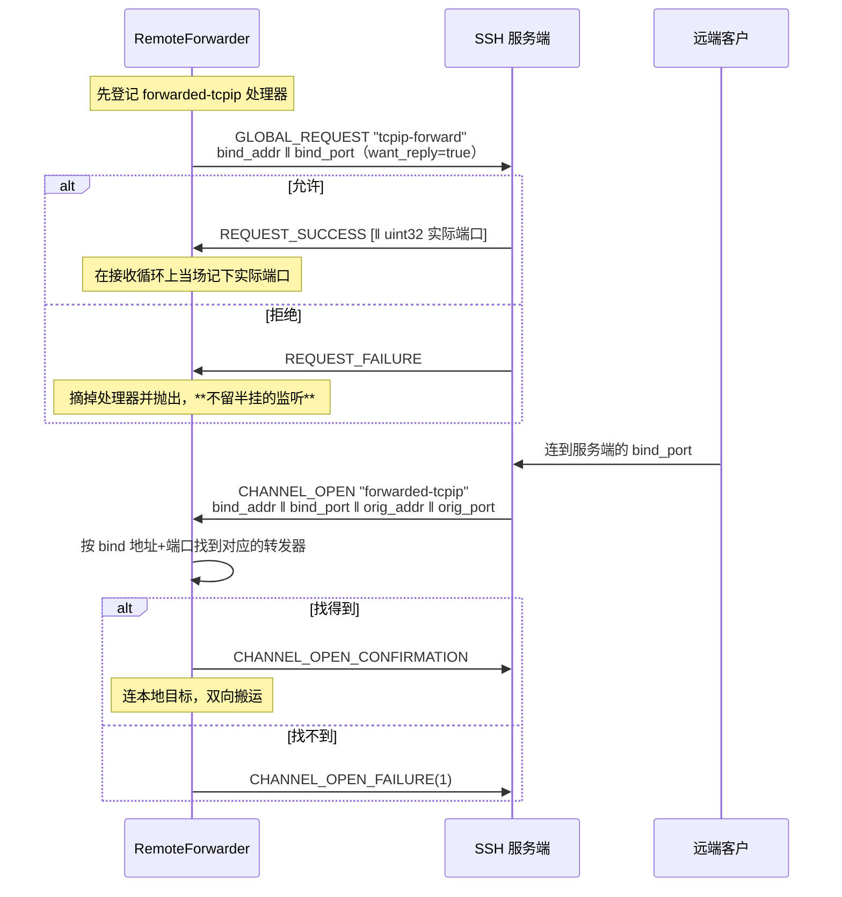

# 07 · 转发与隧道

> 规范依据：RFC 4254 §7（TCP/IP Port Forwarding）；
> OpenSSH `PROTOCOL` 的 `*-streamlocal@openssh.com`、`auth-agent-req@openssh.com`；
> RFC 1928（SOCKS5，用于动态转发）。
>
> 对应实现：`Forwarding/`（L8）。

---

## 一 四种转发

| 形态 | OpenSSH 参数 | 谁监听 | 出站是什么 |
| --- | :-: | --- | --- |
| **本地转发** | `-L` | 我们（本机） | `direct-tcpip` 通道 |
| **动态转发** | `-D` | 我们（本机，跑 SOCKS5） | `direct-tcpip` 通道，目标由 SOCKS 握手给出 |
| **远程转发** | `-R` | 服务端 | 服务端发起 `forwarded-tcpip` 通道，我们连本地目标 |
| **直连隧道** | 无（`-W` 近似） | 无人监听 | `direct-tcpip` / `direct-streamlocal`，流直接交给调用方 |

**第四种最容易被忽略，但常常是最该用的那一种。**
接 `/var/run/docker.sock` 或某个内网 HTTP API 时，本机**不需要**一个监听端口 ——
开了反而意味着同机的任何进程都能连上去。对 root 等价的端点，这不是优化而是前提。

---

## 二 本地转发 `-L`



〔未实现〕服务端拒绝开隧道时，设计是**重置**本机那条连接（RST）：拒绝也是出错，与 §2.2 的「出错不是 EOF」同一条规则。
今天的实现是报 `Error`、**正常关闭**那条连接（FIN），本机应用读到的是一个没有任何数据的结尾。
（动态转发另有 SOCKS 失败应答告诉客户端原因，§3.2。）

### 2.1 `direct-tcpip` 的额外字段

| # | 类型 | 字段 | 说明 |
| :-: | --- | --- | --- |
| 6 | `string` | `host to connect` | **从服务端视角解析** —— `localhost` 指服务端的环回 |
| 7 | `uint32` | `port to connect` | |
| 8 | `string` | `originator IP` | 本机发起方地址 |
| 9 | `uint32` | `originator port` | |

〔决策〕**originator 如实填写**（真实的本机地址与端口）。
服务端会把它写进日志；填假的会让服务端管理员无法追溯，也没有任何隐私收益
（服务端本来就知道我们的连接来源）。

### 2.2 半关闭与出错收尾

TCP 与 SSH 通道都支持半关闭，**必须逐方向对应**；而**正常结束与出错必须分得开**。
一条转发连接的两侧是本机 socket 与 SSH 通道，一侧发生的事按下表传到另一侧：

| 一侧发生的事 | 另一侧看到的 |
| --- | --- |
| 本机应用 `shutdown(SEND)`（我们读到 FIN） | `CHANNEL_EOF`；反方向照常搬 |
| 收到 `CHANNEL_EOF` | 本机 socket `shutdown(SEND)`（FIN）；反方向照常搬 |
| 两个方向都正常到头 | 通道 `CHANNEL_CLOSE`，本机 socket 关闭 |
| 收到对端的 `CHANNEL_CLOSE` | 已经收到的数据照常交完，本机 socket 收到 FIN；往通道写的那个方向就此停下，随后关本机 socket（`CLOSE` 由连接层回） |
| 本机 socket 读或写出错（被重置等） | 通道**不发 EOF**，直接 `CHANNEL_CLOSE` |
| 通道读或写出错（含 SSH 连接断开） | 本机 socket 被**重置**（RST） |
| 转发器释放、SSH 连接断开造成的取消 | 按出错处理：两侧一起中止 |

**把 EOF 当成「连接结束」会截断数据。** 典型症状：
`curl` 通过隧道 POST 一个请求体后等响应，而我们在它 shutdown 写端时
把整条通道关了，响应永远收不到。

〔决策〕**出错不是 EOF。** 任何一个方向出错（含取消），两侧一起**中止**：TCP 那侧 linger 0 再关，对面收到 RST
（Unix 套接字不一定支持 linger 0，那时只是关掉）；通道那侧不先发 `EOF`，直接 `CHANNEL_CLOSE`。
照正常结束去关（FIN / `EOF`）是错的 —— 对面会把截断的数据当成完整的，下载到一半的文件看起来就是下完了；
只停出错的那一个方向也是错的 —— 另一个方向会一直挂着，直到对面自己想起来关。
上报的原因取**最先出错的那一侧**，不取被牵连中止的那一侧（那往往只是一个取消）。

〔决策〕**对端的 `CLOSE` 到了，就停下往通道写的那个方向，不算出错。** 那个方向这时多半正卡在本机 socket 的读上 ——
本机程序在等响应，不会先关；不停下它，socket 与并发名额就一直占着。
从通道读的方向不受影响，已经收到的数据照常排空。本机那头之后再发什么，socket 关掉时操作系统会回它 RST。

### 2.3 绑定地址

| `BindAddress` | 行为 |
| --- | --- |
| `127.0.0.1`（〔决策〕**默认**） | 只有本机能连 |
| `0.0.0.0` / `::` | 局域网可连。**必须由使用者显式指定** |
| 具体网卡地址 | 只在那张网卡上监听 |

〔决策〕**默认绑环回。** 一条隧道的另一端往往是内网数据库或管理接口；
默认绑 `0.0.0.0` 等于把它暴露给同网段的所有人。
OpenSSH 的默认也是这个（`GatewayPorts no`）。

〔决策〕**端口 0 表示由系统分配**，分配结果通过 `PortForwarder.BoundEndPoint` 回传。

### 2.4 监听器的韧性与收尾

本地转发与动态转发共用同一个监听器（`PortForwarder`），下面几条对两者都成立。

〔决策〕**接受失败要退避。** 接受入站连接失败时报一条 `Error`（`accept`），然后等一下再接：
第一次 50 ms，之后逐次翻倍，封顶 1 秒；接到一条就归零。
文件句柄耗尽（EMFILE）这类失败会立刻、反复地再来 —— 不等的话就是一个满核空转、每秒上万条错误事件的循环，
而它恰恰发生在机器已经吃紧的时候。

〔决策〕**SSH 连接断了，就关监听、放出端口。** 留着的话端口一直被占：重连之后重建同一个转发只会得到「端口已被占用」，
而这期间每接一条都只换来一次「隧道打不开」。先关监听、再让 `IsActive` 变 false ——
看到它为 false 的人可以确信端口已经放出来了。在途连接按出错中止（§2.2），本机应用收到 RST。
转发器对象仍要由调用方释放。

〔决策〕**释放要等每条连接都收完尾才返回。** 转发器逐条登记处理中的连接；释放时停下监听、
取消全部连接（按出错中止），再等它们收完尾，最后才放掉并发名额等资源。
曾经是直接放掉：还在收尾的连接随后去还一个已经释放的名额，异常落在没人观察的任务里；释放返回时连接也还开着。

---

## 三 动态转发 `-D`（SOCKS5）

与本地转发的唯一差别：目标地址不是配置死的，而是**客户端在 SOCKS 握手里给出的**。

### 3.1 我们实现的 SOCKS 子集

> 依据：RFC 1928。

| 项 | 支持 |
| --- | --- |
| 版本 | **只支持 SOCKS5**（0x05）。SOCKS4/4a 〔决策〕不实现 |
| 认证方法 | 只接受 `0x00`（无认证）。〔决策〕见下 |
| 命令 | 只支持 `CONNECT`（0x01）。`BIND` / `UDP ASSOCIATE` 回 `0x07`（命令不支持） |
| 地址类型 | IPv4（0x01）、域名（0x03）、IPv6（0x04）全支持 |

〔决策〕**不实现 SOCKS 认证。**
理由：这个监听默认只在环回上（§2.3），同机进程本来就能连；
加一层用户名密码认证给人一种它是安全边界的错觉，而它不是。
真要限制访问，用操作系统的手段（防火墙、命名空间）。

〔决策〕**域名不在本地解析，原样交给服务端。**
这是动态转发最重要的一条语义 —— `curl --socks5-hostname` 依赖它。
本地解析会导致「DNS 走本地、连接走隧道」的分裂，
在内网域名场景下直接失效，而且泄漏了访问目标。

〔决策〕**长度为 0 的域名回 `0x08`（地址类型不支持），关掉这一条。** 空名字不是一个目标：
放过去的话，开隧道那一步因为参数不合法而失败，客户端收不到任何 SOCKS 应答，分不出是哪里错了。

### 3.2 应答码映射

| SSH `CHANNEL_OPEN_FAILURE` 原因 | SOCKS5 REP |
| :-: | :-: |
| 1 `ADMINISTRATIVELY_PROHIBITED` | 0x02 connection not allowed |
| 2 `CONNECT_FAILED` | 0x05 connection refused |
| 3 `UNKNOWN_CHANNEL_TYPE` | 0x01 general failure |
| 4 `RESOURCE_SHORTAGE` | 0x01 general failure |
| 通道打开超时 〔未实现〕 | 0x06 TTL expired |

映射对不对是有实际后果的：`curl` 和浏览器会根据 REP 码决定要不要重试、
以及报给用户哪句话。一律回 `0x01` 等于把信息丢了。

〔未实现〕开通道还没有单独的时限，最后一行因此用不上：今天转发器一直等服务端的应答；
等到之前转发器被释放或 SSH 连接断了，这条连接不回任何应答就关掉。
没有原因码的失败（比如本端的通道数或窗口预算撞满）回 `0x01`。

### 3.3 握手时限

〔决策〕**SOCKS 握手有时限**（`PortForwardOptions.SocksHandshakeTimeout`，默认 30 秒）：
从接下这条连接起，到读完 `CONNECT` 请求为止。超时就关掉这一条，报 `Error`（`socks`），转发器继续跑。
连上来一句不说的客户端，每个都白占一个并发名额；没有时限的话，占满上限（§8）之后正经的连接一条也进不来。
浏览器与 `curl` 连上就发握手，30 秒绰绰有余。

---

## 四 远程转发 `-R`

### 4.1 建立



### 4.2 三个必须

1. **`bind_port = 0` 时，实际端口在 `REQUEST_SUCCESS` 的载荷里**
   （一个 `uint32`）。`want_reply` 必须为 true，否则拿不到端口号。
2. **服务端发起的 `forwarded-tcpip` 通道要按「绑定地址 + 端口」路由到对应的转发器。**
   同一条 SSH 会话上可以有多条远程转发，它们共用这一个通道类型。
   〔决策〕路由表的 key 是 `(bind_addr 原样字符串, bind_port)` ——
   **不要**对地址做规范化（`""`、`"*"`、`"0.0.0.0"`、`"localhost"` 在服务端是不同的语义，
   而它回给我们的是我们请求时用的那个串）。
3. **处理器在请求发出之前登记，实际端口在应答到达的当场记下。**
   服务端回完 `REQUEST_SUCCESS` 立刻就可能开回连（有人正等着连那个端口），而那条 `CHANNEL_OPEN`
   由接收循环紧接着处理。拿到应答再登记处理器，或者等调用方的续体（跑在线程池上）再去记端口，
   那条回连都已经被当成「没人认领」拒掉了。
   〔决策〕所以应答账本允许登记请求时附一个回调：应答一到，先在接收循环上同步调用它（记下端口），
   再完成等待的任务。回调必须又短又不阻塞；连接断了时它拿到的是一个失败的应答。
   服务端拒绝或请求发送失败时摘掉处理器。

### 4.3 取消与宽限期

`cancel-tcpip-forward` 全局请求，字段同 `tcpip-forward`（端口填实际绑定的端口）。
〔决策〕取消后**仍要继续接受在途的 `forwarded-tcpip` 通道**若干秒（`DrainGrace`，2 秒），
否则正在建立的连接会被莫名拒绝。释放按这个顺序走：

1. 发 `cancel-tcpip-forward`（Unix 套接字变体发 `cancel-streamlocal-forward@openssh.com`）。从这一刻起 `IsActive` 为 false。
2. 宽限期里处理器照旧在位：对得上的回连照常接下、照常搬，已有连接也照常搬。
3. 宽限期到，摘掉处理器 —— 之后再来的回连被拒。
4. 结束这个转发器的全部连接，按出错中止（§2.2）：本机目标收到 RST，服务端那条通道收到不带 `EOF` 的 `CLOSE`。

SSH 连接已经断了（取消请求发不出去，或者宽限期里断了）就不再等 —— 那时不会再有回连。

〔历史〕早期实现一进释放就把自己标成「已释放」，而处理器看到这个标记就拒 ——
宽限期形同虚设，在途的回连照样被拒。

### 4.4 Unix 套接字变体

`streamlocal-forward@openssh.com` / `cancel-streamlocal-forward@openssh.com`
（全局请求）+ `forwarded-streamlocal@openssh.com`（通道类型），
字段把 `addr ‖ port` 换成一个 `string socket_path`。

### 4.5 状态与生命周期

| 属性 | 含义 |
| --- | --- |
| `BoundPort` | 服务端**实际**绑的端口：请求端口 0 时取自 `REQUEST_SUCCESS` 的载荷，否则就是请求的端口。Unix 套接字变体为 0 |
| `IsActive` | 开始释放之后、或 SSH 连接断了之后为 false。直接看连接的状态，不等任何回调 |

〔决策〕请求端口 0、服务端回了 `REQUEST_SUCCESS` 却没带端口：摘掉处理器并抛出。
按 `(bind_addr, 0)` 去路由回连一条都对不上，症状是「转发看起来建好了，但连过来的全被拒」。

〔决策〕**每条回连同时挂在 SSH 连接与转发器两者的生命周期上**，哪个先结束，它就跟着结束（按出错中止，§2.2）。
只挂在连接上的话，释放转发器之后它的连接照样一直搬下去，直到整条 SSH 连接断开。

SSH 连接断了之后，服务端的监听随之消失，本机没有要放的端口；转发器对象照样要释放（释放时发现连接已断，不等宽限期）。

---

## 五 计量 —— 在库里，不在调用方

> 这是本库相对现有实现最直接的一处收益。

`PortForwarder` 对外提供：

```
ForwardKind Kind { get; }
EndPoint?   BoundEndPoint { get; }      // 端口 0 时这里是实际端口
bool        IsActive { get; }

int  ActiveConnections { get; }
long TotalConnections  { get; }
long BytesUp   { get; }                 // 本机 → 远端
long BytesDown { get; }                 // 远端 → 本机

event EventHandler<ForwardConnectionEventArgs> ConnectionOpened;
event EventHandler<ForwardConnectionEventArgs> ConnectionClosed;   // 含该连接的字节数与时长
event EventHandler<ForwardErrorEventArgs>      Error;              // 单条连接失败，转发器仍在跑
```

同时走 `System.Diagnostics.Metrics`：

| 仪表 | 类型 | 标签 |
| --- | --- | --- |
| `velashell.ssh.forward.connections.active` | UpDownCounter | `kind`、`bind` |
| `velashell.ssh.forward.connections.total` | Counter | `kind`、`bind` |
| `velashell.ssh.forward.bytes` | Counter | `kind`、`bind`、`direction` |
| `velashell.ssh.forward.errors` | Counter | `kind`、`bind`、`reason` |

〔决策〕**两条路都给**：事件给桌面 UI（要实时刷一个面板），
Metrics 给服务端场景（接 OpenTelemetry）。二选一都会逼使用者自己重写一遍数据面 ——
而那正是我们要消除的那 376 行。

〔决策〕**事件订阅者的异常不影响转发。** 事件逐个订阅者调用，谁抛了就吞掉，不影响后面的订阅者，更不影响那条连接。
事件是给面板刷新用的，订阅者的一个 bug 不该变成转发的故障 ——
曾经 `ConnectionOpened` 的订阅者一抛，那条连接就不搬了，活跃连接数也只加不减。

〔决策〕转发器自己收工（释放、SSH 连接断开）造成的取消**不算单条连接的错误**，不触发 `Error`。

〔实现要点〕计数用 `Interlocked`，读取用 `Volatile.Read`。
字节计数在**搬运循环里**累加，不是在通道层 —— 通道层的字节数含协议开销，
而面板上要显示的是应用数据量。

---

## 六 搬运循环

三种转发都收敛到同一个循环，**这是刻意的**：

```
监听/接受 → 建立出站（工厂委托） → 双向搬运（含计量与半关闭） → 收尾
```

只有「出站怎么建」不同：

| 形态 | 出站工厂 |
| --- | --- |
| 本地 | `(_, ct) => conn.OpenTunnelAsync(host, port, ct)` |
| 动态 | `(inbound, ct) => { 先在 inbound 上跑完 SOCKS5 握手拿到目标; 再 OpenTunnelAsync }` |
| 远程 | 入站是服务端给的通道，出站是本机 TCP —— 方向反过来，循环不变 |

〔决策〕**搬运层与 SSH 无关，单独可测。**
它只见到两个端点（`IRelayEndpoint`），每个端点提供五样东西：读；写；「我不再发了」
（半关闭 —— TCP 是 `shutdown(SEND)`，通道是 `CHANNEL_EOF`）；「出错中止」（TCP 是 RST，通道是不带 `EOF` 的 `CLOSE`）；
以及一个「这一端整个结束了」的信号（通道收到 `CLOSE`，或会话没了）。因此半关闭、计量、
错误收尾这条主路径（§2.2）不必架一台真服务器就能验证。

给不出中止动作的端点（比如只是一条流），中止退化成关掉它：对面知道连接没了，只是分不出是出错还是正常结束。
给不出半关闭动作的，半关闭什么也不做：对面要等整条连接关掉才知道我们发完了。

**缓冲**：〔决策〕每方向 32 KiB，从 `ArrayPool` 租借。
与 SSH 通道的 max packet 同量级，又不至于让每条连接都占住大块内存
（1000 条并发连接 × 2 方向 × 32 KiB = 64 MiB，可接受）。

---

## 七 Agent 转发

> 依据：OpenSSH `PROTOCOL` 的 `auth-agent-req@openssh.com`、`PROTOCOL.agent`。

### 7.1 机制

1. 在 **session 通道**上发 `CHANNEL_REQUEST "auth-agent-req@openssh.com"`（`want_reply = true`）。
2. 服务端随后可以发起 `CHANNEL_OPEN "auth-agent@openssh.com"` 通道。
3. 我们把这条通道桥到本机的 ssh-agent（Unix 套接字 / Windows 命名管道）。

由 `IIncomingChannelHandler` 处理（架构 §8 第 8 项）。

〔决策〕**不是字节级直通**：每条 agent 报文（4 字节长度 + 内容）收齐、解出来看过之后才处理 ——
只有这样才能做 §7.2 的「只转发指定的密钥」与「逐次签名确认」。

〔决策〕**agent 通道的接收窗口至少装得下一整条最长的 agent 报文**（4 字节长度 + 256 KiB）。
报文收齐之前一个字节都不消费，而窗口只随消费回补 —— 窗口比报文小，就是对端等窗口、我们等报文，谁也动不了。
曾经给的是 32 KiB，签一段稍长的数据（`ssh-keygen -Y sign`、证书）就卡死在那里。
窗口只是额度，不是预先分配的内存；平常的报文只有几百字节。长度为 0 或超过 256 KiB 的报文按畸形处理，关掉这条通道。

### 7.2 安全要求

> **Agent 转发是一把上膛的枪。** 远端主机上的 root 可以在转发期间
> 用你的私钥签任何东西。

〔决策〕三条硬约束：

1. **默认关闭**，必须逐连接显式开启。
2. **必须支持「只转发指定的密钥」**（`AgentForwardPolicy.AllowedKeys`），
   而不是把整个 agent 暴露出去。
3. **可选的签名确认回调**（`AgentForwardPolicy.ConfirmEachSignature`）：
   每次远端请求签名时问一次使用者。对跳板场景这是唯一能让人安心的做法。

〔决策〕**放行名单按证书里的那把钥比较。** 证书与它的钥用的是同一把私钥：放行了钥就等于放行了它的证书，
放行了证书也就放行了那把钥。列身份与签名请求用同一个比较 —— 列不到的钥，远端就算从别处知道了它的公钥
（比如 `authorized_keys`），直接拿来签也被拒，请求根本不到本机 agent。

〔决策〕**agent 里本库认不出的钥跳过，不让整张列表失败**（FIDO、DSA、本库不支持的证书类型）：
远端列不到它们，拿它们来签也被拒 —— `AllowedKeys` 为空时也一样。认得出的证书照常列出，它的签名请求照常转给 agent。
RSA 用哪种摘要由远端请求里的标志位决定（SHA-256 / SHA-512，都没给才是 SHA-1），**按证书里那把钥的类型判断** ——
RSA 证书与 RSA 钥一样拿到远端要的 SHA-2；按证书自己的类型串判断的话标志位会被忽略，证书就被签成 SHA-1。
曾经 agent 里只要有一张证书，列身份就整个失败，agent 转发随之不可用。

〔决策〕**转发的期限就是转发器的期限。**释放转发器时，不但不再接受新的 `auth-agent@openssh.com` 通道，
**已经打开的也一起断开**。只摘掉处理器是不够的：连接可能还开着（SFTP、别的会话），
远端早先打开的那条 agent 通道会一直替它签名，直到整条连接断开。
每读出一条请求、处理之前，还要再看一眼转发器是否已经释放：释放发出的取消要在后台传到每条通道，
恰好夹在中间到的一条请求不能在释放返回之后还替远端签一次名。

〔决策〕**Windows 上连命名管道形态的 agent 之前，先确认管道的属主可信**：当前用户、SYSTEM 或 Administrators，
否则拒绝连接。OpenSSH agent 的管道名是固定的（`openssh-ssh-agent`），服务没在跑的时候本机任何用户都能先把这个名字建出来，
之后收到的是签名请求 —— 往 agent 里加钥（§7.3）时还有**明文私钥**。抢先建管道的人只能把属主设成自己。
不靠把模拟级别降到 Identification 来防：OpenSSH 的 agent 服务要以连进来的用户身份保存密钥，降级会把正常的 agent 一起弄坏。

〔决策〕**我们只做转发，不做 agent 服务端。**
本机 agent 由操作系统提供（OpenSSH agent / Pageant / 1Password 等）。

### 7.3 往本机 agent 加钥（`ssh-add`）

> 依据：draft-miller-ssh-agent 的「添加密钥」「私钥格式」「密钥约束」三节；OpenSSH `PROTOCOL.agent`。

这是 agent **客户端**的一条请求（`ssh-add` 做的事），不是 agent 服务端 —— 与 7.2 的决策不冲突。
用途：把一把加密私钥解开一次、交给 agent 保管，之后的认证与转发都经 agent 签名，不必再输口令。

**请求报文**：

| 字段 | 类型 | 说明 |
| --- | --- | --- |
| 消息号 | byte | `17` `SSH_AGENTC_ADD_IDENTITY`；带约束时 `25` `SSH_AGENTC_ADD_ID_CONSTRAINED` |
| 密钥类型 | string | `ssh-ed25519` / `ssh-rsa` / `ecdsa-sha2-nistp256` / `-nistp384` / `-nistp521` |
| 私钥内容 | 按类型，见下表 | |
| 注释 | string | UTF-8；`ssh-add -l` 显示的那一列，通常写私钥文件路径 |
| 约束 | byte + 参数，可重复 | **只在 `25` 里出现**，见下表 |

**私钥内容**（紧跟在密钥类型之后）：

| 密钥类型 | 字段（按顺序） |
| --- | --- |
| `ssh-ed25519` | string 公钥（32 字节）；string 种子 ‖ 公钥（64 字节，种子在前） |
| `ssh-rsa` | mpint n；mpint e；mpint d；mpint iqmp（q⁻¹ mod p）；mpint p；mpint q |
| `ecdsa-sha2-*` | string 曲线名（`nistp256` / `nistp384` / `nistp521`）；string 公钥点（未压缩，`0x04 ‖ X ‖ Y`）；mpint 私钥标量 d |

⚠️ RSA 这里是 **n 在前、e 在后**，与公钥 blob（e 在前）相反。写反了 agent 照样回 SUCCESS，
直到第一次签名才露馅。

**约束**：

| 编号 | 名称 | 参数 | 含义 |
| :-: | --- | --- | --- |
| `1` | `SSH_AGENT_CONSTRAIN_LIFETIME` | uint32 秒 | 到期后 agent 自己删掉这把钥 |
| `2` | `SSH_AGENT_CONSTRAIN_CONFIRM` | 无 | 每次签名都由 agent 向使用者确认（`ssh-add -c`） |

**应答**：`6` `SSH_AGENT_SUCCESS` 为成功；`5` `SSH_AGENT_FAILURE` 抛 `SshAgentException`。
agent 不说拒绝原因，异常消息要点出常见的三种：agent 不支持约束（部分 agent 对 `25` 一律拒绝）、
agent 已被锁定（`ssh-add -x`）、agent 不支持这种密钥类型。

〔决策〕

1. **只接受进程内私钥**（`InMemorySshSigner`）。签名器背后是 agent / PKCS#11 / HSM 时私钥根本不在手里；
   证书签名器（`*-cert-v01@openssh.com`）要「证书 + 私钥」的组合格式，暂不做。其余一律 `ArgumentException`。
2. **没有约束就发 `17`**，不发约束为空的 `25` —— 有的 agent 认 `17` 却不认 `25`。
3. **请求缓冲用完即清零**。缓冲按上限一次性预留，不让扩容在堆上留下未清零的旧副本。
4. **不查重**。同一把钥加两次时怎么处理是 agent 的事（OpenSSH 会更新注释与约束）；
   要不要先 `REQUEST_IDENTITIES` 看一眼由调用方决定。
5. **库从不自动加钥**。什么时候往使用者的 agent 里放东西是使用者的决定 ——
   与 04 §2.2「不自动连 agent」是同一条原则。加进去的钥活多久由 agent 决定
   （Windows 的 OpenSSH agent 会把它存进注册表，重启后仍在）。

---

## 七点五 X11 转发

> 依据：RFC 4254 §6.3（`x11-req` 与 `x11` 通道）、X11 核心协议的连接建立报文、
> `.Xauthority` 文件格式、OpenSSH 的 `ssh -X` / `-Y` 行为。
>
> 〔范围〕**只做转发那一端，不做 X server**（架构 §12「明确不做」）。
> 我们把服务端开回来的 `x11` 通道接到**本机已有的** X 显示上。

### 7.5.1 为什么这件事的默认值必须是「关」

X11 没有客户端隔离：**连上同一个显示的任何客户端都能读别人的按键、
抓别人的窗口、往别人的窗口里塞事件**。所以把本机显示交给远端，
等于把本机所有图形会话的输入输出交给远端。

〔决策〕默认**不请求** X11 转发；要开必须显式写。
〔决策〕默认用**非受信**（untrusted）模式，与 `ssh -X` 一致；
受信模式（`-Y`）要再显式开一次。

### 7.5.2 假 cookie —— 这是整个机制的安全核心

**绝不能把本机真实的 X 授权 cookie 发给服务端。**

做法（与 OpenSSH 一致）：

1. 本端生成一个**随机的假 cookie**，`x11-req` 里发的是它；
2. 服务端把假 cookie 写进远端的 `.Xauthority`，远端的 X 客户端拿它来连；
3. 服务端开回 `x11` 通道，我们读它的**第一个报文**（X11 连接建立报文），
   校验里面的 cookie 是不是我们发出去的那个假 cookie；
4. 校验通过 → 把假 cookie **换成本机真实的 cookie**，再把报文转给本机 X server；
5. 校验不通过 → **拒绝这条通道**。

〔决策〕cookie 比较必须是**常数时间**的。逐字节短路比较会泄漏
「前几个字节对了几个」，而攻击者可以开很多条通道慢慢试。

〔决策〕每个显示各有自己的假 cookie —— 一条连接上转发多个显示时不会串。

### 7.5.3 `x11-req`（RFC 4254 §6.3.1）

```
byte      SSH_MSG_CHANNEL_REQUEST
uint32    recipient channel
string    "x11-req"
boolean   want_reply
boolean   single_connection
string    x11_authentication_protocol   // "MIT-MAGIC-COOKIE-1"
string    x11_authentication_cookie     // 假 cookie 的**十六进制**文本
uint32    x11_screen_number
```

〔注意〕cookie 字段是**十六进制字符串**，不是原始字节。写成原始字节的症状是
远端 `xauth` 存进去的 cookie 和我们校验的对不上，而错误信息只会说
「连接被拒绝」。

〔决策〕时序：`pty-req` → **`x11-req`** → `auth-agent-req@openssh.com` → `env` → `shell`/`exec`
（`05-connection.md` §5.2）。**交互 shell 与一次性命令都支持** —— `ssh -X` 最常见的用法就是 shell。
〔决策〕`single_connection` 默认发 `false`：一个远端会话常常开多个 X 客户端。
使用者要求单连接时，除了发 `true`，**本端也强制**：第一条 X11 连接之后，同一个转发的后续连接一律拒绝 ——
不把安全约束寄托在对端身上。
〔决策〕SFTP 子系统**不继承**连接级的 X11 开关 —— 文件传输不需要显示。

### 7.5.4 `x11` 通道（RFC 4254 §6.3.2）

通道类型 `x11`，type-specific 字段：

```
string    originator address
uint32    originator port
```

〔决策〕**只有在这条连接上请求过 X11 转发才接受**；没请求过就一律拒绝 ——
否则任何服务端都能主动往我们本机显示上开通道。

〔决策〕**同一条连接上可以有多个 X11 转发**（每个会话一个，各有各的假 cookie、显示与有效期）。
`x11` 通道本身不带任何能指回「哪个会话请求的」的字段，唯一能区分它们的是
**建立报文里的 cookie** —— 所以分派在读到建立报文之后才做：逐个转发做常数时间比较，
对上哪个就交给哪个；一个都对不上就拒绝，并给每个活着的转发记一笔拒绝。

- 所有转发都已过期时，在开通道这一步就拒绝；
- 并发上限按**认出归属之后**的那个转发自己的上限算 —— 于是不存在「占了槽位却没走到处理」的泄漏路径；
- 释放一个转发只摘掉它自己；最后一个释放时，这条连接不再接受 `x11` 通道。

〔历史〕早期实现只有一个处理器位置：后请求的会把先请求的挤掉（先那个会话的 X 程序
拿着正确的 cookie 被当成「cookie 不对」拒绝），任何一个释放又会把处理器整个摘掉。

### 7.5.5 X11 连接建立报文

X11 客户端连上来的第一个报文：

```
byte    byte_order          // 'B' = 大端，'l' = 小端
byte    (unused)
uint16  protocol_major
uint16  protocol_minor
uint16  auth_protocol_name_length    n
uint16  auth_protocol_data_length    d
uint16  (unused)
byte[n] auth_protocol_name           // 补齐到 4 的倍数
byte[d] auth_protocol_data           // 补齐到 4 的倍数
```

〔注意〕**两种字节序都要认。** 那两个长度字段的字节序由第一个字节决定，
只按一种解析的症状是「某些客户端能连，某些连不上」。

〔决策〕只支持 `MIT-MAGIC-COOKIE-1`；其它授权协议（`XDM-AUTHORIZATION-1`）
一律拒绝 —— 与 OpenSSH 一致。

〔决策〕报文可能**分几次到达**：要先攒够 12 字节的定长头，
再按头里的长度攒够两段数据。一上来就假设「第一次读就是完整报文」
在小 MTU 或慢链路上会随机失败。

### 7.5.6 本机显示怎么找

`DISPLAY` 的形态：`:0`、`:10.2`、`unix:0`、`host:0`、`[::1]:0`、
以及 macOS launchd 的套接字路径。

〔决策〕解析出 `host` / `display_number` / `screen_number` 三段之后：

| 情况 | 连哪里 |
| --- | --- |
| 本机套接字（空 host、`unix`） | 先试 Linux 抽象套接字，再试 `/tmp/.X11-unix/X<N>`，最后回环 TCP |
| 本机套接字 + Windows | TCP `127.0.0.1:(6000+N)`（VcXsrv 之类） |
| `localhost` | **只走** TCP `127.0.0.1:(6000+N)`，不试任何本机套接字 |
| 远程 host | TCP `host:(6000+N)` |

〔决策〕**`localhost:N` 是 TCP，不是本机套接字。**按 X 的约定它就是 `6000+N`，嵌套 `ssh -X` 时 sshd 给的正是这种形态。
当成本机套接字去试 Linux 抽象套接字是危险的：抽象命名空间不做任何权限检查，
同一台机器上的别的用户抢先绑上 `@/tmp/.X11-unix/X<N>`，就能收到我们换上的**真** cookie。
挑 cookie 时它仍然算本机显示（认本机主机名的 FamilyLocal 条目，§7.5.7）—— 「连哪里」与「用哪个 cookie」是两件事。

### 7.5.7 真实 cookie 从哪来

| 模式 | 来源 |
| --- | --- |
| 受信（`-Y`） | 读 `XAUTHORITY` 或 `~/.Xauthority`，**不跑外部程序** |
| 非受信（`-X`，默认） | 跑 `xauth -f <临时文件> generate <display> MIT-MAGIC-COOKIE-1 untrusted timeout <n>`，从临时文件里读出生成的 cookie |

〔决策〕受信模式下**不调用 `xauth`** —— 读文件就够了，而少跑一个外部程序
就少一条攻击面。
〔决策〕`.Xauthority` 里找不到对应条目时，用随机数据（与 OpenSSH 一致）：
让 X server 去拒绝，比我们在这里猜一个「大概对」的 cookie 好。
〔决策〕调用 `xauth` 要有**超时**（30 秒）—— 它可能卡在一个没响应的 X server 上。
超时或取消时**结束它的进程树**，不留挂着的子进程；它的标准输出与标准错误**同时读**，
只等退出不读的话输出一多就会写满管道、进程永远不退出。

〔决策〕⚠️ **生成的受限 cookie 写进一个只有当前用户可访问的临时文件（`-f`），用完即删，
绝不写进使用者的 `.Xauthority`。** 后者里装的是本机显示的**完全授权** cookie；
不带 `-f` 的 `xauth generate` 会用受限 cookie 把它覆盖掉 —— 有效期一到，
使用者自己本机的 X 程序就再也连不上自己的显示了。
（`xauth` 连本机显示时用的授权仍然是使用者的：指定了 `.Xauthority` 路径时经 `XAUTHORITY` 环境变量交给它。）

〔决策〕交给 `xauth` 的显示名保留主机与套接字路径：本机 Unix 套接字写成 `:N`，
远程显示写成 `host:N`，macOS launchd 的写成完整的套接字路径 —— 只剩一个 `:N` 的话，
`xauth` 会去找（或生成）另一个显示的条目。
〔决策〕非受信模式有**有效期**（默认 20 分钟），过期后拒绝新的 `x11` 通道。

### 7.5.8 失败了怎么办

〔决策〕**分两种情况，因为它们的用户意图不同：**

| 谁开的 | 失败时 |
| --- | --- |
| 调用方在这一次执行上**显式**要求 | **抛异常** —— 他明确要 X11，静默降级等于骗他 |
| 只是连接级开关（比如 `ssh_config` 里的 `ForwardX11 yes`） | **记日志，照常启动** —— 否则一份存量配置会让所有命令都跑不起来 |

### 7.5.9 本机显示经连接器接入

本机的 X server 可能就在调用方进程里（比如宿主内嵌的 X server）。这时去连一个本机端口只是绕路，
还得为它开着一个端口。转发选项可以带一个**连接器**：每来一条 `x11` 通道调它一次，拿到一条直接接进 X server 的双工流。

〔决策〕假 cookie 的核对**照旧**（§7.5.2）—— 那一层防的是远端，与本机这一端怎么接无关。核对通过之后，
建立报文里的 cookie 换成调用方给的「本机 cookie」（没给就是空的），再写进这条流。
访问控制由连接器那一端负责：它给出的流就等于一条已被信任的本机连接。

〔决策〕**只支持受信模式。** 非受信模式要 `xauth` 以完全授权连上本机显示、签一个受限 cookie（§7.5.7），
而连接器后面未必有一个可供 `xauth` 去连的显示。两者同时设时，请求 X11 转发这一步就失败（按 §7.5.8 的两种情况处理），
不静默退回受信 —— 那是悄悄放宽了调用方要的隔离。

〔决策〕屏幕号与诊断信息仍取自显示地址（`DISPLAY` 或调用方显式给的），所以连接器模式下显示地址照样要有。

〔决策〕连接器那一端不可用（X server 已停、已释放）时，这条 `x11` 通道按「本机显示连不上」处理：
不算接纳，通道随后关闭，不影响同一转发上的其它通道。

〔决策〕**远端发来 `CHANNEL_EOF` 时，连接器给的流也要收到「对面发完了」。** 连本机套接字时这是 `shutdown(SEND)`（§2.2）；
连接器给的只是一条流，要另找办法：流本身支持单向关写端（进程内的双工流）就用它；不支持的话**关掉整条流** ——
X 协议里客户端发完就是连接结束，没有「发完了还等回复」的用法，退化成全关不丢任何东西。
漏了这一步，X server 永远读不到 EOF：远端程序早就退出了，它的窗口却一直留到整条 SSH 会话结束。

### 7.5.10 出错收尾

〔决策〕`x11` 通道的对搬用的是同一个搬运循环，**出错与正常结束的区分与 TCP 转发相同**（§2.2）：
正常结束逐方向半关闭；任何一个方向出错，两侧一起中止 —— 连本机套接字时对显示那头 RST，
通道那头不带 `EOF` 的 `CLOSE`。
连接器给的流（§7.5.9）没有「重置」可用，中止退化成关掉整条流：X server 知道连接没了，只是分不出是出错还是正常结束。

## 八 边界与错误速查

| 情况 | 处理 |
| --- | --- |
| 本地端口被占用 | 抛 `SshForwardException`，**不留半挂的监听** |
| `tcpip-forward` 被拒 | 抛，消息里点明「服务端可能禁用了 AllowTcpForwarding / GatewayPorts」 |
| 单条连接的通道打开失败 | 触发 `Error` 事件，关掉这一条入站，**转发器继续跑** |
| 单条连接搬运中出错 | 两侧一起中止（本机 RST，通道不带 `EOF` 的 `CLOSE`），触发 `Error`，转发器继续（§2.2） |
| 接受入站连接反复失败（如 EMFILE） | 每次触发 `Error`（`accept`），退避 50 ms 起、翻倍、封顶 1 秒再接（§2.4） |
| SSH 会话断开 | 本地/动态转发关监听、放出端口；所有转发器 `IsActive` 变 false；在途连接按出错中止。转发器不因断线另发 `Error`（§2.4、§4.5） |
| SOCKS 握手非法 | 关掉这一条，计入 `errors`，转发器继续 |
| SOCKS 请求里的域名长度为 0 | 回 `0x08`，关掉这一条（§3.1） |
| SOCKS 握手超时（默认 30 秒） | 关掉这一条，触发 `Error`（`socks`），转发器继续（§3.3） |
| `forwarded-tcpip` 找不到对应转发器 | 回 `CHANNEL_OPEN_FAILURE(1)`；这条连接上一个远程转发都没有时回 `(3)` |
| 远程转发释放的宽限期内到达的回连 | 对得上就照常接下（§4.3） |
| 并发连接数超上限（〔决策〕默认 1024/转发器） | 拒绝新入站并触发 `Error`，已有连接不受影响。本地/动态转发：关掉这条入站，`Error`（`too-many-connections`）。远程转发：回 `CHANNEL_OPEN_FAILURE(1)`；〔未实现〕触发 `Error` —— 今天只拒掉那条通道，不发事件，也不计入 `errors` |
| 事件订阅者抛异常 | 吞掉，不影响其它订阅者与那条连接（§5） |

〔决策〕**单条连接的失败绝不影响转发器本身。**
一条隧道要能跑几天，期间必然有连不上的目标、被重置的连接。
把这些当成致命错误，隧道就没法用了。
