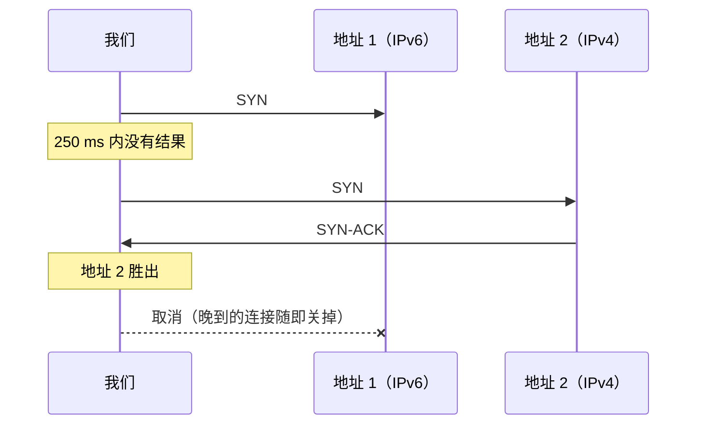
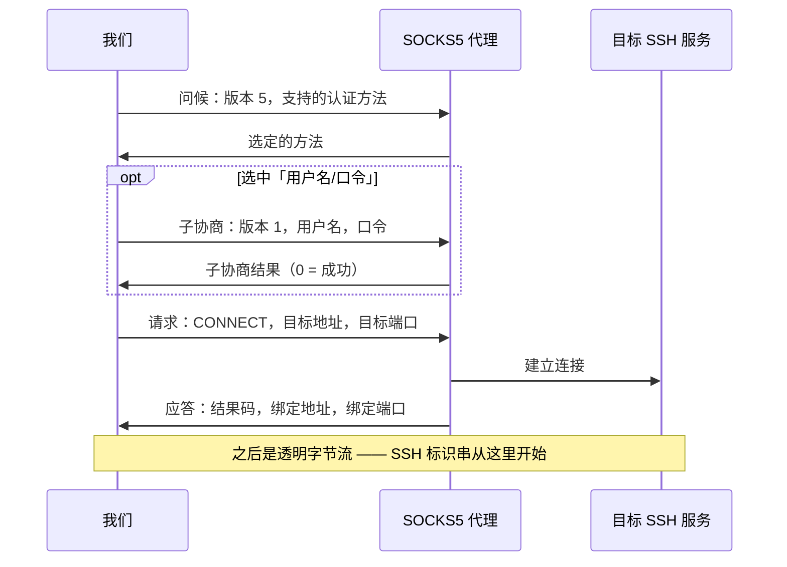
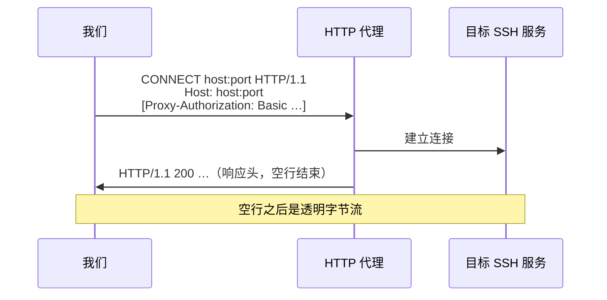
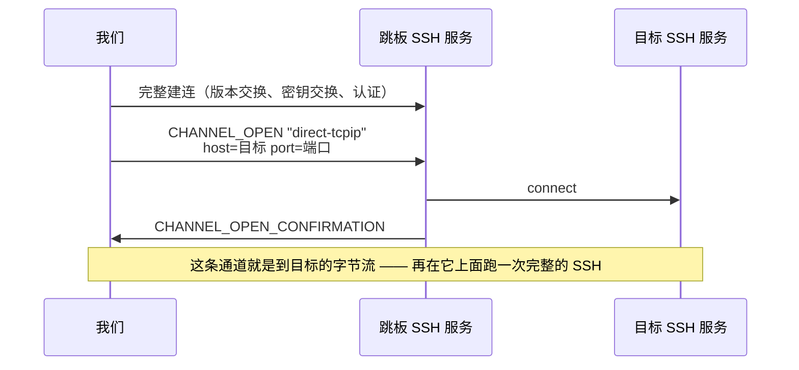

# 09 · 拨号：代理、跳板与代理命令

> 规范依据：RFC 1928（SOCKS 第 5 版）；RFC 1929（SOCKS5 用户名/口令认证）；
> RFC 9110 §9.3.6（`CONNECT` 方法）、§11.7（`Proxy-Authenticate` / `Proxy-Authorization`）、
> §15.5.8（407）；RFC 7617（Basic 认证方案）；RFC 4254 §7.2（`direct-tcpip`）；
> RFC 8305（Happy Eyeballs 第 2 版）；
> OpenSSH `ssh_config(5)` 的 `ProxyJump`、`ProxyCommand`、`Include`、`Match` 等（**只取行为描述**）。
>
> 对应实现：`Transport/`（L1）。架构位置见 `design/architecture.md` §5.1。

---

## 一 为什么这一层单独成篇

拨号层回答一个问题：**给我一条能读能写的字节流，另一端是目标 SSH 服务。**
怎么到达那里 —— 直连、经 SOCKS5、经 HTTP 代理、经另一台 SSH 主机、经一个外部程序 ——
是拨号器的事，上面的版本交换与密钥交换**看不出区别**。

〔决策〕所有到达方式都是同一个接口的实现，**并且可以互相嵌套**：
「经跳板 B 到达 C，而跳板 B 要经 SOCKS5 代理才连得上」是三个拨号器的组合，
不是一个带三个布尔开关的拨号器。嵌套的方式统一为：

> 每个代理类拨号器都有一个「**怎么到达代理本身**」的内层拨号器，默认是直连 TCP。

---

## 二 通用约定

### 2.1 主机名不在本地解析

〔决策〕除了负责建立 TCP 连接的那一个拨号器，**任何拨号器都不得在本地解析目标主机名**。
主机名原样交给代理 / 跳板，由它们去解析：

- 内网域名在本地根本解析不出来；
- 本地解析会把「访问了哪个主机」泄漏给本地 DNS，破坏使用代理的初衷。

目标是 IP 字面量时按 IP 发；否则按域名发。

### 2.2 失败要说清是哪一跳

〔决策〕拨号失败抛 `SshConnectException`，并在 `Hops` 里给出链路上**每一跳**的结果
（`spec/08-failures.md` §5.2）：

| 字段 | 含义 |
| --- | --- |
| `Kind` | `Tcp` / `Socks5` / `HttpConnect` / `SshJump` / `Custom` |
| `Target` | 这一跳要到达的端点（`host:port`） |
| `Succeeded` | 这一跳是否成功 |
| `Elapsed` | 这一跳耗时 |
| `Detail` | 失败时的补充说明（代理的原话、错误码） |

顺序是**从近到远**：第 0 项是离本机最近的那一跳。
内层拨号器失败时，外层**原样保留**内层给出的跳信息，只在后面追加自己的（如果走到了自己）。

原因码约定：

| 情形 | `Reason` |
| --- | --- |
| 代理本身连不上 | 与直连相同（`DnsFailure` / `TcpRefused` / `TcpTimeout` / `TcpUnreachable`） |
| 代理拒绝转发到目标 | `ProxyRefused` |
| 代理要求认证而我们没有凭据，或凭据被拒 | `ProxyAuthRequired` |
| 代理说的话不合协议 | `ProxyRefused`，`Detail` 写明收到了什么 |

### 2.3 读握手应答时不许多读

〔决策〕代理握手结束之后，流上紧接着就是 SSH 服务端的标识串 ——
服务端一连上就先说话，**它的第一个字节可能和代理的应答在同一个 TCP 段里到达**。
所以：

- 长度确定的应答（SOCKS5）按确定的长度读，一个字节都不多读；
- 长度不确定的应答（HTTP 响应头）允许一次多读，但多读到的字节**必须**原样交还给上层
  （返回的流先吐出这些字节，再接着读底层）。

### 2.4 超时与取消

- 连接超时（`SshConnectionOptions.ConnectTimeout`，默认 30 秒）是**一把**计时器，罩住拨号（整条链路：
  直连 TCP、代理握手、每一个跳板）、版本交换与密钥交换；认证另有一把（`AuthenticationTimeout`，默认 2 分钟）。
  每一跳还都受调用方取消令牌的约束。
- 拨号器自己默认不另设上限：`TcpTransportDialer.ConnectTimeout` 默认不限时，TCP 这一步由连接超时来管；
  显式给了的话，两者谁先到算谁。〔决策〕曾经 TCP 这一步固定 30 秒 —— 使用者把连接超时设得更长
  （卫星链路、跨洋的跳板），TCP 照样在 30 秒被掐断，而那个 30 秒在任何配置里都看不到。
- 主机密钥裁决期间连接计时器**停表**（`03-key-exchange.md` §5.3）；
  跳板那一跳里的裁决同样让**外层**计时器停表 —— 里面那一跳的整个建连都发生在外层的拨号阶段之内。
- 〔决策〕**跳板上的认证也让外层停表。**跳板的认证常常是在等人（输口令、看手机上的动态码），
  它用跳板自己的认证计时器；算进外层的连接超时的话，用户在跳板上输动态码花了二十秒，外层十五秒的连接超时早就到了。
  外层的连接超时是为网络往返设计的，等人的时间不该算在里面。
- 外层计时器在跳板那一跳里到点时，报 `Timeout`（`Phase` 为 `Dialing`），消息说明是经哪个跳板建连、
  或者跳板转发到目标时超时，`Hops` 标出那一跳。〔决策〕不报成「建立 TCP 连接超时」：外层此刻确实还在「拨号」，
  但卡住的是跳板的握手或转发，不是本机的 TCP。调用方自己取消的，原样作为取消往外传，不报超时 ——
  里面那一跳拿到的是同一个被取消的令牌，得靠计时器自己记着「是不是到点了」才分得清。

### 2.5 直连 TCP：多个地址时错开并发（RFC 8305）

`TcpTransportDialer` 是唯一在本地解析主机名的拨号器（§2.1）。目标是 IP 字面量就直接连；
否则先把名字解析完、拿到**全部**地址（不做 RFC 8305 §3 那种「A 与 AAAA 谁先回来先用谁」），再按下面的规则连：

1. **按地址族交替排好**：从解析结果里第一个地址的族开始（系统解析器已经按地址选择规则排过序，通常是 IPv6），
   这个族一个、另一个族一个，轮流排下去（RFC 8305 §4）。
2. **错开发起**：先连第一个；每过 `AttemptDelay`（250 毫秒，RFC 8305 §5 的推荐值）还没有结果就再发起下一个；
   正在试的某一个**失败了就立刻发起下一个**，不等满这段间隔。
3. **先连上的胜出**：其余还在试的全部取消；恰好在取消之前也连上了的那几条随即关掉 —— 没人要的连接不能挂着。
4. 全部失败时报**最后一个**失败的原因，按 `DnsFailure` / `TcpRefused` / `TcpTimeout` / `TcpUnreachable` 归类（`08-failures.md` §3），
   `Hops` 里是一条 `Tcp`。

〔决策〕**不逐个顺序试。**在「通告了 IPv6、IPv6 却不通」的网络上（并不少见），顺序试时第一个 IPv6 地址
要等系统的 SYN 超时（Windows 上约 21 秒）才轮到 IPv4，连接超时早就用得差不多了。
错开 250 毫秒并发，代价只是偶尔多发几个 SYN。

每条连接都关掉 Nagle（交互式 shell 上它就是每次按键约 40 ms 的延迟）；要求 TCP keep-alive 时打开它。

---

## 三 SOCKS5（RFC 1928 / RFC 1929）

### 3.1 问候

| 字段 | 长度 | 值 |
| --- | :-: | --- |
| 版本 | 1 | `5` |
| 方法个数 | 1 | 1 或 2 |
| 方法列表 | N | 永远包含 `0`（无需认证）；配置了凭据时再加 `2`（用户名/口令） |

应答两个字节：版本（必须是 `5`）与选中的方法。
选中 `0xFF` 表示「没有可接受的方法」：我们没配凭据时判 `ProxyAuthRequired`，配了判 `ProxyRefused`。
选中我们没提供的方法是协议错误。

### 3.2 用户名/口令子协商（RFC 1929）

| 字段 | 长度 | 值 |
| --- | :-: | --- |
| 子协商版本 | 1 | `1` |
| 用户名长度 | 1 | 1–255 |
| 用户名 | N | UTF-8 |
| 口令长度 | 1 | 1–255 |
| 口令 | N | UTF-8 |

〔决策〕用户名或口令编码后超过 255 字节时，**在本地拒绝**，不截断。
应答两个字节：子协商版本与状态；状态非 0 判 `ProxyAuthRequired`（凭据被拒）。

### 3.3 连接请求

| 字段 | 长度 | 值 |
| --- | :-: | --- |
| 版本 | 1 | `5` |
| 命令 | 1 | `1`（CONNECT） |
| 保留 | 1 | `0` |
| 地址类型 | 1 | `1` IPv4 / `3` 域名 / `4` IPv6 |
| 目标地址 | 4 / 1+N / 16 | 域名形式是一个字节长度后跟名字（最长 255） |
| 目标端口 | 2 | 大端 |

### 3.4 应答

版本、结果码、保留、地址类型、绑定地址、绑定端口 —— 布局同请求。
绑定地址的长度由地址类型决定（域名形式先读一个字节长度）。**整条应答必须读完**，
否则剩下的字节会被当成 SSH 标识串。

| 结果码 | 含义（写进 `Detail`） |
| :-: | --- |
| 0 | 成功 |
| 1 | 代理内部错误 |
| 2 | 规则不允许 |
| 3 | 网络不可达 |
| 4 | 主机不可达 |
| 5 | 目标拒绝连接 |
| 6 | TTL 过期 |
| 7 | 不支持的命令 |
| 8 | 不支持的地址类型 |

非 0 一律判 `ProxyRefused`。

---

## 四 HTTP CONNECT（RFC 9110 §9.3.6）

### 4.1 请求

- 请求行：`CONNECT` 空格 目标 空格 `HTTP/1.1`，目标是 `host:port`（IPv6 字面量加方括号）。
- 必带 `Host` 头，值与请求目标相同。
- 配置了凭据时带 `Proxy-Authorization: Basic <base64(用户名:口令)>`（RFC 7617，UTF-8）。
  〔决策〕**首次请求就带**，不等 407 再重试 —— 重试意味着代理可能关掉这条连接，
  而多一个往返在建连路径上是纯粹的延迟。
- 行尾一律 `CRLF`，请求以一个空行结束。

### 4.2 响应

- 读到第一个空行（`CRLF CRLF`）为止；响应头上限 16 KiB，超过判 `ProxyRefused`。
- 状态码 2xx 成功；多读到的字节交还给上层（§2.3）。
- 407：没配凭据判 `ProxyAuthRequired`；配了（说明凭据被拒）同样判 `ProxyAuthRequired`，
  `Detail` 带上 `Proxy-Authenticate` 头的值。
- 其它状态码判 `ProxyRefused`，`Detail` 带状态行。
- 〔决策〕目标端口是 22 而代理回了 403 / 405 / 501 时，消息里**直接给出建议**：
  「这个代理可能只放行 80/443 —— 请改用 SOCKS5，或让服务端在 443 上监听」。
  这是一个高频、而用户完全猜不到的失败（`08-failures.md` §5.2）。

### 4.3 不做的事

- 不做 NTLM / Negotiate / Digest。它们都需要多轮往返，且在 SSH 拨号场景里罕见；
  需要时由使用者实现自己的拨号器。
- 不跟随重定向。

---

## 五 跳板（`ProxyJump`，RFC 4254 §7.2）

- 跳板本身是一条完整的 SSH 连接，有自己的凭据、主机密钥策略、以及它自己的拨号器
  （于是跳板可以再经代理或另一个跳板到达 —— 嵌套）。
- 目标地址**从跳板的视角**解析（§2.1）。
- `direct-tcpip` 的来源地址填 `127.0.0.1`、端口 `0`：我们没有一个真实的来源套接字，
  编造一个看起来真实的地址只会误导服务端的日志。
- 通道被拒判 `ProxyRefused`，`Detail` 带 `CHANNEL_OPEN_FAILURE` 的原因码与描述；
  跳板的建连失败原样抛出，但 `Hops` 标明失败在跳板那一跳。
- 〔决策〕返回的流**拥有**跳板连接：流释放时先关通道、再释放跳板连接。
  跳板连接不与别的拨号共享 —— 共享会让一条连接的生命周期取决于另一条。
- 跳板连接中途断开时，流的读抛出跳板连接的故障（**不是**读到结尾，`05-connection.md` §4.4）、写入失败 ——
  目标连接随之断开，这是预期的。通道被正常关掉（跳板那头发了 EOF / CLOSE）时读才是读到结尾。
- 跳板上的主机密钥裁决与认证都让外层的连接计时器停表；外层计时器在这一跳里到点时报的是哪一跳超时（§2.4）。

### 5.1 通道作为字节流

把一条 SSH 通道当成双向字节流时：

- 读：通道的 stdout；读到结尾表示对端发了 EOF 或关闭了通道。承载通道的连接中途断了，读抛出那条连接的故障；
  本端释放了那条连接，读抛 `ObjectDisposedException`（`05-connection.md` §4.4）。
- 写：写进通道的 stdin；受对端窗口限制（写会等窗口，不丢数据）。
- 冲刷：等写进来的字节**全部交给会话发送**（离开本地的 stdin 管道）才返回；
  通道先关了、还有字节没发出去时抛 `IOException`，不假装成功。同步 `Flush` 不等，是空操作。
- 释放：先冲刷 stdin 并发 EOF（有时限），再关闭通道。直接关的话，窗口没轮到的那一截会被丢掉 ——
  「写完就关」是跳板与隧道上最常见的用法。
- 不支持定位与长度。

---

## 六 代理命令（`ProxyCommand`）

- 起一个外部程序，**它的标准输入输出就是到目标的字节流**；标准错误收集起来，
  失败时写进异常消息（很多代理程序只在 stderr 说明原因）。
- 命令行里的替换（`ssh_config(5)`）：`%h` 目标主机、`%p` 端口、`%r` 用户名、`%n` 原始主机名、`%%` 百分号。
- 命令交给系统 shell 解释：类 Unix 用 `/bin/sh -c`，Windows 用 `cmd.exe /c`。
- 〔决策〕**代入 `%h` / `%n` / `%r` 之前先检查值**：主机名只许字母、数字与 `.` `-` `_` `:`（IPv6），
  用户名只许字母、数字与 `.` `-` `_` `@`；有别的字符（shell 元字符、`%`、空白、控制字符）就不代入，以 `ProxyRefused` 失败。
  主机名、用户名常常不是写配置的人给的（`ssh://` 链接、导入的会话、快速连接框），原样代入交给 shell 的命令行，
  `x;touch /tmp/pwn`、`x&calc`、`%VAR%` 就是一条被执行的命令（CVE-2023-51385 那一类）。
  不做转义而是拒绝：两种 shell 的引用规则不同，`cmd` 的尤其难写对；合法的名字本来就只用得到这几种字符。
- 程序在握手完成前退出：判 `ProxyRefused`，`Detail` 带退出码与 stderr 末尾。
- 流释放时关闭程序的标准输入，给它一个体面退出的机会；短暂等待后仍未退出则结束整个进程树。
- 〔限制，如实说明〕Windows 上子进程的标准输入输出是匿名管道，而匿名管道不支持重叠 IO：
  对它们的异步读写由运行时在线程池线程上以阻塞方式完成。这是平台限制，不是本库的选择；
  类 Unix 上没有这个问题。需要纯异步的场景请用 SOCKS5 / HTTP / 跳板拨号器。

---

## 七 从 `ssh_config` 到连接参数

`ssh_config` 的解析结果要能**直接变成**连接参数，否则解析只是摆设。映射规则：

| `ssh_config` 项 | 连接参数 |
| --- | --- |
| `HostName` / `Port` / `User` | 目标端点与用户名（`User` 缺省时用调用方给的默认用户名） |
| `IdentityFile` | 逐个读取私钥（`~` 与 `%d` `%u` `%h` `%r` `%%` 展开；文件不存在则静默跳过）；加密的私钥向调用方要口令（`PassphraseProvider`），要不到则跳过。**读不出来的一把只跳过它自己**（格式不认识、口令不对、没权限读），并经 `SshConfigConnectOptions.IdentityFileSkipped` 告诉调用方路径与原因。同一次解析里每个文件（按完整路径）只读一次，跳板与目标共用同一个解好的签名器 —— 一次 KDF、一次口令；不跨调用缓存 |
| `IdentitiesOnly` | 无需额外动作：本库从不自动去 agent 里取钥，用哪些钥完全由凭据清单决定。配置里的密钥排在调用方模板凭据**之前**（与 `ssh` 先试 `IdentityFile` 的行为一致） |
| `Compression yes` | 算法清单打开 `zlib@openssh.com` |
| `ServerAliveInterval` / `ServerAliveCountMax` | 保活策略 |
| `ConnectTimeout` | 连接超时（`SshConnectionOptions.ConnectTimeout`，§2.4）；每个跳板用它自己那台主机的配置 |
| `UserKnownHostsFile` | 主机密钥策略改用该文件（写了多个路径时只用第一个）；`none` / `/dev/null` → **不读也不写**任何 `known_hosts`（`KnownHostsPolicy.WithoutFile`：每台主机都当成没见过，接受了也不记）。`StrictHostKeyChecking` 为 `ask` / 缺省且调用方给了策略时，这一项不起作用（见下一行） |
| `StrictHostKeyChecking` | `yes` → 没见过就拒绝；`accept-new` / `no` / `off` → 接受并记下（密钥**变了**照样拒绝）；`ask` / 缺省 → 调用方给了 `SshConfigConnectOptions.HostKeyPolicy` 就用调用方的，即使配置里写了 `UserKnownHostsFile`；没给时，写了 `UserKnownHostsFile` 就按它、没见过的主机交给 `AskUnknownHost` 问（没给询问回调就拒绝），两项都没写就按默认 `known_hosts`、没见过就拒绝 |
| `ProxyJump` | 逗号分隔的跳板链；每个跳板**按同一份配置解析**（有自己的 `User`、`Port`、`IdentityFile`）；`none` 表示不用。跳板拿到哪些调用方凭据见下 |
| `ProxyCommand` | 代理命令拨号器；`none` 表示不用 |
| `ForwardAgent` / `ForwardX11` / `ForwardX11Trusted` | 会话参数（shell / exec 的 agent 与 X11 转发），不是连接参数 |
| `ForwardX11Timeout` | 随 `ForwardX11` 打开的 X11 转发的有效期（`07-forwarding.md` §7.5.7）。`ssh_config` 的时间格式：数字后跟 `s` / `m` / `h` / `d` / `w`，不带单位为秒，几段相加（`1h30m`）；`0` 为不过期。写不对的值忽略，沿用默认 20 分钟 |

〔决策〕`ProxyJump` 与 `ProxyCommand` 同时出现时 `ProxyJump` 优先。
（`ssh_config(5)` 的规则是「先出现的生效」，而本库的解析结果不保留跨键的出现顺序；
取确定的一个比取一个依赖顺序细节的要好。）

〔决策〕跳板链的解析有深度上限（8）并检测环：`a` 的跳板是 `b`、`b` 的跳板又是 `a`
这种配置应当报错，而不是无限递归。

〔决策〕**调用方给的口令与键盘交互只交给最终目标。**调用方的凭据（`SshConfigConnectOptions.Credentials`）排在 `IdentityFile` 之后；
跳板只拿到其中的公钥凭据（agent 里的钥、内存里的钥），跳板自己的 `IdentityFile` 照常从配置读。
调用方的口令是为目标准备的：曾经每一跳都拿到同一份凭据，目标的口令就这样发给了跳板 ——
跳板的管理员（或者攻下了跳板的人）就此拿到它。出示公钥不泄露秘密，而经 agent 登跳板正是最常见的用法。

〔决策〕**`StrictHostKeyChecking` 为 `ask` 或缺省时，调用方给的主机密钥策略优先于配置里的 `UserKnownHostsFile`。**
这两种都是「交互式」的：调用方带着它自己的信任库与询问界面，不该因为配置里写了一个文件路径就被另起的策略顶掉 —— 曾经就是这样。
`yes` / `no` / `accept-new` 是配置明确要求的行为，照配置来。

〔决策〕**`UserKnownHostsFile none` / `/dev/null` 是「不用 `known_hosts`」，不是文件路径。**曾经把它们当成路径：
Windows 上会去读写当前目录里一个叫 `none` 的文件。

### 7.1 `Include` 与 `Match` 的求值

`Include` 只在 `SshConfigFile.LoadAsync` 里展开（`Parse` 是纯文本解析，不碰文件系统）。
一行可以写多个路径；`~` 展开；相对路径按**包含它的那个文件**所在的目录解析；最后一段可以带 `*` / `?` 通配，
通配的结果按序数排序 —— 目录枚举的顺序因文件系统而异，而「先出现的值赢」之下顺序不定就是结果不定。

- 〔决策〕**就地展开，并且是带条件的包含。**被包含文件的内容排在 `Include` 那一行的位置上：
  - 被包含文件里第一个 `Host` / `Match` 之前的设置，落在 `Include` 所在的那个块里；
  - 被包含文件自己的 `Host` / `Match` 块**套在外层块的条件之下**：`Include` 写在 `Host` / `Match` 块里时，
    被包含文件里的块要自己的条件与外层每一层的条件**都**满足才生效（嵌套的 `Include` 逐层叠加）；写在任何块之外时，它们就是普通的块；
  - 被包含文件读完，解析回到 `Include` 所在的那个块：`Include` 之后的设置照旧归那个块。

  理由：`ssh_config` 是「先出现的值赢」，被包含的内容排在哪里决定结果。曾经先把整个文件解完、再把被包含的内容接在后面：
  主文件里更靠后的 `Host *` 就压过了被包含文件里为具体主机写的设置。改成就地展开之后又有两处不对：被包含文件一开新块，外层的条件就丢了
  （那些块对所有主机无条件生效）；`Include` 之后的设置则落进了被包含文件的最后一个块里。
- **环检测只看当前这条包含链**（按规范化后的完整路径比）：同一个文件从两个 `Host` 块里各包含一次是正常写法，不算环。
  深度上限 16：更深的那一层不再展开，也不报错 —— 配置的其余部分照常可用。

`Match` 的每个条件有三种结果：满足、不满足、**判不了**。判不了的情形：

| 条件 | 什么时候判不了 |
| --- | --- |
| 不认识的条件 | 总是 |
| `canonical` / `final` | 总是 —— 本库不做主机名规范化，也没有「最后再解析一遍」那一轮 |
| `exec` | 调用方没给 `SshConfigMatchContext.ExecEvaluator` 时（默认不执行任何命令） |
| `user` / `localuser` | 上下文里没有远端用户名 / 本机用户名时 |

- 〔决策〕**任何一个条件判不了，整个块都不生效 —— 取反也一样。**曾经「判不了」算成「不满足」，前面加个 `!` 就成了「满足」：
  `Match !exec "…"` 在不执行命令时对所有主机生效，那正是写配置的人想排除的情形。判不了就是判不了，不因为一个 `!` 变成真的。
- 条件之间是「与」；`Match` 后面什么都没写的块不生效。
- **`Match host` 比的是经 `HostName` 改写之后的主机名**（前面的块里给过 `HostName` 就用它，其中的 `%h` 换成输入的名字）；
  `Match originalhost` 与 `Host` 块比的是使用者输入的那个名字。曾经 `Match host` 一律拿输入的别名去比，为真实主机名写的块永远对不上。
- `CreateConnectionOptionsAsync` 求值时只知道主机名，所以带 `user` / `localuser` / `exec` 条件的块在这条路径上不生效。
