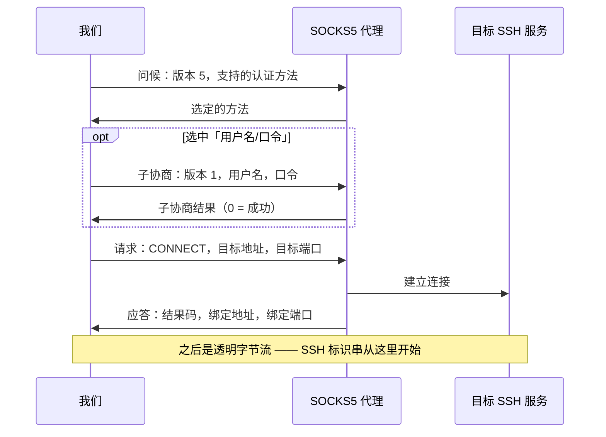
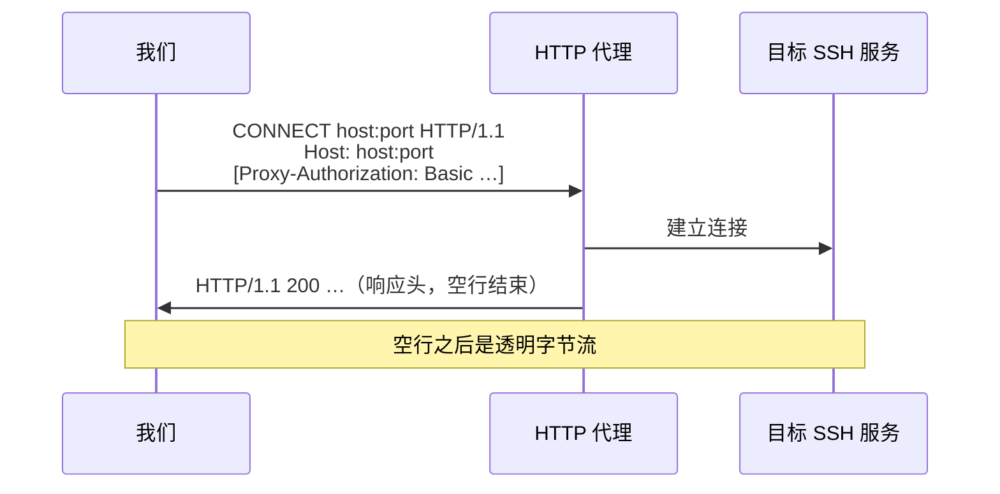
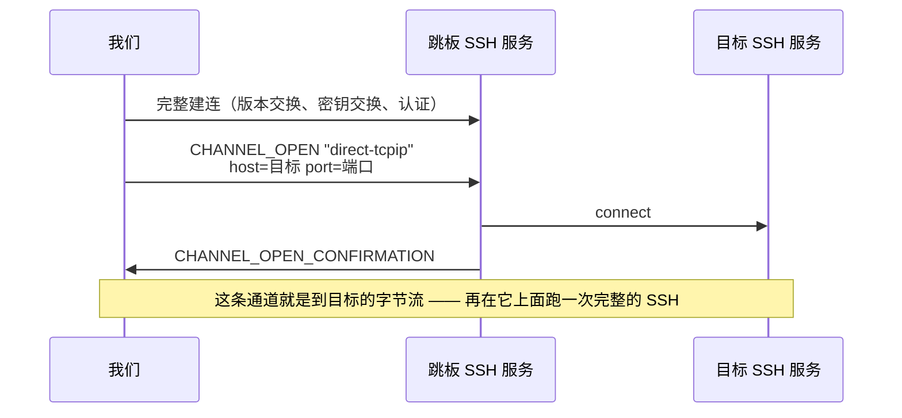

# 09 · 拨号：代理、跳板与代理命令

> 规范依据：RFC 1928（SOCKS 第 5 版）；RFC 1929（SOCKS5 用户名/口令认证）；
> RFC 9110 §9.3.6（`CONNECT` 方法）、§11.7（`Proxy-Authenticate` / `Proxy-Authorization`）、
> §15.5.8（407）；RFC 7617（Basic 认证方案）；RFC 4254 §7.2（`direct-tcpip`）；
> OpenSSH `ssh_config(5)` 的 `ProxyJump`、`ProxyCommand`（**只取行为描述**）。
>
> 对应实现：`Transport/`（L1）。架构位置见 `design/architecture.md` §5.1。

---

## 一 为什么这一层单独成篇

拨号层回答一个问题：**给我一条能读能写的字节流，另一端是目标 SSH 服务。**
怎么到达那里 —— 直连、经 SOCKS5、经 HTTP 代理、经另一台 SSH 主机、经一个外部程序 ——
是拨号器的事，上面的版本交换与密钥交换**看不出区别**。

〔决策〕所有到达方式都是同一个接口的实现，**并且可以互相嵌套**：
「经跳板 B 到达 C，而跳板 B 要经 SOCKS5 代理才连得上」是三个拨号器的组合，
不是一个带三个布尔开关的拨号器。嵌套的方式统一为：

> 每个代理类拨号器都有一个「**怎么到达代理本身**」的内层拨号器，默认是直连 TCP。

---

## 二 通用约定

### 2.1 主机名不在本地解析

〔决策〕除了负责建立 TCP 连接的那一个拨号器，**任何拨号器都不得在本地解析目标主机名**。
主机名原样交给代理 / 跳板，由它们去解析：

- 内网域名在本地根本解析不出来；
- 本地解析会把「访问了哪个主机」泄漏给本地 DNS，破坏使用代理的初衷。

目标是 IP 字面量时按 IP 发；否则按域名发。

### 2.2 失败要说清是哪一跳

〔决策〕拨号失败抛 `SshConnectException`，并在 `Hops` 里给出链路上**每一跳**的结果
（`spec/08-failures.md` §5.2）：

| 字段 | 含义 |
| --- | --- |
| `Kind` | `Tcp` / `Socks5` / `HttpConnect` / `SshJump` / `Custom` |
| `Target` | 这一跳要到达的端点（`host:port`） |
| `Succeeded` | 这一跳是否成功 |
| `Elapsed` | 这一跳耗时 |
| `Detail` | 失败时的补充说明（代理的原话、错误码） |

顺序是**从近到远**：第 0 项是离本机最近的那一跳。
内层拨号器失败时，外层**原样保留**内层给出的跳信息，只在后面追加自己的（如果走到了自己）。

原因码约定：

| 情形 | `Reason` |
| --- | --- |
| 代理本身连不上 | 与直连相同（`DnsFailure` / `TcpRefused` / `TcpTimeout` / `TcpUnreachable`） |
| 代理拒绝转发到目标 | `ProxyRefused` |
| 代理要求认证而我们没有凭据，或凭据被拒 | `ProxyAuthRequired` |
| 代理说的话不合协议 | `ProxyRefused`，`Detail` 写明收到了什么 |

### 2.3 读握手应答时不许多读

〔决策〕代理握手结束之后，流上紧接着就是 SSH 服务端的标识串 ——
服务端一连上就先说话，**它的第一个字节可能和代理的应答在同一个 TCP 段里到达**。
所以：

- 长度确定的应答（SOCKS5）按确定的长度读，一个字节都不多读；
- 长度不确定的应答（HTTP 响应头）允许一次多读，但多读到的字节**必须**原样交还给上层
  （返回的流先吐出这些字节，再接着读底层）。

### 2.4 超时与取消

- 每一跳的建立都受调用方取消令牌与连接超时的约束（连接超时覆盖整条链路）。
- 主机密钥裁决期间连接计时器**停表**（`03-key-exchange.md` §5.3）；
  跳板那一跳里的裁决同样让**外层**计时器停表 —— 里面那一跳的整个建连都发生在外层的拨号阶段之内。

---

## 三 SOCKS5（RFC 1928 / RFC 1929）

### 3.1 问候

| 字段 | 长度 | 值 |
| --- | :-: | --- |
| 版本 | 1 | `5` |
| 方法个数 | 1 | 1 或 2 |
| 方法列表 | N | 永远包含 `0`（无需认证）；配置了凭据时再加 `2`（用户名/口令） |

应答两个字节：版本（必须是 `5`）与选中的方法。
选中 `0xFF` 表示「没有可接受的方法」：我们没配凭据时判 `ProxyAuthRequired`，配了判 `ProxyRefused`。
选中我们没提供的方法是协议错误。

### 3.2 用户名/口令子协商（RFC 1929）

| 字段 | 长度 | 值 |
| --- | :-: | --- |
| 子协商版本 | 1 | `1` |
| 用户名长度 | 1 | 1–255 |
| 用户名 | N | UTF-8 |
| 口令长度 | 1 | 1–255 |
| 口令 | N | UTF-8 |

〔决策〕用户名或口令编码后超过 255 字节时，**在本地拒绝**，不截断。
应答两个字节：子协商版本与状态；状态非 0 判 `ProxyAuthRequired`（凭据被拒）。

### 3.3 连接请求

| 字段 | 长度 | 值 |
| --- | :-: | --- |
| 版本 | 1 | `5` |
| 命令 | 1 | `1`（CONNECT） |
| 保留 | 1 | `0` |
| 地址类型 | 1 | `1` IPv4 / `3` 域名 / `4` IPv6 |
| 目标地址 | 4 / 1+N / 16 | 域名形式是一个字节长度后跟名字（最长 255） |
| 目标端口 | 2 | 大端 |

### 3.4 应答

版本、结果码、保留、地址类型、绑定地址、绑定端口 —— 布局同请求。
绑定地址的长度由地址类型决定（域名形式先读一个字节长度）。**整条应答必须读完**，
否则剩下的字节会被当成 SSH 标识串。

| 结果码 | 含义（写进 `Detail`） |
| :-: | --- |
| 0 | 成功 |
| 1 | 代理内部错误 |
| 2 | 规则不允许 |
| 3 | 网络不可达 |
| 4 | 主机不可达 |
| 5 | 目标拒绝连接 |
| 6 | TTL 过期 |
| 7 | 不支持的命令 |
| 8 | 不支持的地址类型 |

非 0 一律判 `ProxyRefused`。

---

## 四 HTTP CONNECT（RFC 9110 §9.3.6）

### 4.1 请求

- 请求行：`CONNECT` 空格 目标 空格 `HTTP/1.1`，目标是 `host:port`（IPv6 字面量加方括号）。
- 必带 `Host` 头，值与请求目标相同。
- 配置了凭据时带 `Proxy-Authorization: Basic <base64(用户名:口令)>`（RFC 7617，UTF-8）。
  〔决策〕**首次请求就带**，不等 407 再重试 —— 重试意味着代理可能关掉这条连接，
  而多一个往返在建连路径上是纯粹的延迟。
- 行尾一律 `CRLF`，请求以一个空行结束。

### 4.2 响应

- 读到第一个空行（`CRLF CRLF`）为止；响应头上限 16 KiB，超过判 `ProxyRefused`。
- 状态码 2xx 成功；多读到的字节交还给上层（§2.3）。
- 407：没配凭据判 `ProxyAuthRequired`；配了（说明凭据被拒）同样判 `ProxyAuthRequired`，
  `Detail` 带上 `Proxy-Authenticate` 头的值。
- 其它状态码判 `ProxyRefused`，`Detail` 带状态行。
- 〔决策〕目标端口是 22 而代理回了 403 / 405 / 501 时，消息里**直接给出建议**：
  「这个代理可能只放行 80/443 —— 请改用 SOCKS5，或让服务端在 443 上监听」。
  这是一个高频、而用户完全猜不到的失败（`08-failures.md` §5.2）。

### 4.3 不做的事

- 不做 NTLM / Negotiate / Digest。它们都需要多轮往返，且在 SSH 拨号场景里罕见；
  需要时由使用者实现自己的拨号器。
- 不跟随重定向。

---

## 五 跳板（`ProxyJump`，RFC 4254 §7.2）

- 跳板本身是一条完整的 SSH 连接，有自己的凭据、主机密钥策略、以及它自己的拨号器
  （于是跳板可以再经代理或另一个跳板到达 —— 嵌套）。
- 目标地址**从跳板的视角**解析（§2.1）。
- `direct-tcpip` 的来源地址填 `127.0.0.1`、端口 `0`：我们没有一个真实的来源套接字，
  编造一个看起来真实的地址只会误导服务端的日志。
- 通道被拒判 `ProxyRefused`，`Detail` 带 `CHANNEL_OPEN_FAILURE` 的原因码与描述；
  跳板的建连失败原样抛出，但 `Hops` 标明失败在跳板那一跳。
- 〔决策〕返回的流**拥有**跳板连接：流释放时先关通道、再释放跳板连接。
  跳板连接不与别的拨号共享 —— 共享会让一条连接的生命周期取决于另一条。
- 跳板连接断开时，流的读取端结束、写入失败 —— 目标连接随之断开，这是预期的。

### 5.1 通道作为字节流

把一条 SSH 通道当成双向字节流时：

- 读：通道的 stdout；读到结尾表示对端发了 EOF 或关闭了通道。
- 写：写进通道的 stdin；受对端窗口限制（写会等窗口，不丢数据）。
- 释放：发 EOF、关闭通道。
- 不支持定位与长度。

---

## 六 代理命令（`ProxyCommand`）

- 起一个外部程序，**它的标准输入输出就是到目标的字节流**；标准错误收集起来，
  失败时写进异常消息（很多代理程序只在 stderr 说明原因）。
- 命令行里的替换（`ssh_config(5)`）：`%h` 目标主机、`%p` 端口、`%r` 用户名、`%n` 原始主机名、`%%` 百分号。
- 命令交给系统 shell 解释：类 Unix 用 `/bin/sh -c`，Windows 用 `cmd.exe /c`。
- 程序在握手完成前退出：判 `ProxyRefused`，`Detail` 带退出码与 stderr 末尾。
- 流释放时关闭程序的标准输入，给它一个体面退出的机会；短暂等待后仍未退出则结束整个进程树。
- 〔限制，如实说明〕Windows 上子进程的标准输入输出是匿名管道，而匿名管道不支持重叠 IO：
  对它们的异步读写由运行时在线程池线程上以阻塞方式完成。这是平台限制，不是本库的选择；
  类 Unix 上没有这个问题。需要纯异步的场景请用 SOCKS5 / HTTP / 跳板拨号器。

---

## 七 从 `ssh_config` 到连接参数

`ssh_config` 的解析结果要能**直接变成**连接参数，否则解析只是摆设。映射规则：

| `ssh_config` 项 | 连接参数 |
| --- | --- |
| `HostName` / `Port` / `User` | 目标端点与用户名（`User` 缺省时用调用方给的默认用户名） |
| `IdentityFile` | 逐个读取私钥（`~` 展开；文件不存在则跳过）；加密的私钥向调用方要口令，要不到则跳过 |
| `IdentitiesOnly` | 无需额外动作：本库从不自动去 agent 里取钥，用哪些钥完全由凭据清单决定。配置里的密钥排在调用方模板凭据**之前**（与 `ssh` 先试 `IdentityFile` 的行为一致） |
| `Compression yes` | 算法清单打开 `zlib@openssh.com` |
| `ServerAliveInterval` / `ServerAliveCountMax` | 保活策略 |
| `ConnectTimeout` | 连接超时 |
| `UserKnownHostsFile` | 主机密钥策略改用该文件（`none` / `/dev/null` 表示不持久化） |
| `StrictHostKeyChecking` | `yes` → 未知主机拒绝；`accept-new` / `no` → 接受并写入；`ask` / 缺省 → 沿用模板策略 |
| `ProxyJump` | 逗号分隔的跳板链；每个跳板**按同一份配置解析**（有自己的 `User`、`Port`、`IdentityFile`）；`none` 表示不用 |
| `ProxyCommand` | 代理命令拨号器；`none` 表示不用 |
| `ForwardAgent` / `ForwardX11` / `ForwardX11Trusted` | 会话参数（shell / exec 的 agent 与 X11 转发），不是连接参数 |

〔决策〕`ProxyJump` 与 `ProxyCommand` 同时出现时 `ProxyJump` 优先。
（`ssh_config(5)` 的规则是「先出现的生效」，而本库的解析结果不保留跨键的出现顺序；
取确定的一个比取一个依赖顺序细节的要好。）

〔决策〕跳板链的解析有深度上限（8）并检测环：`a` 的跳板是 `b`、`b` 的跳板又是 `a`
这种配置应当报错，而不是无限递归。
